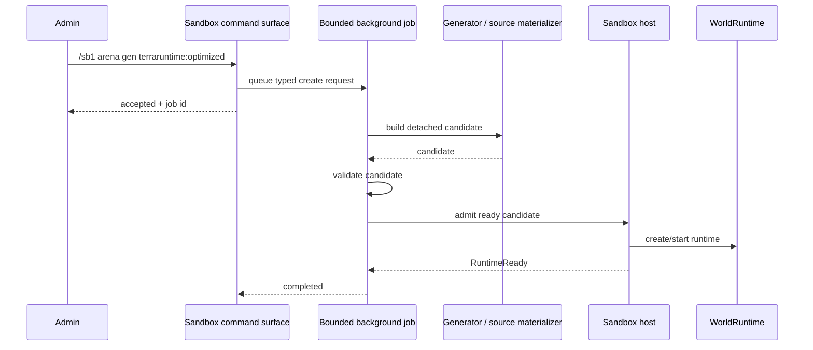
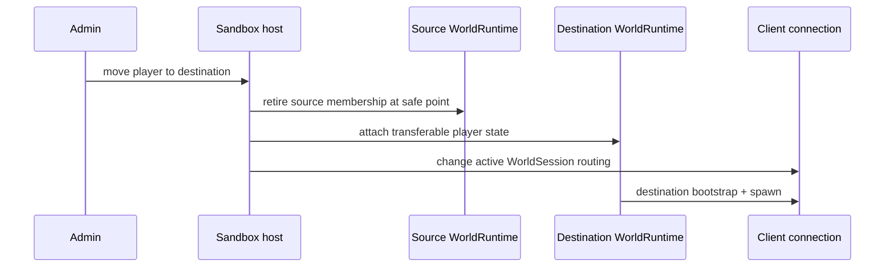
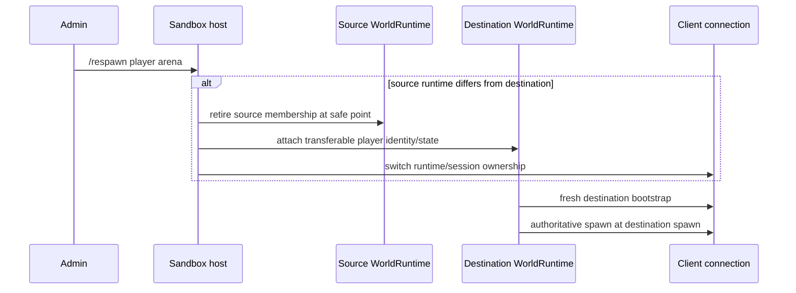
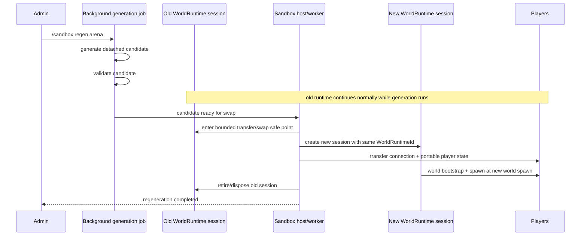
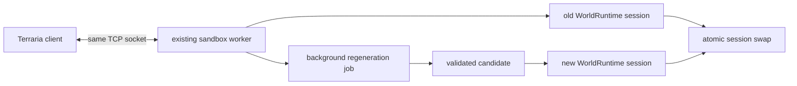
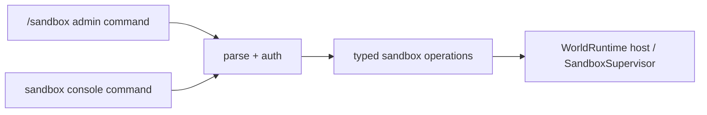

# Sandbox debug/admin command roadmap

This page defines the planned debug/admin command surface for exercising sandbox lifecycle before Vega receives a polished production-facing API. The commands are orchestration only: they must call the same sandbox lifecycle services that Vega will use later and must never become a second implementation of sandbox behavior inside the console/chat layer.

The canonical command family is `/sandbox ...` for an authenticated in-game/admin command surface. The Terminal UI may expose the same semantics as `sandbox ...` without the slash. Both front ends must translate to the same typed requests and status model.

## Command surface

Initial command set:

```text
/sandbox list
/sandbox status <sandbox>
/sandbox jobs
/sandbox job <operation-id>

/sb1 <name> file <relative-world-path>
/sb2 <name> file <relative-world-path>

/sb1 <name> gen <generator-id> [seed <number|random>] [size <primary|width>x<height>] [mode <classic|expert|master|journey>] [evil <corruption|crimson>]
/sb2 <name> gen <generator-id> [seed <number|random>] [size <primary|width>x<height>] [mode <classic|expert|master|journey>] [evil <corruption|crimson>]

/sb1 <name> schem <relative-schematic-path>
/sb2 <name> schem <relative-schematic-path>

/sandbox move <player> <sandbox|primary>
/respawn <player> <sandbox|primary>
/sandbox regen <sandbox> [seed <number|random>]
/sandbox destroy <sandbox>
/sandbox cancel <operation-id>
```

`sb1` creates an `InProcess` request and `sb2` creates a `DedicatedProcess` request. These are intentionally thin debug aliases; Vega uses the typed sandbox API directly and may provide the full source/generation descriptor without being constrained by the console grammar. For generated debug sandboxes, omitted `size` (or explicit `size primary`) uses the current primary world's tile dimensions rather than a hard-coded Terraria world size.

The local TUI/plain-console surface also accepts `sb` as a compact Level 1 alias: `sb <name> gen|file ...` creates an in-process sandbox, while `sb list|status|jobs|job|move|regen|destroy|cancel ...` maps to the canonical lifecycle tree. This is presentation grammar only; it produces the same typed operations as the canonical roots.

The baseline deliberately does not accept an arbitrary `Modules = [...]` list. Level 1 uses already-loaded Vega code and creates only the selected sandbox/game-mode state. Level 2 receives the selected sandbox-side game-mode/plugin package through the normal worker descriptor defined by the Level 2 roadmap.

## Asset safety

Debug commands must not turn an authenticated admin command into arbitrary filesystem access.

- `file` paths resolve only below configured world-asset roots;
- `schem` paths resolve only below configured schematic roots;
- absolute paths and `..` traversal are rejected;
- generator IDs come from the registered generator catalog;
- game-mode IDs come from the registered sandbox/game-mode catalog;
- a command cannot name an arbitrary DLL or executable path;
- sandbox names are bounded, normalized identifiers rather than filesystem paths.

## Background materialization

World generation must never block the authoritative world owner or the command caller.



Normative rules:

- `Generated` sources always execute outside the authoritative game loop;
- generation produces detached candidate state and may not mutate a live runtime while building;
- validation completes before runtime admission;
- generation jobs use bounded concurrency, memory and cancellation;
- one admin cannot create unbounded concurrent generation work;
- `.wld` and `.trschem` loading may use the same detached job pipeline when their materialization cost justifies it;
- command completion reports job acceptance immediately rather than waiting synchronously for generation.
- generator IDs are resolved before acceptance, so an unknown ID is returned to the caller immediately and never creates a phantom queued job;
- every accepted job publishes one terminal `Completed`, `Failed`, or `Canceled` snapshot to operator observability; TUI feedback and the plain-console structured log consume that snapshot without participating in lifecycle commit.

Suggested job states are `Queued`, `Materializing`, `Validating`, `Starting`, `Ready`, `Swapping`, `Completed`, `Failed`, and `Canceled`. Do not create a generic workflow framework solely for these states; they belong to sandbox lifecycle jobs.

## Moving a player

`/sandbox move <player> <sandbox|primary>` performs a semantic runtime transfer. The command must not emulate a world switch by manually spraying Terraria packets.

### Level 1



The same accepted TCP connection remains in the main process.

### Level 2

The move command uses the normal Level 2 transfer path: bounded semantic player-state transfer over `TerraRuntime.Transport`, then OS socket handoff to the worker. Moving back to `primary` performs the reverse handoff. The debug command is not allowed to invent a proxy-only shortcut that would bypass the production transfer contract.

## Respawning a player into a runtime

`/respawn <player> <sandbox|primary>` is the force-spawn form of runtime transfer. It is intentionally separate from the sandbox lifecycle command tree because it is a direct player operation, while still using the exact same typed transfer primitive as `sandbox move`.

The destination is always explicit. The operation guarantees that the player ends in the requested live `WorldSessionId`, receives the destination world's bootstrap as required, and is spawned at the destination runtime's selected spawn point. It does not preserve the player's old world-space position.

The distinction from `move` is operational:

- `move` performs the normal semantic runtime transfer and lets the destination transfer policy decide the spawn/placement details;
- `respawn` forces destination bootstrap + spawn and resets world-bound spatial/death state appropriate to a fresh spawn;
- `respawn` may target the player's current runtime, in which case it performs an authoritative respawn there without changing runtime membership;
- neither command is allowed to fake a world transfer through ad-hoc packet emission.



For Level 1, the TCP connection remains in the main process. For Level 2, crossing the process boundary uses the exact same semantic state-transfer and OS socket-handoff contract as `move`; after the handoff the worker sends the bootstrap and spawn. If the player is already owned by the target Level 2 worker, respawning does not hand the socket back to main merely to hand it to the same worker again.

## Background regeneration and atomic runtime replacement

`/sandbox regen <sandbox>` rebuilds a sandbox without disconnecting its players. `regen` remains a sandbox subcommand; there is no separate top-level regeneration command.

For a generated sandbox, the default is to rerun its recorded `Generated` source descriptor. `seed <number>` replaces the seed for the new activation; `seed random` requests a newly chosen seed that is recorded in job/result metadata.

For non-generated sources, the initial implementation may reject `regen` rather than overload the word to mean file reload. A later explicit `rebuild`/`replace` command can rematerialize `.wld`, `.trschem`, or snapshot sources if that operational need appears.

### Identity semantics

Regeneration preserves the logical sandbox identity and rotates the live activation identity:

```text
WorldRuntimeId  = preserved
WorldSessionId  = new
```

The replacement candidate is not admitted as a competing live session while generation is in progress.

### Swap sequence



Required behavior:

- the old runtime remains fully active until the candidate is ready;
- failed/canceled generation leaves the old runtime untouched;
- the commit window is bounded and happens through authoritative lifecycle control;
- connections remain established;
- players receive a fresh world bootstrap and are spawned in the new session instead of being disconnected;
- old world position is not carried into the replacement world;
- connection/auth identity is preserved;
- inventory/loadout and other player state follow the sandbox's explicit player-transfer policy rather than being copied accidentally from global mutable state;
- world-local NPCs, bosses, projectiles, dropped items, events, progression, RNG, liquids, wiring and other simulation state come from the new world candidate, not from the retired session unless an explicit future migration policy says otherwise.

## Level 1 regeneration

For Level 1, candidate generation/materialization runs on bounded background workers in the main process. The existing TCP connection never changes process ownership.

At commit, the host switches player membership from the old `WorldSessionId` to the new one and sends the replacement world's bootstrap/spawn state. The old session is retired only after membership transfer has committed.

## Level 2 regeneration

For Level 2, ordinary regeneration should happen **inside the existing sandbox worker process**.



The worker keeps ownership of the accepted client sockets throughout regeneration. No worker->main->worker socket handoff is performed merely because the world contents are being replaced. This avoids needless connection choreography and keeps regeneration a local world-session replacement.

Only replacing/crashing/restarting the worker process itself requires the separate Level 2 socket-handoff/recovery design.

## Concurrency and failure rules

- at most one create/regenerate mutation job targets a given sandbox name/runtime at a time;
- process-wide concurrent generation jobs are bounded;
- a second `regen` for the same sandbox is rejected or explicitly supersedes/cancels the pending job, never silently races it;
- destroy while regeneration is pending cancels the job first and then retires the current runtime;
- a failed regeneration never destroys the current healthy runtime;
- swap failure fails closed: either the old session remains authoritative or the new session becomes authoritative, never both;
- lifecycle operations return their operation ID at acceptance; pending operation IDs are visible through `sandbox status`, and structured failures remain observable through runtime logs;
- Level 2 worker failure during regeneration follows normal supervisor fault handling rather than pretending the swap succeeded.

## Debug command implementation boundary

Do not put sandbox lifecycle logic in `RuntimeOverviewDashboard`, chat parsing, or a future Vega command class. The front end should parse/authenticate and submit typed semantic operations to the sandbox lifecycle owner.



The TUI currently owns local presentation commands; sandbox commands should not cause that UI class to grow into the actual world-lifecycle implementation.

## Delivery checklist

### Command contract

- [x] define one typed sandbox debug/admin operation model shared by TUI and authenticated admin command front ends;
- [x] implement `list` and `status`;
- [x] implement retained `jobs` and `job <operation-id>` status inspection;
- [x] implement `sb1 ... file`;
- [x] implement `sb1 ... gen` with asynchronous generation, primary-world dimension defaults and explicit seed/size/mode/evil debug options;
- [ ] implement `sb1 ... schem`;
- [x] implement `sandbox move <player> <sandbox|primary>` for Level 1;
- [x] implement top-level `respawn <player> <sandbox|primary>` for Level 1, including same-runtime forced respawn;
- [x] implement `destroy` for Level 1;
- [x] implement cancellation and terminal success/failure/cancel notifications for accepted Level 1 jobs;
- [x] expose the same typed operations through TUI/plain-console roots `sandbox`, compact Level 1 `sb`, `sb1`, `sb2` and `respawn` without duplicating lifecycle logic.

### Level 2 command coverage

- [ ] implement `sb2 ... file` through `SandboxSupervisor`;
- [ ] implement `sb2 ... gen` with generation/materialization inside the worker where practical;
- [ ] implement `sb2 ... schem`;
- [ ] implement `move` to Level 2 using semantic state transfer + OS socket handoff;
- [ ] implement `respawn` to Level 2 using the same transfer/handoff contract and destination bootstrap/spawn;
- [ ] implement move/respawn back to `primary` using reverse socket handoff when crossing process ownership;
- [ ] implement `destroy` with graceful worker shutdown and forced-kill fallback.

### Regeneration

- [x] persist enough source metadata on a generated sandbox to rerun its generator deterministically when a seed is retained;
- [x] implement bounded background regeneration without mutating the live runtime candidate-in-place;
- [x] preserve `WorldRuntimeId` and rotate `WorldSessionId` on successful replacement;
- [x] keep the old runtime serving players until the replacement candidate is validated and ready;
- [ ] transfer all connected players without disconnecting them;
- [ ] send fresh world bootstrap and respawn players after the swap;
- [x] ensure failed/canceled regeneration leaves the old runtime intact;
- [ ] Level 2 regeneration keeps the existing worker and client socket ownership when the worker itself is healthy;
- [ ] test repeated regeneration for leaked hooks, timers, entities, background jobs and retired runtime references.

### Job control and safety

- [x] bounded process-wide generation/materialization concurrency;
- [x] per-sandbox mutation-job exclusion;
- [x] cancellation and structured failure reporting;
- [x] restricted world/schematic asset roots and path traversal rejection;
- [ ] admin authorization before any lifecycle operation;
- [x] tests proving command parsing cannot select arbitrary DLL/executable/filesystem paths.

## Completion criteria

This debug/admin surface is complete when an operator can create L1 and L2 sandboxes from file, generated and schematic sources; observe accepted/pending operations and structured failures; move or force-respawn a player into a selected sandbox/primary runtime; regenerate a generated sandbox while players remain connected and respawn in the replacement world; and destroy the sandbox without leaving runtime, plugin, worker, transport or socket ownership behind.
