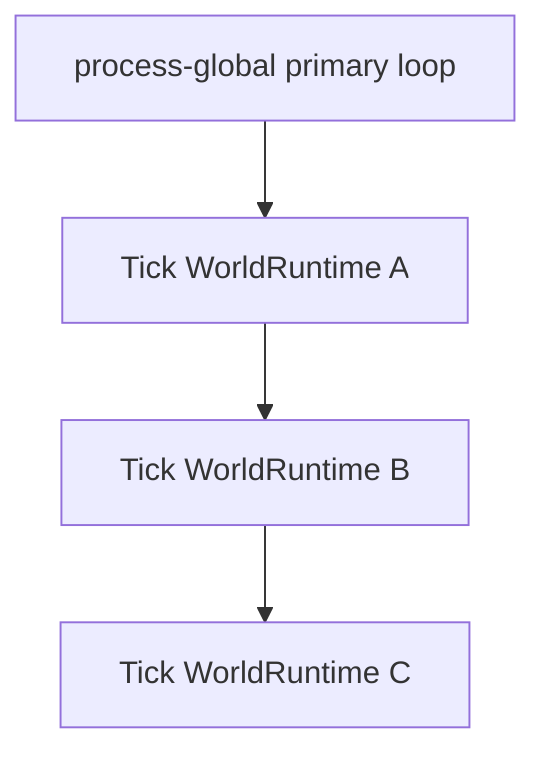
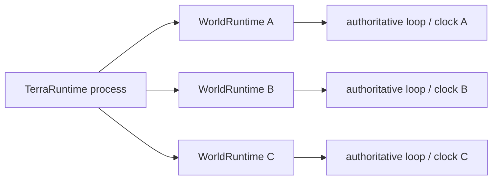
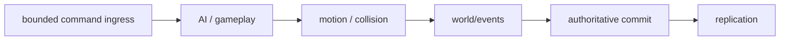
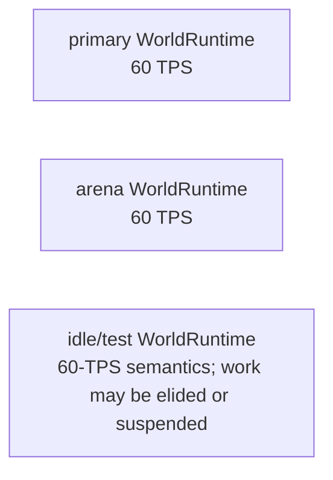
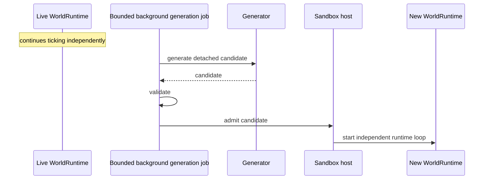
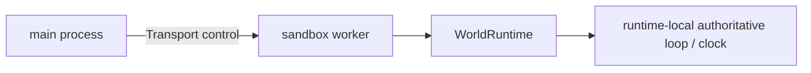

# WorldRuntime scheduling and tick-rate roadmap

This page is normative for execution scheduling of primary worlds, Level 1 sandboxes and Level 2 worker worlds. A primary world is not a special simulation class: it is the same `WorldRuntime` abstraction selected by host/Vega policy.

The core rule is simple: **each live `WorldRuntime` owns its own authoritative simulation clock and execution ownership**. Sharing a process must not turn multiple worlds into one serialized primary-world tick loop.

## Execution ownership

Level 1 must not be implemented as a primary loop that iterates every world:



That design couples latency between otherwise isolated worlds. A slow boss update, pathological plugin callback or expensive world operation in one runtime would delay every other Level 1 runtime.

The target model is independent execution ownership:



Normative rules:

- every live `WorldRuntime` has exactly one authoritative simulation owner at a time;
- mutable gameplay state is touched only by that runtime's authoritative owner;
- one runtime being late must not directly stall another runtime's tick loop;
- cross-runtime operations use typed transfer/lifecycle commands and safe points rather than direct mutable access;
- background generation/materialization is not part of any live runtime tick loop;
- `async` here means independently scheduled runtimes, **not** turning the authoritative tick itself into a graph of arbitrary awaited tasks.

The authoritative tick remains an ordered synchronous simulation step conceptually equivalent to:



I/O, blocking waits and arbitrary asynchronous continuations must not become simulation ownership.

## First Level 1 implementation

The first implementation should prefer the simplest ownership model that makes the invariant obvious: **one dedicated authoritative loop execution context per live `WorldRuntime`**.

A dedicated thread per active runtime is acceptable for the first working Level 1 implementation if that is the smallest reliable design. Do not prematurely replace it with a generic scheduler, worker pool or task graph merely to reduce thread count before measurements exist.

If later measurements show that many mostly-idle worlds make one-thread-per-runtime wasteful, a shared scheduler may be introduced only if it preserves the same logical single-writer ownership and independent clocks.

## Per-runtime clock and target TPS

Tick policy belongs to `WorldRuntime`, not to the process as one global server setting.

The architecture should support a runtime-local policy concept equivalent to:

```csharp
public sealed record WorldRuntimeOptions
{
    public int TargetTicksPerSecond { get; init; } = 60;
    public WorldIdlePolicy IdlePolicy { get; init; } = WorldIdlePolicy.FullRate;
}
```

The exact public shape may change during implementation; do not add an abstraction solely to preserve this example. The semantic requirements are:

- target TPS is runtime-local;
- observed TPS is runtime-local;
- tick duration/overrun metrics are runtime-local;
- pause/idle policy is runtime-local;
- changing policy for one runtime must not change another runtime's clock.

Example target topology:



## Vanilla timing compatibility

The first production-capable Level 1 baseline keeps **60 simulation ticks per second** for ordinary Terraria worlds.

This is not an arbitrary preference. Large parts of vanilla-compatible simulation express time in ticks: AI counters, buffs, projectile lifetime, cooldowns, day/night progression and event timers frequently assume the canonical tick cadence. Simply scheduling a world at 30 ticks per second without compensating semantics would make many mechanics run at half speed rather than merely reducing update frequency.

Therefore:

- [ ] baseline Level 1 runtime loop owns a per-runtime target rate but defaults ordinary Terraria simulation to 60 TPS;
- [ ] no global `ServerTickRate` is allowed to remain the sole owner of simulation cadence once multiple `WorldRuntime` instances exist;
- [ ] non-60 active simulation TPS is opt-in/future until affected vanilla-compatible timing domains are audited;
- [ ] tests must distinguish scheduler frequency from gameplay-time semantics.

## Variable active TPS

The architecture must not make non-60 TPS impossible, but enabling it is a separate correctness feature. It is **not required for idle optimization** and must not be used as the default way to save CPU for empty worlds.

Before an active runtime may claim arbitrary simulation TPS, implementation must define how tick-based mechanics preserve intended elapsed-time semantics. Relevant domains include at least:

- NPC and boss AI timers;
- buffs/debuffs;
- projectile lifetime and cooldowns;
- player immunity/cooldowns;
- world time/day-night advancement;
- invasions and events;
- spawn scheduling;
- wiring/mechanism timers;
- plugin/game-mode timers;
- replication cadence and network backpressure.

Do not scatter `deltaTime` multipliers through source-backed vanilla logic without evidence. If variable-rate simulation is implemented, it needs a deliberate time model and regression coverage.

## Idle work elision and suspension

Idle optimization is more valuable than arbitrary active TPS, but **an empty world must not become a reduced-TPS Terraria simulation by default**. The preferred optimization is to preserve ordinary 60-TPS gameplay semantics while avoiding work that has no observable or required effect when the runtime is empty.

A runtime with no players may therefore:

- keep its normal 60-TPS clock while short-circuiting player-, replication-, AI- or other domains that are explicitly safe to skip;
- avoid waking expensive subsystems when no relevant work is pending;
- enter a suspended/dormant state when the selected sandbox policy permits it;
- wake on player admission, operator/runtime commands or other explicitly registered work and restore normal active execution before gameplay resumes.

Suspension is not the same as running Terraria at 5, 10 or 30 TPS. A dormant runtime performs no ordinary gameplay ticks while asleep. Any state that is expected to advance while the runtime is dormant must have explicit wall-clock or catch-up semantics rather than accidentally inheriting a slower tick cadence.

The idle contract must explicitly decide what happens to at least:

- world time/day-night progression;
- weather;
- invasions and events;
- NPCs and spawn scheduling;
- projectiles and items;
- wiring/mechanism timers;
- plant/world growth or other scheduled world updates;
- plugin/game-mode timers;
- autosave and housekeeping.

Possible policies may eventually include concepts such as:

- full rate: continue normal 60-TPS simulation;
- work-elided idle: retain 60-TPS semantics but skip domains proven irrelevant while empty;
- suspended: stop ordinary simulation entirely for explicitly ephemeral/test worlds where that behavior is acceptable, with defined wake/catch-up rules for any wall-clock state.

The concrete policy names are intentionally not frozen yet.

Requirements:

- [ ] idle state is determined per runtime;
- [ ] active gameplay remains on the ordinary 60-TPS cadence; idle optimization does not silently lower simulation TPS;
- [ ] define which simulation domains may be skipped while empty and which must continue or use explicit wall-clock advancement;
- [ ] entering/leaving idle or suspended state cannot alter another runtime;
- [ ] player admission wakes the runtime and restores normal active execution before gameplay resumes;
- [ ] commands/events that require the authoritative owner can wake a dormant runtime deterministically;
- [ ] time/events/timers under work elision or suspension are explicitly defined and tested;
- [ ] idle optimization does not run background generation on the authoritative thread.

## Overrun and catch-up policy

Each runtime needs its own observability and overrun policy.

Track at least:

- target TPS;
- observed TPS;
- tick duration;
- tick overruns;
- accumulated scheduling lag where applicable;
- current idle/scheduling mode.

Do not implement unbounded catch-up loops. If a runtime falls behind, it must have a bounded policy that prevents one overloaded world from consuming the process indefinitely in an attempt to replay unlimited missed ticks.

Required tests:

- [ ] a deliberately slow runtime does not directly stall another runtime's authoritative loop;
- [ ] one runtime's overrun counters do not affect another runtime;
- [ ] catch-up work is bounded;
- [ ] process shutdown can stop every runtime loop deterministically;
- [ ] create/destroy cycles do not leak loop threads/tasks/timers.

## Background world generation

Generated sandbox materialization is deliberately outside the runtime clock model:



Generation jobs use bounded background execution and never borrow the primary runtime's authoritative loop merely because both live in one process.

## Level 2 consistency

Level 2 uses the same scheduling model inside the worker process:



`WorldRuntime` scheduling semantics therefore must not depend on `WorldIsolationLevel`. Level 2 changes process/fault isolation, not the simulation clock abstraction.

## Shared scheduler is an optimization, not the baseline

A future measured optimization may multiplex low-load Level 1 runtimes over fewer physical threads. If introduced, it must preserve:

- one logical authoritative owner per runtime;
- independent runtime clocks;
- bounded fairness so one runtime cannot starve another;
- runtime-local overrun metrics;
- deterministic teardown;
- no concurrent mutation of one runtime by multiple scheduler workers.

Do not introduce `WorldRuntimeSchedulerManager`, generic task orchestration or work-stealing complexity before evidence shows the simple ownership model is insufficient.

## Delivery checklist

### RS0 - ownership foundation

- [x] move simulation clock ownership from process-global assumptions into `WorldRuntime`;
- [x] give every runtime an independent authoritative loop execution owner;
- [x] prohibit process-global `foreach (world) world.Tick()` as the Level 1 execution model;
- [x] prove two active runtimes can tick concurrently without mutable-state sharing;
- [x] deterministic start/stop/dispose for each runtime loop.

### RS1 - per-runtime 60 TPS baseline

- [x] runtime-local target/observed TPS;
- [x] ordinary Terraria simulation defaults to 60 TPS;
- [x] runtime-local overrun/lag metrics;
- [x] bounded overrun/catch-up behavior;
- [x] existing single-world startup retains its current timing behavior.

### RS2 - Level 1 isolation under load

- [ ] slow synthetic work in sandbox A does not directly stall sandbox B or primary runtime;
- [x] command ingress remains bounded independently per runtime;
- [ ] replication/output pressure for one runtime cannot seize another runtime's simulation owner;
- [x] generation/materialization remains background work outside live loops.

### RS3 - idle work elision / suspension

- [ ] define supported idle semantics without introducing reduced gameplay TPS as the default optimization;
- [ ] define and implement safe per-domain work elision for empty runtimes where measurements justify it;
- [ ] implement optional per-runtime suspension/dormancy where sandbox semantics permit it;
- [ ] wake and restore ordinary 60-TPS active execution before admitting/resuming player gameplay;
- [ ] define and test wall-clock/catch-up behavior for time, events and timers that must progress while dormant;
- [ ] prove idle optimization in one runtime cannot alter scheduling or state in another runtime.

### RS4 - variable active TPS

Only after timing semantics are audited, and independently of idle optimization:

- [ ] define elapsed-time semantics for non-60 active simulation;
- [ ] audit vanilla-compatible tick counters/timers;
- [ ] implement non-60 active runtime policy without cross-runtime effects;
- [ ] regression-test representative bosses, buffs, projectiles, events and world time;
- [ ] expose configuration only after correctness is demonstrated.

### RS5 - optional shared scheduler

Only after profiling demonstrates a need:

- [ ] benchmark thread-per-runtime cost with realistic idle/active world counts;
- [ ] design bounded fair multiplexing while retaining logical single-writer ownership;
- [ ] compare latency/TPS isolation against the simple baseline;
- [ ] adopt only if measurements justify the added complexity.

## Completion criteria

The scheduling foundation is complete when multiple Level 1 `WorldRuntime` instances execute independently, each owns its authoritative clock and metrics, ordinary active Terraria worlds retain correct 60-TPS timing, empty runtimes can avoid unnecessary work or suspend without masquerading as reduced-TPS gameplay, one overloaded runtime cannot directly serialize all others, generation happens outside live loops, and the same clock/ownership model can run unchanged inside a Level 2 worker.
