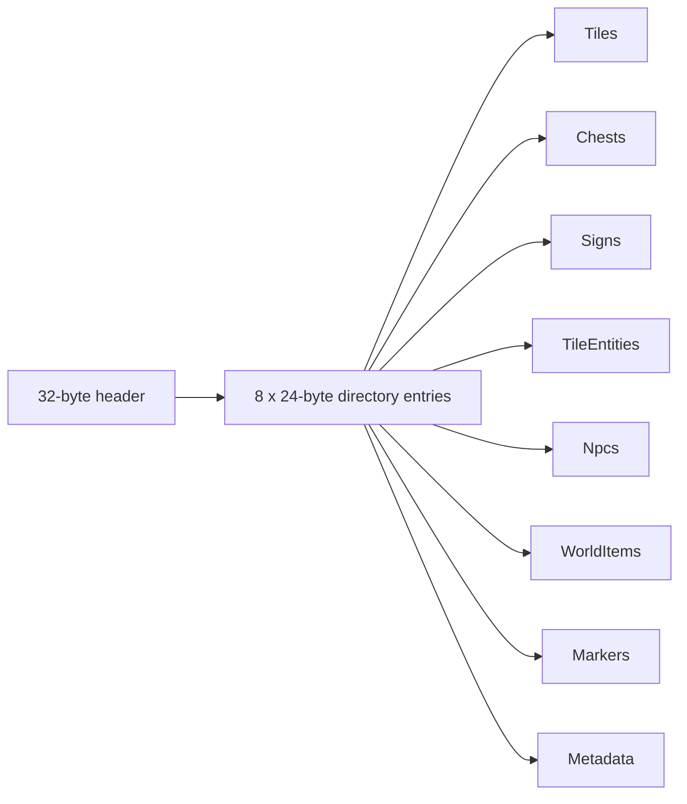

# `.trschem` codec implementation track

This page records implementation detail for the first TerraRuntime Schematic slice. The broader source/materialization plan remains in [`world-sources-schematics.md`](world-sources-schematics.md).

## First slice

The first implementation intentionally stops at the portable format boundary. It introduces `TerraRuntime.Schematics` as a dependency-free, NativeAOT-compatible project and does not yet mutate a live `WorldRuntime`.

Implemented surface in this slice:

- `SchematicDocument` plus typed tile/chest/sign/tile-entity/NPC/world-item/marker/metadata records;
- strict document validation and hard file/section/count/string limits;
- `.trschem` v1 fixed header and deterministic section directory;
- required section semantics, overlap detection and unknown-required-section rejection;
- per-section CRC-32 corruption detection;
- uncompressed deterministic v1 encoding;
- `SchematicBinary.Serialize` / `Deserialize`;
- sync/async `Stream` read/write;
- `SchematicFile.Save` / `Load` and async variants;
- neutral `ISchematicCaptureSource` and `ISchematicRestoreTarget` contracts;
- focused tests for deterministic round trip, checksum corruption, truncation, invalid dimensions/tile counts, stream API and filesystem API.

The package does not reference `TerraRuntime.Core`, `TerraRuntime.World`, Vega, or WorldEdit. `.wld` codecs remain in `TerraRuntime.World`.

## v1 binary layout

The header uses `TRSC`, format version `1`, Terraria content-version metadata, dimensions, relative origin and section count. Directory entries contain section kind/required flags, offset, stored length, decoded length and CRC-32. Compression is deliberately not admitted in v1 yet; `storedLength == decodedLength` is required.

## Next implementation slice

The next work should implement runtime/editor capture and restore over the neutral contracts without moving schematic format knowledge into `TerraRuntime.Core`:

1. capture immutable world-region state into `SchematicDocument` under authoritative ownership;
2. restore tiles/objects/entities into isolated candidate state or an authoritative live-world command;
3. allocate fresh runtime identities for chests/signs/tile entities/NPCs/items;
4. validate object overlap/out-of-bounds semantics before publication;
5. connect `.trschem` materialization to the shared sandbox world-source pipeline;
6. only then mark the runtime-materialization WS2/WS3/WS4 checklist items complete.

WorldEdit should consume the same `TerraRuntime.Schematics` package and call the binary/file APIs directly. No WorldEdit format adapter is planned for this baseline.
