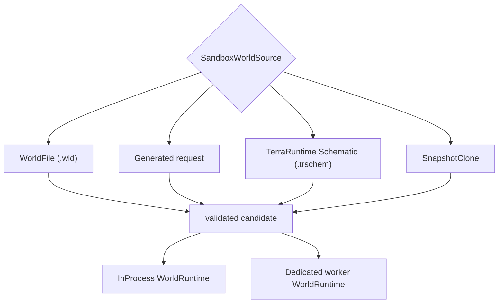
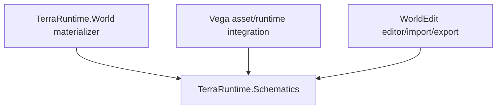
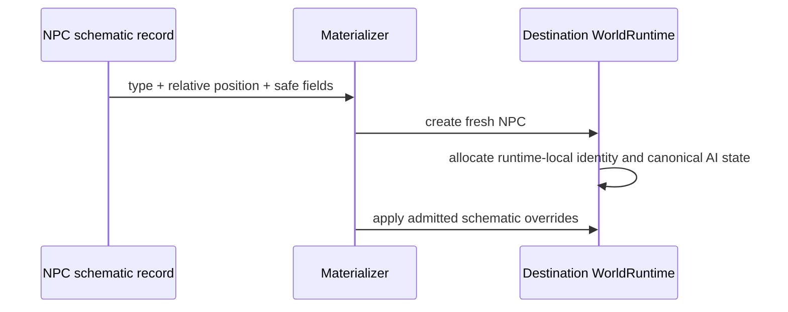
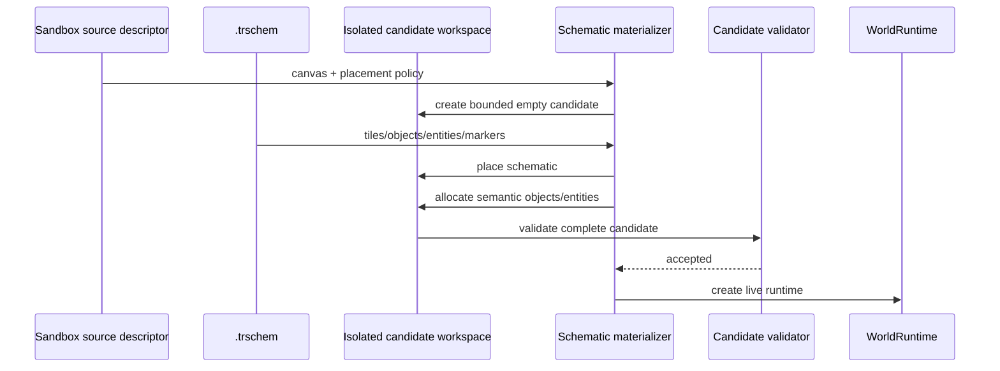

# Sandbox world sources and TerraRuntime Schematic roadmap

This page is normative for the source/materialization side of the sandbox roadmap. It complements [`README.md`](README.md).

## Decision

Level 1 and Level 2 use one `SandboxWorldSource` concept. Isolation changes placement of the resulting `WorldRuntime`; it does not define a second map/source pipeline.

Required source families:



A source that is valid for Level 1 should be valid for Level 2 unless a concrete platform/resource constraint is reported explicitly.

## Shared schematic package

Introduce a small shared format/model boundary, tentatively `TerraRuntime.Schematics`.

It owns:

- `.trschem` file model;
- bounded reader/writer;
- format/version validation;
- deterministic encoding;
- typed schematic records;
- corruption detection and decompression bounds.

It must not depend on:

- `TerraRuntime.Core`;
- live `WorldRuntime` implementations;
- Vega;
- WorldEdit.

Consumers:



WorldEdit adopts `.trschem` directly. TerraRuntime does not carry a WorldEdit compatibility adapter as part of the sandbox baseline.

## `.trschem` v1 semantic content

The file describes a portable bounded scene/region. It is not a live simulation snapshot.

Required logical sections:

```text
Header / SectionDirectory
Tiles
Chests
Signs
TileEntities
Npcs
WorldItems
Markers
Metadata
```

### Header and directory

The binary format must provide:

- fixed magic, recommended `TRSC`;
- explicit format version;
- Terraria content compatibility/version marker;
- schematic width/height;
- origin/anchor information needed for relative placement;
- bounded section count;
- section kind and required/optional semantics;
- stored and decoded lengths;
- per-section corruption detection or equivalent integrity check;
- optional independently compressed sections using an admitted BCL/AOT-safe codec;
- deterministic section order when writing.

Unknown required sections fail closed. Optional future sections may be skipped only when the file format explicitly marks them optional.

### Tile section

The v1 tile representation must preserve the semantic state necessary for round-tripping an arena/build:

- tile type and active state;
- wall;
- frame coordinates;
- slope/half-block/shape state;
- tile/wall paint and supported coatings;
- liquid amount and kind;
- red/blue/green/yellow wires;
- actuator/inactive state;
- other stable tile flags already represented by the runtime/worldgen normalized tile model.

Use bounded palette/RLE/chunk encoding only after independent golden tests prove deterministic decode/encode. Never allocate from file-provided dimensions or section lengths before checking limits.

### Chests

Each chest stores relative tile position, bounded name and up to the vanilla `40` slots. Each slot stores item type, stack and prefix.

Do not store destination runtime chest indices. Materialization allocates new IDs.

Acceptance must prove:

- chest content survives `.trschem` write/read/materialize;
- malformed stacks/item IDs fail through runtime validation rather than corrupting world state;
- overlapping/invalid chest placement is rejected deterministically.

### Signs

Store relative position and bounded UTF-8 text. Runtime sign IDs are assigned on materialization.

### Tile entities

Store typed semantic tile-entity records rather than implementation-object dumps. The v1 specification must enumerate supported vanilla kinds and their bounded fields before the checkbox is completed.

A required tile-entity payload whose kind/version cannot be interpreted fails closed.

### NPC placements

NPC support is required in v1.

A schematic NPC record describes a **fresh NPC placement**, not a paused live NPC object.

Portable fields may include only data with stable materialization semantics:

- `NpcTypeId`;
- relative pixel position;
- safe direction/sprite-direction fields;
- bounded custom/town name;
- town-NPC home coordinate and homeless state;
- appearance/variant fields after their semantic contract is verified;
- optional life override only if explicitly admitted as schematic-safe.

Never persist as v1 baseline:

- runtime NPC slot/index;
- source runtime/session identity;
- target player slots;
- `realLife`/parent slot references;
- raw `ai[]`/`localAI[]` arrays;
- runtime archetype-generation handles;
- transient pathfinding, combat-scheduler or networking state.

Materialization sequence:



Boss NPC types are legal scene records only if the runtime can create them through the same safe fresh-spawn path. Loading a boss record never resumes source-world combat state. Game-mode code may choose not to activate/load boss records until the encounter lifecycle requires them.

### World items

v1 stores dropped/world items with type, stack, prefix and relative position. Runtime identity, pickup ownership/network generation and other transient state are not persisted.

### Projectiles and highly transient entities

Projectiles are not required in v1. Their owner references and AI fields often refer to live player/NPC/runtime state. Add a projectile section only after a portable semantic model exists for the supported projectile families.

This is deliberate scope control, not a statement that `.trschem` can never contain projectiles.

### Markers and regions

v1 supports bounded named points and rectangles. Names are stable data, not plugin objects.

Representative names:

```text
spawn
team:red:spawn
team:blue:spawn
boss:spawn
lobby
arena:bounds
```

Only a minimal shared vocabulary needs runtime semantics. Vega/game modes and WorldEdit can interpret additional names. Names must have hard length/count limits.

### Metadata

Metadata is bounded and versioned. Do not introduce arbitrary object serialization. If namespaced custom metadata is admitted, it must have explicit byte/count limits and must not be trusted as executable/configuration code by the runtime.

## Schematic materialization into a complete sandbox world

A schematic is a region/scene, not a complete `.wld`. `SandboxWorldSource.Schematic` combines it with canvas/materialization options.

Conceptually:

```text
SchematicWorldSource
  source reference / hash
  canvas dimensions
  placement origin or anchor
  spawn marker selection
  world/environment defaults
```

Flow:



The sandbox baseline places into a fresh candidate with deterministic replacement semantics. Editor paste collision policy belongs to WorldEdit/Vega operations and is not hidden inside the `.trschem` file.

## Level 1 integration

Level 1 can create a runtime from:

- `.wld`;
- `Generated` request;
- `.trschem` + canvas options;
- snapshot clone when available.

The resulting runtime is an ordinary `WorldRuntime`; primary/sandbox designation remains host policy.

Generation and schematic materialization happen against isolated candidate state before the runtime is admitted as live.

## Level 2 integration

Level 2 accepts the same source descriptors.

For a local worker:

- `.wld` and `.trschem` should normally be resolved through a controlled source store/reference plus integrity hash rather than repeatedly copying arbitrary file bytes through every control message;
- `Generated` sends the generation descriptor so the worker can generate and validate locally;
- the worker reports `RuntimeReady` only after source materialization and required sandbox-side game mode/plugin logic are ready;
- source transport remains control-plane behavior and is independent from later TCP socket handoff.

Remote workers are deferred and may need a content-transfer/cache protocol later.

## Delivery plan

### WS0 - contracts and file specification

- [ ] define `SandboxWorldSource` source families without coupling them to isolation level;
- [ ] define `.trschem` v1 magic/version/section directory semantics;
- [ ] define hard bounds and corruption/failure behavior;
- [ ] create shared `TerraRuntime.Schematics` model/codec boundary;
- [ ] keep the library NativeAOT-safe and free of Vega/WorldEdit/runtime-core dependencies.

### WS1 - tile scene round trip

- [ ] tiles/walls/frames/shape/paint/coatings round-trip;
- [ ] liquids and all supported wire/actuator state round-trip;
- [ ] deterministic writer output and golden binary fixtures;
- [ ] malformed/truncated/oversized input fails boundedly.

### WS2 - semantic world objects

- [ ] chest position/name/40-slot item contents round-trip;
- [ ] signs round-trip;
- [ ] enumerate and support v1 typed tile-entity kinds;
- [ ] duplicate/overlap/out-of-bounds object placement is rejected before live publication.

### WS3 - NPC/items/markers

- [ ] NPC placements round-trip through fresh runtime identity allocation;
- [ ] town NPC name/home semantics have focused tests;
- [ ] boss record materialization, if enabled, starts fresh canonical state and never copies raw AI references;
- [ ] world-item placements round-trip;
- [ ] named points/regions round-trip with bounded names/counts;
- [ ] no runtime handles, source runtime identity or connection/player slots appear in the persisted format.

### WS4 - candidate materializer

- [ ] create a bounded empty candidate canvas;
- [ ] place `.trschem` deterministically at requested origin/anchor;
- [ ] apply semantic chests/signs/tile entities/NPC/item records;
- [ ] resolve spawn marker and required world metadata;
- [ ] validate before creating/admitting `WorldRuntime`;
- [ ] prove teardown of an ephemeral schematic runtime leaves no retained world/entity state.

### WS5 - sandbox source parity

- [ ] Level 1 can launch the same arena from `.wld`, Generated and `.trschem` sources;
- [ ] Level 2 can launch the same arena from `.wld`, Generated and `.trschem` sources;
- [ ] changing `InProcess` <-> `DedicatedProcess` does not require changing map asset format;
- [ ] Level 2 source resolution is integrity checked and bounded;
- [ ] source preparation completes before player socket transfer begins.

### WS6 - Vega and WorldEdit adoption

- [ ] Vega can store/reference `.trschem` arena assets directly;
- [ ] WorldEdit reads/writes `.trschem` directly through the shared package;
- [ ] WorldEdit can capture supported tiles/chests/signs/tile entities/NPCs/world items/markers into `.trschem`;
- [ ] WorldEdit can paste/materialize the same semantic records back into a runtime-owned operation;
- [ ] no TerraRuntime -> WorldEdit dependency or legacy-format adapter is introduced as part of the baseline.

## Acceptance principle

A `.trschem` feature is not complete merely because our writer and reader round-trip each other. For Terraria content semantics, validate resulting tiles/objects/entities against independent runtime/world-format behavior where practical. Security tests must use hostile lengths/counts/corruption and prove allocations/work remain bounded.
