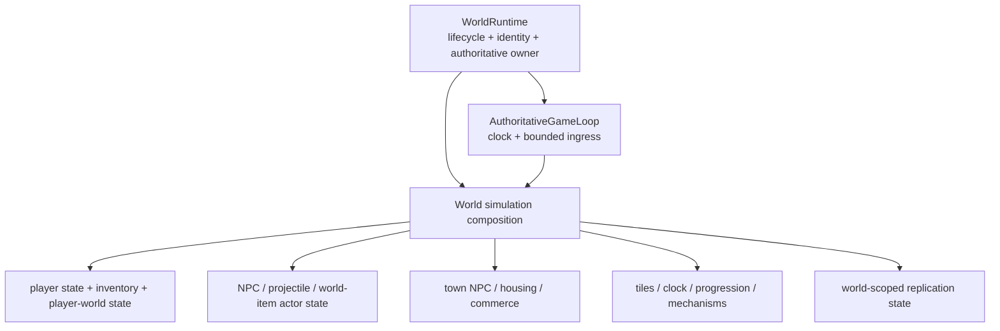
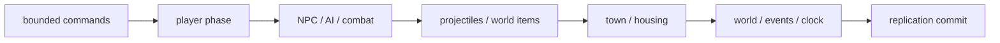

# `ServerRuntimeState` decomposition roadmap

This page expands the `R4` / `R5` architecture-cleanup work for `ServerRuntimeState`. The class is currently a large handwritten application/runtime god object: it owns or composes player state, inventories, NPC state/AI/actors/archetypes, projectiles, combat, town NPC systems, housing/shops, world items, tile mutations, progression, world clock and replication. Its decomposition is a prerequisite for a clean multi-world `WorldRuntime` boundary.

The goal is **not** to replace one 2,000-line class with twenty `*Manager`, `*Provider`, `*Service` or forwarding wrappers. The goal is to make real ownership visible while preserving one authoritative writer per live `WorldRuntime`.

## Target ownership

`WorldRuntime` is the lifecycle boundary. The extracted collaborators remain world-owned implementation details unless there is a real external API boundary. They must not become independently mutable owners.

## What `ServerRuntimeState` is allowed to become

The end state may retain a small runtime-state/composition object if it has a coherent purpose: supplying the authoritative tick with the world-owned collaborators for one `WorldRuntime`.

It must no longer be responsible for all of the following at once:

- constructing most gameplay subsystems;
- storing all mutable entity/player collections;
- implementing every command mutation path;
- coordinating NPC AI and combat;
- coordinating projectiles/world items;
- coordinating town NPC, housing and commerce;
- resolving world progression through hidden process-static lookup;
- owning tile/world-clock behavior;
- owning replication wiring;
- acting as the public lookup surface for unrelated runtime capabilities.

## Decomposition rules

- preserve exactly one authoritative simulation owner per `WorldRuntime`;
- extracted collaborators are called by the authoritative owner and do not start their own simulation threads/tasks;
- do not expose mutable stores merely to make the class shorter;
- do not create `PlayerManager`, `NpcManager`, `WorldManager`, `StateManager`, `RuntimeServiceManager` or similar vague buckets;
- prefer existing stores/registries/executors when they already own the state or algorithm;
- create a new collaborator only when a coherent state/lifecycle/algorithm boundary does not already exist;
- keep source-order-sensitive vanilla AI/combat pipelines ordered exactly as verified;
- move pure gameplay/content semantics to `TerraRuntime.Gameplay` rather than extracting another runtime wrapper around them;
- keep `.wld`/persistence representation in `TerraRuntime.World`;
- do not use decomposition as an excuse for compatibility facades: this project is pre-1.0.

## SR0 - inventory the god object

- [ ] inventory every `ServerRuntimeState` field by owner: player, NPC, projectile, item, town, tile/world, progression, replication, extension/host or composition-only;
- [ ] inventory methods by mutation domain and authoritative tick phase;
- [ ] identify fields that are merely constructor/composition temporaries and remove them from long-lived state;
- [ ] identify process-static/global lookups used by the class and classify whether they are truly immutable/global or hidden world state;
- [ ] add/retain integration tests that cover representative player, NPC, projectile, town, progression and world-item behavior before structural moves.

## SR1 - separate construction from simulation state

The current constructor composes a large portion of the server. That is application composition, not mutable world state.

- [ ] move large conditional subsystem construction out of `ServerRuntimeState` into the concrete one-world composition path that will become `WorldRuntime` construction;
- [ ] pass already-constructed world-owned collaborators where practical rather than twenty optional constructor parameters;
- [ ] avoid replacing the constructor with a giant `ServerRuntimeStateOptions` property bag containing the same architectural mess;
- [ ] avoid a generic factory unless construction has real source/isolation variants that justify one;
- [ ] after this slice, `ServerRuntimeState` construction should not decide broad application topology.

## SR2 - player ownership slice

Extract coherent player-owned mutation/state only where it already forms one responsibility.

Candidate responsibilities include:

- runtime player membership/state;
- pending player vitals;
- talk-NPC state;
- inventory/store interaction;
- authoritative server-player state/commands;
- player liquid/contact snapshots;
- per-player tile-edit budget state.

Requirements:

- [x] per-player packet-17 tile-edit admission counters/ceiling live in `PlayerTileEditBudget`; `ServerRuntimeState` only advances and consumes that world-owned policy on the authoritative thread;
- [ ] player state remains owned by the same `WorldRuntime` authoritative thread;
- [ ] connection/network code receives typed operations/snapshots, not mutable player dictionaries;
- [ ] moving a player between sandbox sessions does not require reaching into another runtime's player store directly;
- [ ] player extraction supports later `sandbox move` and top-level `respawn` semantic transfer.

Do not create a generic `PlayerManager`. Use the existing stores/command services where possible and add only a precise world-player aggregate/operations object if a real missing ownership boundary remains.

## SR3 - NPC / actor slice

The NPC section currently combines stores, AI execution, actor control, behavior registration, archetype identity/spawn, targeting, network combat and replication.

- [ ] keep `RuntimeNpcStore` as the concrete NPC state owner if it remains appropriate;
- [ ] keep AI/behavior pipeline ordering explicit;
- [ ] group actor-control/archetype behavior around their existing registries/executors instead of forwarding through `ServerRuntimeState`;
- [ ] make progression/combat dependencies explicit world-owned references rather than rediscovering world state from global lookup during hot paths;
- [ ] keep NPC replication runtime-local;
- [ ] prove two `WorldRuntime` instances can spawn/tick/kill bosses independently.

## SR4 - projectile and world-item slice

- [ ] keep projectile store/executor and world-item store runtime-local;
- [ ] separate projectile/world-item mutation paths from unrelated player/town command handling;
- [ ] keep instanced-item leases scoped to one runtime;
- [ ] keep projectile/NPC/world-item replication registries scoped to one runtime;
- [ ] prove entity slot/ID state cannot leak between two live runtimes.

## SR5 - town NPC / housing / commerce slice

Town gameplay is currently a substantial subsystem inside the god object.

- [ ] move town NPC scheduling, rescue, housing, move-in, commerce, shops, shimmer and town combat coordination behind one or a few **cohesive** world-owned gameplay boundaries;
- [ ] do not create one wrapper class per existing type just to shorten the parent file;
- [ ] keep source-backed town rules in Gameplay where protocol/runtime ownership is not required;
- [ ] keep mutable town population/housing/session state runtime-local;
- [ ] prove town arrivals/housing/progression in one runtime do not affect another runtime.

## SR6 - world state / progression / tile slice

- [ ] make `WorldTileStore`, `RuntimeWorldClock`, world progression mutations and tile/object mutation ownership explicit members of one `WorldRuntime` composition;
- [ ] remove hidden world-state discovery from `ServerRuntimeState` where direct world-owned references are cleaner;
- [ ] re-evaluate `RuntimeWorldProgressionRegistry`: a weak-key registry is multi-world-safe by `WorldTileStore`, but live runtime composition should prefer explicit ownership when practical;
- [ ] keep tile/object mutation and replication on the authoritative owner;
- [ ] ensure weather/time/events/progression remain independent between runtime instances.

The weak-key progression registry is not automatically a correctness bug: it keys progression by the exact `WorldTileStore`. The cleanup goal is explicit ownership and simpler reasoning, not deleting a safe mechanism solely because it is static.

## SR7 - replication boundary

Replication state belongs to a world/session, but socket/process ownership does not belong inside the mutable simulation god object.

- [ ] group runtime-local replication baselines/registries by world ownership;
- [ ] keep public listener/socket acceptance outside `WorldRuntime`;
- [ ] route connection input to the active `WorldSessionId` and therefore to exactly one runtime command queue;
- [ ] support L1 transfer by switching connection/session routing at an authoritative safe point;
- [ ] do not make `ServerRuntimeState` know Level 2 OS socket-handoff mechanics.

## SR8 - authoritative tick decomposition

After ownership is explicit, the authoritative update should read as ordered orchestration rather than 2,000 lines of mixed mutation logic.

Conceptually:

The exact phases must follow verified Terraria ordering; this diagram is an ownership guide, not permission to reorder vanilla semantics.

- [ ] make tick phases visible and testable without creating a generic pipeline framework;
- [ ] keep cross-phase state transfer explicit;
- [ ] retain source-order-sensitive code together where splitting would make correctness harder to verify;
- [ ] no phase may mutate another `WorldRuntime` directly.

## SR9 - fold result into `WorldRuntime`

- [ ] `WorldRuntime` owns identity, session, world-owned composition and one `AuthoritativeGameLoop`;
- [ ] primary startup constructs one normal `WorldRuntime`;
- [ ] Level 1 sandbox constructs another normal `WorldRuntime` using the same path;
- [ ] each runtime receives its own state/stores/registries/RNG/replication/persistence lifecycle;
- [ ] each runtime starts/stops/disposes deterministically;
- [ ] `ServerRuntimeState` is either reduced to a small cohesive world-simulation aggregate or removed if existing concrete owners make it unnecessary;
- [ ] no `ServerRuntimeStateCompatibilityFacade` or old-name forwarding wrapper remains.

## Validation checklist

- [ ] existing single-world behavior remains unchanged;
- [ ] build uses warnings as errors;
- [ ] focused tests remain green after every ownership slice;
- [ ] complete test suite remains green;
- [ ] Linux/Windows NativeAOT smoke remains green where affected;
- [ ] two live runtimes prove independent players/NPCs/projectiles/items/town/progression/RNG/replication;
- [ ] slow work in one runtime does not serialize another runtime's authoritative loop;
- [ ] repeated create/destroy leaves no retired runtime references, hooks, timers or loop threads;
- [ ] roadmap checkboxes are marked `[x]` only after code and CI demonstrate the completed slice.

## Completion criteria

This decomposition is complete when `ServerRuntimeState` is no longer the place where unrelated world systems are constructed and mutated simply because they need an authoritative thread. One `WorldRuntime` owns a small, understandable composition of real stores/registries/executors; the authoritative loop remains the single writer; primary and Level 1 use the same composition; and the code can be navigated by domain ownership instead of scrolling through a multi-thousand-line god object.
