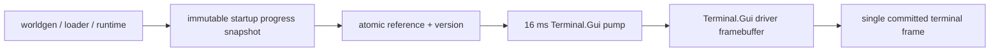
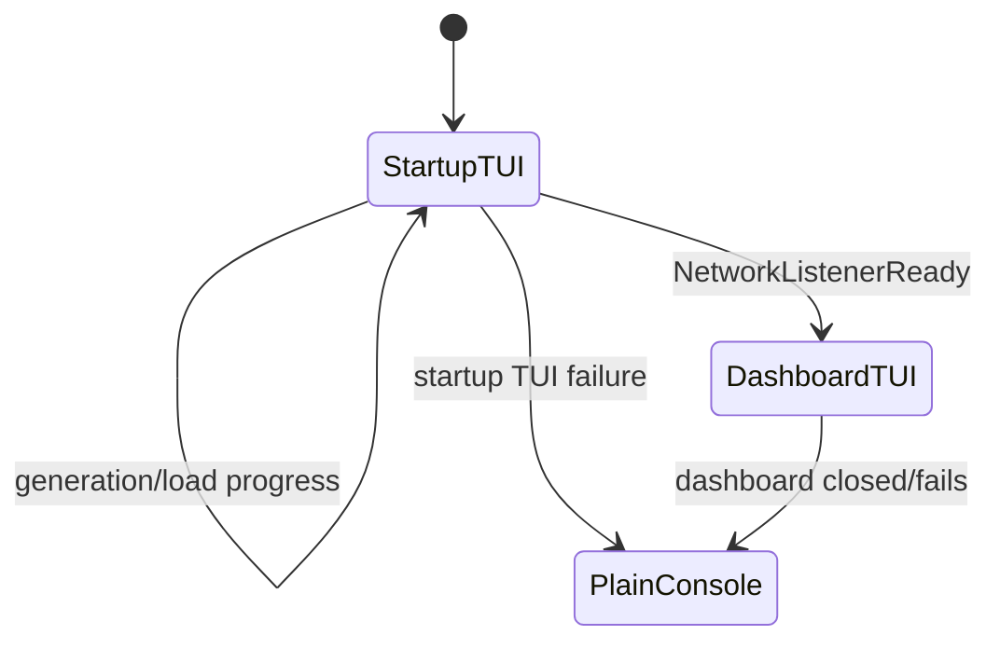

# Startup terminal UX and responsiveness

TerraRuntime uses Terminal.Gui v2 for both the startup surface and the running operations dashboard. The startup UI is intentionally a separate full-screen session: it owns the terminal only while world generation/loading is in progress and releases it before the runtime dashboard starts.

## Acceptance rules

- Terminal input/render pumps target 16 ms. Runtime snapshot freshness remains independent at approximately 500 ms.
- World/network/runtime snapshot acquisition never runs on the Terminal.Gui thread.
- Terminal.Gui's driver framebuffer/double-buffered renderer is the only screen buffer; background workers never write terminal cells or stdout while a TUI owns the terminal.
- Startup progress is event-driven, not timer-driven. No fake percentage advances while work is idle.
- World generation consumes `IWorldGenerationProgressSink` and maps the real pass index/count/fraction to the full-screen progress bar.
- Existing-world startup advances on semantic lifecycle events: cache validation, canonical `.wld` loading, persistence template preparation, bootstrap preparation, runtime activation and network listener readiness.
- `NetworkListenerReady` renders the final startup frame and synchronously releases terminal ownership before the System Dashboard is allowed to take over.
- `--no-tui` preserves headless/plain-console behavior.
- TUI initialization failure degrades to console output and never changes authoritative startup semantics.

## Rendering model

The progress surface deliberately has one dominant visual hierarchy: operation, world, current stage, progress bar, detail and compact timing/step telemetry. It does not duplicate the running dashboard's metrics while the server is not yet ready.

## Runtime handoff

The startup and runtime UIs must never render concurrently into the same terminal.
