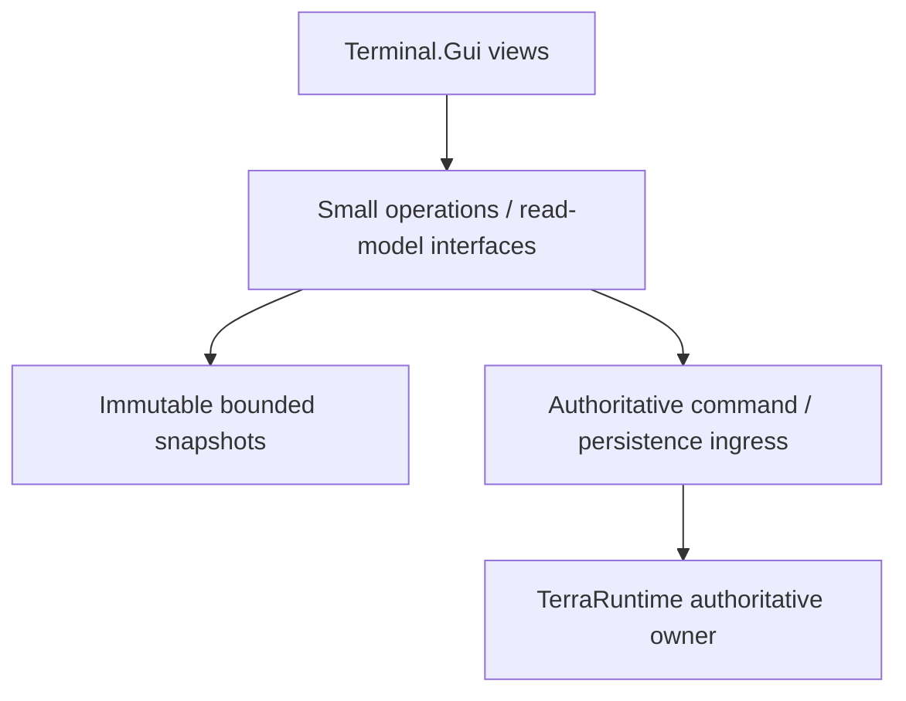
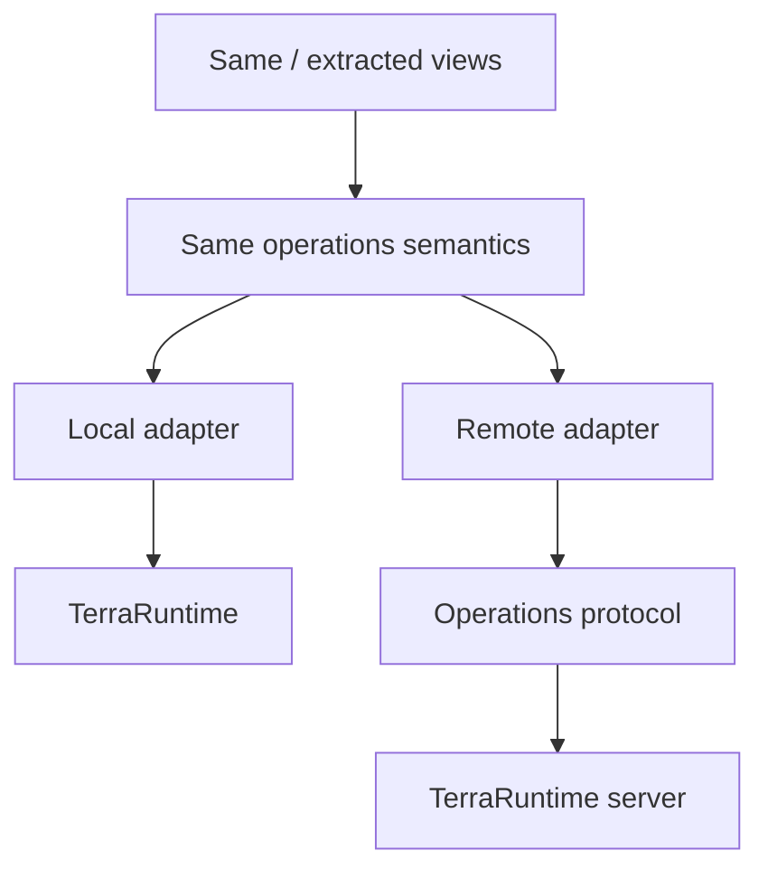
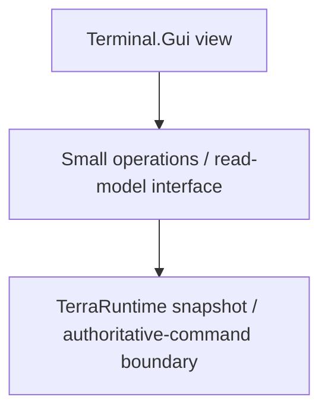

# Terminal UI roadmap

This document refines Phase 10 of the main TerraRuntime roadmap.

TerraRuntime owns a local Terminal.Gui v2 operations UI. The UI is intentionally separated from mutable runtime internals so the same read-model and command semantics can be reused later without inventing a remote-management protocol before there is a real remote client.

## Current rule

**Keep the local TUI useful and runtime-owned; preserve a clean operations boundary for future reuse.**

Views consume immutable, bounded operations snapshots. Mutations cross explicit authoritative runtime command boundaries. Do not transmit UI layout, expose mutable stores to the UI thread, or split the UI into extra assemblies merely for architectural symmetry.

## Verified implementation checklist

> Checkbox policy: `[x]` means the item is verified on `main` by implementation plus tests/CI or an equivalent executable proof. Partial/foundation-only work remains `[ ]`.

- [x] Local Terminal.Gui v2 operations UI exists and is exercised.
- [x] TUI is enabled by default for normal server startup and can be disabled with `--no-tui`.
- [x] No-argument startup scans the runtime `Worlds` directory and lets the operator choose a `.wld` world.
- [x] Views consume immutable/bounded operations snapshots instead of mutable runtime stores.
- [x] Administrative interest-management mutation crosses the authoritative command boundary.
- [x] Manual world checkpoint requests cross `IWorldOperations.TryRequestSave()` and persistence ingress.
- [x] TUI runs independently from the authoritative loop and TUI failure/exit does not stop the server.
- [x] Dashboard, Players, NPCs, Projectiles, Items, Network, World and Logs views are implemented.
- [x] World view exposes bounded runtime-owned save/checkpoint status without exposing persistence internals.
- [x] Network view exposes subsystem-owned admission, connection-stop and frame-rejection telemetry through a bounded snapshot.
- [x] Trusted CoreCLR host modules may contribute independent local dashboard roots through host contracts.
- [x] CoreCLR and Linux/Windows NativeAOT CI exercise the TUI smoke path.
- [x] Smoke exercises real Details MenuBar hotkeys/framebuffer rendering for built-in detail views.
- [x] Smoke exercises **Actions → Save world checkpoint** and verifies pending persistence state.
- [ ] Remote administration protocol/adapter.
- [ ] Separate reusable remote administration client.
- [ ] Dynamic client-side/plugin UI windows for a future remote CoreCLR administration client.

## Current implementation

The standalone server has eight exercised runtime-owned operational views:

- **Dashboard** consumes detached runtime/network snapshots plus the Level 1 sandbox tree. Process-wide TPS visualization is intentionally absent; target/observed TPS is rendered per live `WorldRuntime` in the Worlds / Players roster.
- **Players** consumes `IPlayerOperations` / `RuntimePlayersSnapshot` and exposes generation-safe identity, team, motion, inventory selection, mount and vitals.
- **NPCs** consumes `INpcOperations` / `RuntimeNpcsSnapshot` and observes committed authoritative NPC state without exposing `RuntimeNpcStore`.
- **Projectiles** consumes `IProjectileOperations` / `RuntimeProjectilesSnapshot`, grouping authoritative projectiles rather than materializing every row.
- **Items** consumes `IWorldItemOperations` / `RuntimeWorldItemsSnapshot`, grouping authoritative dropped-item state by item net ID.
- **Network** consumes `INetworkOperations` / `RuntimeNetworkSnapshot` for admission, replication, traffic, queue/backpressure and typed rejection/stop telemetry.
- **World** consumes `IWorldOperations` / `RuntimeWorldSnapshot` for world identity, clock, cache and persistence/checkpoint status plus bounded manual save request.
- **Logs** consumes `ILogOperations` over bounded `RuntimeLogBuffer` independently of plain-console ownership.

Trusted host modules may contribute **independent dashboard roots** through `ITerraRuntimeTerminalDashboardSource` / `ITerraRuntimeTerminalDashboardProvider`. TerraRuntime keeps its System Dashboard intact; hosts do not inject arbitrary controls into built-in detail screens.

## Operational behavior

TUI is default-on, `--no-tui` disables it, no-argument startup uses the `Worlds` selector, Terminal.Gui runs on its own UI thread, closing/failing the TUI leaves the server running and falls back to plain console, global console streams are not replaced, and runtime/network/persistence telemetry comes from subsystem-owned bounded snapshots.

Manual save calls `IWorldOperations.TryRequestSave()`. Accepted requests become observable pending persistence state; rejected requests are explicit administrative results. `--tui-smoke` uses the ANSI test driver and actual MenuBar paths/framebuffer content, including Details screens and **Actions → Save world checkpoint**.

## Dependency shape



Possible future remote shape, only when a real remote client exists:



The dependency boundary matters more than the number of projects.

## Project layout

The current implementation may remain directly in the server project:

```text
src/TerraRuntime.Application/
    Operations/
    TerminalUI/
```

A separate `TerraRuntime.TerminalUI` project is justified only by an actual second consumer or material maintenance pressure. Toolkit-independent read models/contracts move to `TerraRuntime.Contracts` only when they become genuine cross-component contracts.

## UI-facing operations boundary

Views do not depend directly on `ServerRuntimeState`, mutable entity/world collections, sockets, queues, persistence coordinators, save shadows or other authoritative-thread-owned implementation objects.

Current screen-facing interfaces are literal API names:

```text
IRuntimeDashboardOperations
IPlayerOperations
INpcOperations
IProjectileOperations
IWorldItemOperations
INetworkOperations
IWorldOperations
ILogOperations
```

Snapshots are immutable/bounded; polling happens from the UI loop; mutations cross authoritative/persistence ingress; local in-process UI receives no mutable-state shortcut; telemetry is owned by the subsystem that knows the truth; duplicate hot-path accounting is avoided; grouped/bounded detail is preferred over unbounded materialization.

## Runtime telemetry ownership

TerraRuntime currently owns UI-facing measurements for target/observed TPS, tick wall/CPU and phase timing, missed deadlines, command backlog/budget state, process/GC metrics, replication counters, committed entity projections, per-connection pressure/rates, admission rejects, typed connection stops/frame rejections, player/world-clock state, startup/cache timings, section-cache state and persistence/checkpoint lifecycle counters.

The TUI formats those values but does not invent them.

## Implemented screen notes

### Dashboard

Compact network summary plus bounded world/player/chat/log overview and latest administrative result. The Worlds / Players roster owns per-runtime TPS display, row selection, transfer drag/drop, typed context actions and sandbox creation entry.

### Players

Projected from validated authoritative events; optional movement fields normalize to runtime state so later packets do not leave stale UI values.

### NPCs

Projected after authoritative commits; replication remains primary consumer and TUI is a secondary observer.

### Projectiles and items

Grouped operational views avoid hundreds/thousands of rows while retaining useful lifecycle/pressure information.

### Network

Reuses subsystem-owned inbound/outbound/replication accounting. Admission rejects distinguish capacity/rate; terminal stops and frame rejections remain typed rather than reconstructed from logs.

### World

Shows identity, dimensions, persisted counts, startup/cache, authoritative clock, section cache and `RuntimeWorldPersistenceSnapshot` state. Save action uses the same bounded persistence ingress as other callers.

### Logs

Bounded independently from console ownership. Full-screen TUI must not require replacing global console streams.

## Administrative actions

Implemented: enable/disable interest management through authoritative command ingress, request canonical world checkpoint through `IWorldOperations.TryRequestSave()`, move players between Level 1 runtimes, destroy sandboxes, request player disconnect, and create `sb1`/`sb2` sandboxes through typed operations from the dashboard roster.

Future actions follow the same rules: no mutable implementation references in UI callbacks, no command-budget/lifecycle bypass, explicit rejection, and separation between requesting an asynchronous operation and observing its eventual result.

The Worlds / Players roster uses item selection rather than text selection. Right-click maps sandbox/player rows to typed `Destroy`/`Kick` operations, and `+` opens a typed sandbox creation form instead of generating a command string.

## Next local UI work

Future slices are driven by operational need: richer navigation/sorting only when compact views become limiting, deeper packet/security detail only when owning subsystems expose trustworthy bounded counters, more administrative actions only after explicit runtime operations exist, and configurable layout/UX only when operator pressure justifies it.

Section-cache rebuild status, save/checkpoint status/action and categorized admission/connection/frame telemetry are already implemented and exercised.

## Future remote client, deferred

A separate administration client is intentionally outside current Phase 10. If it becomes real, reuse/extract existing view logic, keep layout compiled rather than transmitted, exchange operations state/events/commands/results/version information rather than control trees, preserve local semantics and extract assemblies only when an actual second consumer creates pressure.

Current local trusted-host dashboard registration is not the same as a future remote client's dynamic plugin system. Shipping NativeAOT does not scan arbitrary UI DLL folders or dynamically load managed UI assemblies.

## Non-goals

- remote administration protocol before there is a real client;
- a `TerraRuntime.Client` executable merely for symmetry;
- custom declarative UI language;
- transmitting layout/control trees over the network;
- arbitrary dynamic UI DLL loading in the NativeAOT server;
- provider-specific runtime internals exposed through built-in views;
- splitting UI into several assemblies without concrete pressure.

## Current acceptance state



The standalone server exercises this shape without direct mutable-state access, without blocking the authoritative loop and without making TUI availability a readiness requirement. Manual checkpoints and categorized network telemetry use the same bounded operations model. A future remote-client milestone should prove reuse by substituting a remote operations implementation only when that client is actually being built.
