# Vega → TerraRuntime ownership migration

This document defines which low-level Terraria/runtime responsibilities represented in `VegaKernel/Vega` become native TerraRuntime capabilities, which remain in Vega, and which split into runtime primitive plus Vega policy.

> **TerraRuntime owns everything required for a correct, safe, observable Terraria server to exist without Vega. Vega owns application policy, administration, modules/plugins and operator-facing composition.**

Vega is a source of tested ideas, invariants, security lessons and useful contract shapes, not code to mechanically copy. TerraRuntime reimplements those ideas around its authoritative loop, NativeAOT constraints, world ownership and Multiplicity-backed protocol boundary.

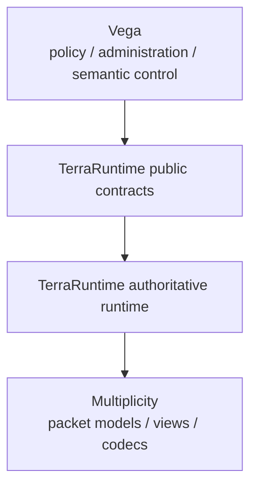

Vega never becomes a second owner of simulation, replication, spatial state or packet-wire semantics.

> Checkbox policy: `[x]` means the item is verified on `main` by implementation plus tests/CI or equivalent executable proof. Partial/foundation-only work remains `[ ]`.

## 1. Ownership matrix

| Capability represented in Vega | Target owner | Decision |
|---|---|---|
| packet/player ownership enforcement | runtime networking/players | move invariant |
| player/world sanity | players/worlds | move |
| projectile ownership/sanity | projectiles | move |
| item validation | items | move |
| chest validation | world/chests | move |
| tile/wall/liquid/tile-entity validation | world subsystems | move |
| packet rate/flood limits | networking | move mechanism, remeasure values |
| game-thread dispatcher | authoritative loop | take concept, replace implementation |
| immutable player/world/entity snapshots | contracts | move/adapt |
| generation/revision mutation guards | core entity/world systems | required primitive |
| runtime/network/security telemetry | runtime diagnostics/contracts | move metric ownership |
| derived world image/cache | startup/save | take ideas, not Vega format |
| scene visibility | replication visibility | split runtime mechanism/Vega policy |
| world clock | world simulation | implement after vanilla verification |
| connection/player slot ownership | networking/players | fundamental runtime ownership |
| connection state machine | networking | move |
| typed packet-processing context | protocol/networking | adopt shape, not second codec |
| entity lifecycle generation IDs | entities | add |
| replication/recipient routing | replication | add |
| AOI/interest management | replication/interest | runtime-owned |
| bounded outbound/backpressure | networking | required runtime primitive |
| world identity/context | worlds | normalize |
| dirty/revision tracking | worlds/entities | required |
| tick/work budgets | runtime | runtime-owned |
| readiness | runtime + host | split runtime readiness from application readiness |

## 2. What remains in Vega

Accounts/auth policy, groups/roles/permissions, bans/mutes/moderation, regions/build authorization, commands, localization, chat policy, plugin lifecycle/hot reload, database/application persistence, REST/API/TUI/operator workflows, GeoIP, cluster messaging and non-vanilla community/gameplay rules remain Vega concerns.

A policy-mediated mutation looks like:

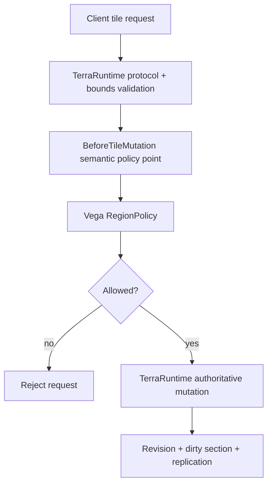

TerraRuntime does not know permissions such as `world.edit.region.foo`.

## 3. Do not copy the old dependency shape

Migration sequence: identify invariant/capability, classify runtime/security versus Vega policy, verify official/Multiplicity semantics, define the smallest runtime contract needed by a real consumer, implement through authoritative ownership, add executable regressions, then switch/remove the Vega-side implementation.

Multiplicity remains the sole packet model/view/encode/decode source; TerraRuntime owns framing, runtime metadata, semantic validation, state and recipient selection.

## 4. Connection and player identity

Connection identity is stronger than a Terraria slot. Runtime distinguishes `ConnectionId`, `PlayerSlot` and session generation. `PlayerHandle` / `ConnectionHandle` combine authoritative source, slot and generation so stale queued work cannot target a new occupant after reuse.

Current foundation includes per-slot monotonically advancing generation, generation-safe join/player handles and stale-generation rejection for appearance/equipment/spawn/movement/disconnect plus deferred movement resync work.

## 5. Typed packet-processing context

Conceptual context fields are direction, connection source, authoritative player slot/handle, connection state, receive timestamp and typed Multiplicity packet/view.

```mermaid
flowchart LR
    Frame["Frame"] --> Wire["Multiplicity view / model"]
    Wire --> Structural["Protocol structural validation"]
    Structural --> Session["Connection-state legality"]
    Session --> Identity["Authoritative identity normalization"]
    Identity --> Semantic["Runtime semantic validation"]
    Semantic --> Command["Typed command"]
    Command --> Apply["Authoritative apply"]
    Apply --> Replication["Replication planning"]
```

The context is internal processing metadata, not a generic raw-packet plugin interception API.

## 6. Runtime validation layers

Protocol structural validation owns complete payload/ranges/bounds. Networking owns connection-state legality, handshake/spawn order, source/slot ownership and rate budgets. Gameplay/world subsystems own finite coordinates, bounds, entity generations, inventory/chest/projectile/tile/liquid preconditions. Vega policy runs only after runtime-safe semantic meaning exists.

Current inventory boundary validates packet-5 slot space `0..989`, with relayable ranges `0..98` and `700..989`; item state is normalized before authoritative enqueue. Player appearance, movement optional fields and spawn parameters likewise use source-backed normalization and bounds before commit.

A Vega policy rejection remains distinct telemetry from malformed protocol or invalid runtime state.

## 7. Generation and revision

Generation answers **is this the same logical object?** Revision answers **is this the same version of that object?**

Example lifecycle:

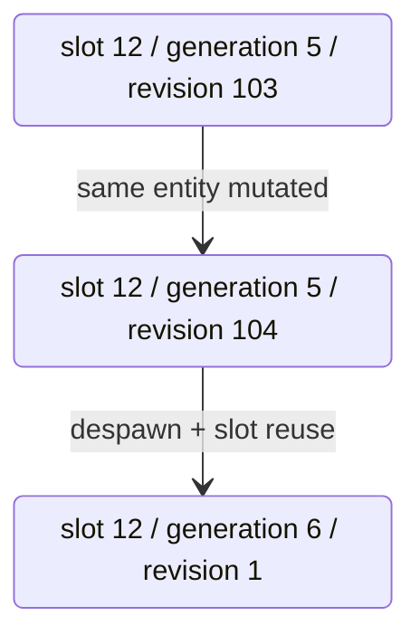

Stale generation-5 handles are invalid even if revision numbers later happen to match.

## 8. Revision-guarded mutation model

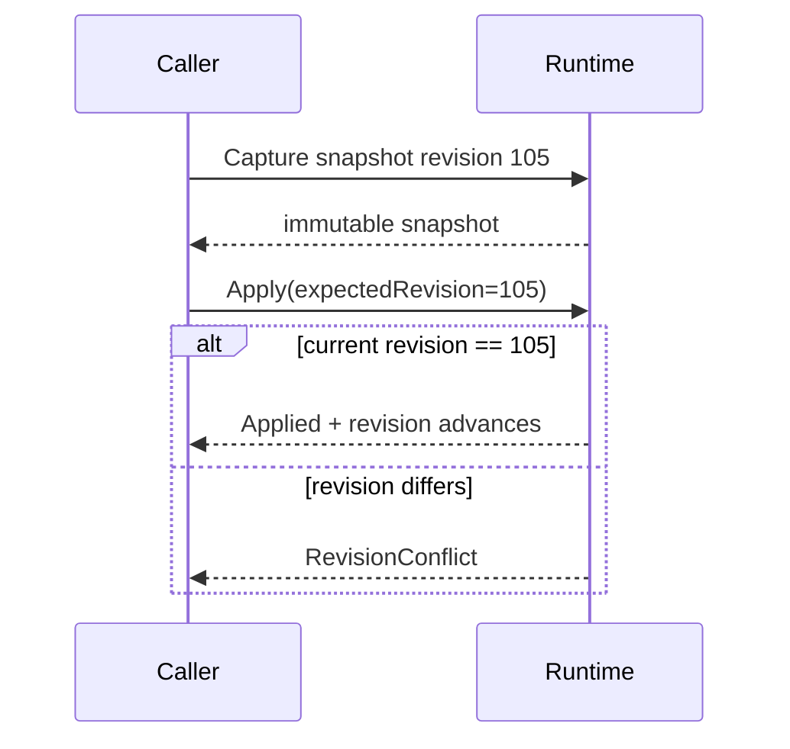

Result vocabularies stay small/subsystem-specific, e.g. `Applied`, `NotFound`, `GenerationConflict`, `RevisionConflict`, `Invalid`, `Rejected`, `Cancelled`, `Failed`.

## 9. Immutable runtime snapshots

Runtime snapshots are immutable, demand-driven and ownership-specific rather than copies of internal stores. Separate player state, connection, inventory and entity/world snapshot concepts prevent unrelated sensitive/expensive state from being bundled automatically.

Large collections are bounded/paged or exposed through explicit area/query operations. Formatting happens outside the authoritative loop.

## 10. Entity lifecycle foundation

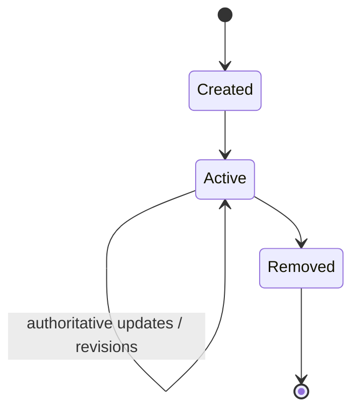

Lifecycle owners maintain stable identity, generation on slot reuse, current state, revision/dirty tracking, replication activation/deactivation, deterministic cleanup and spatial membership where applicable.

Current player slice uses generation-safe packet-14 activation/deactivation ordering verified against TerrariaServer 1.4.5.8.

## 11. Native authoritative scheduler

Vega's bounded/time-sliced dispatcher contributes useful concepts, but TerraRuntime implements them natively in its own game loop.

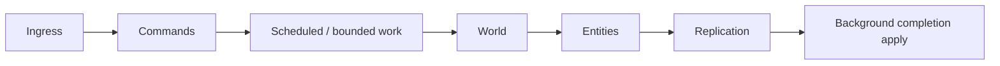

Budgets are global per subsystem, queues bounded, fairness explicit, long work incremental, backlog/age observable, async continuations excluded from the hot simulation path and worker results applied at explicit commit points.

## 12. Replication layer

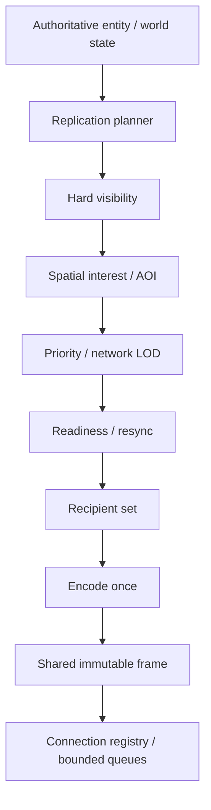

Transport registry resolves connection/queue state but does not own gameplay/spatial policy. Shared frames remain immutable, slow recipients stay isolated and routing is observable.

## 13. Visibility and interest are different

Hard visibility asks whether observer A is allowed to observe entity B at all. Interest management asks whether B is relevant enough to replicate now.

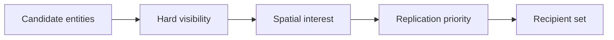

Hard visibility may expose narrow policy extension points; spatial index, hysteresis, observer tracking and AOI correctness remain runtime-owned.

## 14. Runtime-owned AOI control

External control remains deliberately narrow: `IsEnabled`, `SetEnabled(bool)`, or a future runtime-owned mode enum such as `Disabled`, `Conservative`, `Aggressive`, `CustomRuntimePreset`.

Vega never owns grids/cells, observer sets, entity buckets, hysteresis internals, recipient queries, resync tracking or arbitrary distance callbacks. Real suppression remains blocked until lifecycle enter/leave/full-state-on-enter is live-proven.

## 15. Replication priority / network LOD

Runtime-owned priority concepts may include `Critical`, `High`, `Normal`, `Low`, `Dormant`. Near/critical entities may update at full eligible cadence, far-but-relevant entities at reduced cadence, outside-interest deltas may suppress, and resync deadlines force state refresh.

Global progression/world events remain global unless official behavior proves otherwise. Compatibility mode preserves vanilla-like observable behavior.

## 16. Rate limiting architecture

Move the mechanism into TerraRuntime but remeasure thresholds. Prefer burst-aware measured accounting over treating Vega's historical numbers as protocol constants.

Conceptual policy fields: `Capacity`, `RefillRate`, `Burst`, `Action`; actions may include `Allow`, `Defer`, `DropLowPriority`, `Reject`, `Violation`, `Disconnect`.

Requirements: per-connection and optional category budgets, cleanup on disconnect/generation change, bounded memory, monotonic timing, explicit burst semantics, throttle/reject/drop metrics and thresholds derived from client traces/load tests.

## 17. Backpressure and slow-client isolation

Each connection has bounded frame-count and byte accounting. On pressure, stale low-priority updates may coalesce/drop where legal, affected state is marked for resync and pathological slow clients disconnect. Authoritative simulation never waits for socket progress.

Telemetry includes queue frames/bytes/high-water, dropped/coalesced work, responsible packet/entity class, resync requests and slow-client disconnects.

## 18. Dirty state and world mutation integration

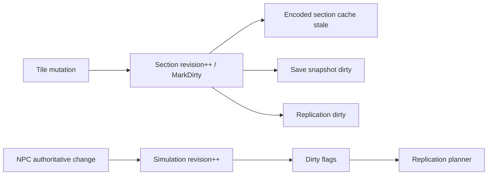

One authoritative mutation/change source should feed save/cache/network dirty consumers rather than maintaining unrelated dirty systems.

## 19. Runtime/network/security telemetry ownership

Metrics originate in TerraRuntime; Vega may display/export/persist them. Families include connection lifecycle and traffic/rejections/queues, tick CPU/wall/phase/backlog/budget, entity dirty/replication/fan-out/AOI/resync, and world section-cache/save/runtime-image metrics.

Telemetry collection avoids hot-path string formatting/allocation.

## 20. Runtime readiness boundary

TerraRuntime lifecycle includes runtime initialization, world loading/readiness, network readiness and stopping/stopped. `NetworkReady` means Terraria clients can safely be accepted.

Vega may layer configuration/modules/policy stores/operator services/background warmup around this, but optional application readiness does not redefine runtime world/network coherence.

## 21. World image migration guidance

Keep `.wld` canonical, derived cache disposable, source/schema/integrity validation, safe fallback, atomic rebuild and profiling around actual bottlenecks. Do not copy Vega-specific format/application metadata or patched-runtime layout assumptions.

The cache should cooperate with section revisions, dirty tracking and incremental save snapshots.

## 22. World clock migration rule

Do not copy Vega's corrective clock. First verify official 1.4.5.8 day/night transitions, sleep/time acceleration, time-altering events, sync and save/load semantics. Implement vanilla first; only then consider an optional runtime-owned correction mode. `Vanilla` remains default absent a deliberate compatibility decision.

## 23. Public extension/policy boundary for Vega

Semantic policy points may include admission, tile mutation, chest interaction, teleport and NPC spawn requests. Runtime supplies decoded runtime-safe semantic data; policy returns bounded `Allow` / `Reject(reason)` decisions.

Callbacks do not mutate collections or receive raw Multiplicity buffers by default. Game-thread policy is synchronous/bounded; I/O-dependent policy uses precomputed/cacheable state or explicit async lifecycle before apply. TerraRuntime retains final mutation ownership.

## 24. Migration order

1. [x] connection/session identity + generation
2. [ ] packet ownership enforcement
3. [ ] player/projectile/world/item/chest sanity
4. [x] entity lifecycle foundation
5. [x] immutable snapshots + generation/revision mutation model
6. [x] native authoritative scheduler primitives
7. [x] replication layer separated from connection registry
8. [ ] hard visibility + runtime-owned AOI
9. [ ] rate limiting + backpressure
10. [x] runtime/network/security telemetry
11. [x] save/runtime-world snapshot improvements
12. [ ] vanilla world clock
13. [ ] optional measured replication/network LOD optimizations

Lifecycle and AOI work remain coupled; do not enable aggressive suppression before lifecycle/resync correctness.

## 25. Vertical-slice migration method

For each migrated capability: identify Vega invariant, classify runtime versus policy, verify official/Multiplicity semantics, add the minimum TerraRuntime contract, implement through authoritative ownership, add focused and live tests, add telemetry, prove NativeAOT compatibility, switch the Vega consumer, then remove the duplicate Vega implementation.

Temporary adapters are allowed only as explicit migration debt with tests proving the authoritative side.

## 26. Acceptance criteria

Migration is complete only when TerraRuntime can run correctly without Vega; runtime-dangerous sanity executes before policy; Multiplicity remains shared codec/model; lifecycle uses generation-safe identity where reuse exists; snapshots/mutations are runtime-owned and revision-safe; connection registry does not own recipient policy; replication has an explicit planner; hard visibility/interest stay separate; AOI internals are runtime-owned; real culling waits for enter/leave/resync proof; rate/backpressure are runtime security primitives; runtime metrics originate in TerraRuntime; cache formats are independent of Vega; vanilla world-clock behavior is independently verified; duplicate migrated implementations are removed; and all slices remain green under CoreCLR, Linux/Windows NativeAOT and relevant live probes.

## 27. Target boundary after migration

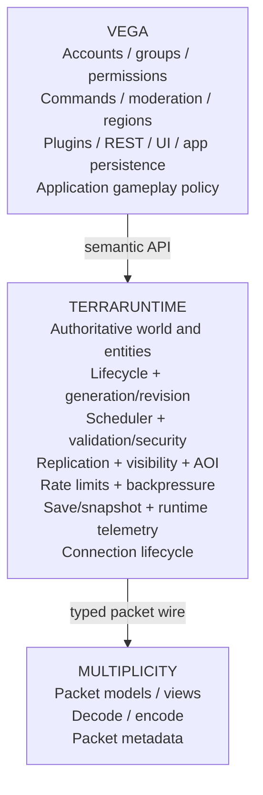

This boundary is normative even when exact project/folder names evolve.
