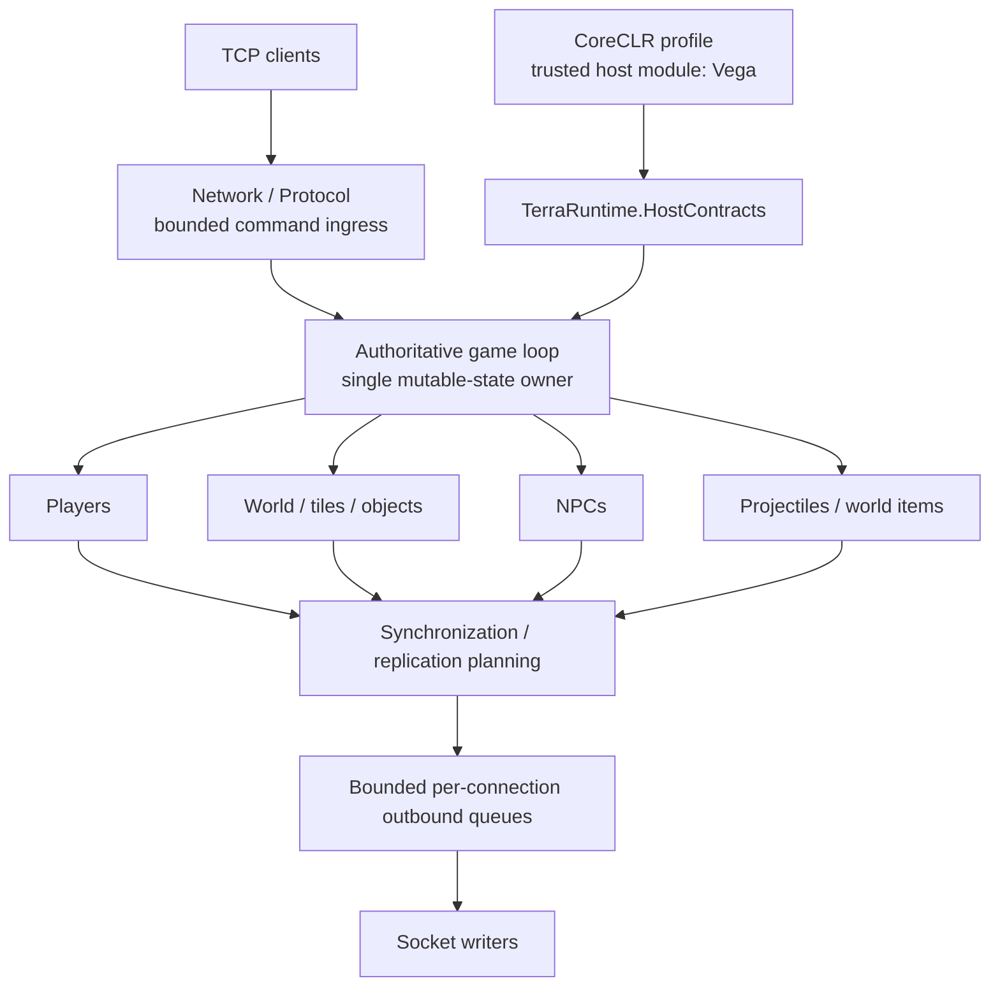
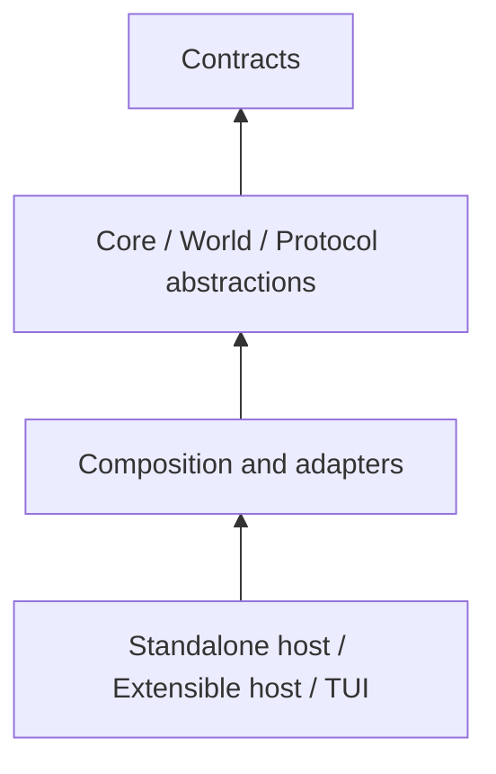
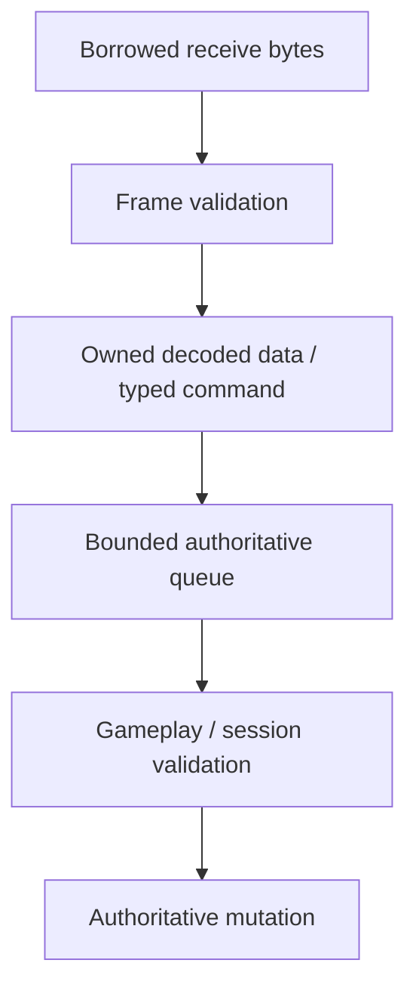
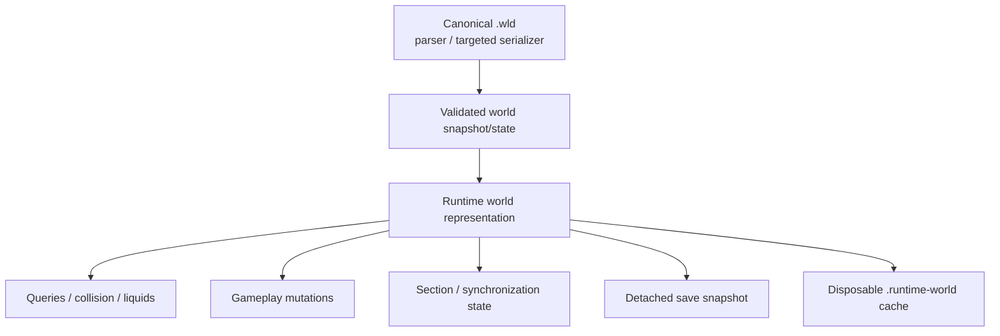
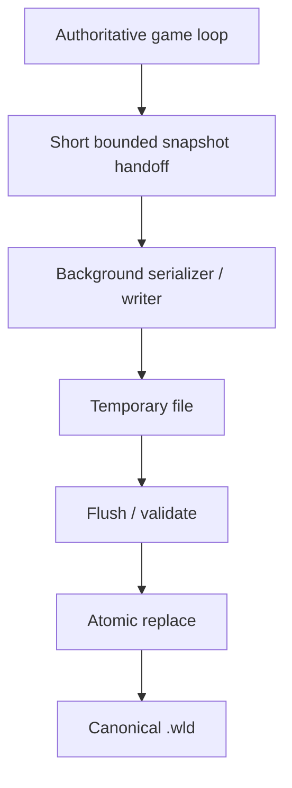
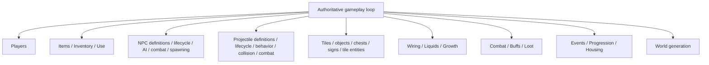
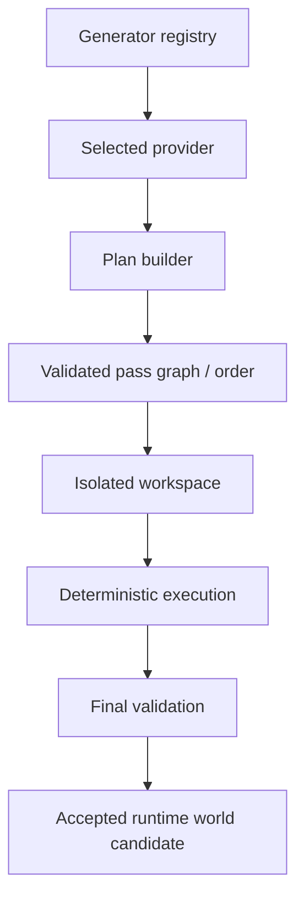
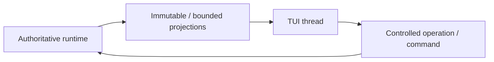

# Архитектура TerraRuntime

[English](../en/architecture.md) · [Документация](README.md) · [Руководство](project-guide.md) · [Host interfaces](host-interfaces.md)

## 1. Архитектурная цель

TerraRuntime воспроизводит наблюдаемое поведение TerrariaServer 1.4.5.8 без сохранения его внутренней архитектуры. Главные ограничения проектирования:

- mutable simulation state имеет одного authoritative owner;
- network I/O не мутирует gameplay state напрямую;
- client input всегда недоверенный и bounded;
- blocking I/O, compression и тяжёлая фоновая работа не выполняются в hot path game loop;
- gameplay behavior отделяется от packet encoding/decoding;
- `.wld` остаётся каноническим persistent representation;
- runtime core сохраняет NativeAOT-совместимость;
- внешние hosts получают узкие explicit contracts вместо implementation objects.

## 2. Высокоуровневая схема

Game loop является центром ownership. Transport, UI и trusted-host code взаимодействуют с ним через bounded contracts, а не через общие mutable runtime objects.

## 3. Направление зависимостей

Архитектура не должна превращаться в круговую зависимость между networking, gameplay и host integration.

`TerraRuntime.HostContracts` не должен ссылаться на внутренние concrete runtime classes. Trusted host получает contracts и snapshots, а не `ServerRuntimeState`, mutable stores или socket objects.

## 4. Authoritative ownership

Один dedicated game-loop thread владеет изменяемым simulation state.

К owned state относятся по мере реализации player runtime state, NPC slots/handles/state, projectile slots/handles/state, world item state, mutable world/tile/progression state и connection-associated gameplay state после преобразования network input в commands.

Другие threads могут принимать сеть, декодировать bounded input, строить immutable work products, выполнять disk I/O, сериализовать snapshots, обновлять UI из immutable telemetry и возвращать результаты через explicit completion/command boundaries. Они не могут напрямую менять authoritative collections.

## 5. Command boundary

Network input проходит ownership transfer до попадания в game loop.

Это разделяет две разные задачи:

1. можно ли безопасно разобрать bytes;
2. разрешено ли действие в текущем gameplay/session state.

Decoder не должен принимать gameplay-решения, а gameplay не должен зависеть от временной памяти socket receive buffer.

## 6. Scheduling и fairness

Базовая simulation schedule работает на $60\,\mathrm{Hz}$, что соответствует nominal tick interval примерно $16.67\,\mathrm{ms}$.

Inbound command processing ограничивается бюджетами. Один connection не должен получить возможность превратить unbounded `while(queue.TryRead(...))` в собственный DoS primitive.

Runtime использует или развивает hard global operation cap, per-source fairness quota, optional authoritative CPU-time cap, deferred-work counters, oldest backlog age и subsystem phase timing.

Бюджеты подсистем являются глобальными, если работа конкурирует за один simulation tick. Их нельзя механически умножать на player count.

## 7. Network architecture

Для каждого connection существуют независимые read/write paths.

```mermaid
flowchart LR
    SocketIn["Socket read"] --> Framing["Incremental framing"]
    Framing --> Decode["Bounded protocol decode"]
    Decode --> State["Connection-state legality<br/>+ rate/work accounting"]
    State --> Command["Owned typed command"]
    Command --> Loop["Authoritative game loop"]
    Loop --> Recipients["Recipient decision"]
    Recipients --> Encode["Packet projection / encode"]
    Encode --> Outbound["Bounded per-client queue"]
    Outbound --> Slow["Slow-client policy"]
    Slow --> SocketOut["Socket writer"]
```

Terraria framing имеет форму `[u16 length][u8 message id][payload]`. Slow client не должен заставлять game loop ждать освобождения socket buffer.

## 8. Protocol boundary

`TerraRuntime.Protocol` задаёт runtime-facing protocol concepts. `TerraRuntime.Protocol.Multiplicity` адаптирует Multiplicity 2.7.x к этой границе.

Gameplay-код не должен зависеть от concrete Multiplicity packet classes там, где может работать с domain commands/state.

Protocol layer отвечает за framing, packet IDs/flags, bounded decode/encode и преобразование между wire representation и owned semantic/runtime data. Gameplay layer отвечает за legality, domain invariants, state transitions и authoritative outcomes.

## 9. Entity identity

Content type и live runtime identity являются разными понятиями.

| Content identity | Live runtime identity |
|---|---|
| `ProjectileTypeId` | projectile slot/handle |
| `NpcTypeId` | NPC slot/handle |
| `ItemTypeId` | inventory/world-item identity |

Runtime использует generation/revision-style identity там, где reuse slot делает stale reference опасным. Это не даёт command для старой entity случайно мутировать новую entity в переиспользованном slot.

## 10. World architecture

World subsystem разделяет canonical persistence, live representation и disposable derived data.

Derived cache не должен быть единственным recovery source мира.

## 11. Save architecture

Save pipeline минимизирует stop-the-world работу authoritative thread.

Runtime coalesces redundant save requests вместо накопления serialization work. Shutdown semantics должны гарантировать, что newer authoritative state не проиграет более старому background save.

## 12. Runtime world cache

`.runtime-world` ускоряет startup и может хранить prepared runtime state. Он versioned, disposable и проверяется относительно source `.wld` и собственной schema/integrity metadata.

Правила:

- cache miss является нормальным состоянием;
- invalid cache означает fallback на `.wld`;
- cache rebuild не предшествует successful canonical save;
- cache corruption не является world corruption;
- optimization принимается только при измеримом выигрыше `WorldReady`/`NetworkReady`.

## 13. Synchronization и interest management

Replication не обязана воспроизводить неэффективный vanilla broadcast algorithm, если observable behavior сохраняется.

Interest management является внутренней TerraRuntime subsystem. External host получает только `IInterestManagementControl` enable/disable surface.

Внутри runtime остаются spatial partitioning, recipient sets, enter/leave transitions, hysteresis, forced resync deadlines, full-state-on-entry и entity-specific visibility rules.

До доказательства этих semantics packet suppression должна fail-open.

## 14. Gameplay decomposition

Gameplay не должен становиться одним giant packet switch.

Definition catalogs содержат version-pinned vanilla facts. Runtime stores содержат live state. Packet projection остаётся на внешней границе.

## 15. World-generation architecture

Worldgen отделяет discovery от execution.

Trusted host регистрирует provider, но TerraRuntime контролирует execution boundaries и acceptance результата. `terraruntime:flat` остаётся infrastructure baseline. Отдельно `terraruntime:vanilla` является runtime-owned clean-room генератором TerrariaServer 1.4.5.8: ordinary canonical worlds теперь проходят все 109 закреплённых pass identity до `Final Cleanup`, а vanilla RNG пересоздаётся на каждом pass в соответствии с `WorldGenerator.RunPass`. Это покрытие pass pipeline, а не claim reference-world equality; fixed-seed differential parity и special/secret-seed behavior остаются открытой работой.

## 16. NativeAOT и CoreCLR split

### NativeAOT profile

Он доказывает, что core architecture не зависит от JIT-only behavior, не требует arbitrary managed DLL loading, не опирается на reflection-driven discovery и проходит Linux/Windows native smoke paths.

### CoreCLR extensible profile

Он добавляет trusted host-module loading. Это не отменяет AOT constraints core projects. Host-specific dynamic behavior должен оставаться за extensible-host boundary и не протекать обратно в runtime core.

## 17. Host integration boundary

Trusted host module получает API в две стадии.

### Bootstrap environment

`ITerraRuntimeHostEnvironment` доступен до live runtime и содержит root/deployment paths, dashboard registry и world-generator registry.

### Live runtime

`ITerraRuntimeHostRuntime` прикрепляется после старта authoritative runtime и предоставляет runtime info, interest-management control, player snapshots, NPC actor operations и controlled server-player operations.

Ни один из contracts не разрешает хранить mutable references на internal stores.

## 18. TUI architecture

TUI является consumer operations/read-model boundary.

UI toolkit не должен становиться gameplay-core dependency.

## 19. Background workers

Worker получает snapshot или isolated buffer и возвращает result. Worker не должен получать mutable world object и менять его concurrent с game loop.

Parallel gameplay/worldgen разрешается только после доказательства independence и deterministic equivalence там, где vanilla RNG/order наблюдаем.

## 20. Failure containment

Trust boundaries локализуют failures.

- malformed frame не валит process;
- bad packet не обходит mutation validation;
- save failure не заменяет хороший canonical file partial output;
- TUI failure не останавливает runtime readiness;
- stale/corrupt runtime cache не блокирует `.wld` fallback;
- host module не получает direct mutable authority над internal state.

## 21. Observability

Telemetry должна объяснять, где runtime тратит время и почему отбрасывает work, не превращая каждый packet в allocation festival.

Ключевые группы: tick CPU/wall и worst phase, command backlog/budget exhaustion, queue depth/slow-client drops, active entity counts, spatial membership, save/cache state, malformed/rejected protocol categories и GC/memory там, где это безопасно доступно.

## 22. Архитектурный Definition of Done

При изменении architecture boundary одновременно проверяется:

1. mutable-state ownership остаётся explicit;
2. input/output contracts остаются bounded;
3. NativeAOT constraints остаются intact;
4. failure behavior определён;
5. tests способны поймать regression;
6. RU и EN документация обновлена в том же change.
