# Основа combat damage

[English](../en/combat-damage.md) · [Gameplay](gameplay.md) · [Roadmap декомпозиции gameplay](../roadmap/gameplay-decomposition-and-catalogs.md)

## 1. Назначение

В TerraRuntime появилась protocol-independent и generation-safe основа авторитетного урона по NPC. Этот срез намеренно разделяет **происхождение урона**, **детерминированный расчёт защиты NPC** и **авторитетный commit HP** от packet handlers, replication, death effects и loot.

Это фундамент для дальнейшего паритета с TerrariaServer 1.4.5.8, а не заявление, что полный vanilla-путь `StrikeNPC` уже воспроизведён.

## 2. Реализованные контракты

`DamageSource` хранит семантическое происхождение урона без packet ID и ссылок на изменяемые runtime-объекты. Текущие категории источников:

- окружение;
- предмет игрока;
- projectile игрока;
- контакт с NPC;
- projectile NPC;
- внутренний/server-owned урон.

Происхождение от игрока, NPC и projectile использует generation-safe runtime handles. Источник проверяет, что заполнены только те handles, которые имеют смысл для выбранной категории. Например, `PlayerItem` требует player handle и отвергает посторонний projectile handle, а `PlayerProjectile` требует и владельца-игрока, и точную generation projectile.

`NpcDamageRequest` содержит generation-safe цель, семантический источник, положительный base damage, неотрицательный flat armor penetration, обычный флаг critical hit, конечный неотрицательный knockback и вычисленное источником направление удара в диапазоне `-1..1`. Направление задаётся явно: vanilla получает его от атаки/projectile при вызове `NPC.StrikeNPC`, а не выводит из движения самого NPC.

`NpcDamageResult` является immutable-записью уже committed перехода: source damage, defense, effective defense, resolved damage и Life до/после.

## 3. Авторитетный поток

```mermaid
flowchart LR
    Source["Item / projectile / NPC / environment"] --> Request["NpcDamageRequest"]
    Request --> Lookup["Generation-safe NPC lookup"]
    Lookup --> Definition["Verified VanillaNpcDefinition"]
    Definition --> Resolve["Defense + armor penetration + crit"]
    Resolve --> Knockback["justHit + vanilla knockback slice"]
    Knockback --> Store["RuntimeNpcStore atomic commit"]
    Store --> Result["NpcDamageResult"]
    Result --> Future["Future hit replication / death / loot"]
```

Цель должна оставаться тем же самым живым `NpcHandle`. Повторное использование того же числового NPC slot с новой generation не делает старый damage request снова действительным.

## 4. Детерминированная математика урона

Реализованный срез начинается **после** source-specific масштабирования weapon/projectile и возможной случайной вариации урона. Пусть

- \(B\) — уже рассчитанный base/source damage;
- \(D\) — проверенная защита NPC из `VanillaNpcDefinitionCatalog`;
- \(P\) — flat armor penetration.

Эффективная защита:

\[
D_{\mathrm{eff}}=\max(D-P,0).
\]

Обычная эффективность защиты NPC в этом срезе:

\[
k_D=0.5,
\]

поэтому урон до critical hit:

\[
H=\max(B-k_DD_{\mathrm{eff}},1).
\]

Для обычного critical hit реализован множитель

\[
k_{\mathrm{crit}}=2,
\]

то есть

\[
H_{\mathrm{crit}}=2H.
\]

Итоговый целочисленный результат не может быть меньше единицы и насыщается на `Int32.MaxValue`, а не переполняется на экстремальном входе.

Это намеренно уже полного vanilla hit pipeline. Damage variation, banners, buffs/debuffs, scaling armor penetration, target damage multipliers, immunity, специальные resistances и прочие source/target modifiers здесь не угадываются и не подменяются приблизительными правилами.

## 5. `justHit` и ordinary knockback

Каждый принятый удар коммитит `JustHit = true`, включая удары с нулевым knockback и удары по boss с нулевой resistance. AI очищает это transient-состояние в source-backed точке обновления, поэтому fighter stuck/hop logic видит реальный удар, а не косвенную эвристику направления.

Реализован ordinary knockback-срез TerrariaServer 1.4.5.8 `NPC.StrikeNPC_Inner`. Начальная эффективная сила равна

\[
K_0=KR,
\]

где \(K\) — запрошенный knockback, а \(R\) — `KnockBackResist` эффективной definition. В vanilla это множитель: `0` означает иммунитет, `0.5` уменьшает начальную силу вдвое, а значения больше `1` усиливают её. Это не процент, вычитаемый из единицы. Реализация последовательно смягчает значения выше `8`, `10`, `12` и `14`, ограничивает результат значением `16` и только затем применяет critical-множитель `1.4`.

Resolved damage выбирает одну из двух vanilla-ветвей velocity. Сильный удар использует переданное направление, сохраняет уже более быстрое движение в ту же сторону и добавляет вертикальный импульс с учётом gravity/no-gravity. Слабый удар заменяет горизонтальную и вертикальную velocity и второй раз применяет `KnockBackResist`, как в source. Порог сильного удара равен \(10H>L_{\max}\) в classic и \(15H>L_{\max}\) в expert/master, где \(H\) — resolved damage, а \(L_{\max}\) — текущий максимум Life.

Executor разрешает полную definition по положительному type и signed `netId`. Поэтому отрицательные варианты slime, eye и flyer используют собственные defense, maximum life и knockback multiplier, а не defaults положительного type.

## 6. Commit HP и lethal hit

`RuntimeNpcDamageExecutor` читает точную текущую generation NPC, рассчитывает урон по его проверенной definition и изменяет `Life` через `RuntimeNpcStore.TryUpdate`. Поэтому существующие revision/generation invariants остаются единственным владельцем mutation NPC state.

Для lethal hit этот срез коммитит

\[
\mathrm{Life}_{after}=0
\]

и возвращает `NpcDamageResult.Lethal = true`.

При этом NPC намеренно **не** despawn'ится немедленно, loot не запускается, kill effects не выполняются и порядок смерти не выдумывается. Это наблюдаемое gameplay-поведение, которому нужен отдельный проверенный death pipeline. Сохранение zero-life NPC до будущей точки commit не позволяет этой основе случайно закрепить неправильный порядок эффектов.

## 7. Свойства безопасности

- zero/unassigned target handles отвергаются;
- stale NPC generations отвергаются до mutation;
- некорректное или смешанное damage provenance отвергается;
- неположительный base damage, отрицательный armor penetration, некорректный knockback и направление вне `-1..1` отвергаются;
- уже мёртвый (`Life <= 0`) NPC повторно этим executor не повреждается;
- NPC без проверенной definition/combat state отвергается вместо подстановки выдуманной защиты;
- экстремальный critical damage насыщается, а не вызывает integer overflow.

## 8. Текущие ограничения

Отдельной последующей работой остаются:

- player PvE/PvP damage и правила player defense/difficulty;
- damage variation и luck;
- immunity frames/cooldowns и projectile penetration;
- buffs, debuffs, banners и специальные target modifiers, включая knockback-бонус On Fire! 2;
- динамически меняющаяся knockback resistance и type-specific strike branches, ещё не представленные в authoritative definition/state model;
- преобразование contact/projectile collision в hit;
- hit packet/combat-text replication;
- порядок NPC death, kill effects, loot и progression hooks;
- boss-specific damage rules и специальные immunities.

Семантическая damage model сделана так, чтобы эти системы наращивались вокруг одного авторитетного перехода, а не возвращали packet-driven mutation HP.

## 9. Проверка

Фокусные тесты закрепляют валидацию формы источника, расчёт защиты Blue Slime, применение armor penetration до critical multiplier, минимум в один damage, lethal commit в zero Life, rejection stale generation и защиту от integer overflow. Regression-сценарии также закрепляют `justHit`, направление от источника атаки, strong/weak и expert thresholds, gravity-aware vertical velocity, ordered soft caps до critical amplification, boss с нулевой resistance и variant-specific resistance выше `1`. Эти сценарии падают при прежней аппроксимации `(1 - resistance)`/NPC-direction. Ожидаемые переходы прослежены до TerrariaServer 1.4.5.8 `NPC.StrikeNPC_Inner`; для оставшихся правил всё ещё требуется differential evidence до заявления о более широком combat parity.
