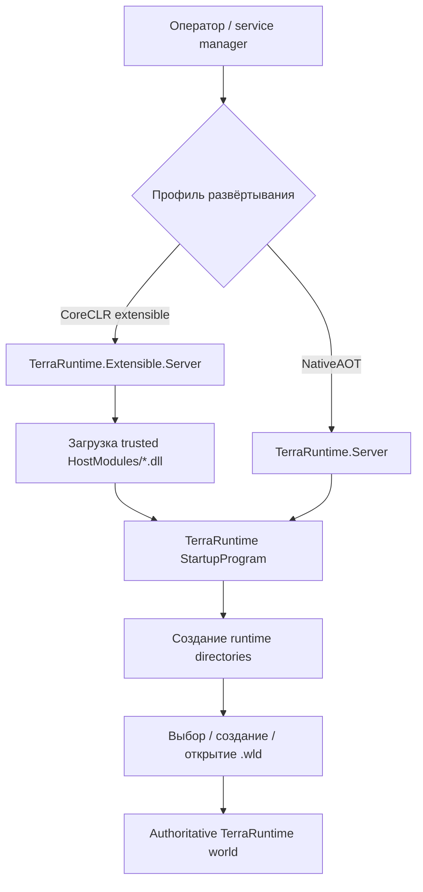
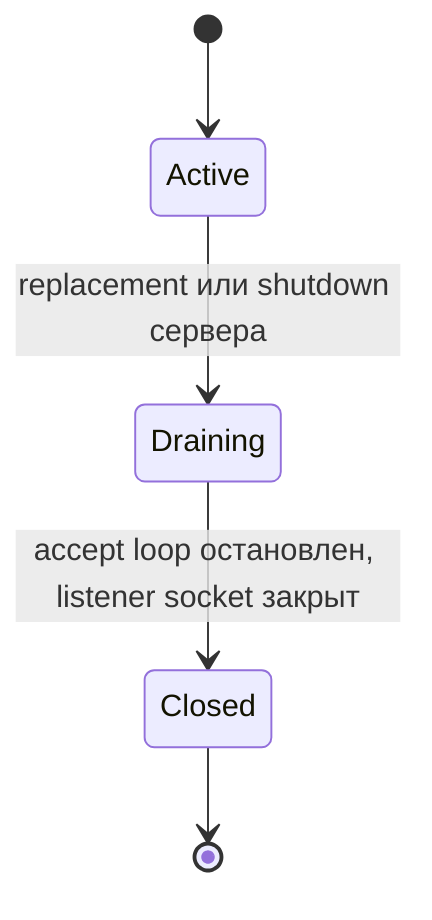

# Развёртывание и конфигурация

[English](../en/deployment-configuration.md) · [Индекс документации](README.md) · [Operations/TUI](operations-tui.md) · [Host interfaces](host-interfaces.md)

Это руководство описывает реально существующие в текущем TerraRuntime варианты развёртывания и поверхность конфигурации. Реализованное поведение намеренно отделено от каталогов и extension points, которые пока только зарезервированы на будущее.

## Профили развёртывания

У TerraRuntime есть два намеренно разных исполняемых профиля.

| Профиль | Исполняемый файл | Runtime model | Динамические trusted host modules |
| --- | --- | --- | --- |
| NativeAOT core | `TerraRuntime.Server` / `TerraRuntime.Server.exe` | NativeAOT-first, trim/AOT-compatible core | Нет |
| Extensible host | `TerraRuntime.Extensible.Server` / `TerraRuntime.Extensible.Server.exe` | self-contained CoreCLR single-file host | Да, из `HostModules/` |

NativeAOT executable — минимальный production runtime. Extensible executable оборачивает тот же startup/runtime path, но намеренно разрешает загрузку managed DLL для trusted integration modules.



## Layout NativeAOT-развёртывания

`TerraRuntime.csproj` создаёт runtime-каталоги после NativeAOT publish. Приложение также проверяет/создаёт их при startup, поэтому пустой deployment может самостоятельно подготовить writable directory structure.

```text
TerraRuntime.Server[.exe]
Worlds/
config/
data/
logs/
```

Также могут присутствовать platform-native dependencies. Текущий CI-контракт требует `libonigwrap.so` на Linux и `libonigwrap.dll` на Windows.

Release publication удаляет `.pdb`/`.dbg` из runnable deployment. CI проверяет ожидаемый top-level layout, а не принимает произвольный мусор из publish directory.

Пример publish для Linux:

```text
dotnet publish src/TerraRuntime/TerraRuntime.csproj -c Release -r linux-x64 -p:PublishAot=true -p:IlcTreatWarningsAsErrors=true -o artifacts/native-aot/linux-x64
```

Пример publish для Windows:

```text
dotnet publish src/TerraRuntime/TerraRuntime.csproj -c Release -r win-x64 -p:PublishAot=true -p:IlcTreatWarningsAsErrors=true -o artifacts/native-aot/win-x64
```

## Layout extensible CoreCLR-развёртывания

Extensible host намеренно не является AOT-compatible, потому что динамическая загрузка managed modules входит в его контракт. Release publish — self-contained single-file CoreCLR с ReadyToRun, server GC, tiered compilation и tiered PGO согласно project configuration.

```text
TerraRuntime.Extensible.Server[.exe]
runtime/
HostModules/
ServerPlugins/
Worlds/
config/
data/
logs/
```

Пример publish для Linux:

```text
dotnet publish src/TerraRuntime.ExtensibleHost/TerraRuntime.ExtensibleHost.csproj -c Release -r linux-x64 -p:PublishAot=false -p:PublishSingleFile=true -p:SelfContained=true -p:PublishReadyToRun=true -o artifacts/coreclr/linux-x64
```

Windows-вариант отличается `-r win-x64` и destination path.

Каталог `runtime/` входит в extensible deployment contract. `HostModules/` реально используется TerraRuntime. `ServerPlugins/` сейчас является выделенным/экспортируемым каталогом для trusted host/plugin architecture; сам TerraRuntime пока **не** сканирует его и не создаёт произвольные server plugins.

## Владение runtime directories

Оба профиля вычисляют root directory из `AppContext.BaseDirectory`, а не из текущего working directory shell.

Каталоги core runtime:

- `Worlds/` — default local world discovery и default destination создаваемых `.wld`;
- `config/` — стабильное место, зарезервированное под runtime/host configuration data;
- `data/` — mutable runtime/host data;
- `logs/` — место runtime/host log output.

Extensible host дополнительно предоставляет:

- `HostModules/` — trusted host module assemblies;
- `ServerPlugins/` — зарезервированный/экспортируемый server-plugin location.

Эти пути передаются trusted modules через `ITerraRuntimeHostEnvironment`; модули должны использовать предоставленные пути, а не самостоятельно восстанавливать deployment-relative paths.

Ошибка создания каталогов фатальна до запуска мира. Core startup path возвращает exit code `24`; extensible wrapper возвращает `30`, если расширенный directory layout не удалось инициализировать.

## Текущая модель конфигурации

Core server пока **не** определяет стабильную универсальную схему configuration file. Текущая стабильная server startup surface — CLI. Поэтому наличие `config/` нельзя трактовать как доказательство поддержки конкретного `json`, `toml`, YAML или legacy Terraria config-файла.

Текущие server host options:

| Опция | Значение | Default / диапазон |
| --- | --- | --- |
| `--world <path.wld>` | мир для загрузки | обязателен, если startup не выбирает/создаёт мир |
| `--bind <ip>`, `--bind-address <ip>` | начальный TCP bind address | `0.0.0.0`; numeric IPv4/IPv6, `*`, `any` или `localhost` |
| `--port <n>` | начальный TCP listen port | `7777`; допустимо `1..65535` |
| `--max-players <n>` | максимум player slots | `8`; допустимо `1..255` |
| `--interest-management` | включить runtime interest-management control | выключено |
| `--tui` | включить Terminal UI | включено |
| `--no-tui` | отключить Terminal UI | флаг отключения поверх default-enabled TUI |
| `--help`, `-h` | вывести startup help | завершает процесс без запуска мира |
| `--list-world-generators` | вывести built-in и trusted-host generators | завершает процесс без запуска мира |

Runtime нормализует `--world` до абсолютного пути. Некорректные host options, не прошедшие required-value/range validation, возвращают exit code `23`.

### Смена listener endpoint на живом сервере

Пара `--bind`/`--port` задаёт только начальный public endpoint. Во время работы сервера **Settings → Runtime settings** и видимая кнопка **Settings** на System Dashboard позволяют заменить bind-address и/или порт без отключения уже принятых клиентов. DNS lookup намеренно не входит в этот control surface: используется numeric IPv4/IPv6, `*`/`any` либо `localhost`.

`ListenerManager` владеет listening sockets по поколениям, а `ServerConnectionAcceptor` независимо владеет уже accepted client sockets. У каждого поколения listener есть явный lifecycle:



При обычной смене endpoint новый listener сначала успешно bind/listen, и только после этого предыдущее поколение переводится в Draining. Если новый bind не удался, текущий Active listener остаётся рабочим. При некоторых сменах адреса на том же порту старый `ANY` socket может конфликтовать с новым endpoint на уровне ОС; тогда TerraRuntime закрывает только старый listening socket, повторяет bind и при неудаче пытается восстановить прежний endpoint. Уже принятые соединения принадлежат отдельному connection lifecycle и сохраняются при любом rebind. В fallback-сценарии возможен короткий разрыв только в **приёме новых соединений**, но существующие client sockets не переносятся и не закрываются.

### Startup без аргументов

Запуск без `--world` — интерактивный local startup path, а не ошибка. TerraRuntime создаёт runtime directories, сканирует `Worlds/` и предлагает выбрать существующий `.wld` либо перейти в world-creation flow.

Для unattended service deployment следует явно передавать `--world`, чтобы startup не зависел от interactive selector.

## Неинтерактивное создание мира

Startup layer умеет создать мир и сразу запустить его:

```text
TerraRuntime.Server --create-world <name> --world-generator <id> --world-seed <uint64> --world-width <tiles> --world-height <tiles> [--world-game-mode <classic|expert|master|journey>] [--world-evil <corruption|crimson>] [--world-output <path.wld>] [server options]
```

Обязательные значения creation request задаются явно, чтобы deterministic generation inputs не были скрыты:

- `--create-world` — logical world name;
- `--world-generator` — ID зарегистрированного generator;
- `--world-seed` — unsigned 64-bit seed;
- `--world-width` и `--world-height` — положительные размеры в tiles.

Defaults:

- game mode: `classic`;
- world evil: `corruption`;
- output path: `Worlds/<name>.wld` относительно runtime root.

`--world-output` может задать другой absolute/relative `.wld` destination после нормализации. Существующий destination creation pipeline не перезаписывает. `--create-world` и `--world` взаимоисключающие. Некорректные generation/startup requests возвращают exit code `25`.

Built-in generator catalog сейчас включает `terraruntime:flat`; это framework/baseline generator, а не заявление о parity с vanilla Terraria WorldGen. См. [World generation](world-generation.md).

## Trusted host modules

Host modules загружает только extensible CoreCLR executable.

Startup behavior детерминирован:

1. перечисляются top-level `HostModules/*.dll`;
2. имена файлов сортируются case-insensitive;
3. для каждого кандидата создаётся collectible `AssemblyLoadContext`;
4. проверяется TerraRuntime assembly boundary;
5. ищется ровно одна exported concrete реализация `ITerraRuntimeHostModule`;
6. она создаётся через public parameterless constructor;
7. требуется непустое и case-insensitive уникальное имя module;
8. `StartAsync` вызывается до attachment TerraRuntime world;
9. запущенный мир подключается через host lifecycle после startup;
10. при teardown modules detach/stop выполняются в обратном порядке.

Assemblies, которые не являются корректными managed images, игнорируются. Assembly без реализации host module также игнорируется. Некорректный либо упавший реальный host module прерывает trusted-module startup; уже запущенные modules останавливаются и unload выполняется до распространения ошибки. Extensible executable сообщает о startup failure host module через exit code `31`.

### Граница контрактов

Trusted module может ссылаться на допущенные loader’ом TerraRuntime contract assemblies. Текущий прямой TerraRuntime allowlist:

- `TerraRuntime.HostContracts`;
- `TerraRuntime.Contracts`.

Ссылки на implementation assemblies вроде `TerraRuntime`, `TerraRuntime.World` или protocol/network implementation projects отклоняются. `Terminal.Gui` делится через load context для dashboard extensions.

Это архитектурная compatibility boundary, а не security sandbox. Host modules — **trusted in-process code** и могут выполнять произвольное managed/native поведение, доступное process identity. Нельзя класть непроверенные third-party DLL в `HostModules/`.

### Зависимости module

Collectible load context сначала использует `AssemblyDependencyResolver`. Также поддерживается fallback dependency directory рядом с каждым module:

```text
HostModules/
├── Vega.dll
└── Vega/
    ├── SomeDependency.dll
    └── AnotherDependency.dll
```

Shared TerraRuntime contract assemblies и `Terminal.Gui` берутся из host, а не приватно загружаются в каждый module context.

## Рекомендации для service deployment

Для headless service предпочтительны явные аргументы:

```text
TerraRuntime.Server --world Worlds/world.wld --port 7777 --max-players 8 --no-tui
```

Для extensible profile:

```text
TerraRuntime.Extensible.Server --world Worlds/world.wld --port 7777 --max-players 8 --no-tui
```

Executable root должен быть writable для service account, если TerraRuntime должен создавать или изменять `Worlds/`, `config/`, `data/` или `logs/`. Дополнительные правила atomic publication/recovery сохранений описаны в [Загрузке мира и persistence](world-persistence.md).

Не следует запускать несколько server processes на одном writable world/save path, пока отдельный multi-process ownership mechanism явно не утверждает, что это безопасно. Текущий save/persistence design предполагает одного authoritative runtime owner для работающего мира.

## Smoke и maintenance modes

Core startup program также распознаёт standalone modes, ориентированные на implementation/CI:

- `--loop-smoke`;
- `--protocol-smoke`;
- `--network-smoke`;
- `--world-smoke`;
- `--tui-smoke`;
- `--save-wld <path.wld>`.

Extensible wrapper обходит host-module loading для этих modes и для `--help`/`-h`, сохраняя core verification независимым от optional managed extensions.

`--host-module-smoke` специфичен для extensible executable: он загружает/запускает trusted host modules и завершается до запуска мира.

## Что пока не является deployment contract

Текущий код не устанавливает следующие возможности как стабильные поддерживаемые features:

- универсальную TerraRuntime configuration-file schema;
- automatic hot reload конфигурации;
- automatic hot reload trusted host modules;
- automatic scanning/loading `ServerPlugins/` самим TerraRuntime;
- sandboxing или permission isolation trusted host modules;
- произвольную dynamic DLL loading в NativeAOT core executable;
- compatibility guarantees для недокументированных файлов в `config/`, `data/` или `runtime/`.

Когда любая из этих возможностей станет реальным поведением, это руководство и host/operations documentation должны измениться в том же implementation change.
