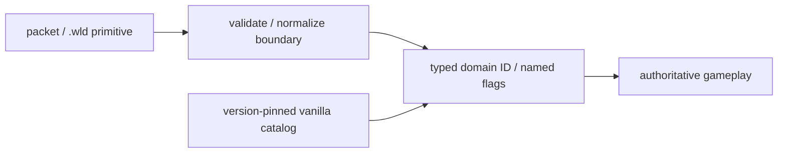

# CI-гейт доменных числовых литералов gameplay

[English](../en/gameplay-domain-literal-gate.md) · [Roadmap декомпозиции gameplay](../roadmap/gameplay-decomposition-and-catalogs.md)

TerraRuntime считает числовую Terraria identity данными границы/версии, а не обычной деталью gameplay. `tools/ci/audit_gameplay_domain_literals.py` является высокосигнальным CI-гейтом этого правила.

Гейт сканирует gameplay-owned C# в `src/TerraRuntime.Core`, `src/TerraRuntime` и `src/TerraRuntime.World`. Protocol, persistence, snapshot и world-generation adapters, чьи имена явно обозначают boundary ownership, исключены: на этих границах raw representation допустим.

Вне таких границ аудит запрещает:

- создание `ItemTypeId`, `NpcTypeId`, `ProjectileTypeId`, `TileTypeId`, `WallTypeId`, `BuffTypeId`, `PrefixId`, `TileEntityTypeId`, `NpcAiStyleId` или `ProjectileAiStyleId` из числового литерала;
- target-typed варианты вроде `NpcTypeId type = new(3)`;
- прямые решения вроде `npc.Type == 3`, `tile.Type is 10 or 388` или `tile.Wall != 350`;
- прямую frame arithmetic вроде `tile.FrameX / 18`; literal принадлежит object geometry или named frame fact;
- прямые числовые битовые операции над семантическими `Flags`, `ControlFlags`, `StateFlags`, `WireFlags` или `Bits`.
- raw constants/comparisons поддиапазонов player inventory, например `AmmoSlotStart = 54` или `inventorySlot >= 59`; ими владеет `VanillaPlayerItemSlotCatalog`.
- создание/сравнение непустого числового `ItemNetId` в gameplay-owned коде; значение должно приходить из named `VanillaItemIds`/item facts или validated boundary.

Комментарии, строковые и символьные литералы перед проверкой вырезаются, поэтому примеры в документации не превращаются в ложные нарушения.

## Правильная граница



Gameplay использует `VanillaNpcIds.Zombie`, `VanillaProjectileIds.Shuriken`, `VanillaNpcAiStyles.Fighter` или проверенные metadata families вместо повторения их raw-значений.

## Исключения

Скрытого baseline-файла, который молча легализует старые нарушения, нет. Реально необходимый числовой литерал в gameplay обязан иметь заметное при review исключение на той же строке:

```text
// gameplay-domain-literal-audit: allow <rule> - <конкретная причина>
```

Имя rule должно совпадать с нарушением, а причина не может быть пустой формальностью. Обычное boundary representation лучше вынести в явно названный adapter, а не подавлять проверку.

## Граница доказательства

Зелёный гейт доказывает отсутствие запрещённых raw-domain форм в проверяемых gameplay roots. Он не означает, что любой числовой tuning-параметр плох или что protocol/persistence должны отказаться от primitives. Таймеры, размеры и математические значения остаются ответственностью своих подсистем и обычных правил roadmap по magic numbers.

Гейт запускается в `Gameplay AI Verify` до .NET build, чтобы новый raw ID падал быстро и заметно.
