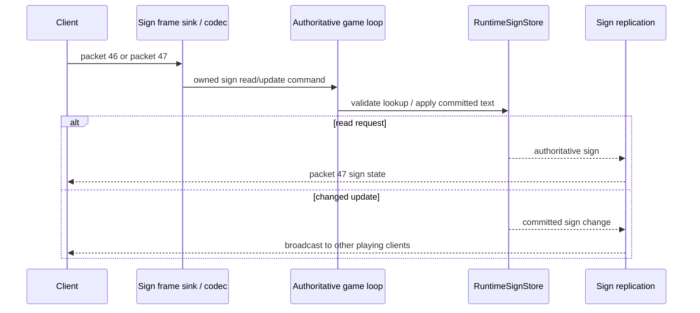
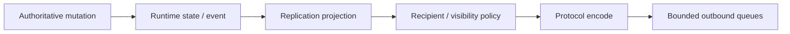
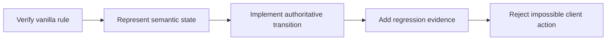

# Gameplay runtime и vanilla parity

[English](../en/gameplay.md) · [Документация](README.md) · [Архитектура](architecture.md) · [Gameplay decomposition roadmap](../roadmap/gameplay-decomposition-and-catalogs.md)

## 1. Назначение

PlayerBot использует [typed task/action слой](runtime-bot-architecture.md). `Mining` теперь самостоятельно ищет и добывает выбранную обычную руду под землёй; `Collect` и `ReturnToPlayer` сохраняют прежнюю семантику. Помощь Follow/Guard, physics, combat, pickup и consumables сохраняют своих authoritative владельцев. Mining ограничен восемью обычными рудами и локальным проходом через Dirt/Stone: это не глобальная разведка и не parity строительства/crafting.

### Сыпучие блоки в работающем мире (2026-09-09)

Песок, эбонитовый, жемчужный и кримзоновый песок, ил, слякоть и ракушки без опоры отделяются через `WorldTileAuthority`, становятся server-owned projectile AI `10` с точным поколением и оседают через те же mutation/item authorities. Начальная серверная скорость, первое обновление без collision, гравитация, движение в воде, платформы/полублоки, защищённые опоры и превращение в предмет на конвейере следуют проверенному срезу `1.4.5.8`. Обычный projectile combat применяет броню, иммунитет, GodMode и смерть игрока (`packet 118`) без выдуманного NPC-источника; допущенные враждебные NPC получают урон через существующий non-player damage/loot pipeline. Тип клиентского projectile не даёт terrain/damage authority.

Работа ограничена на мир: $256\,\text{checks/tick}$, $16\,\text{spawns/tick}$, $128\,\text{active-or-pending falls}$ и $4096\,\text{queued wakeups}$. Обычные tile mutations немедленно будят соседей. Первичный поиск и восстановление после переполнения очереди используют возобновляемый обход; перегрузка замедляет оседание, а не запускает неограниченный full-world pass. Полный projectile pool оставляет исходный тайл на месте. Полный item pool удерживает landing event до появления места. Это runtime scheduling policy, не паритет vanilla timing. Стресс-проверки контролируют сохранность материала при обвале $160\,\text{blocks}$ и заполненных пулах; официальные AI/movement fixtures покрывают семь типов в сухих/водных сценах, на платформах и полублоках.

Кучи монет, sandgun/player-owned channels, побочные эффекты AI tile-cut для декораций и полное взаимодействие с town NPC в этот срез не включены. Неизвестное пересечение разрушаемого декора остаётся fail-closed. Сохранение летящих projectiles не добавлялось; прежние семантика и формат world-save не изменены. Как при vanilla projectile replacement/edge deactivation, удаление без Kill не выдумывает восстановление тайла. Полный parity сыпучих блоков/gameplay не заявлен.

Локальная проверка: Release $5555/5555$ тестов, сборка без warnings/errors, Windows NativeAOT и шесть smoke-режимов прошли. Изолированный обвал $160\,\text{blocks}$ за $300\,\text{ticks}$ после начального spawn занял $58.441\,\mathrm{ms}$ wall time и выделил $102688\,\mathrm{bytes}$ на writer thread, включая assertions. Это измерение fixture, не гарантия production latency и не before/after оптимизация. Linux NativeAOT и официальный GUI client acceptance остаются непроверенными.

### Исправление перемещения ботов (2026-09-08)

Подземное сопровождение: ограниченный поиск с проверкой полного тела учитывает пещерные проходы с несколькими поворотами. Недопустимая точка строя смещается к позиции сопровождаемого игрока. Место для зеркала ищется среди соседних сухих свободных позиций **после** округления floor anchor по `Spawn_SetPosition`; замкнутое место отменяет телепорт, а не вызывает раскопку или застревание тела в стене. Это локальная навигация, не полный поиск пути по пещерам.

Боты получают Vortex Pickaxe `2776` в hotbar-слот6. Помощь Follow/Guard требует недавнего (120 тактов) успешного authoritative разрушения простого тайла именно сопровождаемым player generation в том же мире. Оба игрока и кандидат должны быть ниже проверенного `WorldSurfaceTiles`; неизвестная граница, копание на поверхности и промежуточные `fail=1` ничего не разрешают. Эта помощь расширяет только мешающий проход из ближайших Dirt/Stone, с малой дальностью, без стенок, жидкостей, проводов и соседних специальных тайлов. Используются существующие проверки кирки, mutation, резервирование дропа и replication в `WorldTileAuthority`, с интервалом12 тактов. Руды, постройки, мебель, разрушение храма/данжа и автономные цели исключены из помощи; отдельный режим Mining описан выше. Source-параметры предмета: pick225/useTime6/useAnimation12; политика ждёт полную анимацию, не придумывая модификаторы скорости копания от экипировки.

Защитники одного игрока мягко распределяют цели: расходятся по неэкстренным угрозам, сохраняют target lock, могут вместе бить единственного врага и приоритетно реагируют на угрозы в80 пикселях от игрока. Melee-пара подходит с разных смещений; стрелки меняют позицию при перекрытии линии союзником, с определённым порядком уступания при общем spawn. Разные handles сопровождаемых игроков не делят назначения. Это серверная политика ботов, не заявление о паритете vanilla NPC AI или полноценных тактиках отряда.

Четыре функциональных слота теперь занимают Fishron Wings, Soaring Insignia, Terraspark Boots и Magiluminescence; пятый зависит от комплекта. Отключение полёта сохраняет наземные аксессуары. Общая физика требует функциональные крылья, не предмет в inventory/vanity или один флаг политики. Активный WingMovement пропускает гравитацию. Воздушная скорость8/ускорение2 Fishron, move-speed+.075/ускорение1.75/jump-speed+1.8 Insignia и восстановление полётного времени после декремента следуют1.4.5.8. Без Insignia запас180 обновлений; отпускание прыжка в воздухе его не пополняет. Перевод топлива ракетных ботинок в крылья, другие крылья, рывки и составные эффекты движения остаются открыты.

Ограниченная политика бота проверяет полный габарит20x42 на маршрутах перелёта и бокового выхода из-под навеса, удерживая промежуточную точку короткое время. Передаётся обычный movement intent; collision, скорость, бой и зеркало остаются у существующих authority. Это локальный обход, не универсальный поиск пути и не визуальный acceptance официальным клиентом. Регрессии включают реальное100-тактовое преследование вверх, функциональную экипировку и стены/навес/замкнутую комнату.

Исправление acceptance-инструментов (2026-09-08): live Dirt probe использует разные hotbar-слоты для земли и кирки, ждёт реальную ретрансляцию inventory и проверяет packet-13 selection и допустимую позицию рядом с тайлом вне краевой полосы мира. Одинаковое movement-состояние законно дедуплицируется, поэтому замена предмета в том же слоте не является подтверждением movement. Production mining admission не изменён. Source gate Moon Lord распознаёт как разрешённые XNA-конструкторы, так и форму ILSpy с by-reference конструктором при отсутствии XNA, сохраняя проверку временной переменной, операндов и коэффициента интерполяции. Изменённые damage/AI-константы не принимаются за вариацию декомпилятора.

### Исправление телепорта к океану

Волшебная ракушка `4263` и океанический Shellphone `5360` используют один клиентский `packet 73`, подтип `1`. Существующая authority игрока теперь сначала проверяет противоположный океан и только при неудаче — исходную сторону, как `Player.MagicConch` в 1.4.5.8. Произвольный поиск подземного пола заменён ограниченным обходом поверхности: начало в $40\,\text{тайлах}$ от края на высоте $50\,\text{тайлов}$, движение вдоль воды к суше, проверки габаритов и опасностей, исходное смещение относительно воздушной клетки приземления. Повторное использование чередует доступные берега. Неудачный `packet 65` содержит бит `2`, оставляющий клиенту его текущую позицию.

Обычный игрок фиксированного размера требует подтверждённой метадаты поверхности мира; габариты на маунтах, Skyblock low-tiles и исключения опасностей от экипировки/особых сидов остаются fail-closed. Двенадцать прямых вызовов официального серверного helper дали совпадающие координаты обоих берегов для земли, травы, песка, платформ, шипов и адского камня. Литеральные входящие/исходящие пакеты и повторные authoritative-телепорты проверяют реальный runtime. Визуальная проверка официальным клиентом и порядок предварительной отправки секций назначения остаются отдельными открытыми проверками; другие режимы Shellphone этим исправлением не закрыты.

TerraRuntime реализует gameplay Terraria как authoritative runtime systems, а не как побочные эффекты внутри packet handlers.

Цель: **наблюдаемая parity TerrariaServer 1.4.5.8**, а не повторение source structure. Внутренняя implementation может отличаться полностью, если player-visible results, ordering и compatibility остаются корректными.

Этот документ различает implemented foundations и broad vanilla coverage. Наличие runtime store или AI dispatcher не означает implementation всех Terraria entities этой subsystem.

## 2. Базовый gameplay flow

```mermaid
flowchart LR
    Client["Client / network input"] --> Decode["Bounded protocol decode"]
    Decode --> Ingress["Semantic ingress / command"]
    Ingress --> Loop["Authoritative game loop"]
    Loop --> Validate["Validation + state transition"]
    Validate --> Store["Runtime store / event"]
    Store --> Replication["Replication projection"]
    Replication --> Recipients["Recipient selection"]
    Recipients --> Encode["Protocol encode"]
```

### Спавн Ада и лава: ограниченный поддержанный участок

Обычная сухая ветка Ада теперь использует строгую границу `floorY > height - 190` и порядок бросков из `NPC.Spawner.SpawnAnNPC`. Runtime composition передаёт server-owned progression и наличие NPC; достигнутые в текущем сеансе Hardmode/mechanical milestones учитываются без перезапуска. Существующий definition/AI coverage gate сохранён. Сейчас допущены Lava Slime, Hellbat, Lava Bat и Bone Serpent; multi-actor ветка lava bait и выбранные типы без допущенного AI (включая Fire Imp и демонов) не создают NPC и никогда не подменяются Blue Slime/Skeleton. Предшествующие event/biome ветки, специальные seed, население остальных биомов и точный spawn budget остаются неполными. Необязательная инъекция `IVanillaNpcRandom` позволяет воспроизводить regression через тот же production path.

Для NPC типов `1`, `2`, `3`, `21`, `22` добавлен прямой контактный урон лавой в обычном мире. Проверяется committed physical rectangle по `Collision.LavaCollision`, а не клиентский wet-флаг или уменьшенная центральная wet-проба; source base damage `50` проходит существующий defense/death/loot pipeline без приписывания игроку. Generation-keyed контактный cooldown длится $30\,\text{updates}$. Invulnerable actors и непроверенные типы не считаются уязвимыми; Remix/For-the-Worthy здесь не допущены. Это **не полная lava parity**: открыты NPC OnFire buffs/DoT, общий межисточниковый канал `immune[255]`, остальные immunity/state families, урон игроку/боту с учётом экипировки и сгорание world items/призыв через Guide Voodoo Doll. Контакт проверяется после committed motion; точный порядок collision внутри vanilla update также остаётся открытым.

### Урон лавой server-owned игрокам

PlayerBot и другие игроки без клиента теперь проверяют лаву до движения на world writer, через существующую authority экипировки, HP и смерти. Обычный контакт начинается с урона `80` (`200` в Remix), учитывает броню и отдельный канал иммунитета `Lava`, добавляя OnFire только после успешного несмертельного удара. Функциональные Terraspark Boots `5000` дают $420\,\text{updates}$ защиты, восстанавливают её по единице за сухое обновление, снижают контактный урон на `45` и длительность горения на $210\,\text{updates}$. Vanity-экипировка не защищает. Текущие наборы ботов включают эти сапоги; тесты незащищённого контакта явно снимают их. Recall заполняет запас защиты; обычный teleport — нет.

Обычный OnFire вносит `-8` за обновление в регенерационный счётчик с порогом `120`, обходя броню и hit immunity. Вода/мёд гасят горение. GodMode предотвращает потерю HP; смерть очищает generation-owned состояние горения. Контакт и горение используют существующий vitals/death commit. В `packet 118` передаются `ByOther(2)` для лавы и `ByOther(8)` с death damage `10` для горения. Сохранённый buff-type baseline `packet 50` показывает горение и поздно подключившимся; длительность принадлежит серверу, клиентское представление не задаёт её. `packet 55` для отображения баффов удалённого игрока не используется.

Закрыт ограниченный участок **server-owned actors**, а не environmental authority обычного клиента или полный buff engine. При неизвестных world facts, Vampire OnFire и неизвестной функциональной экипировке семантика не угадывается. Другие lava accessories, Obsidian Skin/Ash Wood, mount/shimmer interactions, сочетания дебаффов и естественная регенерация не покрыты. NPC DoT/общий иммунитет и общее сгорание world items открыты; область поддержки куклы Гида описана отдельно ниже.

### Кукла Гида и возврат владения предметом

Обычная server-owned кукла Гида (`267`) теперь падает с проверенной гравитацией предмета и сгорает при контакте с лавой. World writer удаляет **весь стек** до того, как существующий NPC combat/death path наносит удар каждому активному Гиду. Без Гида предмет всё равно сгорает, но другие town NPC не страдают. При наличии Гида оставшиеся куклы поражают случайно выбранных допущенных town-like NPC без повторного выбора. Размещение `NPC.SpawnWOF` отделено от обычного spawn-on-player: воспроизведены source depth/duplicate gates, сторона относительно середины мира, отступ от активных игроков, вертикальный поиск по жидкости/твёрдым блокам и итоговая полоса Ада. Второй Гид не создаёт вторую Стену. Призыв не открывает Hardmode; progression по-прежнему принадлежит существующему пути смерти босса.

Клиентский `packet 39` — ограниченный запрос освобождения, а не назначение владельца или команда призыва. Освободить предмет может только текущий владелец при совпадении актуальных connection/item generations; запрос не задаёт нового получателя или координаты. `packet 22` остаётся только исходящим. Режимы владения начального `packet 21` теперь сохраняют source grab delay/reservation в $100\,\text{updates}$. Server-owned таймеры и допущенное движение обновляются без drop/owner-пакетов каждый tick; дискретные изменения используют прежнюю репликацию.

Область ограничена обычным движением куклы `14x26` на ровном рельефе, включая движение в воздухе/воде/мёде и определение контакта до движения для последующего сгорания. Склоны, платформы, конвейеры, shimmer и чрезмерное/непредставленное движение отклоняют этот участок симуляции. Движение зарезервированного клиенту предмета/притягивание при подборе, полная физика и сгорание всех предметов по rarity, динамический town identity, объявления боссов/Bestiary credit остаются неполными. Ограничения игроков/NPC выше сохраняются, но сгорание куклы Гида уже не отсутствует целиком. Это не утверждение о полном vanilla-прохождении или parity генератора.

Gameplay владеет legality и authoritative outcomes. Networking владеет wire transport. Replication отвечает за projection state обратно к clients.

## 3. Authoritative ownership

Mutable gameplay state принадлежит game-loop thread.

Сюда входят player state, world mutations, chests, signs, world items, NPCs, projectiles и другое simulation state по мере перехода subsystem в authoritative model.

External threads и trusted host modules используют snapshots или command/operations surfaces. Mutable stores им не выдаются.

## 4. Identity и content type

TerraRuntime разделяет vanilla content identity и identity конкретной live runtime entity.

| Vanilla content identity | Live runtime identity |
|---|---|
| `NpcTypeId(1)` | `NpcHandle(slot, generation)` |
| `ProjectileTypeId(1)` | projectile slot/handle |
| `ItemTypeId` | inventory/world-item identity |

Generation/revision-aware handles не дают stale reference мутировать другую entity после reuse slot.

Raw protocol IDs допустимы на wire boundary. Gameplay должен как можно раньше переходить к validated named domain IDs.

## 5. Version-pinned vanilla facts

Gameplay facts runtime привязаны к TerrariaServer 1.4.5.8.

Current typed/named facts включают NPC IDs и AI-style IDs, projectile IDs и AI-style IDs, verified widths/heights/defaults simulation, tile/item/sign facts implemented mutation paths и protocol-independent runtime handles/snapshots.

Catalog содержит только facts, реально нужные current behavior. TerraRuntime не копирует весь decompiled `SetDefaults` ради искусственного ощущения полноты.

## 6. Текущий статус parity

Таблица намеренно консервативная.

| Область | Состояние | Что это значит |
|---|---|---|
| Handshake / join / player slot | substantial | есть live official-world join probes; поддерживаются не все gameplay packets |
| Player spawn/state/movement | partial-to-substantial | есть authoritative ingress/state, normalization и replication foundations; complete anti-cheat movement model отсутствует |
| Inventory/equipment | partial | есть typed commit/request paths и packet handling, но full server-authoritative item-use/equipment semantics не завершена |
| World items | substantial foundation | runtime-owned store, allocation/reservation/update/replication paths и tests существуют |
| Tiles | partial | definition-driven simple-cell mining/drop/transform slices и replication есть; frame-important/object placement/destruction и full framing/wiring/growth breadth отсутствуют |
| Chests | substantial slice | runtime chest state, live open/content path, replication и persistence проверяются; complete chest/item authority ещё растёт |
| Signs | substantial slice | authoritative read/update/store/replication, source-backed tile normalization и `.wld` persistence есть; complete placement/destruction/object lifecycle parity отсутствует |
| Projectiles | partial | lifecycle/store/ownership/AI-style physics/collision/replication есть для verified type families; full projectile catalog/combat/side effects нет |
| NPC lifecycle | partial | runtime store, generation-safe identity, definitions, targeting/check-active/spawn/motion primitives существуют |
| NPC AI breadth | early partial | есть selected verified NPCs/AI families, но не весь vanilla roster |
| Combat/damage | early/partial | supporting structures существуют, полный vanilla PvE/PvP damage pipeline не завершён |
| Bosses | largely incomplete | broad boss parity предполагать нельзя |
| Loot/drops | partial | complete 1.4.5.8 simple-cell tile drop classification и пять contextual simple-cell identities definition-driven; frame/object drops и complete NPC loot/RNG пока incomplete |
| Housing/town NPCs | incomplete | target architecture есть, broad behavior отсутствует |
| Events/invasions/progression | incomplete | production parity пока нет |
| Wiring/liquids/growth | foundation/partial | world/liquid primitives существуют; full vanilla simulation отсутствует |
| Vanilla world generation | incomplete | extensible worldgen framework есть; built-in flat generator не vanilla WorldGen |

Если таблица расходится с executable evidence или newer roadmap item, обновляется документ, а не сохраняется stale status.

## 7. Players

Player networking переводится в runtime-owned commit requests/events до mutation.

Implemented architecture содержит dedicated ingress/commit shapes для spawn, movement, vitals/state slices, appearance/equipment slices и event fanout/replication.

Movement имеет vanilla-oriented normalization и server-known state, но long-term roadmap всё ещё включает richer history/tolerance handling teleports, mounts и respawn transitions.

Runtime не должен reject legal vanilla movement только потому, что future authoritative model амбициознее. Anti-cheat policy не должна становиться guessed gameplay.

## 8. Server-controlled players

Trusted hosts могут создавать connection-free runtime-owned players через `IServerPlayerOperations`.

Такие actors резервируют normal Terraria player slots из generation-safe pool и принимают semantic intent, например horizontal movement. Host не может напрямую выставлять final velocity/position каждый tick, обходя runtime physics/ownership.

Эта boundary предназначена для server-controlled actors/integration, а не для выдачи mutable player internals plugins.

## 9. Inventory и equipment

Inventory/equipment processing постепенно выносится из loose packet fields/raw slot numbers.

Target concepts: named inventory layout regions, validated item type/stack/prefix state, explicit equipment/loadout semantics, semantic item use вместо packet-handler side effects и server-known ownership world items/transitions.

Разреженный item-definition catalog теперь применяет source-backed maximum stack для импортированных item types на границах normalization, stored mutations и item use. Canonical item types, чьи defaults ещё не импортированы, сохраняют compatibility для положительных protocol-valid stacks вместо наследования выдуманной metadata.

Current packet/commit infrastructure нельзя считать complete authoritative recipe/use/ammo/accessory logic.

## 10. World items

`RuntimeWorldItemStore` является authoritative runtime entity store, а не transparent client relay.

Implemented foundation покрывает slot allocation/reservation, updates/partial updates, runtime ingress/commands, replication-registry integration и selected tile-drop integration. Сервер каждые пять ticks выполняет консервативный slice `WorldItem.FindOwner` и публикует packet 22. Место учитывает пустые main slots и совпадающие по type/prefix стопки ниже проверенного максимума, включая занятые ammo slots; избранные consumable placement стопки допускаются, неизвестные favorite-item правила и максимумы отклоняются. Cursor slot 58 и coin slots для обычных предметов не подходят. Это проверка eligibility для reservation, не новая серверная реализация `GetItem`.

Полный подбор использует **packet 151**, а не пустой packet 21 в обычном vanilla wire path: `NetMessage.SendData(21)` заменяет пустой предмет компактным removal frame. Входящий 151 и разрешённая исходником пустая форма 21 проходят одну проверку точного поколения и владельца reservation. Обычное удаление и завершение instanced lease кодируются исходным пятибайтовым packet 151. Произвольный клиент не может удалить чужой/reused предмет или неактивный leased slot; входящий packet 22 остаётся неавторитетным. Раньше игнорирование 151 оставляло подобранные клиентом предметы в bounded серверном pool, что в итоге блокировало любое разрушение с дропом. Literal-wire регрессии выполняют 900 циклов копания/смены инструмента/подбора как с пустым, так и с полным main inventory, без увеличения pool или сетевых лимитов. На packet 151 сохраняется общий flood ceiling; копирование лимита packet 21 отвергало бы допустимый подбор всего pool за один burst.

World-item merging/overflow eviction, специальные magnets, Void Bag routing, полная физика предметов и оставшиеся ветки `ItemSpace`/`CanPullItem` не завершены. Действительно полный pool по-прежнему отклоняет разрушение с дропом до мутации блока, не теряя предмет. Каталог также допускает проверенные Nebula/Solar Flare/Stardust pickaxes `2781/2786/3466`, каждая с pick power `225`. Исправлены доказанные пути; точный временный сбой тестера без лога или packet capture полностью не восстановлен.

World-item identity отделена от item content type. Future pickup/stack/ownership validation строится на server-owned identity, а не на доверии arbitrary client slot metadata.

## 11. Tiles и world mutation

World edits проходят semantic/runtime mutation paths, а не напрямую переписывают tile из decoder.

Runtime имеет verified slices tile kill/update/replication и world collision/query behavior. `WorldTile` хранит только mutable state клетки; один flyweight `VanillaTileDefinition` на каждый TileID 1.4.5.8 владеет break-path, mining, drop и failed-pick transform semantics. Поэтому обычный simple-cell mining больше не использует положительный TileID allow-list.

Mining через packet 17 разрешает выбранный packet-13 inventory slot через точное generation соединения. Verified pick catalog включает обычные кирки и буры, в том числе варианты Nebula, Solar Flare и Stardust. Drill Containment Unit является отдельным source-backed источником authority: mount type `8` с `controlUseItem`, summon item в обычном inventory и vanilla mount pick power `210`. Он не маскируется под кирку в выбранном slot.

В broad vanilla scale пока incomplete остальные frame-important/multi-tile object destruction/placement families за пределами точного base Chest slice, все slope/platform interactions, wiring/actuation, growth/spread families, полный `HitTile`/reach и оставшиеся environment-dependent правила `CanKillTile`.

Tile mutation не завершена только потому, что resulting tile ID выглядит правильно. Neighbor framing, object validity, drops, liquid interaction, persistence и network replication могут быть observable parts одного vanilla action.

## 12. Chests

Chest path является одним из более зрелых object slices.

Current architecture включает runtime chest state, interaction/replication paths и authoritative persistence. Live workflows проверяют open/content behavior на official-world data.

Важные invariants: chest identity/coordinate validation до mutation, containment malformed chest traffic, authoritative-owner save capture и separation replication/storage.

Full server-authoritative inventory conservation/anti-dupe logic вводится только когда item-ownership model достаточно сильна, чтобы не создавать false rejects legal vanilla traffic.

## 13. Signs

Signs теперь являются authoritative object slice, а не packet relay.

Current production path содержит:

- protocol `326` typed handling `RequestSign` (`packet 46`) и `SignNew` (`packet 47`);
- `RuntimeSignNetworkIngress` для bounded socket-thread → game-thread handoff;
- `RuntimeSignStore` и `RuntimeSignCommandProcessor` для authoritative lookup/mutation;
- `RuntimeSignReplicationRegistry` для transport projection;
- `SignInteractionFrameSink` в production connection chain;
- `.wld` sign-section persistence из authoritative runtime state.

### Source-backed tile normalization

Sign read нормализует clicked tile к sign origin по verified TerrariaServer 1.4.5.8 frame rule. Horizontal origin использует `FrameX / 18` modulo two, vertical origin использует `FrameY / 18`. Normalized origin должен иметь один из verified sign tile types `55`, `85`, `425` или `573`.

Out-of-world coordinates или normalized tile другого type reject'ятся, а не угадываются.

### Update replication

При committed text change current source-backed path broadcast'ит resulting sign state другим playing clients, исключая sender, как в pinned vanilla update path. Read response отправляется только requesting connection.

Это substantial interaction/persistence slice, но не complete sign-object lifecycle parity. Placement, destruction, framing и surrounding tile-object rules остаются broader tile/object work.

## 14. NPC lifecycle

NPC используют runtime-owned store и generation-safe handles.

Current foundations: allocation/lifecycle state, version-pinned definition lookup, target selection primitives, gravity/world motion, spawn cadence primitives, check-active/despawn slices, replication projection и trusted-host actor control через semantic intent.

Current verified definition catalog содержит **Blue Slime**, **Demon Eye**, **Zombie**, **Eye of Cthulhu**, **Servant of Cthulhu**, **Skeleton** и **King Slime**. `VanillaNpcAiCoverageCatalog` записывает точные admitted capabilities и сейчас помечает каждую запись как неполный vanilla AI parity.

## 15. NPC AI

AI декомпозируется по behavior/family вместо unbounded `switch(type)` в packet handler.

Current selected implementation включает AI-specific/family primitives verified NPC slice: slime, fighter, flying и два boss paths. Skeleton явно разделяет ownership AI_003, но сохраняет свой source-backed horizontal speed band `1.5f`. Полный roster отслеживается в [roadmap NPC/AI parity](../roadmap/npc-ai-parity.md).

Rules расширения AI:

1. verify constants/state ordering TerrariaServer 1.4.5.8;
2. isolate reusable behavior только при реальном shared rule;
3. preserve observable RNG ordering;
4. add deterministic state-transition tests;
5. use official-server/client evidence, когда local tests могут разделять wrong assumption.

Boss orchestration не нужно запихивать в abstractions, придуманные для ordinary early-game NPCs.

Обычный AI69 Duke Fishron теперь получает подтверждённые ширину мира и surface через существующую NPC authority. Ocean gates используют левый верхний угол игрока и строгие сравнения800/6400/surface/правого края. Enrage сокращает hover до10 ticks, добавляет6 к скорости рывка, заменяет bubble-specials, меняет damage/defense и передаёт признак Cthulhunado bolt; возвращение к океану восстанавливает обычную фазу. Обычный Classic/Expert/Master defDamage равен100/140/210 до phase/enrage. Без границ мира root step/projectile plan отклоняется. Эти source-backed части не закрывают difficulty-dependent spawn life, distant-target/despawn ordering, special seeds и официальный client encounter acceptance.

## 16. Trusted-host NPC actors

`INpcActorOperations` позволяет trusted host получить lease existing runtime NPC и отправлять semantic `NpcActorIntent`.

Runtime владеет final movement, gravity, collision, lifetime/entity identity и authoritative application order.

Controller IDs и explicit release позволяют safe module/plugin teardown. Host не может хранить direct mutable NPC objects across reload boundaries.

## 17. Projectiles

Projectile support уже вышел из relay-only design.

Current architecture включает runtime projectile store, ownership/provenance facts, lifecycle handling, definition catalog, behavior state executor/stepper, world physics/collision, tile-cut integration supported cases и packet projection/replication.

Projectile combat теперь имеет отдельные mutation-free intent boundaries для player-owned и admitted server-owned/NPC-owned sources. Player-owned provenance разрешает byte owner в текущий generation-safe `PlayerHandle`; admitted hostile projectiles сохраняют точную generation исходного `NpcHandle`, а generation-safe player/NPC hit selection становится authoritative только для source-backed collision families.

Generic supported tile impacts теперь сохраняют `TileCollision` как semantic termination reason через generation-safe authoritative commit. Post-behavior decorators и termination observers могут отличить столкновение от обычного lifetime expiry без анализа wire state.

Source-backed world step также применяет vanilla pre-AI inclusive world-edge deactivation для supported non-boomerang families и отдельно сообщает `WorldBounds`. Это не позволяет out-of-world state симулироваться ещё один tick и сохраняет vanilla boomerang exemption для будущего behavior slice.

| Verified family | Vanilla AI style |
|---|---:|
| Arrow | `1` |
| Thrown | `2` |
| Boomerang | `3` |
| Controlled magic missile | `9` |
| Cultist lightning | `88` |

Definition catalog содержит growing verified set этих families: arrows, bullets/lasers, bones, shuriken/throwing-knife-style projectiles, boomerang support и controlled Magic Missile/Flamelash aiStyle-9 slice. Для этих двух channeled projectiles packet 27 передаёт только bounded cursor intent; movement, release по packet-13 use control/selected-item state, damage, mana consumption и hit resolution принадлежат серверу.

Hostile Cultist lightning slice теперь владеет Orb `465` и Arc `466`. Orb использует source fade/lifetime counter и на updates `30`, `60`, `90`, `120` и `150` создаёт до пяти arcs, выбирая живых игроков в порядке физических slots в пределах `$2000\,\mathrm{px}$` при наличии line of sight. RNG дочерних снарядов сохраняет порядок вызовов Terraria `UnifiedRandom`. Каждая Arc выполняет пять subupdates за world tick, получает новый поворот каждый восьмой subupdate из синхронизированного `ai[1]`, при столкновении с тайлом останавливается, а не исчезает, generation-safe хранит source trail из 20 позиций и использует этот trail для authoritative collision с игроком до его схлопывания.

Это **не** complete Terraria projectile parity. Unsupported irreversible side effects, child spawning, immunity, penetration, specialized AI, damage и kill effects остаются explicit boundaries, а не guessed behavior.

## 18. Combat

Combat является отдельной semantic subsystem, а не просто fields projectile/NPC packets.

Target model включает damage source/provenance, attacker/target, base/final damage, defense interaction, knockback, critical hits, immunity/cooldowns, death reason/result и PvP/environment/NPC/projectile categories.

Authoritative становятся только verified portions. Пока complete conservation/damage rules отсутствуют, server не должен invent strict rejection rules, ломающие legal vanilla behavior.

Серверные PlayerBot теперь участвуют как PvP-цели в поддерживаемых direct-melee, trusted projectile и termination-explosion paths. Используются authoritative weapon/equipment mitigation, hostility/team/generation checks, GodMode и source PvP immunity в восемь ticks. Смертельный урон отправляет packet `118`; это не означает поддержку всех weapons, buffs/debuffs и equipment effects. AI_001 motion и prediction бота различают прямолинейные Bullet `14` / Silver Bullet `981` / Green Laser `20` / Jester's Arrow `5` и падающие стрелы.

## 19. Drops и loot

Simple-cell tile drops теперь source-pinned definition data, а не вручную поддерживаемый allow-list. Пять contextual simple-cell identities 1.4.5.8 имеют явные стратегии: vines/flowering vines используют Cordage ближайшего игрока, Mushroom Vines — vanilla half-chance, Hive может оставить honey и породить Bee/SmallBee до RNG создания Hive Block item. Frame-important/object drops и полный NPC loot остаются отдельными incomplete families.

NPC loot parity потребует rules/data structures, сохраняющих conditions, probabilities, stack ranges, progression/event dependencies и RNG ordering.

Declarative loot table полезна только если воспроизводит verified sequence. Изменение RNG call order при тех же nominal percentages может изменить observable vanilla outcome.

### Награды за смерть Плантеры и Голема

Плантера и Голем теперь используют существующий authoritative death/interaction/item pipeline для своих NPC-specific правил Classic, Expert и Master. Первая победа над Плантерой в Classic сначала выдаёт Grenade Launcher и 50..150 Rocket I, затем маску/ключ/необязательные награды; последующие победы выбирают из восьми source rules. Загруженный `DownedPlantera` и текущий прогресс мира оба отключают ветку первой победы. При неизвестном исходном состоянии мира этот Classic reward slice не выдаётся: неизвестность не считается новым миром. В Expert выдаётся адресный Boss Bag, а не дополнительный Temple Key в мир.

Голем сохраняет source-порядок маски, независимых шансов Picksaw и нового для 1.4.5.8 Mobius Strip, семи вариантов награды, боеприпасов для Stynger и 4..8 Beetle Husks. Master relic/pet и трофей также следуют source-порядку. Мешки через packet 90 используют существующий lease/recipient path; боты без клиентского соединения и устаревшие поколения игроков не перенаправляют мешок наблюдателю. Повторный запрос смерти не создаёт новых наград.

Для 35 предметов допущены только world-drop dimensions и natural-prefix families. Независимое сравнение с официальным сервером совпало для 3500 item/seed prefix outcomes и следующих RNG draws; сохранены исключения округления Venus Magnum и Heat Ray. Выпадение этих предметов не разрешает непроверенное применение оружия, инструментов или аксессуаров. Общие luck/coin/heart rules, содержимое мешков и открытие двери Temple Key через packet 52 остаются явными долгами. Эти награды и существующие AI slices не доказывают полную проходимость vanilla.

Новые evaluators проверяют трофей до остальных NPC-specific наград: официальная база регистрирует трофеи до таблиц боссов и сохраняет порядок добавления. Это подтверждено прямым probe `Populate/GetRulesForNPCID` оригинала. Старые boss evaluators с трофеем в конце остаются отдельным подтверждённым долгом по порядку RNG; их зелёные тесты сами по себе не доказывают vanilla parity.

## 20. Buffs, prefixes и item metadata

Buffs и prefixes теперь имеют typed version-pinned identity ranges и выбранные source-backed definition traits вместо scattered raw integers.

Player packet `50` теперь является typed presentation boundary для TerrariaServer 1.4.5.8. Runtime проверяет source shape `[player][buff ushort...][0]` с лимитом `Player.maxBuffs = 44`, отбрасывает заявленный клиентом slot в пользу generation, принадлежащей connection, удерживает полученные snapshots для peer/late-join replication и переносит наблюдённый snapshot между мирами. Реально полученный пустой список отличается от состояния, когда packet `50` ещё вообще не приходил.

Этот packet не содержит buff duration и не является authoritative combat modifier input. Vanilla dedicated server не исполняет hostile projectile `Damage_EVP`: пострадавший multiplayer client применяет такие projectile statuses локально и сообщает серверу только список активных types через packet `50`. Packet `55` остаётся отдельным targeted PvP buff-delivery path и не используется как PvE fallback.

Admitted projectile-specific PvP status slice теперь server-resolved из source-pinned правил `Projectile.StatusPvP`: Fire Arrow `2` может наложить `On Fire!` `24` на 180 ticks с шансом `1/3`, Flamelash `34` — на 240 ticks с `1/2`, Poisoned Knife `54` — `Poisoned` `20` на 600 ticks с `1/2`. Status roll выполняется в vanilla ordering до `Player.Hurt`, поэтому Creative GodMode может избежать HP damage, не отменяя уже состоявшийся proc. Успешный эффект кодируется packet `55` только exact target generation; equipment/enchantment-driven status остаётся fail-closed.

Полный buff gameplay остаётся broad future work. Identity/presentation validation нельзя путать с реализацией каждого buff effect, immunity, duration/RNG rule, prefix stat family или reforging rule.

## 21. Wiring, liquids и growth

Wiring, liquid material и growth commits теперь имеют отдельные typed mutation boundaries. Liquids также имеют explicit runtime work queue, persistable через warm snapshots.

Обычное settling жидкости одного вида теперь повторяет verified-схему TerrariaServer 1.4.5.8 `Liquid.Update`: сначала gravity transfer, затем при оставшейся жидкости horizontal leveling в том же update. Сохранён vanilla-случай полного source `255 -> 254`, где нижняя клетка добирает одну единицу без уменьшения source. Горизонтальный проход использует source-backed окна усреднения на 2/3/4/5/7 клеток; ветки на 5/7 клеток также сохраняют подпитываемую source-column, когда соседи уже равны округлённому уровню. Lava и honey используют source-backed задержки потока на пять и десять updates.

Обычные open-cell material-contact paths из `Liquid.LiquidCheck` теперь также authoritative. Water будит соседние lava/honey/shimmer и оставляет выбор merge-location update чужого типа жидкости. Проверенные merges создают Obsidian (`56`) для water/lava, Honey Block (`229`) для water/honey, Crispy Honey Block (`230`) для lava/honey и Shimmer Block (`659`), когда shimmer побеждает в source-order выборе merge. Vanilla-порог `24` units, поглощение чужой жидкости слева/справа/сверху, очистка source меньше `24` над чужой жидкостью и packet-20 tile-square replication для material mutations закреплены focused runtime tests.

Обычный dedicated-server lifecycle активной liquid entry теперь также входит в authoritative slice. Одна liquid entry может продвинуться максимум на один logical update за TerraRuntime tick даже при work budget больше единицы, изменение amount сбрасывает `kill` и будит клетку сверху, стабильные entries retire по порогу TerrariaServer 1.4.5.8 `10 + activePlayersInSlots0To14 / 3`, а стабильные `254` при retirement нормализуются в `255`. Water ниже `Main.UnderworldLayer == maxTilesY - 200` испаряется по две units за liquid update. Generating/loading slice покрывает quick-settle scheduling, `Liquid.QuickWater` и `WorldGen.WaterCheck` с финальными source-pinned таблицами water-death из 10 и lava-death из 267 TileID. Canonical load теперь выполняет поддержанный sequence `QuickWater -> WaterCheck -> quickSettle drain (максимум 100000 итераций) -> WaterCheck` до admission runtime/bootstrap cache, а runtime cache layout 2 можно записать только из такого prepared state. Полная vanilla liquid simulation всё ещё открыта для сложных `WorldGen.ReplaceTile` cases вне safe active subset, Remix/Zenith load-time liquid remapping и panic/forced-settle paths. Circuit traversal/devices и families growth/spread rules также остаются отдельной работой.

Общие таблицы из 10 water- и 267 lava-идентичностей не являются итоговыми правилами разрушения объектов. Загрузка теперь сначала разрешает style/subtile/alternate из `TileObjectData.Check*(Tile)`: обсидиановые мебель/платформы переживают лаву, но lantern `42`/style `32` наследует разрушаемый лавой alternate. Статический resolver напрямую сравнен с официальным 1.4.5.8 на 3 853 832 неотрицательных сочетаниях type/frame без расхождений; тест хранит golden hash фиксированных 1 961 154 случаев. Проверенное удаление при загрузке охватывает одноклеточные растения/факелы/травы/мох и согласованные сердца/горшки/лампы/костры/декор джунглей/картины/знамёна/фонари без item drops. Стены, провода, жидкость и актуаторы сохраняются, block frames становятся `-1`. Несогласованные структуры, защищённые части, зависимые от платформ объекты и непредставленные каскады остаются fail-closed. Live mining и права создания drops не расширяются. См. [доказательства отказов запуска](startup-performance-gate.md).

Live scheduler вычисляет slice TerrariaServer 1.4.5.8 по формулам `curMaxLiquid = 25000 - players * 250` и `cycles = 10 + players / 3`, с максимумом `2500` entries за TerraRuntime tick на пустом сервере. Backlog-тесты water, lava и shimmer доказывают, что независимые миры при одинаковом TPS получают одинаковый slice. Клетки с нулевым количеством жидкости не занимают active queue, а committed tile mutation немедленно будит соседнюю непустую жидкость.

Эти subsystems order-sensitive и могут затрагивать large world areas, поэтому implementation сочетает exact behavioral verification, global bounded per-tick work, deterministic owner-thread commits, dirty/replication tracking и save compatibility.

## 22. Progression, events, town NPCs и bosses

Permanent milestones, active events и invasion identities теперь проецируются из world metadata в отдельный typed gameplay state.

Их simulation остаётся major parity gap. Нельзя выводить full support из readable milestone или generic NPC infrastructure: transitions, waves, spawn rules, rewards и gameplay consequences всё ещё требуют source-backed implementations.

При переходе этих systems в authoritative state каждой нужны explicit persistence, synchronization и official behavior evidence.

## 23. World generation

TerraRuntime имеет world-generation **framework** с provider registration, planning, ordered passes, isolated workspace execution и final validation.

Built-in catalog теперь включает source-backed vanilla provider Terraria `1.4.5.8` наряду с flat, optimized и skyblock providers. Canonical small-world integration уже проверяет source-shaped terrain, framed trees, много-комнатный dungeon graph, покрытие Underworld ash/hellstone/lava, footprints jungle/snow/desert/evil biome и generated chests с непустыми source-pinned loot families. Этот же provider используется генерацией sandbox.

Vanilla worldgen parity всё ещё incomplete: успешное structural/content coverage не означает bit-identical output `WorldGen`, а оставшиеся passes и order-sensitive RNG behavior требуют дальнейшего source-backed porting и differential evidence.

## 24. Replication

Gameplay mutation и network replication являются разными responsibilities.

Runtime replication registries существуют для player-related events, NPCs, projectiles, world items, chests, signs и tile manipulation.

Входящий liquid packet `48` является bounded client proposal. Для текущего поколения игрока world writer проверяет tile bounds, дальность `$12\,\text{tiles}$`, вид жидкости и per-connection edit budget, затем коммитит точные decoded amount/type через `VanillaWorldLiquidMutationService`. Mutation планирует authoritative settling и публикует normalized cell всем playing clients. Значение клиента больше не отбрасывается как один лишь wake-up hint, а distant, malformed или saturated proposals по-прежнему fail closed.

Separation важно, потому что одна mutation может иметь много recipients, recipients меняются interest management, identical encoded state может safe-share'иться, а persistence не должна зависеть от того, что последний раз отправили client.

## 25. Validation philosophy

Server становится более authoritative только там, где правило доказано.

Anti-pattern: придумать, что legitimate client «должен» делать, reject всё остальное, а потом узнать, что vanilla это допускает. False-positive anti-cheat является gameplay bug.

## 26. Evidence hierarchy

Gameplay changes используют project-wide source hierarchy:

1. locally decompiled TerrariaServer 1.4.5.8 для current vanilla behavior/constants;
2. Multiplicity для protocol `326` wire representation;
3. terrustia как independent implementation cross-check;
4. TShock/OTAPI только для history/exploit lessons.

Real official-client/server traffic, generated worlds и differential probes требуются, когда local unit test не может independently prove behavior.

## 27. Test strategy

По subsystem evidence включает deterministic state-transition tests, definition/catalog tests, runtime store lifecycle/slot-reuse tests, collision/world-query tests, replication tests, malformed/illegal input tests, official-source workflows, live official-world/client probes и persistence/restart tests сохраняемого state.

Green build сам по себе не parity evidence.

## 28. Добавление нового NPC/projectile behavior

Перед новым behavior slice:

Projectile behavior dispatch остаётся централизованным, но family-specific helpers разделены по ответственности: boss families, player-owned families, Deerclops-specific behavior и shared math/targeting helpers находятся в отдельных partial-файлах `VanillaProjectileBehaviorStepper.*.cs`. Новый behavior следует помещать в самый узкий подходящий family-файл; dispatcher не должен снова разрастаться в один монолитный implementation-файл.

1. identify exact Terraria 1.4.5.8 type и AI/default facts;
2. определить existing verified family или separate strategy;
3. добавить только metadata current behavior;
4. implement state transitions без protocol-library dependencies;
5. independently verify world collision/physics assumptions;
6. add lifecycle/replication handling;
7. add deterministic regression tests;
8. explicitly document unsupported side effects;
9. update RU/EN parity docs в том же change.

## 29. Current highest-risk gaps

Largest remaining gameplay breadth — vanilla rule coverage, а не basic store architecture:

- many NPC AI families;
- bosses;
- full combat/damage semantics;
- complete item use/inventory authority;
- loot;
- housing/town NPC behavior;
- invasions/events;
- wiring/liquids/growth;
- world progression;
- vanilla world generation.

Это explicit work, а не повод скрывать всё за label `gameplay implemented`.

## 30. Правило оформления

Gameplay diagrams используют Mermaid для flows/sequences/state relationships. Numeric measurements/dimensional limits оформляются LaTeX с units; packet IDs, AI-style IDs, content IDs и protocol versions остаются code literals, потому что это identifiers, а не measurements.
