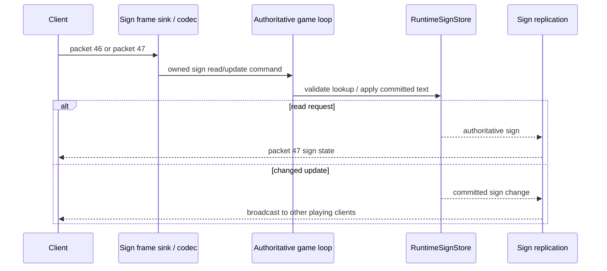
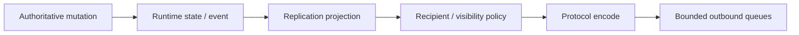
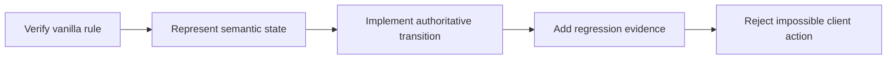

# Gameplay runtime и vanilla parity

[English](../en/gameplay.md) · [Документация](README.md) · [Архитектура](architecture.md) · [Gameplay decomposition roadmap](../roadmap/gameplay-decomposition-and-catalogs.md)

## 1. Назначение

TerraRuntime реализует gameplay Terraria как authoritative runtime systems, а не как побочные эффекты внутри packet handlers.

Цель: **наблюдаемая parity TerrariaServer 1.4.5.8**, а не повторение source structure. Внутренняя implementation может отличаться полностью, если player-visible results, ordering и compatibility остаются корректными.

Этот документ различает implemented foundations и broad vanilla coverage. Наличие runtime store или AI dispatcher не означает implementation всех Terraria entities этой subsystem.

## 2. Базовый gameplay flow

```mermaid
flowchart LR
    Client["Client / network input"] --> Decode["Bounded protocol decode"]
    Decode --> Ingress["Semantic ingress / command"]
    Ingress --> Loop["Authoritative game loop"]
    Loop --> Validate["Validation + state transition"]
    Validate --> Store["Runtime store / event"]
    Store --> Replication["Replication projection"]
    Replication --> Recipients["Recipient selection"]
    Recipients --> Encode["Protocol encode"]
```

Gameplay владеет legality и authoritative outcomes. Networking владеет wire transport. Replication отвечает за projection state обратно к clients.

## 3. Authoritative ownership

Mutable gameplay state принадлежит game-loop thread.

Сюда входят player state, world mutations, chests, signs, world items, NPCs, projectiles и другое simulation state по мере перехода subsystem в authoritative model.

External threads и trusted host modules используют snapshots или command/operations surfaces. Mutable stores им не выдаются.

## 4. Identity и content type

TerraRuntime разделяет vanilla content identity и identity конкретной live runtime entity.

| Vanilla content identity | Live runtime identity |
|---|---|
| `NpcTypeId(1)` | `NpcHandle(slot, generation)` |
| `ProjectileTypeId(1)` | projectile slot/handle |
| `ItemTypeId` | inventory/world-item identity |

Generation/revision-aware handles не дают stale reference мутировать другую entity после reuse slot.

Raw protocol IDs допустимы на wire boundary. Gameplay должен как можно раньше переходить к validated named domain IDs.

## 5. Version-pinned vanilla facts

Gameplay facts runtime привязаны к TerrariaServer 1.4.5.8.

Current typed/named facts включают NPC IDs и AI-style IDs, projectile IDs и AI-style IDs, verified widths/heights/defaults simulation, tile/item/sign facts implemented mutation paths и protocol-independent runtime handles/snapshots.

Catalog содержит только facts, реально нужные current behavior. TerraRuntime не копирует весь decompiled `SetDefaults` ради искусственного ощущения полноты.

## 6. Текущий статус parity

Таблица намеренно консервативная.

| Область | Состояние | Что это значит |
|---|---|---|
| Handshake / join / player slot | substantial | есть live official-world join probes; поддерживаются не все gameplay packets |
| Player spawn/state/movement | partial-to-substantial | есть authoritative ingress/state, normalization и replication foundations; complete anti-cheat movement model отсутствует |
| Inventory/equipment | partial | есть typed commit/request paths и packet handling, но full server-authoritative item-use/equipment semantics не завершена |
| World items | substantial foundation | runtime-owned store, allocation/reservation/update/replication paths и tests существуют |
| Tiles | partial | definition-driven simple-cell mining/drop/transform slices и replication есть; frame-important/object placement/destruction и full framing/wiring/growth breadth отсутствуют |
| Chests | substantial slice | runtime chest state, live open/content path, replication и persistence проверяются; complete chest/item authority ещё растёт |
| Signs | substantial slice | authoritative read/update/store/replication, source-backed tile normalization и `.wld` persistence есть; complete placement/destruction/object lifecycle parity отсутствует |
| Projectiles | partial | lifecycle/store/ownership/AI-style physics/collision/replication есть для verified type families; full projectile catalog/combat/side effects нет |
| NPC lifecycle | partial | runtime store, generation-safe identity, definitions, targeting/check-active/spawn/motion primitives существуют |
| NPC AI breadth | early partial | есть selected verified NPCs/AI families, но не весь vanilla roster |
| Combat/damage | early/partial | supporting structures существуют, полный vanilla PvE/PvP damage pipeline не завершён |
| Bosses | largely incomplete | broad boss parity предполагать нельзя |
| Loot/drops | partial | complete 1.4.5.8 simple-cell tile drop classification и пять contextual simple-cell identities definition-driven; frame/object drops и complete NPC loot/RNG пока incomplete |
| Housing/town NPCs | incomplete | target architecture есть, broad behavior отсутствует |
| Events/invasions/progression | incomplete | production parity пока нет |
| Wiring/liquids/growth | foundation/partial | world/liquid primitives существуют; full vanilla simulation отсутствует |
| Vanilla world generation | incomplete | extensible worldgen framework есть; built-in flat generator не vanilla WorldGen |

Если таблица расходится с executable evidence или newer roadmap item, обновляется документ, а не сохраняется stale status.

## 7. Players

Player networking переводится в runtime-owned commit requests/events до mutation.

Implemented architecture содержит dedicated ingress/commit shapes для spawn, movement, vitals/state slices, appearance/equipment slices и event fanout/replication.

Movement имеет vanilla-oriented normalization и server-known state, но long-term roadmap всё ещё включает richer history/tolerance handling teleports, mounts и respawn transitions.

Runtime не должен reject legal vanilla movement только потому, что future authoritative model амбициознее. Anti-cheat policy не должна становиться guessed gameplay.

## 8. Server-controlled players

Trusted hosts могут создавать connection-free runtime-owned players через `IServerPlayerOperations`.

Такие actors резервируют normal Terraria player slots из generation-safe pool и принимают semantic intent, например horizontal movement. Host не может напрямую выставлять final velocity/position каждый tick, обходя runtime physics/ownership.

Эта boundary предназначена для server-controlled actors/integration, а не для выдачи mutable player internals plugins.

## 9. Inventory и equipment

Inventory/equipment processing постепенно выносится из loose packet fields/raw slot numbers.

Target concepts: named inventory layout regions, validated item type/stack/prefix state, explicit equipment/loadout semantics, semantic item use вместо packet-handler side effects и server-known ownership world items/transitions.

Разреженный item-definition catalog теперь применяет source-backed maximum stack для импортированных item types на границах normalization, stored mutations и item use. Canonical item types, чьи defaults ещё не импортированы, сохраняют compatibility для положительных protocol-valid stacks вместо наследования выдуманной metadata.

Current packet/commit infrastructure нельзя считать complete authoritative recipe/use/ammo/accessory logic.

## 10. World items

`RuntimeWorldItemStore` является authoritative runtime entity store, а не transparent client relay.

Implemented foundation покрывает slot allocation/reservation, updates/partial updates, runtime ingress/commands, replication-registry integration и selected tile-drop integration.

World-item identity отделена от item content type. Future pickup/stack/ownership validation строится на server-owned identity, а не на доверии arbitrary client slot metadata.

## 11. Tiles и world mutation

World edits проходят semantic/runtime mutation paths, а не напрямую переписывают tile из decoder.

Runtime имеет verified slices tile kill/update/replication и world collision/query behavior. `WorldTile` хранит только mutable state клетки; один flyweight `VanillaTileDefinition` на каждый TileID 1.4.5.8 владеет break-path, mining, drop и failed-pick transform semantics. Поэтому обычный simple-cell mining больше не использует положительный TileID allow-list.

В broad vanilla scale пока incomplete остальные frame-important/multi-tile object destruction/placement families за пределами точного base Chest slice, все slope/platform interactions, wiring/actuation, growth/spread families, полный `HitTile`/reach и оставшиеся environment-dependent правила `CanKillTile`.

Tile mutation не завершена только потому, что resulting tile ID выглядит правильно. Neighbor framing, object validity, drops, liquid interaction, persistence и network replication могут быть observable parts одного vanilla action.

## 12. Chests

Chest path является одним из более зрелых object slices.

Current architecture включает runtime chest state, interaction/replication paths и authoritative persistence. Live workflows проверяют open/content behavior на official-world data.

Важные invariants: chest identity/coordinate validation до mutation, containment malformed chest traffic, authoritative-owner save capture и separation replication/storage.

Full server-authoritative inventory conservation/anti-dupe logic вводится только когда item-ownership model достаточно сильна, чтобы не создавать false rejects legal vanilla traffic.

## 13. Signs

Signs теперь являются authoritative object slice, а не packet relay.

Current production path содержит:

- protocol `326` typed handling `RequestSign` (`packet 46`) и `SignNew` (`packet 47`);
- `RuntimeSignNetworkIngress` для bounded socket-thread → game-thread handoff;
- `RuntimeSignStore` и `RuntimeSignCommandProcessor` для authoritative lookup/mutation;
- `RuntimeSignReplicationRegistry` для transport projection;
- `SignInteractionFrameSink` в production connection chain;
- `.wld` sign-section persistence из authoritative runtime state.

### Source-backed tile normalization

Sign read нормализует clicked tile к sign origin по verified TerrariaServer 1.4.5.8 frame rule. Horizontal origin использует `FrameX / 18` modulo two, vertical origin использует `FrameY / 18`. Normalized origin должен иметь один из verified sign tile types `55`, `85`, `425` или `573`.

Out-of-world coordinates или normalized tile другого type reject'ятся, а не угадываются.

### Update replication

При committed text change current source-backed path broadcast'ит resulting sign state другим playing clients, исключая sender, как в pinned vanilla update path. Read response отправляется только requesting connection.

Это substantial interaction/persistence slice, но не complete sign-object lifecycle parity. Placement, destruction, framing и surrounding tile-object rules остаются broader tile/object work.

## 14. NPC lifecycle

NPC используют runtime-owned store и generation-safe handles.

Current foundations: allocation/lifecycle state, version-pinned definition lookup, target selection primitives, gravity/world motion, spawn cadence primitives, check-active/despawn slices, replication projection и trusted-host actor control через semantic intent.

Current verified definition catalog содержит **Blue Slime**, **Demon Eye**, **Zombie**, **Eye of Cthulhu**, **Servant of Cthulhu**, **Skeleton** и **King Slime**. `VanillaNpcAiCoverageCatalog` записывает точные admitted capabilities и сейчас помечает каждую запись как неполный vanilla AI parity.

## 15. NPC AI

AI декомпозируется по behavior/family вместо unbounded `switch(type)` в packet handler.

Current selected implementation включает AI-specific/family primitives verified NPC slice: slime, fighter, flying и два boss paths. Skeleton явно разделяет ownership AI_003, но сохраняет свой source-backed horizontal speed band `1.5f`. Полный roster отслеживается в [roadmap NPC/AI parity](../roadmap/npc-ai-parity.md).

Rules расширения AI:

1. verify constants/state ordering TerrariaServer 1.4.5.8;
2. isolate reusable behavior только при реальном shared rule;
3. preserve observable RNG ordering;
4. add deterministic state-transition tests;
5. use official-server/client evidence, когда local tests могут разделять wrong assumption.

Boss orchestration не нужно запихивать в abstractions, придуманные для ordinary early-game NPCs.

## 16. Trusted-host NPC actors

`INpcActorOperations` позволяет trusted host получить lease existing runtime NPC и отправлять semantic `NpcActorIntent`.

Runtime владеет final movement, gravity, collision, lifetime/entity identity и authoritative application order.

Controller IDs и explicit release позволяют safe module/plugin teardown. Host не может хранить direct mutable NPC objects across reload boundaries.

## 17. Projectiles

Projectile support уже вышел из relay-only design.

Current architecture включает runtime projectile store, ownership/provenance facts, lifecycle handling, definition catalog, behavior state executor/stepper, world physics/collision, tile-cut integration supported cases и packet projection/replication.

Projectile combat теперь имеет отдельные mutation-free intent boundaries для player-owned и admitted server-owned/NPC-owned sources. Player-owned provenance разрешает byte owner в текущий generation-safe `PlayerHandle`; admitted hostile projectiles сохраняют точную generation исходного `NpcHandle`, а generation-safe player/NPC hit selection становится authoritative только для source-backed collision families.

Generic supported tile impacts теперь сохраняют `TileCollision` как semantic termination reason через generation-safe authoritative commit. Post-behavior decorators и termination observers могут отличить столкновение от обычного lifetime expiry без анализа wire state.

Source-backed world step также применяет vanilla pre-AI inclusive world-edge deactivation для supported non-boomerang families и отдельно сообщает `WorldBounds`. Это не позволяет out-of-world state симулироваться ещё один tick и сохраняет vanilla boomerang exemption для будущего behavior slice.

| Verified family | Vanilla AI style |
|---|---:|
| Arrow | `1` |
| Thrown | `2` |
| Boomerang | `3` |
| Controlled magic missile | `9` |

Definition catalog содержит growing verified set этих families: arrows, bullets/lasers, bones, shuriken/throwing-knife-style projectiles, boomerang support и controlled Magic Missile/Flamelash aiStyle-9 slice. Для этих двух channeled projectiles packet 27 передаёт только bounded cursor intent; movement, release по packet-13 use control/selected-item state, damage, mana consumption и hit resolution принадлежат серверу.

Это **не** complete Terraria projectile parity. Unsupported irreversible side effects, child spawning, immunity, penetration, specialized AI, damage и kill effects остаются explicit boundaries, а не guessed behavior.

## 18. Combat

Combat является отдельной semantic subsystem, а не просто fields projectile/NPC packets.

Target model включает damage source/provenance, attacker/target, base/final damage, defense interaction, knockback, critical hits, immunity/cooldowns, death reason/result и PvP/environment/NPC/projectile categories.

Authoritative становятся только verified portions. Пока complete conservation/damage rules отсутствуют, server не должен invent strict rejection rules, ломающие legal vanilla behavior.

## 19. Drops и loot

Simple-cell tile drops теперь source-pinned definition data, а не вручную поддерживаемый allow-list. Пять contextual simple-cell identities 1.4.5.8 имеют явные стратегии: vines/flowering vines используют Cordage ближайшего игрока, Mushroom Vines — vanilla half-chance, Hive может оставить honey и породить Bee/SmallBee до RNG создания Hive Block item. Frame-important/object drops и полный NPC loot остаются отдельными incomplete families.

NPC loot parity потребует rules/data structures, сохраняющих conditions, probabilities, stack ranges, progression/event dependencies и RNG ordering.

Declarative loot table полезна только если воспроизводит verified sequence. Изменение RNG call order при тех же nominal percentages может изменить observable vanilla outcome.

## 20. Buffs, prefixes и item metadata

Buffs и prefixes теперь имеют typed version-pinned identity ranges и выбранные source-backed definition traits вместо scattered raw integers.

Их complete gameplay остаётся broad future work. Identity validation нельзя путать с реализацией каждого buff effect, immunity, prefix stat family или reforging rule.

## 21. Wiring, liquids и growth

Wiring, liquid material и growth commits теперь имеют отдельные typed mutation boundaries. Liquids также имеют explicit runtime work queue, persistable через warm snapshots.

Эта декомпозиция не является full vanilla simulation. Circuit traversal/devices, liquid flow/reactions и families growth/spread rules остаются incomplete.

Эти subsystems order-sensitive и могут затрагивать large world areas, поэтому implementation сочетает exact behavioral verification, global bounded per-tick work, deterministic owner-thread commits, dirty/replication tracking и save compatibility.

## 22. Progression, events, town NPCs и bosses

Permanent milestones, active events и invasion identities теперь проецируются из world metadata в отдельный typed gameplay state.

Их simulation остаётся major parity gap. Нельзя выводить full support из readable milestone или generic NPC infrastructure: transitions, waves, spawn rules, rewards и gameplay consequences всё ещё требуют source-backed implementations.

При переходе этих systems в authoritative state каждой нужны explicit persistence, synchronization и official behavior evidence.

## 23. World generation

TerraRuntime имеет world-generation **framework** с provider registration, planning, ordered passes, isolated workspace execution и final validation.

Built-in generator сейчас deterministic flat dirt/stone baseline и explicitly не approximation vanilla Terraria WorldGen.

Vanilla worldgen остаётся incomplete, хотя architecture custom/pluggable worldgen развита существенно.

## 24. Replication

Gameplay mutation и network replication являются разными responsibilities.

Runtime replication registries существуют для player-related events, NPCs, projectiles, world items, chests, signs и tile manipulation.

Separation важно, потому что одна mutation может иметь много recipients, recipients меняются interest management, identical encoded state может safe-share'иться, а persistence не должна зависеть от того, что последний раз отправили client.

## 25. Validation philosophy

Server становится более authoritative только там, где правило доказано.

Anti-pattern: придумать, что legitimate client «должен» делать, reject всё остальное, а потом узнать, что vanilla это допускает. False-positive anti-cheat является gameplay bug.

## 26. Evidence hierarchy

Gameplay changes используют project-wide source hierarchy:

1. locally decompiled TerrariaServer 1.4.5.8 для current vanilla behavior/constants;
2. Multiplicity для protocol `326` wire representation;
3. terrustia как independent implementation cross-check;
4. TShock/OTAPI только для history/exploit lessons.

Real official-client/server traffic, generated worlds и differential probes требуются, когда local unit test не может independently prove behavior.

## 27. Test strategy

По subsystem evidence включает deterministic state-transition tests, definition/catalog tests, runtime store lifecycle/slot-reuse tests, collision/world-query tests, replication tests, malformed/illegal input tests, official-source workflows, live official-world/client probes и persistence/restart tests сохраняемого state.

Green build сам по себе не parity evidence.

## 28. Добавление нового NPC/projectile behavior

Перед новым behavior slice:

Projectile behavior dispatch остаётся централизованным, но family-specific helpers разделены по ответственности: boss families, player-owned families, Deerclops-specific behavior и shared math/targeting helpers находятся в отдельных partial-файлах `VanillaProjectileBehaviorStepper.*.cs`. Новый behavior следует помещать в самый узкий подходящий family-файл; dispatcher не должен снова разрастаться в один монолитный implementation-файл.

1. identify exact Terraria 1.4.5.8 type и AI/default facts;
2. определить existing verified family или separate strategy;
3. добавить только metadata current behavior;
4. implement state transitions без protocol-library dependencies;
5. independently verify world collision/physics assumptions;
6. add lifecycle/replication handling;
7. add deterministic regression tests;
8. explicitly document unsupported side effects;
9. update RU/EN parity docs в том же change.

## 29. Current highest-risk gaps

Largest remaining gameplay breadth — vanilla rule coverage, а не basic store architecture:

- many NPC AI families;
- bosses;
- full combat/damage semantics;
- complete item use/inventory authority;
- loot;
- housing/town NPC behavior;
- invasions/events;
- wiring/liquids/growth;
- world progression;
- vanilla world generation.

Это explicit work, а не повод скрывать всё за label `gameplay implemented`.

## 30. Правило оформления

Gameplay diagrams используют Mermaid для flows/sequences/state relationships. Numeric measurements/dimensional limits оформляются LaTeX с units; packet IDs, AI-style IDs, content IDs и protocol versions остаются code literals, потому что это identifiers, а не measurements.
