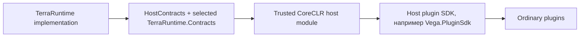
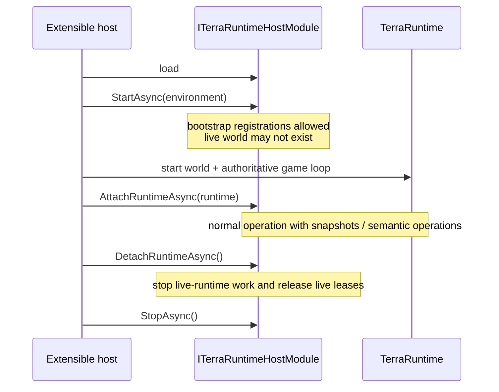
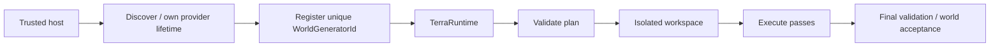

# Host-интерфейсы TerraRuntime

[English](../en/host-interfaces.md) · [Документация](README.md) · [Архитектура](architecture.md) · [Руководство](project-guide.md)

Этот документ описывает public integration surface trusted host module в CoreCLR-профиле. Это не каталог всех внутренних `public` типов TerraRuntime. Каноническая внешняя граница для Vega и других trusted hosts — `TerraRuntime.HostContracts` плюс deliberately exposed contracts из `TerraRuntime.Contracts`.

## 1. Модель доверия

Trusted host module привилегированнее ordinary Vega plugin, но не становится co-owner внутреннего runtime state.

> Host получает snapshots, semantic operations и registration surfaces. Он не получает mutable stores, game-loop object, socket connection objects или direct setters authoritative fields.



Ordinary plugins должны работать через Vega/его Plugin SDK. `TerraRuntime.HostContracts` не предназначен для выдачи каждому plugin DLL.

## 2. Lifecycle trusted host module

Основной contract:

```csharp
public interface ITerraRuntimeHostModule
{
    string Name { get; }

    ValueTask StartAsync(
        ITerraRuntimeHostEnvironment environment,
        CancellationToken cancellationToken = default);

    ValueTask AttachRuntimeAsync(
        ITerraRuntimeHostRuntime runtime,
        CancellationToken cancellationToken = default);

    ValueTask DetachRuntimeAsync(CancellationToken cancellationToken = default);

    ValueTask StopAsync(CancellationToken cancellationToken = default);
}
```



### Правила lifecycle

- `StartAsync` не предполагает наличие live world.
- Модуль, реализующий `ITerraRuntimeHostModuleWorldActivation`, получает immutable identity мира перед каждым runtime attach. `false` пропускает `AttachRuntimeAsync`, не создаёт runtime scope и поэтому не публикует actor/shop state для этого мира. Activation policy и configuration остаются во владении модуля.
- Registration handles/resources module retire до unload.
- После `DetachRuntimeAsync` retained references не используются как attached live world.
- `StopAsync` освобождает host-owned resources.
- Cancellation tokens уважаются; lifecycle calls не должны зависать indefinitely.

## 3. `ITerraRuntimeHostEnvironment`

Bootstrap environment доступен в `StartAsync`.

```csharp
public interface ITerraRuntimeHostEnvironment
{
    string RootDirectory { get; }
    string HostModulesDirectory { get; }
    string ServerPluginsDirectory { get; }
    string WorldsDirectory { get; }
    string ConfigDirectory { get; }
    string DataDirectory { get; }
    string LogsDirectory { get; }

    ITerraRuntimeTerminalDashboardRegistry TerminalDashboards { get; }
    ITerraRuntimeWorldGeneratorRegistry WorldGenerators { get; }
}
```

### Для чего использовать

- resolve host-owned config/data/log paths;
- register independent TUI dashboard;
- register selectable world generator.

### Для чего не использовать

- reflection-scan TerraRuntime internal assemblies/implementation types;
- считать deployment paths заменой runtime API;
- напрямую rewrite `.wld` running world в обход persistence boundary.

## 4. `ITerraRuntimeHostRuntime`

Live runtime surface attach'ится после запуска authoritative runtime.

```csharp
public interface ITerraRuntimeHostRuntime
{
    TerraRuntimeHostRuntimeInfo Info { get; }
    IInterestManagementControl InterestManagement { get; }
    IPlayerStateSnapshotReader PlayerStates { get; }
    IPlayerAdministrativeOperations PlayerAdministration { get; }
    INpcActorOperations NpcActors { get; }
    INpcShopOperations NpcShops { get; }
    IServerPlayerOperations ServerPlayers { get; }
}
```

Это composition surface; каждый child contract владеет одной semantic area.

## 5. Чтение player state

`IPlayerStateSnapshotReader` возвращает immutable snapshot по generation-safe `PlayerHandle`.

```csharp
PlayerStateSnapshot? snapshot = await runtime.PlayerStates.CaptureAsync(
    playerHandle,
    cancellationToken);

if (snapshot is null)
{
    // Игрок ушёл, handle stale или state недоступен.
    return;
}

// Читаем snapshot. Не мутируем authoritative player state.
```

API async, потому что request может сериализоваться через runtime-owned boundary. Host не должен считать capture прямым dictionary/array read на calling thread.

### Trusted player administration

`IPlayerAdministrativeOperations` — typed administrative boundary для live player точного поколения. Сейчас он отдаёт runtime-only get/set GodMode по `PlayerHandle`; stale handle не меняет состояние и не перенаправляется на нового игрока, занявшего тот же slot. Surface предназначен для trusted hosts вроде Vega и встроенного TUI. Он намеренно не публикуется как chat command или text-command grammar.

GodMode остаётся process/runtime state и не сохраняется в player persistence. Level-1 transfer между мирами сохраняет его для того же live connection, а disconnect завершает состояние вместе с поколением игрока.

## 6. Interest management

`IInterestManagementControl` намеренно узкий:

```csharp
bool currentlyEnabled = runtime.InterestManagement.IsEnabled;
bool changed = runtime.InterestManagement.SetEnabled(true);
```

Host управляет только participation mechanism. Spatial cell/section size, enter/leave radii, hysteresis, entity visibility rules, forced resync и packet-specific routing принадлежат TerraRuntime.

## 7. Runtime-owned NPC actors

`INpcActorOperations` позволяет trusted host получить semantic control поддерживаемого NPC actor.

Модуль сначала регистрирует stable archetype с source-verified vanilla presentation, затем просит TerraRuntime выделить slot и создать actor. И публикация archetype, и NPC mutation выполняются на authoritative game-loop boundary; модуль не выбирает raw NPC slot:

```csharp
var descriptor = new NpcArchetypeDescriptor(
    merchantArchetypeId,
    VanillaNpcIds.Zombie,
    Role: NpcArchetypeRole.Town);
NpcArchetypeRegistrationStatus registered = runtime.NpcActors.TryRegisterArchetype(
    descriptor,
    out INpcArchetypeRegistration? archetype);

NpcActorSpawnResult spawned = await runtime.NpcActors.SpawnAsync(
    new NpcActorSpawnRequest(descriptor.Id, positionX, positionY),
    cancellationToken);
```

Возвращённый `NpcHandle` generation-safe. Spawn использует первый reusable runtime NPC slot, проходит через ordinary NPC store/replication chain и привязывает server-only archetype identity к exact generation. `DespawnAsync` использует тот же authoritative path.

`Role` по умолчанию равен `Ordinary`. Custom town- и boss-actors обязаны явно указывать `Town` или `Boss`; TerraRuntime не выводит lifecycle policy из presentation NPC type или AI style. Role classification привязана к exact generation actor и revision опубликованного archetype registry. Это ownership boundary для custom runtime actors, а не заявление о vanilla parity town/boss поведения.

```csharp
NpcActorAcquireStatus status = await runtime.NpcActors.AcquireAsync(
    npc,
    controllerId,
    cancellationToken);

if (status != NpcActorAcquireStatus.Acquired)
    return;

await runtime.NpcActors.SetIntentAsync(
    npc,
    controllerId,
    intent,
    cancellationToken);
```

Host задаёт **intent**, не final velocity/position. TerraRuntime сохраняет ownership gravity, collision, final motion, lifecycle и replication.

Освободить actor:

```csharp
await runtime.NpcActors.ReleaseAsync(npc, controllerId, cancellationToken);
```

При unload controller/module освобождаются все leases:

```csharp
int released = await runtime.NpcActors.ReleaseControllerAsync(
    controllerId,
    cancellationToken);
```

Explicit release задаёт модулю deterministic момент fallback. Как fail-safe, runtime scope trusted module отслеживает каждую archetype registration, spawned actor и успешно acquired controller; detach освобождает control, despawn'ит owned actors и retire'ит archetypes. Вызовы через истёкший scope после этого fail closed.

### `NpcActorAcquireStatus`

- `Acquired` — lease acquired;
- `InvalidActor` — handle не указывает valid live actor;
- `InvalidController` — invalid controller identity;
- `UnsupportedNpcType` — actor control для NPC type не implemented;
- `AlreadyControlled` — actor контролируется другим controller;
- `QueueRejected` — authoritative command boundary не приняла operation.

`QueueRejected` не означает «наверное всё равно применилось».

### Регистрация runtime NPC shop

`INpcShopOperations` регистрирует immutable protocol-valid vanilla catalog для stable runtime NPC archetype. Registration и replacement staging выполняются с host thread и публикуются вместе на следующем authoritative game-loop tick:

```csharp
var catalog = new NpcShopCatalog(shopId, merchantArchetypeId, offers);
NpcShopRegistrationStatus status = runtime.NpcShops.TryRegister(catalog, out INpcShopRegistration? shop);
bool replaced = shop?.TryReplaceCatalog(updatedCatalog) ?? false;
```

Возвращённая registration не может изменить identity shop или archetype. Runtime scope trusted module владеет всеми registrations и retire'ит их при detach, даже если cleanup модуля завершился ошибкой или модуль потерял lease; retirement становится видимым на следующем authoritative tick. `RuntimeDetached` отклоняет регистрацию через истёкший scope.

### Наблюдение за commit покупки в NPC shop

`INpcShopPurchaseCommitSink` получает immutable `NpcShopPurchaseCommit` только после atomic commit всей транзакции с монетами и inventory. Record содержит exact-generation handles покупателя и продавца, stable shop/offer IDs, catalog revision, цену/сдачу, destination slot и число mutations. Это observer boundary без права изменять inventory; ошибка observer не меняет результат уже committed покупки.

`RuntimeActorInteractionBoundary` валидирует semantic `ActorInteractionRequest` до policy dispatch. Требуются exact-generation player/NPC handles, live available state, source-backed target definition и пересечение с vanilla-регионом `TileReachCheckSettings.Simple`. Accepted request фиксирует обе authoritative revisions; raw wire slots и финальные policy/UI decisions остаются вне этого boundary.

## 8. Connection-free runtime-owned players

`IServerPlayerOperations` создаёт runtime-owned player actors без network connection, используя ordinary Terraria player-slot pool.

```csharp
ServerPlayerCreateResult result = await runtime.ServerPlayers.CreateAsync(
    serverPlayerId,
    positionX,
    positionY,
    cancellationToken);

if (!result.IsCreated)
    return;

PlayerHandle handle = result.Player;
```

Appearance, vitals и packet-valid equipment/inventory slots также изменяются authoritative commands по stable `ServerPlayerId`:

```csharp
await runtime.ServerPlayers.SetAppearanceAsync(serverPlayerId, appearance, cancellationToken);
await runtime.ServerPlayers.SetVitalsAsync(
    serverPlayerId,
    new ServerPlayerVitalsState(Life: 100, MaxLife: 100, Mana: 20, MaxMana: 20),
    cancellationToken);
await runtime.ServerPlayers.SetItemAsync(serverPlayerId, item, cancellationToken);
```

TerraRuntime применяет ту же source-backed normalization appearance, life и item ID/slot, что и на connection boundaries. State привязан к exact generation и удаляется вместе с server-player lease; sparse item storage выделяется только после первого non-empty item.

Зафиксированные изменения жизненного цикла, внешности, пересылаемой экипировки, показателей и движения server-player проецируются активным реальным клиентам обычными пакетами игрока протокола `326`. Новый активный клиент получает базовое состояние существующих server-player в стабильном порядке: активность, внешность, экипировка, показатели и движение; при удалении отправляется неактивное состояние игрока. Первый срез репликации консервативно отправляет состояние server-player всем активным клиентам; AOI-маршрутизация fake-player остаётся отдельной задачей.

Входящие изменения внешности, экипировки, показателей и движения connection-owned игрока принимаются только для точного слота, выделенного этому соединению. Поскольку соединения и server-player используют единый эксклюзивный пул слотов, клиентский пакет с заявленным server-owned слотом отклоняется до authoritative command queue.

После creation host не получает direct position/velocity setters. Control выражается semantic intent:

```csharp
bool accepted = await runtime.ServerPlayers.SetHorizontalIntentAsync(
    serverPlayerId,
    ServerPlayerHorizontalIntent.Right,
    cancellationToken);

bool jumping = await runtime.ServerPlayers.SetJumpIntentAsync(
    serverPlayerId,
    ServerPlayerJumpIntent.Held,
    cancellationToken);

await runtime.ServerPlayers.SetJumpIntentAsync(
    serverPlayerId,
    ServerPlayerJumpIntent.Released,
    cancellationToken);

bool moving = await runtime.ServerPlayers.SetMovementIntentAsync(
    serverPlayerId,
    ServerPlayerMovementIntent.MoveTo(targetX: 800f, targetY: 320f),
    cancellationToken);

bool following = await runtime.ServerPlayers.SetMovementIntentAsync(
    serverPlayerId,
    ServerPlayerMovementIntent.FollowPlayer(targetPlayer),
    cancellationToken);
```

`ServerPlayerJumpIntent` — button-level semantic input, не velocity command. TerraRuntime владеет ordinary vanilla jump speed/duration, release gate, gravity и collision. Holding jump через landing не запускает новый jump, пока `Released` не rearms vanilla release gate.

`MoveTo` и `FollowPlayer` на authoritative tick преобразуются в те же horizontal/jump button intents и никогда не записывают position или velocity напрямую. Follow target задаётся exact-generation `PlayerHandle`: disconnect или slot reuse останавливает controller, а не перенаправляет его на replacement player. Ограниченные stop, vertical-jump и maximum-distance policy задаются через `ServerPlayerMovementOptions`.

Liquid contact TerraRuntime определяет самостоятельно по authoritative world tiles; host по-прежнему не передаёт тип жидкости или velocity. Проверенный ordinary unmounted path переносит exact-generation contact state между тиками и выбирает source-backed gravity, fall-speed и jump profile сухой среды, воды/лавы, мёда или shimmer по предыдущему contact pass. Текущий контакт выбирает vanilla position factors $0.5$ для воды/лавы, $0.25$ для мёда и $0.375$ для shimmer; authoritative collision velocity не масштабируется, а ограниченная tile collision ось применяется без повторного коэффициента. Выход из жидкости также ограничивает оставшийся ordinary jump counter в source-backed transition point. Accessory swimming/floating, mounts, grapples и extra-jump families остаются отдельной gameplay-работой и не входят в поддерживаемый baseline.

Despawn:

```csharp
await runtime.ServerPlayers.DespawnAsync(serverPlayerId, cancellationToken);
```

`ServerPlayerCreateStatus`: `Created`, `InvalidId`, `InvalidPosition`, `AlreadyExists`, `NoAvailableSlot`, `QueueRejected`.

Created server player использует generation-safe runtime identity. Raw slot index не permanent identifier.

`TerraRuntime.HostModuleFixture` служит исполняемым bot и custom-merchant example в тестах CoreCLR host boundary. При runtime attach он spawn'ит controlled merchant archetype, прикрепляет protocol-valid shop, создаёт именованного server-player, фиксирует appearance/vitals, отправляет bot `MoveTo` и задаёт merchant `FollowPlayer` на exact live generation. При detach оба actor останавливаются и despawn'ятся; loader также доказывает retirement registrations, которыми владеет scope. Поэтому пример проходит публичный semantic API без прямой записи position/velocity. Controlled-physics regression сравнивает одинаковые прогоны по $256\,\text{тиков}$ и удерживает прогретый allocation budget ниже $3\,\mathrm{KiB/tick}$.

## 9. Terminal dashboard registration

```csharp
public interface ITerraRuntimeTerminalDashboardProvider
{
    string Id { get; }
    string Title { get; }
    View CreateDashboard();
    void Refresh(View rootView);
}
```

Registration/removal:

```csharp
bool registered = environment.TerminalDashboards.TryRegister(provider);
environment.TerminalDashboards.TryUnregister(provider.Id);
```

`CreateDashboard()` и `Refresh(...)` выполняются на Terminal.Gui UI thread. Provider создаёт complete independent dashboard root и не inject'ит controls в built-in system dashboard TerraRuntime. UI callbacks не мутируют gameplay state напрямую.

## 10. World-generator registration

```csharp
TerraRuntimeWorldGeneratorRegistrationResult result =
    environment.WorldGenerators.TryRegister(provider, out var registration);
```

Possible results: `Registered`, `DuplicateId`, `InvalidProvider`. Successful registration возвращает `ITerraRuntimeWorldGeneratorRegistration`; `Dispose()` retire'ит registration до provider/module unload.



Host владеет provider discovery/lifetime и pass logic. TerraRuntime владеет selection, plan validation, isolated workspace, execution boundary, final acceptance и cancellation/error containment. Explicit registration существует вместо reflection-driven discovery.

## 11. `ITerraRuntimeHostLifecycle`

```csharp
public interface ITerraRuntimeHostLifecycle
{
    ValueTask AttachRuntimeAsync(
        ITerraRuntimeHostRuntime runtime,
        CancellationToken cancellationToken = default);

    ValueTask DetachRuntimeAsync(CancellationToken cancellationToken = default);
}
```

Optional bridge позволяет extensible host attach loaded modules к live runtime. Standalone NativeAOT обычно его не предоставляет.

Reload path CoreCLR loader сначала detach'ит каждый live runtime scope, освобождая controls, despawn'я scope-owned actors и retire'я archetype/shop registrations. Затем loader останавливает modules, unload'ит их collectible assembly contexts, повторно обнаруживает module DLL и запускает и attach'ит свежие instances. Integration coverage выполняет attach, per-world skip, reload, reattach и финальный detach и проверяет, что старое actor, controller или catalog state не сохраняется.

## 12. Pattern реализации host module

```csharp
public sealed class ExampleHostModule : ITerraRuntimeHostModule
{
    private ITerraRuntimeHostEnvironment? environment;
    private ITerraRuntimeHostRuntime? runtime;

    public string Name => "Example";

    public ValueTask StartAsync(
        ITerraRuntimeHostEnvironment environment,
        CancellationToken cancellationToken = default)
    {
        this.environment = environment;
        return ValueTask.CompletedTask;
    }

    public ValueTask AttachRuntimeAsync(
        ITerraRuntimeHostRuntime runtime,
        CancellationToken cancellationToken = default)
    {
        this.runtime = runtime;
        return ValueTask.CompletedTask;
    }

    public ValueTask DetachRuntimeAsync(CancellationToken cancellationToken = default)
    {
        runtime = null;
        return ValueTask.CompletedTask;
    }

    public ValueTask StopAsync(CancellationToken cancellationToken = default)
    {
        environment = null;
        return ValueTask.CompletedTask;
    }
}
```

Real module также retire'ит dashboard/worldgen registrations и release'ит actor-controller leases до завершения `StopAsync`.

## 13. Boundary violations

Host integration не должна reflection-reach internal runtime state, писать прямо в NPC/player/world stores, mutate gameplay с TUI thread в обход command boundary, хранить raw slots как permanent identity, blocking wait через `.Result`/`.Wait()` в sensitive callbacks, использовать live-runtime contracts после detach или оставлять registrations/controller leases после unload.

## 14. Версионирование документации интерфейсов

Любое изменение signature, status enum, lifecycle ordering, threading semantics или ownership guarantee требует matching source XML docs where appropriate, обе EN/RU host-interface pages, `architecture.md` при изменении boundary и roadmap при изменении readiness/plans.

Architecture/process diagrams в этом guide используют Mermaid. Dimensional measurements используют LaTeX, если такие quantities появляются; API signatures, enum values и code examples остаются literal code.
