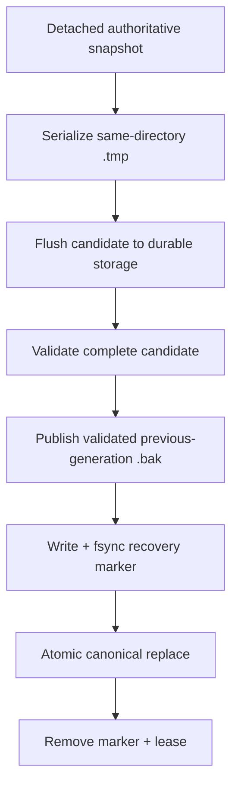
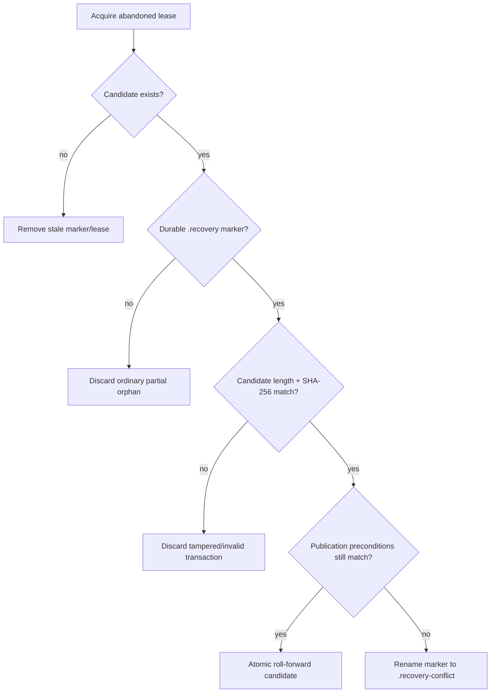

# Recovery прерванного save

[English](../en/interrupted-save-recovery.md) · [Документация](README.md) · [World persistence](world-persistence.md)

## Назначение

Atomic replacement защищает canonical `.wld` от partial publication, но процесс всё равно может погибнуть после того, как полный validated candidate и rollback backup уже durable, а финальный namespace replace ещё не выполнен. TerraRuntime теперь рассматривает такое состояние как recoverable transaction, а не просто удаляет candidate.

Механизм живёт внутри `AtomicSaveFileWriter`, поэтому host startup и следующий save используют одну и ту же lease-safe transaction model.

## Граница transaction

Для authoritative `.wld` save порядок такой:

Для first save предыдущего backup нет, поэтому recovery marker seal'ится после validation candidate и до первой canonical publication.

Ключевое правило: случайного orphan `.tmp` **недостаточно** для recovery. Roll-forward разрешается только когда существует durable recovery marker.

## Recovery marker

У recovery-ready managed temporary может быть sibling `.recovery` marker. Текущий формат хранит:

- `$8\,\mathrm{B}$` format magic и mode byte;
- byte length candidate и `$32\,\mathrm{B}$` SHA-256 digest;
- byte length и SHA-256 предыдущего `.bak`, если backup существует;
- normalized backup path, когда он нужен.

Marker bounded до `$64\,\mathrm{KiB}$`, пишется через durable file path, flush'ится через `Flush(flushToDisk: true)` и на Linux получает parent-directory `fsync` barrier до того, как сможет дать transaction право на recovery.

Для runtime `.wld` marker создаётся только после того, как `ValidateCandidateAsync` принял exact candidate. `RuntimeWorldTileChestSaveService` привязывает этот callback к полному supported `WorldFileLoader`, поэтому SHA-256 seal'ит bytes, уже прошедшие Terraria 1.4.5.8 structural/content validation. Для existing canonical marker создаётся только после copy, validation и publication предыдущей generation в `<world>.wld.bak`.

## Recovery при startup и следующем write

Сначала recovery пытается эксклюзивно получить abandoned `.tmp.lease`. Live writer продолжает держать lease с `FileShare.None`, поэтому его transaction не инспектируется и не удаляется.

First-save candidate может roll-forward только пока canonical target всё ещё отсутствует. Existing-save candidate может roll-forward только пока current canonical и `.bak` оба совпадают с fingerprint предыдущей generation, sealed в marker. Поэтому старый orphan не может затереть более новый successful save или externally replaced world.

Если preconditions уже не совпадают, TerraRuntime не гадает. Candidate и lease остаются на месте, marker quarantine'ится как `.recovery-conflict` для явной диагностики. Повторный cleanup остаётся fail-closed и никогда не overwrite'ит current canonical bytes.

## Crash windows

Поведение намеренно асимметрично:

- crash до durable recovery marker: authoritative остаётся старый canonical checkpoint; abandoned managed temporary позже удаляется;
- crash после durable recovery marker, но до canonical publication: exact sealed candidate может быть roll-forward;
- crash после canonical rename, но до cleanup marker/lease: canonical path уже содержит новую generation, startup удаляет stale sidecars;
- live lease: cleanup/recovery не трогает transaction;
- unknown legacy `.tmp` без TerraRuntime lease: остаётся untouched, потому что ownership доказать нельзя.

Так закрывается interrupted-publication gap без превращения любой времянки в recovery source.

## Единый recovery authority и writer exclusion

В runtime больше нет второго recovery path, который выбирает orphan по `LastWriteTimeUtc`. Executable startup вызывает ту же marker-aware границу `AtomicSaveFileWriter.RecoverAbandonedWrites`, что используется save cleanup. Поэтому unsealed managed `.tmp` является только cleanup input и не может стать canonical лишь потому, что его bytes случайно проходят parser.

Та же граница проверяется перед стартом нового atomic write. Если другой process всё ещё держит same-target lease, recovery I/O остаётся неопределённым или transaction уже quarantine'нут как `.recovery-conflict`, новый writer отказывает ещё до создания собственного temporary. Для canonical target остаётся один cross-process owner вместо гонки двух save transactions за publication.

## Стоимость и ownership

Recovery hashing и marker I/O выполняются внутри detached background save transaction, а не на authoritative game-loop thread. Сейчас implementation повторно sequentially читает sealed candidate и backup для SHA-256. Это принятый correctness-first I/O cost; оптимизировать его можно позже только по measurements и без ослабления гарантии, что marker аутентифицирует exact validated bytes.

## Verification

`AtomicSaveFileWriterCleanupTests` покрывает marker parsing, roll-forward, tamper rejection, conflict quarantine и isolation live lease. `AtomicSaveFileWriterConsolidatedRecoveryTests` дополнительно доказывает, что unsealed candidate никогда не публикуется, live same-target writer блокирует второй write, а quarantined conflict блокирует последующие writes. Dedicated workflow `Interrupted World Save Recovery` создаёт настоящий мир TerrariaServer 1.4.5.8, удерживает recovery-ready transaction под live lease, доказывает отказ startup, убивает writer настоящим `SIGKILL`, затем доказывает marker-authorized roll-forward при startup. Отдельно проверяются rejection unsealed orphan и conflict quarantine без изменения более нового canonical.

## Проверка сбоя после публикации

Выделенный recovery workflow также убивает writer после завершения атомарного rename canonical-файла, но до удаления recovery marker и lease. В этот момент managed `.tmp` уже поглощён rename-операцией, а `.tmp.recovery` и `.tmp.lease` ещё существуют. Следующий запуск host обязан оставить новые canonical bytes неизменными, удалить устаревшие sidecars и нормально продолжить запуск. Этот реальный post-publication SIGKILL закрывает последнее окно очистки после namespace publication вместе с уже существующей проверкой roll-forward до публикации.
