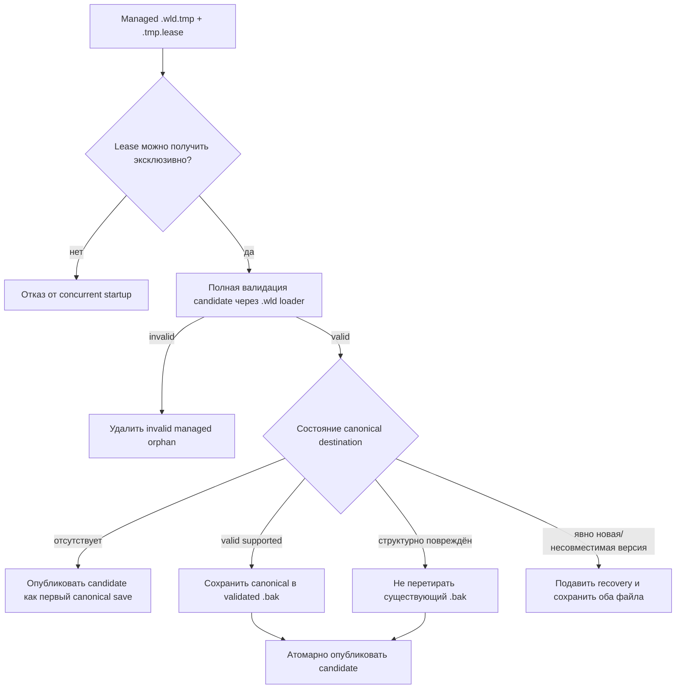

# Восстановление прерванного сохранения `.wld`

[Сохранение мира](world-persistence.md) · [Архитектура](architecture.md) · [Дорожная карта](../roadmap.md)

## Зачем это нужно

Атомарная публикация уже гарантирует, что убитый процесс не выставит частично записанный canonical `.wld`. Но остаётся второй случай: процесс может погибнуть после того, как полный кандидат уже записан в managed `.tmp` в том же каталоге, но до атомарного rename в canonical path. Если всякий abandoned temporary без разбора удалять как мусор, старый canonical останется цел, зато можно потерять самое новое полностью восстановимое поколение.

Поэтому TerraRuntime рассматривает managed orphan candidate не как мусор, а как недоверенный вход recovery-процедуры.

## Порядок startup

Исполняемый путь `--world` выполняет interrupted-save recovery до обычного host cleanup и до cache/stat/load canonical мира.

Candidate публикуется через тот же atomic rename и Linux parent-directory `fsync`, что и обычный save. При I/O error candidate и lease остаются на диске, чтобы recovery можно было повторить, а не превращать неопределённость в тихую потерю данных.

## Выбор candidate

Рассматриваются только корректно именованные managed transaction TerraRuntime. Candidate сортируются по `LastWriteTimeUtc` temporary-файла; сначала проверяется самый новый abandoned candidate. Если полная `.wld` validation его отвергает, этот orphan удаляется и recovery переходит к следующему более старому кандидату. Живой exclusive lease останавливает recovery, чтобы старый orphan не обогнал более новый active writer.

Legacy temporary без распознаваемого TerraRuntime lease в эту схему не входят: их ownership безопасно доказать нельзя.

## Политика canonical и backup

Если текущий canonical валиден и поддерживается, перед публикацией recovered candidate он сохраняется как предыдущее поколение. Backup тоже создаётся через temporary, проходит validation и публикуется атомарно.

Если canonical структурно повреждён, interrupted candidate может заменить его без ротации повреждённых байтов поверх уже известного хорошего `.bak`. Так сохраняются два независимых recovery-источника.

Явно неподдерживаемый формат мира не считается corruption. Например, canonical Terraria world с версией `327` не заменяется валидным orphan candidate для текущей поддерживаемой версии `326`. Startup завершается fail-closed, сохраняя и несовместимый canonical, и managed orphan для version-aware/manual обработки.

## Проверка реальным падением процесса

Отдельный workflow `Interrupted World Save Recovery` создаёт настоящий version-326 `.wld` через официальный TerrariaServer 1.4.5.8. Затем `TerraRuntime.AtomicSaveCrashProbe` начинает первый save, копирует полный официальный мир в temporary writer-а, держит lease и получает реальный `SIGKILL` до publication.

Proof требует, чтобы canonical path после `SIGKILL` оставался скрытым, managed orphan byte-for-byte совпадал с официальным source world, executable startup валидировал и публиковал его до cleanup, а явно более новая версия canonical подавляла recovery без изменения обоих файлов.

## Границы гарантии

Механизм восстанавливает полный managed `.wld` candidate, переживший process crash. Он не утверждает, что байты, которые ещё не были durably flushed, переживут внезапное отключение питания; это отдельная гарантия существующих file-content и directory-metadata durability barriers.

Preflight сейчас относится к composition path исполняемого `TerraRuntime.Server --world`. Низкоуровневый embedder, который напрямую вызывает `TerrariaServerHost.RunAsync`, должен вызвать тот же recovery boundary до host cleanup, если ему нужна идентичная interrupted-save семантика.
