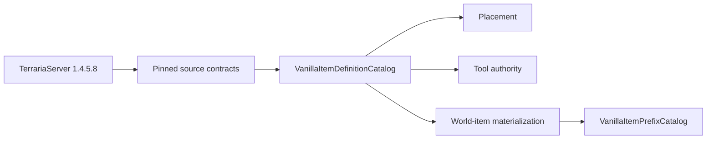

# Разреженный каталог определений vanilla items

TerraRuntime использует намеренно разреженный source-backed каталог item definitions. Отсутствующая metadata означает **ещё не проверено/не импортировано**, а не выдуманный vanilla-ноль или `false`.

## Владение данными

`VanillaItemIds` владеет content identity. `VanillaItemDefinitionCatalog` владеет неизменяемыми проверенными item-фактами. Runtime inventory/world-item stores владеют mutable stack, prefix, slot, generation и revision.

## Проверенные capabilities

| Item | Проверенные capability-факты |
|---|---|
| `DirtBlock` (`2`) | placement: `createTile = 0`, `consumable = true` |
| `CopperPickaxe` (`3509`) | pick tool: `pick = 35`, `tileBoost = -1` |
| `Gel` (`23`) | world drop: размер `10×12`, обычная gravity, без natural-prefix family |
| `SlimeStaff` (`1309`) | world drop: размер `26×28`, обычная gravity, summon natural-prefix family |

Optional records теперь такие:

- `VanillaItemPlacementDefinition`;
- `VanillaItemPickToolDefinition`;
- `VanillaItemWorldDropDefinition`.

Gameplay запрашивает их через `TryGetPlacement`, `TryGetPickTool` и `TryGetWorldDrop`. Отсутствующая capability завершается fail-closed.

## World-drop defaults

Pinned NPC-loot source contract доказывает, что Gel и Slime Staff не входят в `ItemID.Sets.ItemNoGravity`. Поэтому vanilla `Item.NewItem` использует

$$
v_x=0.1R_x,\quad R_x\in[-30,30],
$$

$$
v_y=0.1R_y,\quad R_y\in[-40,-16].
$$

`VanillaItemWorldDropDefinition` хранит размеры, gravity branch и проверенную natural-prefix family. Это не попытка скопировать целиком `Item.SetDefaults`.

## Prefix metadata

`VanillaItemPrefixCatalog` содержит только source-backed prefix-факты, которые уже нужны gameplay. Для первого среза это точная summon family из 22 prefix ID и закреплённый набор `ReducedNaturalChance`. Item-specific проверка Slime Staff отвергает natural prefixes `55`, `89` и `91`: после применения их damage multiplier `Math.Round` снова даёт исходные `8` damage, поэтому vanilla `Prefix(-1)` делает reroll.

Эти данные использует `VanillaNaturalItemPrefixRoller`; они остаются отдельно от mutable `PrefixId` конкретного inventory/world item.

## Проверка источником

Два постоянных official-source gate защищают этот разреженный каталог:

- `probe_tile_authority.py` проверяет placement/tool факты Dirt Block и Copper Pickaxe;
- `probe_npc_loot_spawn.py` проверяет размеры Gel/Slime Staff, gravity branch, summon family, ветки вероятностей natural prefix и item-specific prefix validity по pinned Windows TerrariaServer 1.4.5.8.

Runtime-тесты затем проверяют typed representation и fail-closed capability queries.

## Охват

Use timing, damage, ammo, healing, equipment behavior и остальные item-поля добавляются только тогда, когда authoritative gameplay действительно начинает их использовать и для них закреплено official-source evidence. Гигантская спекулятивная таблица просто превратила бы неизвестные значения в уверенно неправильные defaults, а подобной инженерной роскоши и без нас хватает.
