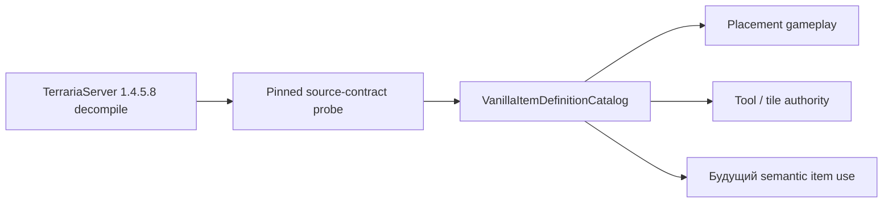

# Разреженный каталог определений vanilla items

В TerraRuntime появился начальный source-backed каталог item definitions для gameplay-фактов, которые уже проверяются по закреплённому TerrariaServer 1.4.5.8.

Каталог намеренно **разреженный**. Он не изображает полный `Item.SetDefaults`, заполняя неизвестные поля нулями, значениями из Wiki или догадками. Отсутствующая capability означает **ещё не проверено/не импортировано**, а не «vanilla-значение равно нулю/false».

## Владение данными

`VanillaItemIds` владеет item identity. `VanillaItemDefinitionCatalog` владеет неизменяемыми проверенными gameplay-фактами. Inventory state владеет stack/prefix/runtime slot state. Packet codecs в этот каталог не входят.

## Начальный проверенный срез

Repository source-contract probe сейчас фиксирует следующие факты из официального source:

| Item | Проверенные факты |
|---|---|
| `DirtBlock` (`ItemTypeId(2)`) | `createTile = 0`, `consumable = true` |
| `CopperPickaxe` (`ItemTypeId(3509)`) | `pick = 35`, `tileBoost = -1` |

Они представлены отдельными optional capability records:

- `VanillaItemPlacementDefinition`;
- `VanillaItemPickToolDefinition`.

Поэтому definition Dirt Block содержит `Placement`, но не содержит `PickTool`; Copper Pickaxe содержит `PickTool`, но не содержит `Placement`.

## Fail-closed семантика

Gameplay-код должен запрашивать capability через `TryGetPlacement`, `TryGetPickTool` и аналогичные API. Если конкретная capability отсутствует, вызов возвращает `false`.

Это важное различие. Например отсутствие `PickTool` не доказывает

\[
\mathrm{pickPower}=0.
\]

Оно доказывает только отсутствие source-backed pick-tool данных для этого item в TerraRuntime.

Аналогично отсутствие placement definition не означает, что предмет в vanilla гарантированно ничего не размещает.

## Существующая tile authority

`VanillaTileInteractionItemFacts` остаётся тонким compatibility facade, потому что production packet-17 authority уже использует этот API. Собственной таблицей он больше не владеет, все значения делегируются в `VanillaItemDefinitionCatalog`.

Так сохраняется текущее production-поведение, а будущие item-use, tool и placement механизмы получают один источник item definitions вместо очередной россыпи feature-local констант.

## Source verification

`tools/ci/probe_tile_authority.py` разбирает закреплённый decompile официального сервера и падает, если импортированные контракты изменились. Он независимо проверяет:

- `ItemID.DirtBlock == 2`;
- Dirt Block `consumable = true`;
- Dirt Block `createTile = 0`;
- `ItemID.CopperPickaxe == 3509`;
- Copper Pickaxe `pick = 35`;
- Copper Pickaxe `tileBoost = -1`.

`VanillaItemDefinitionCatalogTests` затем проверяет runtime representation и compatibility facade.

## Дальнейшее расширение

Поля вроде use timing, damage, use style, ammo, shoot type, healing, mana, accessory/equipment behavior и дополнительных placement/tool свойств добавляются только когда runtime реально начинает их использовать **и** соответствующие значения независимо подтверждены pinned official source.

Для продолжения D2 не нужна гигантская спекулятивная item table. Каталог расширяется вертикально вместе с реализованным gameplay.
