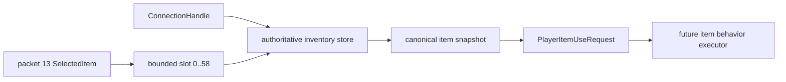

# Авторитетная граница item-use

[English](../en/item-use-boundary.md) · [Gameplay](gameplay.md) · [Roadmap декомпозиции gameplay](../roadmap/gameplay-decomposition-and-catalogs.md)

## Назначение

В TerraRuntime появилась protocol-neutral граница между состоянием выбранного предмета из packet 13 и будущей item gameplay. Она безопасно отвечает на один узкий вопрос:

> Какой именно канонический предмет сейчас выбран у этого точного connection generation?

Граница пока намеренно не выполняет поведение оружия, инструмента или placeable item. Version-pinned каталог уже предоставляет use style/timing и placement/tool facts для начального среза Dirt Block и Copper Pickaxe; damage, projectile spawning и broad item-family defaults остаются отдельной работой.

## Поток



Movement packet предоставляет только индекс выбранного inventory slot. Он **не** задаёт item identity, которой будет доверять gameplay. `RuntimePlayerItemUseBoundary` разрешает этот индекс через `RuntimePlayerInventoryStore`, уже привязанный к точному `ConnectionHandle` занятия переиспользуемого player slot.

## Semantic request

`PlayerItemUseRequest` содержит:

- точный `ConnectionHandle`, а вместе с ним generation-safe `PlayerHandle`;
- выбранный inventory slot;
- канонический `ItemTypeId`;
- авторитетный stack;
- канонический `PrefixId`;
- bounded item flags, уже сохранённые нормализованным inventory path.

Request отделён от изменяемого inventory storage. Будущий item executor сможет получить один явный semantic input вместо повторного чтения raw packet fields или доверия client-claimed item ID.

## Пространство выбора

Существующее evidence TerrariaServer 1.4.5.8 для `PlayerItemSlotID` закрепляет низкую inventory projection из 59 элементов:

\[
N_{inventory}=58+1=59,
\]

где slots `0..57` являются ordinary inventory, а slot `58` — mouse-item entry. Item-use boundary принимает ровно этот уже проверенный диапазон и отвергает `SelectedItem >= 59`.

Это правило выбора и identity, а не утверждение, что все слоты обладают одинаковой gameplay-семантикой.

## Generation safety

Владелец inventory проверяется целым `ConnectionHandle`, а не только байтовым player slot. Если player slot 0 освободился и позже был переиспользован, stale connection не сможет разрешить выбранный предмет нового игрока.

```text
old connection/player generation
        x
        └── cannot read
              new occupation of slot 0
```

Resolver также отвергает unassigned connection, пустой выбранный slot и любой non-canonical stored item вместо создания выдуманного item-use request.

## Результаты resolve

`PlayerItemUseResolveResult` различает:

- `Resolved`;
- invalid/unassigned connection;
- selected slot вне inventory span;
- inventory generation mismatch;
- empty selected item;
- non-canonical selected item.

Это результаты runtime/gameplay boundary, а не ошибки protocol decoder.

## Что остаётся

Этот срез создаёт semantic boundary D2, но намеренно не выдумывает отсутствующую vanilla item metadata. Semantic intents Dirt Block и Copper Pickaxe уже содержат source-backed use timing; следующим этапам всё ещё нужны broader definitions/defaults и behavior executors для melee/ranged weapons, tools, placeables, consumables и special-use items. Такие executors должны принимать `PlayerItemUseRequest`, а не возвращаться к packet offsets или raw item IDs.

## Проверка

Фокусные тесты закрепляют точное разрешение selected slot, поддержку mouse-item slot, out-of-range rejection, изоляцию stale connection generation, rejection empty slot и invalid connection. Inventory identity остаётся тем же каноническим `ItemTypeId`/`PrefixId` state, который уже используется packet-5 normalization и atomic inventory mutations.
