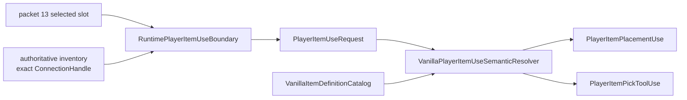
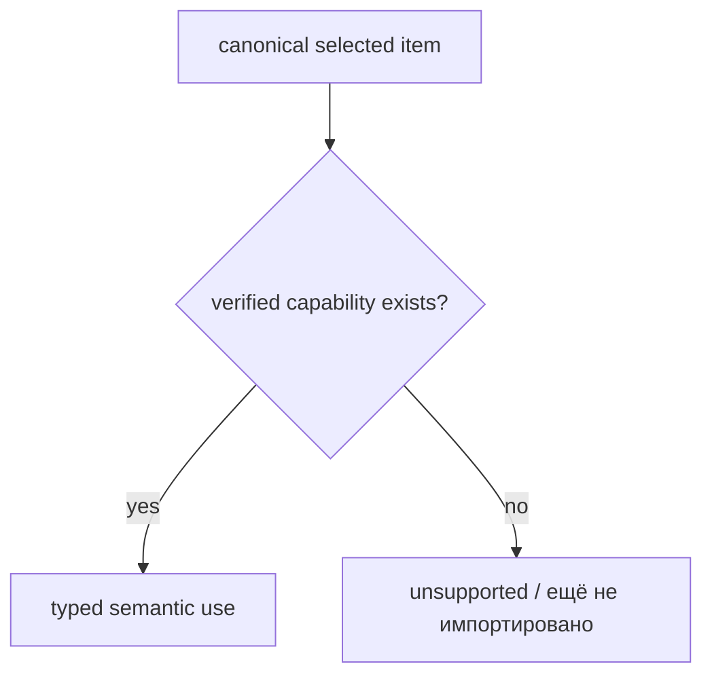

# Семантические возможности использования предметов

Граница выбранного предмета и source-backed каталог item definitions намеренно разделены:

1. `RuntimePlayerItemUseBoundary` отвечает на вопрос **какой именно inventory item выбрала именно эта generation игрока**;
2. `VanillaItemDefinitionCatalog` отвечает **какие gameplay capabilities TerraRuntime уже проверил для этого item type**;
3. `VanillaPlayerItemUseSemanticResolver` объединяет оба слоя в типизированные gameplay intents без повторного чтения packet state и без ветвления по raw item ids.

## Generation safety

Оба semantic intent сохраняют полный `PlayerItemUseRequest`, включая точную generation из `ConnectionHandle` / `PlayerHandle`. Поэтому повторное использование того же Terraria player slot не делает старый item-use intent принадлежащим новому игроку.

Базовое правило authoritative runtime остаётся тем же:

\[
\text{player identity} = (\text{slot},\ \text{generation})
\]

а не просто `slot`.

## Placement

`TryResolvePlacement` успешен только когда:

- detached `PlayerItemUseRequest` валиден;
- выбранный `ItemTypeId` имеет проверенный `VanillaItemPlacementDefinition`.

Для текущего source-backed среза Dirt Block преобразуется в:

- `TileTypeId = Dirt (0)`;
- `Consumable = true`.

Возвращаемый `PlayerItemPlacementUse` содержит эти факты и исходный snapshot игрока/предмета. Downstream placement gameplay больше не обязан сравнивать raw item ids.

Он также содержит verified `VanillaItemUseTimingDefinition`: swing style, animation $15\,\text{тиков}$, use time $10\,\text{тиков}$, auto-reuse и turn-during-use.

## Pick tools

`TryResolvePickTool` работает по той же схеме. Текущий Copper Pickaxe преобразуется в:

- `PickPower = 35`;
- `TileBoost = -1`.

Эти значения приходят из source-backed definition catalog, а не из packet data.

Intent Copper Pickaxe несёт его итоговые inherited/overridden defaults: swing style, animation $23\,\text{тика}$, use time $15\,\text{тиков}$, auto-reuse и turn-during-use.

## Fail-closed поведение

Canonical item может быть полностью валидным inventory state, но при этом ещё не иметь импортированного gameplay definition. В этом случае semantic resolver возвращает `false` для неподтверждённых capabilities.

Это принципиальное различие:

Resolver не выводит поведение из числового id, соседних definitions, формы stack или совпадений, похожих на `aiStyle`.

## Production placement consistency

`ClientTileManipulationConsistency` теперь читает placement-факты напрямую из `VanillaItemDefinitionCatalog`. Старый `VanillaTileInteractionItemFacts` остаётся только compatibility facade для gameplay-paths, которые ещё не мигрировали.

Так сохраняется существующая packet-17 consistency policy, но исчезает одна feature-local зависимость от отдельной item-definition таблицы.

## Проверка

`VanillaPlayerItemUseSemanticResolverTests` проверяет:

- Dirt Block разрешается только как текущая проверенная placement capability;
- Copper Pickaxe разрешается только как текущая проверенная pick-tool capability;
- непроверенные item types не наследуют семантику из numeric id;
- invalid item-use request отклоняется до capability lookup;
- две generations, занимавшие один player slot, остаются различными после semantic resolution.

Постоянный gameplay acceptance workflow выполняет эти `ItemUse` tests при соответствующих изменениях `main`.
