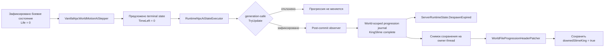

# Прогрессия после смерти King Slime

TerraRuntime завершает смерть King Slime внутри авторитетного NPC state pipeline, а не пытается угадать смерть босса по клиентскому пакету или позднему сканированию переиспользуемых слотов.

## Владение состоянием

Post-commit observer получает и снимок NPC до шага, и уже зафиксированную ревизию. Поэтому `downedSlimeKing` не публикуется, если переход был отвергнут из-за устаревшего поколения слота.

## Привязка к миру

`RuntimeWorldProgressionRegistry` использует конкретный объект `WorldTileStore` как слабый ключ. NPC simulation и persistence получают один и тот же экземпляр `RuntimeWorldProgressionMutations` без process-global переменной текущего мира. Слабая связь также не удерживает выгруженный мир в памяти.

Journal хранит семантические биты `VanillaWorldProgressionId`, а не физические offsets формата `.wld`. При сохранении значение journal отделяется на авторитетном owner thread до фоновой сериализации.

## Lossless persistence

`WorldFileProgressionHeaderPatcher` пока владеет одной мутацией persistence: `VanillaWorldProgressionId.KingSlime`. Он проверяет тот же identity/dimension prefix, что и clock patcher, проходит закреплённый fixed header Terraria 1.4.5.8 и меняет только boolean `downedSlimeKing`. Неизвестные mutation bits приводят к fail-closed ошибке, а не к тихой потере состояния.

Уже установленный persisted flag сохраняется. Прогрессия в этом срезе монотонна: journal может завершить milestone, но не очищает посторонние или ранее установленные `SaveWorldFlags`.

## Намеренная граница parity

Изменение закрывает для King Slime авторитетный путь **death lifecycle + сохранение progression**. Полная parity смерти King Slime этим не объявляется. NPC-specific loot, зависящие от difficulty drops, death-time minions/effects и оставшиеся source-ordered side effects остаются открытыми, пока их контракты TerrariaServer 1.4.5.8 не будут подтверждены и подключены через существующие death/loot transaction boundaries.
