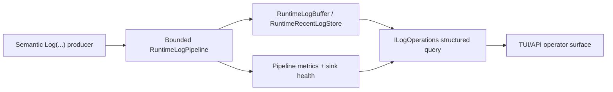

# Operator observability для logging

[English](../en/logging-operator-observability.md) · [Observability](observability-logging.md) · [Logging roadmap](../roadmap/runtime-logging-pipeline.md)

Эта страница описывает первый L4-срез operator observability поверх завершённого logging pipeline L0-L3.

## Единый граф состояния

Второй metrics queue или дублирующий log ring не создаётся. `RuntimeLogBuffer` остаётся retained-log sink и получает pipeline metrics/sink health через bounded snapshot providers, которые подключает `RuntimeHostLog`.

## Structured query

`RuntimeLogQuery` поддерживает deterministic exact filters по minimum level, subsystem/source, category, event ID и correlation ID. `MaxEntries` всегда задаётся явно и ограничен retained-store capacity.

Возвращаемый `RuntimeLogEntry` сохраняет компактные поля старого TUI projection и дополнительно отдаёт semantic event ID, category и correlation ID. Фильтрация выполняется по retained structured records до создания operations projection.

## Diagnostics snapshot

Каждый `RuntimeLogSnapshot` содержит `RuntimeLogDiagnosticsSnapshot`: accepted/filtered, per-level drops, drained count, current queue depth, queue high-water mark, sink failures, recent-store published/overwrite counters и bounded sink-health snapshots с quarantine state.

Для текущей глубины очереди \(N_q\) и high-water mark \(N_h\) выполняется

\[
0 \le N_q \le N_h \le C,
\]

где \(C\) — configured pipeline queue capacity.

Aggregate drop count:

\[
D_{total}=D_{trace}+D_{debug}+D_{info}+D_{warning}+D_{error}+D_{critical}.
\]

## Изоляция

Operator reads не выполняют console/disk I/O и не мутируют runtime state. Sink failures остаются изолированы внутри pipeline; operator snapshot только показывает counters и quarantine state.

## Оставшаяся работа L4

Interactive TUI filter controls, sustained flood/slow-sink benchmarks, NativeAOT logging smoke gates и rotation/disk-failure recovery tests остаются отдельными L4-срезами.
