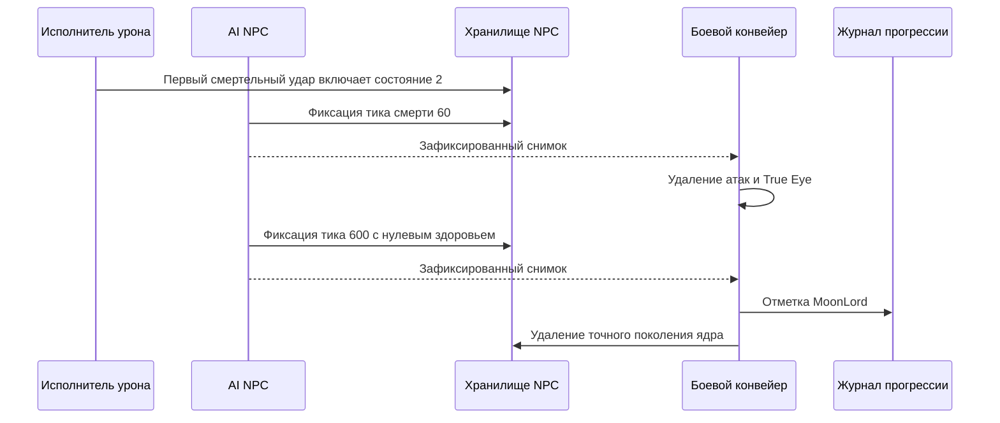

# Завершение смерти Лунного лорда

Уход (`ai[0] = 3`) продолжается без живых целей. При потере последнего игрока ядро выполняет последний шаг преследования, затем переходит к уходу с нулевым таймером. Скорость стремится к `(direction, -0.5)` с коэффициентом `0.98`. На $40\,\mathrm{ticks}$ глобально удаляются пять типов атак и все Истинные глаза; удаление снарядов повторяет `packet 27` и очищает серверный baseline без `packet 29`. На $60\,\mathrm{ticks}$ удаляются все руки, головы и Истинные глаза, затем уходящее ядро; сбрасывается `LunarApocalypseIsUp` и запрашивается существующая рассылка world-info. Победа и добыча не выдаются. Журнал сохраняет загруженное состояние события и передаёт явные булевы изменения существующему патчеру заголовка сохранения.

Проверки ухода включают 120 прямых вызовов оригинального AI для скорости, таймера, сущностей и события; двенадцать случаев последнего шага преследования; прохождение ухода через executor; защиту от старого поколения; повтор `packet 27` и очистку baseline для нового игрока; 32 оригинальных заголовка с переключением события в обе стороны. При сравнении заголовков выравниваются только временные метки в ожидаемой fixture, а в исходном заголовке должен измениться ровно один байт. Полное поведение событий и объявлений, оставшиеся вызовы общего RNG требуют дальнейшей проверки; эти тесты не доказывают полный паритет AI.

[English](../en/moon-lord-death-sequence.md) · [Семейства NPC](npc-behavior-families.md) · [Дорожная карта NPC](../roadmap/npc-ai-parity.md)

## Реализованная граница

Первый смертельный удар по ядру переводит его в `ai[0] = 2`, восстанавливает здоровье и включает неуязвимость на общей границе обработки урона. Затем авторитетный AI продвигает таймер смерти, даже если все игроки вышли или умерли. Движение при смерти использует подтверждённую интерполяцию к скорости $(0, -0.5)\,\mathrm{px/tick}$ с коэффициентом `0.98`.

`NpcAuthority` передаёт боевой конвейер исполнителю NPC как получателя уведомлений после фиксации состояния. Эффекты выполняются только после успешной фиксации точного поколения и ревизии NPC:

- На $60\,\mathrm{ticks}$ активные снаряды `456/462/455/452/454` удаляются через границу despawn/репликации снарядов, а все True Eye (`NPC 400`) деактивируются. Проверка намеренно охватывает весь мир по типам, как в официальном исходнике. Остальные снаряды и обычные NPC остаются активны.
- На $600\,\mathrm{ticks}$ здоровье ядра становится нулевым и вызывается существующая граница импортированного лута и прогрессии. Победа над Лунным лордом записывается в `RuntimeWorldProgressionMutations`, ядро удаляется и публикуется его терминальное состояние. Завершение таймера не создаёт искусственный удар `packet 28`.
- Голова, руки и True Eye, чей слот `ai[3]` больше не содержит ядро, удаляются через обычный жизненный цикл NPC. Они не присоединяются к другому активному ядру. Терминальные части не могут планировать новые снаряды.

Журнал использует существующий конвейер сохранения канонического `.wld`; новый формат файла или сохраняющаяся только в памяти отметка прогресса не добавляются. Буферы обхода сущностей ограничены настроенными таблицами NPC и снарядов. Устаревшие уведомления о поколении или ревизии не могут изменить замещающие сущности или прогресс.

## Дальняя телепортация

После преследования ядро с живой целью в состоянии `0/1` телепортируется только при расстоянии до центра цели строго больше $2400\,\mathrm{px}$. Оно переходит в состояние `-2`, сохраняя таймер, и перемещается на $150\,\mathrm{px}$ выше игрока. То же смещение применяется по порядку к каждому активному сохранённому слоту оболочки, затем ко всем активным True Eye в мире. Повторные ссылки на слот сохраняют повторные перемещения. Вступление может создать оболочку и телепортировать её в одном шаге; последующее физическое движение ядра не входит в смещение частей.

Подтверждённые эффекты получили необязательную фазу после спавна: после выделения частей и привязки слотов проверяются точные поколение и ревизия ядра. Обёртка физического движения передаёт эту фазу внутреннему AI. Авторитетное перемещение публикует `ForcedUpdate`, которое существующий реестр репликации кодирует в `packet 23` без задержки обычного интервала синхронизации движения; baseline и телеметрия используют подтверждённую позицию. Сетевые callbacks не изменяют состояние NPC.

Подтверждения включают 48 вызовов неизменённого оригинального серверного AI: точную границу расстояния, четыре направления, защищённое и открытое ядро, завершение вступления. Тесты сравнивают координаты ядра и соседей, AI, следующий RNG и координаты отправленных пакетов при действующем ограничении частоты обычной синхронизации. Два случая включают производственную обёртку физики; ещё один заменяет ядро при коммите. Отключение телепортации или принудительной синхронизации ломает по 26 тестов; снятие проверки поколения после выделения частей ломает тест подмены. Это не доказывает полный AI атак рук, головы и True Eye или паритет всего боя.

## Подтверждения и ограничения

Инициализация устанавливает `localAI[3]` и включает вступление, сохраняя входящий таймер, в том числе из состояний смерти и ухода. Вступление и возврат после телепортации сохраняют скорость и завершаются только при равенстве увеличенного таймера `60`. Преследование начинается в том же тике. Вступление создаёт три части даже при последующем переходе к уходу из-за потери цели; сохраняются точные выделенные слоты. Координаты спавна берутся из центра ядра до физического движения, с усечением дробной части до прибавления смещений. Новые части получают оригинальную неопределённую цель `255`.

Общий поток RNG для AI NPC теперь расходуется на оригинальное решение о звуке до инициализации, включая условный второй бросок, и на бросок при возврате после телепортации, результат которого оригинал сразу обнуляет. Fixture содержит 384 прямых вызова оригинального серверного AI с настоящим `NewNPC`, двумя seed RNG (включая звуковую ветку), дробными координатами, инициализированным и новым ядром, наличием и отсутствием игроков. Через executor совпадают состояние, скорость, слоты, позиции/AI/цели частей и следующий результат RNG; отдельный тест с физикой защищает порядок спавна. Возврат старой реализации ломает все 385 тестов. RNG визуальных эффектов смерти и полный паритет общего потока случайных чисел между подсистемами остаются открытыми.

Игроки на маунтах остаются среди авторитетных целей NPC, включая игроков под управлением сервера. Оригинальный `NPC.TargetClosest` проверяет активность, смерть и состояние призрака, но не тип маунта. Поэтому посадка на маунта не исключает живого игрока из проверки ухода ядра и из выбора целей обычных NPC. Геометрия хитбокса игрока для разных маунтов остаётся отдельной задачей паритета.

`LateHardmodeBossParityTests` проверяет движение при смерти, границу завершения таймера и отсутствие игроков; эти регрессионные сценарии падают на прежней реализации. `MoonLordDeathSequenceTests` проводит реальный исполнитель и конвейер после фиксации через весь таймер, проверяя очистку, прогресс, удаление осиротевших частей и повторное использование слота. Существующие тесты прогрессии мира покрывают сохраняемый формат отметки.

`tools/ci/check_moon_lord_death_source.py` независимо проверяет `NPC.AI_077_MoonLordCore`, `AI_078_MoonLordHands`, `AI_079_MoonLordHead`, AI style `82` и `AI_081_TrueEyeOfCthulhu` из TerrariaServer `1.4.5.8`, сверяя закреплённый SHA-256 исполняемого файла. Отдельный workflow повторяет проверку с ILSpy `11.0.0.9375`; исходники игры не попадают в систему контроля версий.

Закрыты ограниченные пробелы жизненного цикла и добычи при смерти. Остаются открытыми полное глобальное поведение событий и объявлений, отслеживание поколения владельца при повторном использовании слота ядра и более широкие дифференциальные сценарии с официальным сервером. Эффекты смерти только для отображения, включая снаряд `622`, находятся вне серверного авторитетного контракта. `FullVanillaAiParity` остаётся false.

## Преследование ядром

При преследовании защищённое и открытое ядро теперь повторяет `TargetClosest(false)` каждый тик AI. За пределами мёртвой зоны $20\,\mathrm{px}$ направление учитывает разность смещения и текущей скорости, исходное ускорение при развороте и смешивание пополам с прежней скоростью. Внутри зоны скорость сохраняется. `MoonLordCoreMotionTests` хранит независимо полученные хеши 2 000 вызовов неизменённого официального `AI_077_MoonLordCore` в открытом состоянии: проверяются точные биты скорости, цель и состояние AI с одним или двумя активными игроками. Удаление исправления движения ломает все пятнадцать целевых тестов; удаление обновления цели — все десять дифференциальных сценариев. При вырожденном нулевом направлении сохраняется конечная скорость сервера; оставшиеся состояния/RNG ядра требуют отдельной работы по паритету.

## Точные слоты оболочки

При успешном создании частей слоты двух рук и головы записываются в `localAI[0..2]` ядра через существующую границу создания после фиксации состояния с проверкой поколения. Для частей, которым не хватило места, сохраняется отрицательная отметка. Пока ядро защищено (`ai[0] = 0`), отсутствующий слот, неактивная часть или NPC другого типа напрямую удаляют ядро, даже без живого игрока. Добыча не выдаётся, победа не записывается. Подходящая часть того же владельца в другом слоте не заменяет первоначальную. Для открытия ядра все три сохранённые части должны перейти в состояние `-2`; исчезновение оболочки не удаляет уже открытое или умирающее ядро. Проверка исходника и тесты полного исполнителя покрывают эти границы, включая частичное создание при заполненной таблице NPC.

## Добыча при смерти и участие

После фиксации последнего тика смерти выполняется таблица Лунного лорда. В Classic выпадают Portal Gun, 70–90 люминита и два разных оружия из десяти вариантов версии `1.4.5.8`, включая Moon Lord Whip. Маска и вагонетка Meowmere сохраняют отдельные броски вероятности. Мешки Expert/Master доставляются активным участникам адресным `packet 90`; Master добавляет реликвию и отдельный бросок питомца для каждого участника. Бросок трофея предшествует таблице босса во всех режимах. Учитываются исходный порядок удачи, количества предметов, выбора оружия и промежуточной материализации предметов.

Принятые попадания по голове и рукам записывают участие на активное ядро в точном слоте `ai[3]`, как через входящий `packet 28`, так и через серверный урон. Некорректный слот владельца или слот другого типа не записывает участие на постороннее ядро. При первом смертельном ударе и до тика 600 добыча не выдаётся; устаревшие уведомления о завершении не дублируют её. Общие предметы используют существующий путь `packet 21`, мешки — существующее ограниченное резервирование слота.

Восемнадцать определений выпадающих предметов и естественные префиксы сверены с неизменённой официальной Linux-сборкой выделенного сервера, загруженной локальным .NET-пробником на Windows. Сохранённые тесты закрепляют префикс и следующее значение RNG для 100 начальных состояний на предмет (1 800 сравнений); это дифференциальная проверка сборки, а не запуск Linux NativeAOT. `VanillaMoonLordLootTests` покрывает все 90 упорядоченных пар разного оружия, чередование доставки с RNG и таблицы сложности. `MoonLordLootPipelineTests` проверяет реальные тики смерти, оба пути урона, адресацию участникам и устаревшие уведомления. При удалении вызова таблицы новые проверки конвейера падают.

Добавлены только определения добычи: открытие мешков, использование и размещение новых предметов, глобальные правила монет и сердец и полноценная работа оружия остаются отдельными задачами.

## Валун Moon Lord в Good World

Залп головы в Good World теперь использует явное runtime-семейство type 1021 с `aiStyle 25`. Каждый мировой тик выполняет два исходных подшага: валун задаёт `ai[0] = 1`, ограничивает входящую скорость падения 16, ускоряет качение при малой вертикальной скорости на `0.025`, затем добавляет гравитацию `0.06`. Остановившийся летящий вверх или горизонтально валун проверяет три исходные дистанции соседних твёрдых тайлов, прежде чем выбрать направление; при отсутствии препятствий используется чётность тайла центра. Столкновения сохраняют быстрый вертикальный отскок на 90 процентов, состояние мягкой посадки и четыре горизонтальных отскока перед уничтожением на пятом. `Collision.SwitchTiles` для нажимных переключателей и проводки остаётся вне авторитетной границы мутаций мира.

`VanillaProjectileWorldStateStepperTests` проверяет траекторию с двумя подшагами, локальный счётчик обновлений, выбор направления от соседнего твёрдого тайла и вертикальный отскок. Регрессия каталога профилей требует, чтобы type 1021 оставался в явном семействе rolling boulder.

## Такт атак и боевые кадры рук

`VanillaMoonLordHandBehavior` реализует два расписания рук по 600 тикам, движение фаз, наведение зрачка, ограничение координат перед внешним движением и создание снарядов Phantasmal Eye, Sphere и Bolt. Уничтоженная рука остаётся в `ai[0] = -2`, задаёт нулевой урон и неуязвимость, сбрасывает счётчик на 32 (либо из отрицательного входного значения) и продолжает двигаться к своей точке привязки к ядру. `NpcSimulationState.FrameCounter` хранит боевой счётчик кадров: входящий кадр 21 запрещает урон даже на тике начала открытия руки. Смена фазы немедленно отправляет пакет 23 через существующую границу фиксации с проверкой поколения.

`MoonLordHandTests` сравнивает 3664 независимых вызова оригинального `AI_078`: обе стороны, каждый обычный входящий такт от 0 до 599 и кадры 0/19/21, а также уничтоженную руку со значениями `-1/0/1/15/30/31/32/63` и кадрами 0/19/20/21. Проверяются точные координаты, скорости, AI/local, неуязвимость, кадр, цель, реально созданные снаряды и следующий результат RNG. SHA256 числовых наборов: `d3a5ecf7d781ab4b548372eaf621a3f606db9de347d1905cac0bed9607898fc1` (обычные) и `e3d85bf8fe4387551d40cb0b79c9a1d71977f1b2ff7aeefcd41c3768466d8e94` (уничтоженная рука). Неизменённая Linux-сборка оригинального сервера запускалась на Windows CoreCLR; это не подтверждение нативного Linux. Ещё три интеграционных случая проверяют фактическое отклонение урона и немедленную отправку пакета.

`IVanillaNpcRandom.NextDouble()` выдаёт значение единичного интервала. Production использует `Random.NextDouble` исходного потока; реализации только целочисленного интерфейса сохраняют адаптер по умолчанию, а для точного расходования потока по seed следует переопределить метод. Центры создания снарядов переводятся в координаты верхнего левого угла runtime перед отправкой намерения.

Сохранённая трасса руки на 2 400 тиков теперь охватывает все четыре состояния атаки в последовательных вызовах с тем же неподвижным ядром и игроком. Каждое состояние руки, активные снаряды и итоговый общий бросок RNG совпадают с независимой трассой оригинального сервера; SHA256 расширенной fixture: `01138e8d1c53167047314125733ad2df65e449200ba557bd90880eb69d9e1cb2`. Трасса исполняет только AI руки, поэтому взаимодействие прикреплённых взрывов, более широкие сочетания целей в мультиплеере, внешняя физика NPC и AI снарядов остаются отдельной работой по паритету.
## Сохранённая цель и выпуск сфер

Наведение руки продолжается по сохранённому слоту без живой цели; отсутствующий слот даёт центр нового Player `(10, 21)`. Выпуск сфер на локальном такте 292 следует `Player.FindClosest`: ближайший живой активный игрок, иначе первый активный слот, даже мёртвый, иначе слот ноль. Нормализация сохраняет умножение на обратную длину FNA перед масштабированием до скорости 12. Получение цели для болтов запрашивает пакет 23 даже при входящем состоянии атаки 3.

Ещё 80 вызовов оригинального AI покрывают неподвижную, движущуюся, мёртвую и отсутствующую цель; 48 вызовов — существующие сферы до, на и после такта выпуска обеими руками. Проверяются точное состояние и немедленные координаты/скорость пакета 27; уже выпущенные сферы и сферы другого владельца исключены. Два случая полного игрового тика проверяют движущихся сетевого и серверного игроков через существующий lookup скорости снимков. Production-путь скорости не потребовал изменений. Отрицательные контроли ломают восемь случаев отсутствующей цели, восемь случаев выпуска, случай пакета 23 с повторным состоянием и оба случая lookup скорости.

Хеши двух распакованных наборов: `6bd1013cf7860a9b035e01d8f61a533b1048fad989f42839f90e9769eced23e3` (цели) и `3e6440a9b0292eabeab9db6738f80b07dc8096ca63a2a85009609548cdc03aef` (выпуск). Это независимые проверки отдельных вызовов, а не полного боя или всех сочетаний целей в мультиплеере.
## Атаки головы и состояние века

`VanillaMoonLordHeadBehavior` заменяет общее движение точной привязкой головы: центр на 400 пикселей выше центра ядра, нулевая скорость перед выбором цели и созданием снарядов. Расписание атак на 1200 тиков обновляет зрачок, рот и веко. Входящий `localAI[3] >= 15` определяет запрет урона; новая голова начинает с нулевого local-состояния, а `ai[3]` хранит слот ядра. Переход уничтоженной головы из `-2` в `-3` сохраняет ранний выход оригинала, включая входящий запрет урона по веку.

Голова создаёт Deathray, Bolt и адресованные каждому игроку Moon Leech в исходные такты и координаты. В каталог добавлены геометрия Moon Leech 16×16 и стиль AI 85. Случайные углы перед Deathray расходуют общий RNG даже на выделенном сервере. Смена фазы, смена цели, получение цели болтов и запуск Deathray немедленно запрашивают пакет 23 через существующую границу зафиксированных эффектов.

`MoonLordHeadTests` проверяет 3600 вызовов оригинального AI по всем входящим тактам и состояниям века 0/13/15, ещё 36 случаев — уничтоженную голову. Сравниваются точные координаты, скорость, AI/local, запрет урона, цель, реально созданные снаряды, следующий RNG и немедленный пакет 23. Эталон использует проверенный размер головы 38×56 и сбрасывает предыдущие цель/направления, как внешний цикл NPC. Хеши распакованных наборов: `b53358c6945b688feaca399e9a24327e72e667acdf3e084d57c1137b33f3a770` и `55c486f5d618095e952f21e97b81ad31218d55f4563543c5ae6aa894986963ac`. Три интеграционных случая проверяют настоящий урон и создание головы ядром в слоте 20. Возврат старого AI ломает 3631 тест; отключение синхронизации и возврат конфликтующей метки владельца — 3511.

Дополнительный регрессионный тест сохраняет одну голову, local-состояние, общий поток случайных чисел и созданные снаряды в течение двух полных циклов атак ($2400\,\text{тиков}$). Каждый такт совпадает с независимой трассой оригинального сервера, включая точное состояние снарядов и последний случайный результат. SHA256 распакованного набора: `405a45608d1796c0b3e8be07d9d04433399dcd0ec102893967bbd12a57cd6062`. Трасса исполняет AI головы с неподвижными ядром и игроком; AI снарядов и внешняя физика NPC не исполняются.

Полный непрерывный бой, AI/бафф/лечащие сгустки Moon Leech, все сочетания целей мультиплеера и более широкие трассы True Eye остаются открытыми.

## Good World: залп валунов головы

AI_079 в финале Deathray теперь создаёт 30 валунов 1021 из точного центра головы 31x31 с уроном 70 и отбрасыванием 10. Запрос твёрдой клетки выполняется в каждой из 30 итераций; твёрдая клетка не расходует RNG. MoonLordHeadTests покрывает пустой и твёрдый тайл. Качение aiStyle-25, collision и SwitchTiles пока остаются открытыми.

## Исправление зависания, Bolt и сфер True Eye

В обычном окне зависания `AI_081` теперь каждый тик заново выбирает ближайшего живого игрока. Зрачок поворачивается к предсказанию его скорости на 20 тиков, открывается до `0.7`, а скорость на одну тридцатую приближается к точке на 200 пикселей выше игрока со скоростью 24. Затем он обходит физические слоты NPC и добавляет исходный покомпонентный импульс раздвижения для каждого близкого True Eye, включая глаза другого ядра. В окне Bolt скорость затухает, меняется масштаб зрачка, а Phantasmal Bolt создаётся из его круглого вектора зрачка `30×30` в исходные такты 76 и 83. Окно сфер проходит шесть исходных лучей, создаёт Phantasmal Sphere на каждой десятикратной границе, добавляет верхний импульс подготовки на такте 75 и затем выпускает только свои ещё не выпущенные сферы вектором скорости 12. Вращающееся окно сохраняет RNG поворота на такте 45, затухание каждые 40 тиков, рост скорости и создание Phantasmal Eye каждые 10 тиков из знакового вектора зрачка со смещением исходника `12√2`. Окно Deathray расходует броски телеграфа, сохраняет поворот зрачка и запускает `455` с исходным уроном, направлением и привязкой к слоту True Eye на такте 180. Уничтоженный True Eye сохраняет `ai[0] = -2` на ненулевых записях таблицы атак и возвращается в состояние `0` только в следующем окне зависания. Общий поток случайных чисел также потребляет начальный звуковой бросок AI_081 до проверки связи с ядром. `MoonLordFreeEyeTests` теперь сравнивает полный неподвижный цикл оригинального сервера на 1 200 тиков, включая состояние, активные снаряды и финальный бросок RNG; SHA-256 набора — `51adc7a88fc15afbcacb7194a1ee530c0cd96219143f412d05aa80a69d315074`. Более широкие трассы боя с движущимися целями и внешней физикой NPC/снарядов остаются открытыми.

## Moon Leech в разработке

Рабочая реализация включает движение AI 85, переход к возврату на обновлении 330 или при потере адресованного игрока, проверку головы, отметку контакта и уничтожение возле рта при возврате. Сохранённый набор из 160 случаев оригинального сервера проверяет точные AI/local-состояние, скорости и решение об уничтожении; задержка возврата на одно обновление ломает 14 случаев. SHA256 распакованного набора: `460000cef7d10aa92dcd7491e7baaee790c5a3b7ec358419b4dbd23f55fd148b`.

Первый контакт теперь предлагает наложить бафф 145 на точное поколение игрока, если GodMode не предотвращает эффект. Исполнитель снарядов применяет его через существующий обработчик фиксации только после успешного завершения всего обновления снаряда. Состояние сетевого игрока сохраняет длительность без серверного отсчёта; пакет 50 заменяет полученные длительности на 60 и удаляет отсутствующие баффы. Пакет 55 для Moon Leech не отправляется.

Ограниченное состояние баффов игрока хранит 44 слота и исходный порядок вытеснения заполненного массива: обычные баффы можно удалить, дебаффы сохраняются, а `Player.DelBuff` оставляет последний слот на месте при уплотнении предыдущих. Десять независимых случаев оригинального `AddBuff` проверяют вставку, обновление длительности, иммунитет и заполненный массив; все 401 идентификатора сверяются с исходной таблицей из 76 дебаффов. Хеши наборов: `5e994022f14fa030b0b0ab15ae19cfb96f1d63d2592897b1f6b207fb3c782ddb` и `29d6b2c7fd4bd9510f06692541595bec0a1f2afd5c69789e8a8f4b148f06727f`.

`ProjectileSimulationStepResult.PlayerBuff` — необязательное единственное наложение за локальное обновление. Композиция поведений сохраняет его через декораторы; более позднее ненулевое предложение заменяет предыдущее. Между обновлениями оно сбрасывается, проверяется вместе с предлагаемым состоянием и применяется к текущему поколению игрока после фиксации. Некорректное предварительное состояние не вызывает наложения. Этот механизм не моделирует эффекты, которым нужно повлиять на следующее extra update до окончательной фиксации.

Управляемые сервером игроки теперь уменьшают длительность Moon Leech один раз за такт мира, в том числе без физики движения. Обновление сохраняет большую длительность; смерть и удаление игрока очищают состояние его поколения. Существующая репликация пакета 50 объединяет Moon Leech с горением от лавы в порядке наложения, сохраняя другой эффект при завершении любого из них. Тесты исполняют настоящие такты мира и проверяют байты пакетов для обоих порядков, независимого завершения, смерти и повторного использования слота. Этот таймер отделён от длительности сетевого игрока, которой владеют снимки клиента; состояние зелий ботов и общее объединение баффов остаются открытыми.

Остальные правила иммунитета и экипировки, доказательства фиксации пакета 27 и полная приёмка ещё не завершены. Это не полный паритет Moon Leech или общей системы баффов.

## Представление ссылки лечащего сгустка

NPC 401 хранит `ProjectileKey` в `ai[1]`, переинтерпретируя его биты. Поэтому корректный ключ может представлять NaN или бесконечность. `NpcAiState.IsValidFor` и граница пакета 23 допускают такое непрозрачное поле только для NPC 401 и проверяют исходную границу индекса от 0 до 1000. Координаты, скорости, остальные поля AI и другие типы NPC по-прежнему требуют конечных чисел. Общий предикат `IsFinite` сохраняет прежний смысл.

Набор из 36 случаев оригинального представления `ProjectileKey` проверяет хранение состояния, композицию поведения и байты пакета 23, включая высокие поколения и оба граничных индекса. SHA256: `a92ff556dfa67d4534132a842ee7cc211de3f428b8f45b7b4a2197b4547bb3dc`. Исходная проверка наличия `ai[1] != 0` опускает в пакете ключ с отрицательным нолём `(отправитель 0, индекс 0, поколение 8192)`; тест сохраняет это поведение оригинала и не утверждает, что любой ключ переживает передачу. NPC 401 теперь разрешает ссылку через существующий реестр точных сетевых ключей и выполняет исходные движение и переход лечения. Создание сгустков головой ещё не завершено.

Нативный путь `--protocol-smoke` также проверяет хранение NPC и сериализацию пакета 23 со ссылками, представленными конечными числами, NaN, бесконечностью и отрицательным нолём. Сетевое поколение снаряда теперь сохраняет младшие 14 бит назначенного поколения среды исполнения, включая ноль. Двенадцать настоящих вызовов NewProjectileSetup оригинала охватывают отправителей 0, 1 и 255 около двух переходов через ноль (SHA256 набора: 7e5ce31590f4a1950c28c3e5bfc0f3c15b9f419c7b0fb8f0e099959dc4c7c885). Пакет 27 принимает и сохраняет эти ключи; внутренние дескрипторы по-прежнему требуют назначенного ненулевого широкого поколения. Нативная проверка протокола охватывает и этот переход. Особая обработка полностью нулевого ключа оригиналом при промахе входящего поиска, а также поиск ключей неактивных снарядов остаются отдельными пробелами паритета входящих пакетов.

## Отображение числового лечения

Кодек числового боевого текста теперь формирует пакет 81, который оригинальный выделенный сервер использует для `NPC.HealEffect`: две координаты одинарной точности, RGB и знаковое 32-битное количество. Шесть пакетов, захваченных вызовом оригинального метода, проверяют точные байты, включая нечётные размеры прямоугольника и отрицательные координаты (SHA256 набора: `00ca7b0b22ae766f6c58a6d160957dc00392a4177a7f78958837f216a9cad7cc`). Центр прямоугольника использует целочисленные половины размеров. Кодек подключён к подтверждённому лечению NPC 401. Восстановленное здоровье обновляет сохранённый снимок для входящего клиента; числа лечения отправляются перед пакетом удаления сгустка.
## Симуляция лечащего сгустка

Исходные параметры NPC 401: размер $30\times30\,\text{пикселей}$, $400\,\text{здоровья}$, отсутствие гравитации и столкновений с тайлами, скрытое отображение. AI82 интерполирует центр от активного языка Moon Leech к рту головы за $90\,\text{обновлений}$. При завершении он распределяет бюджет $1000\,\text{здоровья}$ в порядке: голова, ядро, левая рука, правая рука, затем деактивируется. Недействительная голова вызывает деактивацию до увеличения возраста; отсутствующая ссылка на снаряд сохраняет координаты и обнуляет скорость.

Исполнитель подтверждает конечное состояние без промежуточного уведомления об обновлении, применяет лечение с проверкой поколения и публикует удаление до перехода к следующему слоту NPC. Обёртка движения мира передаёт решение об удалении и сохраняет интегрирование последней скорости оригинала. Повторное создание сущности в том же слоте после подтверждения не получает эффекты или удаление старого поколения. Обычные обновления хранилища сохраняют существующие правила публикации.

Набор из 80 случаев оригинального AI82 (SHA256 `d782fd9d563a84cebd66c993ccf3b311ead62a56ecd9745f8e5e8b1cde4bb713`) проверяет движение, возраст, распределение лечения и деактивацию. Каждый случай также проходит через движение мира с независимо проверенным правилом внешнего `NPC.UpdateNPC`. Тесты проверяют количество лечения в пакетах 81 и их порядок перед пакетом удаления 23. Нативная проверка протокола выполняет лечение через обёртку движения мира. Полное поведение сгустка в бою и при выпадении предметов, а также полный иммунитет остаются открытыми; это не полный паритет Moon Lord.

## Создание лечащих сгустков головой

Голова теперь создаёт NPC 401 на обновлениях 120, 180 и 240 второй фазы. После подтверждения обновления головы она обходит все 1000 физических слотов снарядов по возрастанию. Каждый активный Moon Leech, у адресованного игрока которого сохранён бафф 145, передаёт свой исходный сетевой ключ; возвращающиеся языки и языки других голов также подходят. Центр цели головы служит нижней координатой появления сгустка. Создание использует доступную ёмкость: заполнение таблицы NPC не отменяет предыдущие сгустки и не отклоняет обновление головы. Дочерние NPC в старших слотах обновляются в том же проходе.

`IVanillaNpcProjectileAnchorLookup.TryGetHealingAnchor` предоставляет эту проверку без изменения состояния. Адаптер приложения читает реальные слоты снарядов, обратное соответствие сетевых ключей и снимки баффов ожидающих или активных игроков; отключение очищает снимок. Старый снаряд сохраняет собственный ключ для создания сгустка, даже если прямой поиск разрешает только новое поколение. Общий иммунитет от экипировки пока не представлен в состоянии адаптера.

Сорок случаев оригинального AI головы (SHA256 набора `0efd2e88193845b4a8d931eba93c2688a66eb326935b6874c5d4a73a6e7532e1`) проверяют создание при заданных результатах запросов снарядов и баффов. Отдельные тесты приложения используют настоящее состояние пакета 50, перекрытие ключей и исчерпание ёмкости. Связанный прогон оригинала на $400\,\text{обновлений}$ точно сравнивает состояния головы, языка, баффа, сгустка и лечения (SHA256 распакованного набора `94c6de51c11f96a7971d20ea220162990dd5f5d9763ba3a84a29bbafe74c0de7`). Игрок неподвижен, AI ядра и рук заморожен, отсчёт баффа удалённого игрока отсутствует; это не сравнение полного боя или всего `Main.Update`. Сдвиг первого момента создания ломает регрессионный тест. Нативная проверка протокола также создаёт сгусток через настоящий адаптер приложения. Защита слотов NPC от повторного появления теперь следует исходному жизненному циклу тиков мира; полный график сетевых обновлений остаётся открытым.
