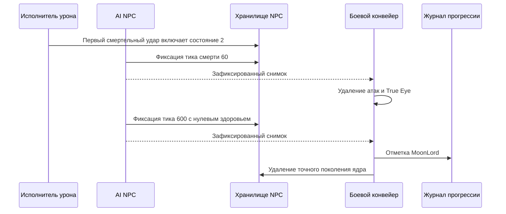

# Завершение смерти Лунного лорда

Уход (`ai[0] = 3`) продолжается без живых целей. При потере последнего игрока ядро выполняет последний шаг преследования, затем переходит к уходу с нулевым таймером. Скорость стремится к `(direction, -0.5)` с коэффициентом `0.98`. На $40\,\mathrm{ticks}$ глобально удаляются пять типов атак и все Истинные глаза; удаление снарядов повторяет `packet 27` и очищает серверный baseline без `packet 29`. На $60\,\mathrm{ticks}$ удаляются все руки, головы и Истинные глаза, затем уходящее ядро; сбрасывается `LunarApocalypseIsUp` и запрашивается существующая рассылка world-info. Победа и добыча не выдаются. Журнал сохраняет загруженное состояние события и передаёт явные булевы изменения существующему патчеру заголовка сохранения.

Проверки ухода включают 120 прямых вызовов оригинального AI для скорости, таймера, сущностей и события; двенадцать случаев последнего шага преследования; прохождение ухода через executor; защиту от старого поколения; повтор `packet 27` и очистку baseline для нового игрока; 32 оригинальных заголовка с переключением события в обе стороны. При сравнении заголовков выравниваются только временные метки в ожидаемой fixture, а в исходном заголовке должен измениться ровно один байт. Полное поведение событий и объявлений, оставшиеся вызовы общего RNG требуют дальнейшей проверки; эти тесты не доказывают полный паритет AI.

[English](../en/moon-lord-death-sequence.md) · [Семейства NPC](npc-behavior-families.md) · [Дорожная карта NPC](../roadmap/npc-ai-parity.md)

## Реализованная граница

Первый смертельный удар по ядру переводит его в `ai[0] = 2`, восстанавливает здоровье и включает неуязвимость на общей границе обработки урона. Затем авторитетный AI продвигает таймер смерти, даже если все игроки вышли или умерли. Движение при смерти использует подтверждённую интерполяцию к скорости $(0, -0.5)\,\mathrm{px/tick}$ с коэффициентом `0.98`.

`NpcAuthority` передаёт боевой конвейер исполнителю NPC как получателя уведомлений после фиксации состояния. Эффекты выполняются только после успешной фиксации точного поколения и ревизии NPC:

- На $60\,\mathrm{ticks}$ активные снаряды `456/462/455/452/454` удаляются через границу despawn/репликации снарядов, а все True Eye (`NPC 400`) деактивируются. Проверка намеренно охватывает весь мир по типам, как в официальном исходнике. Остальные снаряды и обычные NPC остаются активны.
- На $600\,\mathrm{ticks}$ здоровье ядра становится нулевым и вызывается существующая граница импортированного лута и прогрессии. Победа над Лунным лордом записывается в `RuntimeWorldProgressionMutations`, ядро удаляется и публикуется его терминальное состояние. Завершение таймера не создаёт искусственный удар `packet 28`.
- Голова, руки и True Eye, чей слот `ai[3]` больше не содержит ядро, удаляются через обычный жизненный цикл NPC. Они не присоединяются к другому активному ядру. Терминальные части не могут планировать новые снаряды.

Журнал использует существующий конвейер сохранения канонического `.wld`; новый формат файла или сохраняющаяся только в памяти отметка прогресса не добавляются. Буферы обхода сущностей ограничены настроенными таблицами NPC и снарядов. Устаревшие уведомления о поколении или ревизии не могут изменить замещающие сущности или прогресс.

## Дальняя телепортация

После преследования ядро с живой целью в состоянии `0/1` телепортируется только при расстоянии до центра цели строго больше $2400\,\mathrm{px}$. Оно переходит в состояние `-2`, сохраняя таймер, и перемещается на $150\,\mathrm{px}$ выше игрока. То же смещение применяется по порядку к каждому активному сохранённому слоту оболочки, затем ко всем активным True Eye в мире. Повторные ссылки на слот сохраняют повторные перемещения. Вступление может создать оболочку и телепортировать её в одном шаге; последующее физическое движение ядра не входит в смещение частей.

Подтверждённые эффекты получили необязательную фазу после спавна: после выделения частей и привязки слотов проверяются точные поколение и ревизия ядра. Обёртка физического движения передаёт эту фазу внутреннему AI. Авторитетное перемещение публикует `ForcedUpdate`, которое существующий реестр репликации кодирует в `packet 23` без задержки обычного интервала синхронизации движения; baseline и телеметрия используют подтверждённую позицию. Сетевые callbacks не изменяют состояние NPC.

Подтверждения включают 48 вызовов неизменённого оригинального серверного AI: точную границу расстояния, четыре направления, защищённое и открытое ядро, завершение вступления. Тесты сравнивают координаты ядра и соседей, AI, следующий RNG и координаты отправленных пакетов при действующем ограничении частоты обычной синхронизации. Два случая включают производственную обёртку физики; ещё один заменяет ядро при коммите. Отключение телепортации или принудительной синхронизации ломает по 26 тестов; снятие проверки поколения после выделения частей ломает тест подмены. Это не доказывает полный AI атак рук, головы и True Eye или паритет всего боя.

## Подтверждения и ограничения

Инициализация устанавливает `localAI[3]` и включает вступление, сохраняя входящий таймер, в том числе из состояний смерти и ухода. Вступление и возврат после телепортации сохраняют скорость и завершаются только при равенстве увеличенного таймера `60`. Преследование начинается в том же тике. Вступление создаёт три части даже при последующем переходе к уходу из-за потери цели; сохраняются точные выделенные слоты. Координаты спавна берутся из центра ядра до физического движения, с усечением дробной части до прибавления смещений. Новые части получают оригинальную неопределённую цель `255`.

Общий поток RNG для AI NPC теперь расходуется на оригинальное решение о звуке до инициализации, включая условный второй бросок, и на бросок при возврате после телепортации, результат которого оригинал сразу обнуляет. Fixture содержит 384 прямых вызова оригинального серверного AI с настоящим `NewNPC`, двумя seed RNG (включая звуковую ветку), дробными координатами, инициализированным и новым ядром, наличием и отсутствием игроков. Через executor совпадают состояние, скорость, слоты, позиции/AI/цели частей и следующий результат RNG; отдельный тест с физикой защищает порядок спавна. Возврат старой реализации ломает все 385 тестов. RNG визуальных эффектов смерти и полный паритет общего потока случайных чисел между подсистемами остаются открытыми.

Игроки на маунтах остаются среди авторитетных целей NPC, включая игроков под управлением сервера. Оригинальный `NPC.TargetClosest` проверяет активность, смерть и состояние призрака, но не тип маунта. Поэтому посадка на маунта не исключает живого игрока из проверки ухода ядра и из выбора целей обычных NPC. Геометрия хитбокса игрока для разных маунтов остаётся отдельной задачей паритета.

`LateHardmodeBossParityTests` проверяет движение при смерти, границу завершения таймера и отсутствие игроков; эти регрессионные сценарии падают на прежней реализации. `MoonLordDeathSequenceTests` проводит реальный исполнитель и конвейер после фиксации через весь таймер, проверяя очистку, прогресс, удаление осиротевших частей и повторное использование слота. Существующие тесты прогрессии мира покрывают сохраняемый формат отметки.

`tools/ci/check_moon_lord_death_source.py` независимо проверяет `NPC.AI_077_MoonLordCore`, `AI_078_MoonLordHands`, `AI_079_MoonLordHead` и `AI_081_TrueEyeOfCthulhu` из TerrariaServer `1.4.5.8`, сверяя закреплённый SHA-256 исполняемого файла. Отдельный workflow повторяет проверку с ILSpy `11.0.0.9375`; исходники игры не попадают в систему контроля версий.

Закрыты ограниченные пробелы жизненного цикла и добычи при смерти. Остаются открытыми полное глобальное поведение событий и объявлений, отслеживание поколения владельца при повторном использовании слота ядра и более широкие дифференциальные сценарии с официальным сервером. Эффекты смерти только для отображения, включая снаряд `622`, находятся вне серверного авторитетного контракта. `FullVanillaAiParity` остаётся false.

## Преследование ядром

При преследовании защищённое и открытое ядро теперь повторяет `TargetClosest(false)` каждый тик AI. За пределами мёртвой зоны $20\,\mathrm{px}$ направление учитывает разность смещения и текущей скорости, исходное ускорение при развороте и смешивание пополам с прежней скоростью. Внутри зоны скорость сохраняется. `MoonLordCoreMotionTests` хранит независимо полученные хеши 2 000 вызовов неизменённого официального `AI_077_MoonLordCore` в открытом состоянии: проверяются точные биты скорости, цель и состояние AI с одним или двумя активными игроками. Удаление исправления движения ломает все пятнадцать целевых тестов; удаление обновления цели — все десять дифференциальных сценариев. При вырожденном нулевом направлении сохраняется конечная скорость сервера; оставшиеся состояния/RNG ядра требуют отдельной работы по паритету.

## Точные слоты оболочки

При успешном создании частей слоты двух рук и головы записываются в `localAI[0..2]` ядра через существующую границу создания после фиксации состояния с проверкой поколения. Для частей, которым не хватило места, сохраняется отрицательная отметка. Пока ядро защищено (`ai[0] = 0`), отсутствующий слот, неактивная часть или NPC другого типа напрямую удаляют ядро, даже без живого игрока. Добыча не выдаётся, победа не записывается. Подходящая часть того же владельца в другом слоте не заменяет первоначальную. Для открытия ядра все три сохранённые части должны перейти в состояние `-2`; исчезновение оболочки не удаляет уже открытое или умирающее ядро. Проверка исходника и тесты полного исполнителя покрывают эти границы, включая частичное создание при заполненной таблице NPC.

## Добыча при смерти и участие

После фиксации последнего тика смерти выполняется таблица Лунного лорда. В Classic выпадают Portal Gun, 70–90 люминита и два разных оружия из десяти вариантов версии `1.4.5.8`, включая Moon Lord Whip. Маска и вагонетка Meowmere сохраняют отдельные броски вероятности. Мешки Expert/Master доставляются активным участникам адресным `packet 90`; Master добавляет реликвию и отдельный бросок питомца для каждого участника. Бросок трофея предшествует таблице босса во всех режимах. Учитываются исходный порядок удачи, количества предметов, выбора оружия и промежуточной материализации предметов.

Принятые попадания по голове и рукам записывают участие на активное ядро в точном слоте `ai[3]`, как через входящий `packet 28`, так и через серверный урон. Некорректный слот владельца или слот другого типа не записывает участие на постороннее ядро. При первом смертельном ударе и до тика 600 добыча не выдаётся; устаревшие уведомления о завершении не дублируют её. Общие предметы используют существующий путь `packet 21`, мешки — существующее ограниченное резервирование слота.

Восемнадцать определений выпадающих предметов и естественные префиксы сверены с неизменённой официальной Linux-сборкой выделенного сервера, загруженной локальным .NET-пробником на Windows. Сохранённые тесты закрепляют префикс и следующее значение RNG для 100 начальных состояний на предмет (1 800 сравнений); это дифференциальная проверка сборки, а не запуск Linux NativeAOT. `VanillaMoonLordLootTests` покрывает все 90 упорядоченных пар разного оружия, чередование доставки с RNG и таблицы сложности. `MoonLordLootPipelineTests` проверяет реальные тики смерти, оба пути урона, адресацию участникам и устаревшие уведомления. При удалении вызова таблицы новые проверки конвейера падают.

Добавлены только определения добычи: открытие мешков, использование и размещение новых предметов, глобальные правила монет и сердец и полноценная работа оружия остаются отдельными задачами.

## Такт атак и боевые кадры рук

`VanillaMoonLordHandBehavior` реализует два расписания рук по 600 тикам, движение фаз, наведение зрачка, ограничение координат перед внешним движением и создание снарядов Phantasmal Eye, Sphere и Bolt. `NpcSimulationState.FrameCounter` хранит боевой счётчик кадров: входящий кадр 21 запрещает урон даже на тике начала открытия руки. Смена фазы немедленно отправляет пакет 23 через существующую границу фиксации с проверкой поколения.

`MoonLordHandTests` сравнивает 3600 независимых вызовов оригинального `AI_078`: обе стороны, каждый входящий такт от 0 до 599 и кадры 0/19/21. Проверяются точные координаты, скорости, AI/local, неуязвимость, кадр, цель, реально созданные снаряды и следующий результат RNG. SHA256 распакованных числовых данных: `d3a5ecf7d781ab4b548372eaf621a3f606db9de347d1905cac0bed9607898fc1`. Неизменённая Linux-сборка оригинального сервера запускалась на Windows CoreCLR; это не подтверждение нативного Linux. Ещё три интеграционных случая проверяют фактическое отклонение урона и немедленную отправку пакета. Отключение стратегии рук ломает 3601 проверку.

`IVanillaNpcRandom.NextDouble()` выдаёт значение единичного интервала. Production использует `Random.NextDouble` исходного потока; реализации только целочисленного интерфейса сохраняют адаптер по умолчанию, а для точного расходования потока по seed следует переопределить метод. Центры создания снарядов переводятся в координаты верхнего левого угла runtime перед отправкой намерения.

Подтверждены отдельные синтетические вызовы AI с одной неподвижной целью. Полный непрерывный бой, движущиеся или отсутствующие цели, сравнение уничтоженных рук, взаимодействие с прикреплённой взрывчаткой, синхронизация выпуска сфер, точность атак головы и True Eye остаются отдельной работой по паритету.
## Сохранённая цель и выпуск сфер

Наведение руки продолжается по сохранённому слоту без живой цели; отсутствующий слот даёт центр нового Player `(10, 21)`. Выпуск сфер на локальном такте 292 следует `Player.FindClosest`: ближайший живой активный игрок, иначе первый активный слот, даже мёртвый, иначе слот ноль. Нормализация сохраняет умножение на обратную длину FNA перед масштабированием до скорости 12. Получение цели для болтов запрашивает пакет 23 даже при входящем состоянии атаки 3.

Ещё 80 вызовов оригинального AI покрывают неподвижную, движущуюся, мёртвую и отсутствующую цель; 48 вызовов — существующие сферы до, на и после такта выпуска обеими руками. Проверяются точное состояние и немедленные координаты/скорость пакета 27; уже выпущенные сферы и сферы другого владельца исключены. Два случая полного игрового тика проверяют движущихся сетевого и серверного игроков через существующий lookup скорости снимков. Production-путь скорости не потребовал изменений. Отрицательные контроли ломают восемь случаев отсутствующей цели, восемь случаев выпуска, случай пакета 23 с повторным состоянием и оба случая lookup скорости.

Хеши двух распакованных наборов: `6bd1013cf7860a9b035e01d8f61a533b1048fad989f42839f90e9769eced23e3` (цели) и `3e6440a9b0292eabeab9db6738f80b07dc8096ca63a2a85009609548cdc03aef` (выпуск). Это независимые проверки отдельных вызовов, а не полного боя или всех сочетаний целей в мультиплеере.