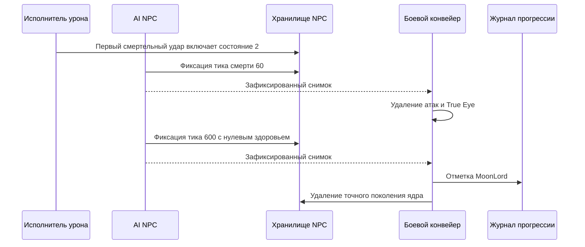

# Завершение смерти Лунного лорда

[English](../en/moon-lord-death-sequence.md) · [Семейства NPC](npc-behavior-families.md) · [Дорожная карта NPC](../roadmap/npc-ai-parity.md)

## Реализованная граница

Первый смертельный удар по ядру переводит его в `ai[0] = 2`, восстанавливает здоровье и включает неуязвимость на общей границе обработки урона. Затем авторитетный AI продвигает таймер смерти, даже если все игроки вышли или умерли. Движение при смерти использует подтверждённую интерполяцию к скорости $(0, -0.5)\,\mathrm{px/tick}$ с коэффициентом `0.98`.

`NpcAuthority` передаёт боевой конвейер исполнителю NPC как получателя уведомлений после фиксации состояния. Эффекты выполняются только после успешной фиксации точного поколения и ревизии NPC:

- На $60\,\mathrm{ticks}$ активные снаряды `456/462/455/452/454` удаляются через границу despawn/репликации снарядов, а все True Eye (`NPC 400`) деактивируются. Проверка намеренно охватывает весь мир по типам, как в официальном исходнике. Остальные снаряды и обычные NPC остаются активны.
- На $600\,\mathrm{ticks}$ здоровье ядра становится нулевым и вызывается существующая граница импортированного лута и прогрессии. Победа над Лунным лордом записывается в `RuntimeWorldProgressionMutations`, ядро удаляется и публикуется его терминальное состояние. Завершение таймера не создаёт искусственный удар `packet 28`.
- Голова, руки и True Eye, чей слот `ai[3]` больше не содержит ядро, удаляются через обычный жизненный цикл NPC. Они не присоединяются к другому активному ядру. Терминальные части не могут планировать новые снаряды.

Журнал использует существующий конвейер сохранения канонического `.wld`; новый формат файла или сохраняющаяся только в памяти отметка прогресса не добавляются. Буферы обхода сущностей ограничены настроенными таблицами NPC и снарядов. Устаревшие уведомления о поколении или ревизии не могут изменить замещающие сущности или прогресс.

## Подтверждения и ограничения

`LateHardmodeBossParityTests` проверяет движение при смерти, границу завершения таймера и отсутствие игроков; эти регрессионные сценарии падают на прежней реализации. `MoonLordDeathSequenceTests` проводит реальный исполнитель и конвейер после фиксации через весь таймер, проверяя очистку, прогресс, удаление осиротевших частей и повторное использование слота. Существующие тесты прогрессии мира покрывают сохраняемый формат отметки.

`tools/ci/check_moon_lord_death_source.py` независимо проверяет `NPC.AI_077_MoonLordCore`, `AI_078_MoonLordHands`, `AI_079_MoonLordHead` и `AI_081_TrueEyeOfCthulhu` из TerrariaServer `1.4.5.8`, сверяя закреплённый SHA-256 исполняемого файла. Отдельный workflow повторяет проверку с ILSpy `11.0.0.9375`; исходники игры не попадают в систему контроля версий.

Закрыт ограниченный пробел жизненного цикла, а не весь паритет Лунного лорда. Остаются открытыми специальные таблицы лута, полное глобальное поведение событий и объявлений, самоуничтожение ядра при потере слотов оболочки, отслеживание поколения владельца при повторном использовании слота ядра и более широкие дифференциальные сценарии с официальным сервером. Эффекты смерти только для отображения, включая снаряд `622`, находятся вне серверного авторитетного контракта. `FullVanillaAiParity` остаётся false.
