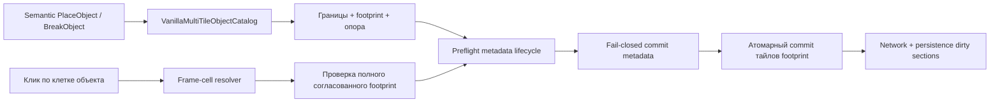

# Авторитетные мутации многотайловых объектов

TerraRuntime управляет мутациями многотайловых объектов мира отдельно от декодирования пакетов и кодирования persistence. Этот слой использует source-backed геометрию `VanillaMultiTileObjectDefinition` и коммитит один согласованный footprint в авторитетном single-writer потоке.

## Граница транзакции

Площадь footprint объекта равна

$$
A = w h,
$$

где $w$ и $h$ берутся из version-pinned определения объекта. Frame-cell использует ванильный размер базового стиля в $18$ frame units; посторонние обработчики больше не должны повторять эту арифметику.

## Lifecycle метаданных

`IVanillaMultiTileObjectMetadataLifecycle` является protocol-neutral мостом между `TerraRuntime.World` и runtime-owned состоянием сундуков, табличек и tile entity. Для создания и удаления предусмотрены side-effect-free preflight-вызовы и отдельные non-throwing `TryCommit*`-вызовы. Поэтому владелец метаданных может отклонить исчерпание capacity, занятый сундук, активного владельца или другой семантический конфликт до изменения первого `WorldTile`. Если состояние всё же изменилось между preflight и commit, commit возвращает `false`, а world transaction завершится с `MetadataCommitFailed`, не меняя footprint.

World-слой намеренно не зависит от `RuntimeChestStore`, `RuntimeSignStore` или будущего runtime-хранилища tile entity. Конкретный adapter выбирается runtime composition.

### Runtime adapter сундуков

`RuntimeChestObjectMetadataLifecycle` является первым production adapter и связывает container footprint с `RuntimeChestStore` в том же авторитетном writer-потоке:

- создание получает минимальный свободный vanilla chest slot и создаёт обычный пустой контейнер на 40 слотов;
- повторные координаты или исчерпанная ёмкость chest store отклоняют placement до изменения тайлов;
- удаление запрещено, пока сундук открыт любой живой игровой сессией;
- удаление запрещено, пока хотя бы один item slot непустой;
- имя не является содержимым: даже непустое имя не мешает удалить закрытый пустой сундук;
- успешное удаление очищает coordinate- и slot-index, после чего освободившийся slot можно использовать снова.

Runtime storage остаётся совместимым с variable-size сундуками protocol 326 до 256 item slots, тогда как обычные созданные vanilla-контейнеры используют source-backed значение 40.

## Поддержка placement

Placement намеренно работает fail-closed. Первый source-backed авторитетный набор для размещения:

- `Containers`;
- `Containers2`;
- `Dressers`.

Для них весь нижний footprint должен опираться на активные, не actuated, solid или solid-top тайлы. Placement переводит source-backed placement origin в top-left footprint, проверяет неактивность всех целевых клеток, проверяет опору, запрашивает разрешение metadata lifecycle и только затем записывает все клетки объекта с детерминированными frame базового стиля.

Таблички и уже каталогизированная мебель с tile entity **не** подгоняются под это правило по догадке. Их точные alternate origins, anchors, ограничения по жидкости и style-варианты остаются fail-closed до независимой верификации.

## Break и разрешение frame

Break принимает любую клетку согласованного объекта из `VanillaMultiTileObjectCatalog`. Frame выбранной клетки преобразуется в локальные column/row объекта; style-offset обрабатывается по модулю проверенных width/height. До мутации сервис проверяет каждую клетку footprint: ожидаемый tile identity и правильную локальную frame-координату. Повреждённый или частичный объект отклоняется атомарно.

Удаление объекта очищает только состояние, принадлежащее тайлу: active identity, object frames, tile color, shape и block-specific actuator/visibility/fullbright flags. Независимые wall, wall color, wires и liquid state сохраняются.

Production break-path packet 17 теперь допускает точную source-pinned identity базового Chest (`Containers`, style 0, alternate 0). Клик по любой клетке нормализуется к согласованному 2x2 footprint, runtime chest metadata выполняет veto, footprint удаляется атомарно, а через reserved world-item slot создаётся один authoritative Chest item drop. Открытый или непустой сундук остаётся неизменным. Остальные styles и object families остаются fail-closed до точного reverse object-to-item mapping и secondary effects.

## Dirty propagation

Каждая изменённая клетка проходит через `WorldTileStore.Set`, поэтому dirty/revision получают соответствующие network и persistence sections. Ограниченная framing-окрестность в один тайл дополнительно помечается network-dirty, включая обе стороны границы Terraria section, если объект её пересекает или касается.

## Граница текущего объёма

Это world transaction layer, а не заявление о полной parity `TileObjectData`. Отдельной работой остаются:

- отдельный Terraria object-placement network ingress вместо перегрузки packet 17;
- точная item-to-object authorization для клиентских placement-запросов;
- точные support/anchor policies для табличек и другой мебели;
- alternate placement origins и style/substyle mapping;
- правила размещения в жидкости;
- конкретные adapters для sign/tile-entity metadata и их replication semantics;
- оставшиеся object-specific drops и вторичные эффекты за пределами точного base Chest break slice.

Поэтому широкий пункт D5 placement/break/framing остаётся открытым до подключения этих production-boundaries и подтверждения CI.
