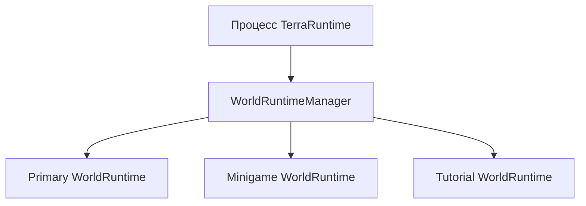

# Multi-world и sandbox runtime

TerraRuntime проектируется так, чтобы один серверный процесс мог содержать несколько одновременно живых runtime-миров, а выбранные миры при необходимости могли работать в отдельных worker-процессах.

Это не замена Dimensions. Долгоживущие дополнительные миры в будущем могут использовать ту же основу, но sandbox-миры в первую очередь нужны для изолированных арен миниигр, tutorial, временных dungeon/event instances, тестовых миров и более сильной изоляции сбоев и ресурсов.

Нормативный план реализации находится в [`../roadmap/multi-world-sandbox-runtime.md`](../roadmap/multi-world-sandbox-runtime.md).

## Идентичность

Файл `.wld` не является идентичностью живого runtime.

`WorldRuntimeId` идентифицирует один логический экземпляр runtime-мира. Клон, созданный из того же source, получает другой runtime ID.

`WorldSessionId` идентифицирует один живой запуск. Повторный запуск того же логического runtime создаёт новую session ID, чтобы устаревшие host/process identities можно было отклонить.

`WorldRuntimeIdentity` объединяет оба значения для границ, которым нужно однозначно определить конкретный живой мир.

`TerraRuntimeHostRuntimeInfo` теперь публикует `RuntimeIdentity`, `IsolationLevel` и `PersistenceMode`. Существующий single-world startup автоматически получает новую assigned identity и сообщает `InProcess` + `Persistent`; будущая multi-world composition сможет сохранять логический `WorldRuntimeId`, меняя `WorldSessionId` при повторном запуске этого runtime.

Сейчас эти identity contracts добавлены как foundation. Одновременный запуск нескольких миров пока не реализован.

## Уровни изоляции

`WorldIsolationLevel.InProcess` означает, что мир работает внутри текущего процесса TerraRuntime со своей authoritative state boundary.

`WorldIsolationLevel.DedicatedProcess` означает, что мир размещён в отдельном TerraRuntime worker, которым управляет основной процесс.

Изоляция независима от `WorldPersistenceMode`:

- `Persistent` использует canonical persistence;
- `Ephemeral` существует только в течение lifecycle runtime/session;
- `SnapshotClone` стартует из другого immutable source/snapshot, но получает независимую runtime identity и независимые изменения.

## Уровень 1: внутри процесса

Целевая модель:



Каждый runtime владеет своим mutable simulation state. Один runtime не должен менять players, entities, progression или extension state другого мира через общие globals.

Первая реализация может использовать один authoritative thread на каждый активный runtime. Это implementation detail позже можно изменить после измерений, но single-writer boundary каждого runtime остаётся.

Обычный in-process gameplay через IPC не проходит.

## Уровень 2: отдельный процесс с передачей TCP socket

Более сильная песочница использует worker process. Worker получает source мира, выбранные sandbox-side modules/plugins, configuration и limits, создаёт `WorldRuntime`, подключает локальную игровую логику и сообщает готовность через `TerraRuntime.Transport`.

`TerraRuntime.Transport` здесь является control plane. Для локальной Level 2 песочницы он **не** является постоянным proxy Terraria gameplay traffic.

До входа игрока в sandbox:

```text
Terraria client <---- TCP ----> Main TerraRuntime
```

После готовности sandbox TerraRuntime передаёт bounded semantic state игрока через `TerraRuntime.Transport` и передаёт ownership уже принятого TCP socket в worker через OS-specific socket-handoff механизм:

```text
Terraria client <---- то же TCP connection ----> Sandbox worker
```

Клиент не переподключается. Worker становится единственным application-level reader/writer этого connection и напрямую обрабатывает обычный Terraria traffic, а hooks, commands и sandbox-local gameplay logic выполняются локально в worker.

Когда игрок выходит из sandbox, операция выполняется зеркально: worker подготавливает переносимую часть player state, отправляет её через `TerraRuntime.Transport`, передаёт тот же TCP socket обратно основному процессу, ждёт подтверждения ownership и только после этого прекращает владеть connection. Main process затем подключает игрока к целевому `WorldRuntime`.

На Windows используется проверенный механизм Winsock/.NET socket duplication; на Unix/Linux — проверенная передача file descriptor через локальный Unix-domain control channel, например `SCM_RIGHTS`. Kernel socket не сериализуется как обычные payload bytes Transport. Transport координирует транзакцию и переносит semantic state, а platform mechanism передаёт живой socket/descriptor.

Handoff может commit только на границе полного Terraria protocol frame. User-space bytes, уже считанные в decoder, `PipeReader` или process-local buffer, вместе с socket не переезжают, поэтому не должно оставаться partial frame или непереданного receive state. В каждый момент ровно один процесс владеет application-level reads/writes. Ошибка согласования ownership должна fail closed, а не оставлять два одновременно работающих connection processors.

Отдельный process даёт crash containment и более сильную resource isolation. Crash worker не должен убивать основной сервер; supervisor обнаруживает отказ, завершает sandbox и детерминированно отключает или восстанавливает затронутых клиентов согласно реализованной recovery policy.

Первая process-isolated реализация должна размещать один sandbox-мир в одном worker. Несколько миров внутри одного worker являются будущей оптимизацией, а не базовым контрактом.

## Transport

`TerraRuntime.Transport` намеренно сохраняется.

У него два конкретных назначения:

1. Vega может общаться с несколькими TerraRuntime servers через независимые transport sessions. Vega остаётся владельцем permissions/capabilities, которые выдаются обычным плагинам.
2. `SandboxSupervisor` общается с отдельными TerraRuntime sandbox workers через тот же bounded/versioned process-boundary envelope.

Для Level 2 Transport переносит lifecycle, handshake, heartbeat, faults, metrics, administrative operations и semantic player/runtime transfer data. После передачи socket локального игрока в worker обычный Terraria gameplay traffic идёт напрямую между client и worker, а не постоянно проксируется через Transport или main process.

Transport предоставляет механику framing, versioning, correlation, request/response/events, cancellation и heartbeat. Он не определяет gameplay operations и не позволяет обходить authoritative command boundary.

Обычный Vega plugin должен получать semantic и policy-scoped cross-server operations через Vega PluginSdk, а не unrestricted raw transport.

## Перевод игрока

Одно connection принадлежит одному активному world session. Для dedicated-process sandbox у него также есть ровно один committed process owner в каждый момент времени.

Перевод игрока между in-process мирами является authoritative runtime lifecycle operation, а не трюком с эмуляцией пакетов. Перевод в Level 2 sandbox или обратно дополнительно передаёт accepted TCP connection на protocol-frame safe point после подготовки переносимого player state.

Это не позволяет host/plugin снова построить хрупкую модель класса Dimensions/FakeProvider из вручную отправленной последовательности world/section packets и одновременно устраняет постоянный IPC proxy overhead для Level 2 gameplay.

## Текущее состояние

Реализованный foundation:

- `WorldRuntimeId`;
- `WorldSessionId`;
- `WorldRuntimeIdentity`;
- `WorldIsolationLevel`;
- `WorldPersistenceMode`;
- host-visible runtime identity/isolation/persistence через `TerraRuntimeHostRuntimeInfo`;
- сохранённый bounded/versioned envelope и handshake `TerraRuntime.Transport`.

Нормативно зафиксировано, но пока не реализовано:

- `WorldRuntimeManager`;
- несколько одновременно активных world runtimes;
- transfer connection между мирами;
- создание ephemeral runtime из worldgen/source state;
- sandbox worker process и supervisor;
- двунаправленная передача TCP socket для Level 2;
- Vega multi-server service protocol поверх Transport;
- OS-level ограничения ресурсов worker.

Следующий implementation slice должен сначала создать in-process runtime container. Process isolation должна повторно использовать эту модель мира, а не создавать вторую архитектуру simulation.
