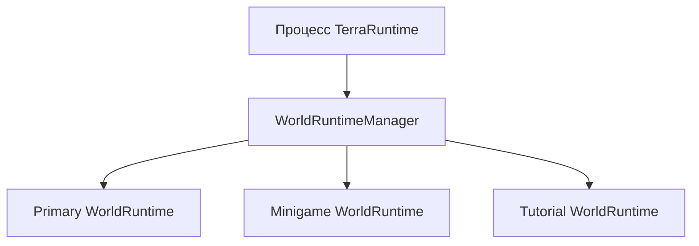
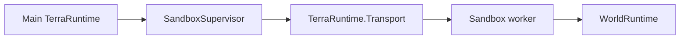

# Multi-world и sandbox runtime

TerraRuntime проектируется так, чтобы один серверный процесс мог содержать несколько одновременно живых runtime-миров, а выбранные миры при необходимости могли работать в отдельных worker-процессах.

Это не замена Dimensions. Долгоживущие дополнительные миры в будущем могут использовать ту же основу, но sandbox-миры в первую очередь нужны для изолированных арен миниигр, tutorial, временных dungeon/event instances, тестовых миров и более сильной изоляции сбоев и ресурсов.

Нормативный план реализации находится в [`../roadmap/multi-world-sandbox-runtime.md`](../roadmap/multi-world-sandbox-runtime.md).

## Идентичность

Файл `.wld` не является идентичностью живого runtime.

`WorldRuntimeId` идентифицирует один логический экземпляр runtime-мира. Клон, созданный из того же шаблона, получает другой runtime ID.

`WorldSessionId` идентифицирует один живой запуск. Повторный запуск того же логического runtime создаёт новую session ID, чтобы устаревшие host/process identities можно было отклонить.

`WorldRuntimeIdentity` объединяет оба значения для границ, которым нужно однозначно определить конкретный живой мир.

`TerraRuntimeHostRuntimeInfo` теперь публикует `RuntimeIdentity`, `IsolationLevel` и `PersistenceMode`. Существующий single-world startup автоматически получает новую assigned identity и сообщает `InProcess` + `Persistent`; будущая multi-world composition сможет сохранять логический `WorldRuntimeId`, меняя `WorldSessionId` при повторном запуске этого runtime.

Сейчас эти identity contracts добавлены как foundation. Одновременный запуск нескольких миров пока не реализован.

## Уровни изоляции

`WorldIsolationLevel.InProcess` означает, что мир работает внутри текущего процесса TerraRuntime со своей authoritative state boundary.

`WorldIsolationLevel.DedicatedProcess` означает, что мир размещён в отдельном TerraRuntime worker, которым управляет основной процесс.

Изоляция независима от `WorldPersistenceMode`:

- `Persistent` использует canonical persistence;
- `Ephemeral` существует только в течение lifecycle runtime/session;
- `SnapshotClone` стартует из другого immutable source/snapshot, но получает независимую runtime identity и независимые изменения.

## Уровень 1: внутри процесса

Целевая модель:

Каждый runtime владеет своим mutable simulation state. Один runtime не должен менять players, entities, progression или extension state другого мира через общие globals.

Первая реализация может использовать один authoritative thread на каждый активный runtime. Это implementation detail позже можно изменить после измерений, но single-writer boundary каждого runtime остаётся.

Обычный in-process gameplay через IPC не проходит.

## Уровень 2: отдельный процесс

Более сильная песочница использует worker process:

Отдельный процесс нужен, когда требуется crash containment, строгий resource accounting или реальная OS boundary для менее доверенного игрового режима.

Первая process-isolated реализация должна размещать один sandbox-мир в одном worker. Несколько миров внутри одного worker являются будущей оптимизацией, а не базовым контрактом.

## Transport

`TerraRuntime.Transport` намеренно сохраняется.

У него два конкретных назначения:

1. Vega может общаться с несколькими TerraRuntime servers через независимые transport sessions. Vega остаётся владельцем permissions/capabilities, которые выдаются обычным плагинам.
2. `SandboxSupervisor` общается с отдельными TerraRuntime sandbox workers через тот же bounded/versioned process-boundary envelope.

Transport предоставляет механику framing, versioning, correlation, request/response/events, cancellation и heartbeat. Он не определяет gameplay operations и не позволяет обходить authoritative command boundary.

Обычный Vega plugin должен получать semantic и policy-scoped cross-server operations через Vega PluginSdk, а не unrestricted raw transport.

## Перевод игрока

Одно connection принадлежит одному активному world session.

Перевод игрока в arena является authoritative runtime lifecycle operation, а не трюком с эмуляцией пакетов. Runtime завершает membership в исходном мире, выделяет membership в целевом, отправляет bootstrap состояния нового мира и только после этого считает игрока Playing в новом session.

Это не позволяет host/plugin снова построить хрупкую модель класса Dimensions/FakeProvider из вручную отправленной последовательности world/section packets.

## Текущее состояние

Реализованный foundation:

- `WorldRuntimeId`;
- `WorldSessionId`;
- `WorldRuntimeIdentity`;
- `WorldIsolationLevel`;
- `WorldPersistenceMode`;
- host-visible runtime identity/isolation/persistence через `TerraRuntimeHostRuntimeInfo`;
- сохранённый bounded/versioned envelope и handshake `TerraRuntime.Transport`.

Пока не реализованы:

- `WorldRuntimeManager`;
- несколько одновременно активных world runtimes;
- transfer connection между мирами;
- создание ephemeral runtime из worldgen/template state;
- sandbox worker process и supervisor;
- Vega multi-server service protocol поверх Transport;
- OS-level ограничения ресурсов worker.

Следующий implementation slice должен сначала создать in-process runtime container. Process isolation должна повторно использовать эту модель мира, а не создавать вторую архитектуру simulation.
