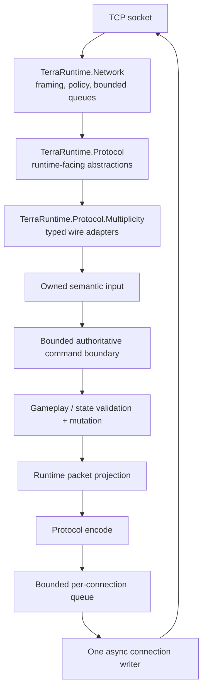
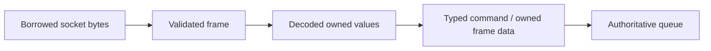
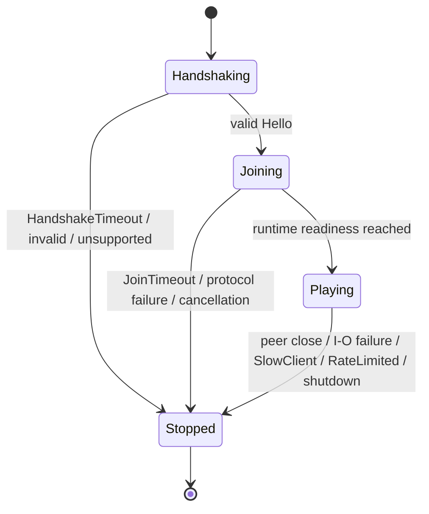
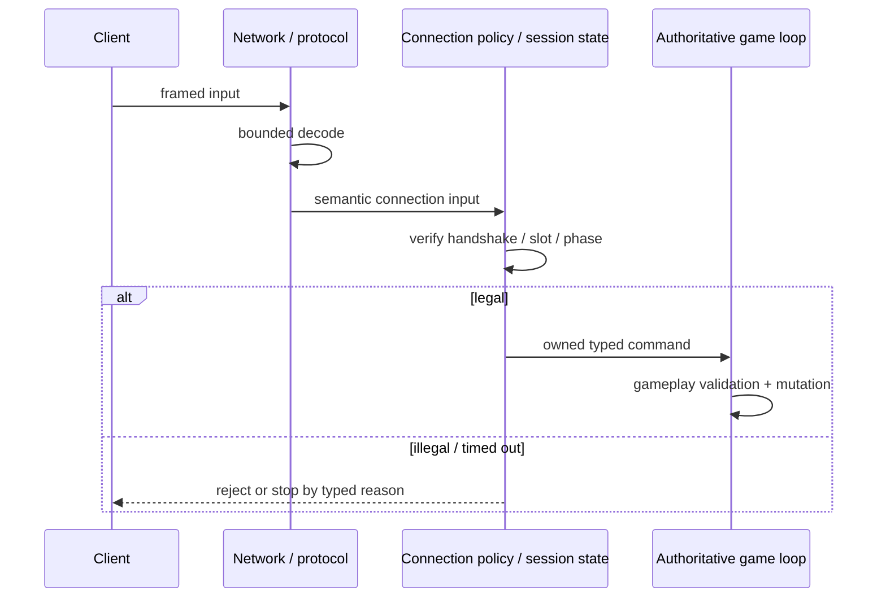
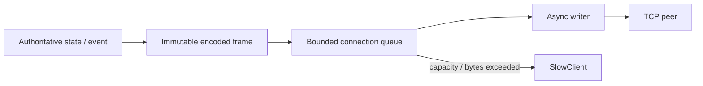
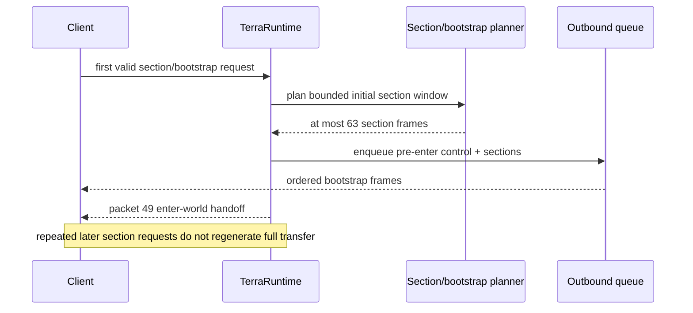
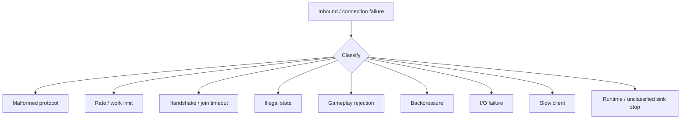

# Сеть и протокол

[English](../en/networking-protocol.md) · [Документация](README.md) · [Архитектура](architecture.md) · [Roadmap](../roadmap.md)

## 1. Область документа

Здесь описан фактически существующий networking/Terraria protocol path TerraRuntime. Protocol baseline: Terraria `1.4.5.8`, protocol `326`, Multiplicity 3.0.x за protocol boundary TerraRuntime.

Official TerrariaServer 1.4.5.8 behavior и independent real-client traffic остаются final reference, если implementation и self-round-trip evidence расходятся.

## 2. Карта слоёв



Packet decoder не владеет gameplay policy. Socket callback не владеет gameplay state.

## 3. Framing

Terraria frame использует literal envelope:

```text
[u16 total frame length][u8 message id][payload...]
```

Network layer обрабатывает split frames, несколько frames в одном read, invalid lengths, oversized messages под explicit ceilings и truncated input. Client-declared sizes недоверенные и не могут определять unbounded allocations.

## 4. Владение receive buffer



Transient `Span<T>`, `ReadOnlySequence<T>` и pooled-buffer data не должны попадать в authoritative state после продвижения receive pipeline.

## 5. Connection policy

Current default policy использует:

- handshake deadline `$10\,\mathrm{s}$`;
- post-`Hello` join deadline `$2\,\mathrm{min}$` до readiness `Playing`;
- отсутствие normal post-join idle timeout (`Timeout.InfiniteTimeSpan`);
- `HardAbuse` connection-wide и configured per-message rate limits.

`$2\,\mathrm{min}$` join deadline является abuse ceiling, а не vanilla gameplay timing rule. Он не даёт peer завершить cheap protocol `Hello` и удерживать admitted player slot бесконечно.



Successful handshake фиксирует completion и будит watchdog. Production отдаёт network policy узкий `ITerrariaConnectionReadinessSource`, а не gameplay objects. Terminal stop state monotonic.

## 6. Stop и rejection categories

`TerrariaConnectionStopReason` различает `PeerClosed`, `ApplicationStopped`, `Cancelled`, `HandshakeTimeout`, `JoinTimeout`, `IdleTimeout`, `InvalidHandshake`, `UnsupportedProtocol`, `ProtocolFailure`, `InboundIoFailure`, `OutboundFailure`, `SlowClient`, `RateLimited` и `FrameRejected`.

`FrameRejected` является connection-lifetime outcome, когда downstream protocol/gameplay sink намеренно останавливается из-за classified frame rejection. `ApplicationStopped` сохраняется для unclassified/intentional inner-sink stop и больше не используется как generic label для malformed, invalid-state, gameplay или backpressure rejection.

Frame-rejection telemetry остаётся отдельной diagnostic dimension и нормализует malformed protocol, rate-limited, invalid-state, gameplay-rejected и backpressure failures. Lifetime reason отвечает, почему завершился connection; rejection category отвечает, какой класс frame был отклонён. Эти две оси нельзя сплющивать в generic network error.

Production sink chain протаскивает rejection category через sign, chest, projectile/tile, world-item и vitals/bootstrap layers. Поэтому bootstrap failures, включая malformed join/player packets, illegal join state, player-slot mismatch и ingress/outbound backpressure, остаются видимыми, хотя `PlayerVitalsFrameSink` является первым rejection-source wrapper вокруг bootstrap layer.

## 7. Handshake и legality состояния



Connection-owned identity имеет приоритет над client-claimed identity там, где ownership уже известен. Illegal pre-handshake/pre-spawn operations не доходят до runtime stores.

## 8. Граница Multiplicity

Multiplicity является protocol dependency, а не gameplay dependency. `TerraRuntime.Protocol.Multiplicity` переводит wire models в TerraRuntime-owned protocol/domain representations и обратно.

Critical layouts требуют independent evidence: golden bytes, official traffic или differential probes. Successful encode/decode round trip доказывает лишь согласие наших encoder/decoder.

## 9. Inbound и fan-out rate accounting

Rate accounting выполняется до expensive gameplay work. Legal input, который делает shared fan-out вне authoritative command loop, получает server-global budget до multiplication.

Public vanilla `Say` chat сейчас имеет server-global ceiling:

$$
R_{\mathrm{chat}}=256\ \text{broadcasts}/\mathrm{s}.
$$

Budget проверяется до $O(P)$ recipient iteration, где $P$ — число playing connections. Over-budget broadcast drop'ится и учитывается как rate-limited rejection, а не выдаёт каждому sender собственный global allowance.

Это deliberately loose hard-abuse protection, не normal chat cadence.

## 10. Authoritative command queue

Command loop имеет bounded global capacity, per-tick operation limits, per-source processing quotas и per-source pending/reservation ceilings. Один connection не может monopolize tick или reserve весь shared mailbox, просто submitting faster.

Количественные loop budgets описаны в [Performance и tick scheduling](performance-runtime.md).

## 11. Outbound queues и structural sizing



Production frame capacity выводится `ConnectionOutboundQueueSizing`, а не fixed magic ceiling `$4\,096$`.

Пусть $P$ — configured player capacity. Verified structural components:

$$
F_{\mathrm{join}}=69,
\qquad
F_{\mathrm{entities}}=1\,257,
\qquad
F_{\mathrm{peer}}=393.
$$

Тогда

$$
F_{\mathrm{queue}}(P)
=F_{\mathrm{join}}+F_{\mathrm{entities}}+(P-1)F_{\mathrm{peer}}
=933+393P.
$$

Для default $P=8$:

$$
F_{\mathrm{queue}}(8)=4\,077\ \text{frames}.
$$

Byte envelope масштабируется от deployed default `$16\,\mathrm{MiB}$`:

$$
B_{\mathrm{queue}}(P)
=\max\!\left(
B_{\mathrm{max\ frame}},
\left\lceil16\,\mathrm{MiB}\cdot\frac{F_{\mathrm{queue}}(P)}{4\,077}\right\rceil
\right).
$$

Это structural correctness bound, а measurement-derived final sizing остаётся active work. Queue high-water telemetry сохраняется across disconnects, чтобы tightening опирался на реальные workloads.

## 12. Join и bootstrap traffic

Pre-`packet 49` live contract существенно ужесточён. Runtime entity/global baselines намеренно находятся вне final packet-10-to-packet-49 handoff.

Current `PlayerBootstrapFrameBudget` доказывает:

$$
F_{\mathrm{sections,max}}=63,
\qquad
F_{\mathrm{pre49,max}}=65,
\qquad
F_{\mathrm{probe}}=96.
$$

Для default $P=8$:

$$
65 < 96 < 4\,077.
$$



Section-heavy path state-gated. После `AwaitingSpawn`/`Playing` repeated section requests не regenerate полный initial transfer.

Separate `$2\,\mathrm{min}$` join deadline ограничивает peers, которые завершили `Hello`, но не стали ready.

## 13. Interest management

Interest management относится к synchronization, не packet parser. External hosts получают только `IInterestManagementControl`; spatial layout, hysteresis, enter/leave behavior и forced resync остаются runtime-owned.

До полного proof visibility transitions suppression fail-open в broad vanilla-like routing.

## 14. Threading rules

Допустимо off-thread: socket I/O, framing, bounded protocol decode/encode, immutable frame construction, connection-local accounting и bounded transport-only fan-out с explicit server-global ceiling.

Direct mutation player/world/NPC/projectile/item stores остаётся authoritative-thread work. Transient receive-buffer references не сохраняются в gameplay state.

## 15. Failure isolation



Malformed/abusive traffic остаётся connection-local. Classified downstream frame rejection завершает connection как `FrameRejected`, сохраняя granular rejection category. Shared non-authoritative work вроде chat fan-out может drop только over-budget operation, не disconnect unrelated peers.

## 16. Tests и executable evidence

Evidence включает framing/socket tests, handshake/join/idle watchdog tests, connection/fan-out rate tests, rejection-stop normalization и production bootstrap-propagation tests, Multiplicity decoder/mapper tests, deterministic malformed framing/typed-decoder fuzz tests, real-process slow-client tests, `Vanilla World Load` live join/movement probes и official-server reference workflows.

Regression test обязан падать при removal guarded fix.

## 17. Текущие ограничения

Incomplete остаются broader protocol/world fuzz corpora beyond current deterministic floor, complete global/per-subsystem expensive-work budgets, measurement-derived final queue sizing, complete per-message byte/count telemetry, full section-aware suppression/resync semantics, broad real-client replay и full gameplay coverage каждого valid packet type.

## 18. Checklist изменения сети

Networking/protocol change не завершён, пока по необходимости:

- malformed/valid framing/decoder behavior tested;
- connection-state legality и deadlines tested;
- rate/queue/fan-out work bounded;
- rejection lifetime reason и granular rejection category остаются различимыми;
- NativeAOT paths valid;
- wire-sensitive claims имеют independent evidence;
- diagrams используют Mermaid вместо pseudographics;
- dimensional quantities/formulas используют LaTeX с units;
- эта page и `docs/en/networking-protocol.md` изменены вместе.
