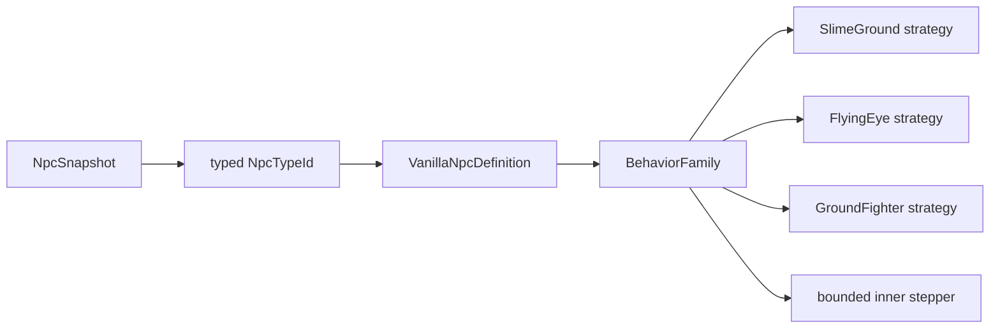

# Dispatch NPC по behavior-family

[English](../en/npc-behavior-families.md) · [Gameplay](gameplay.md) · [Roadmap декомпозиции gameplay](../roadmap/gameplay-decomposition-and-catalogs.md)

## Назначение

TerraRuntime разделяет два разных понятия NPC:

- `NpcAiStyleId` — source-backed факт Terraria 1.4.5.8, сохранённый в vanilla definition;
- `VanillaNpcBehaviorFamily` — runtime-owned явное разрешение использовать конкретную реализацию поведения, уже проверенную для этой definition.

Это намеренно не одно и то же. В Terraria множество NPC могут иметь одинаковый `aiStyle`, но при этом отличаться type-specific ветками, параметрами или lifecycle-правилами. Если автоматически отправить любой будущий NPC с `aiStyle = 3` в текущую Zombie-реализацию, полезный source fact быстро превращается в красивое, но опасное предположение.

## Текущее проверенное соответствие

| NPC | source `AiStyle` | runtime behavior family |
| --- | --- | --- |
| Blue Slime | `Slime` | `SlimeGround` |
| Demon Eye | `DemonEye` | `FlyingEye` |
| Zombie | `Fighter` | `GroundFighter` |

Family назначается только definitions, уже присутствующим в version-pinned `VanillaNpcDefinitionCatalog`. Для нового vanilla NPC требуется отдельное явное решение; один лишь совпавший aiStyle доказательством не является.

## Путь dispatch



`VanillaNpcTargetingAiStepper` теперь один раз получает definition и выбирает стратегию через `BehaviorFamily`. На уровне orchestration больше нет проверки «это конкретно Blue Slime / Demon Eye / Zombie?» перед выбором реализации. Сама специализированная strategy всё ещё проверяет ожидаемый source `AiStyle` как invariant.

Metadata definition одновременно используется для размеров при targeting/overlap calculations, поэтому повторный поиск той же definition внутри одного шага больше не нужен.

## Почему это безопаснее dispatch по aiStyle

Предположим, позже будет добавлена ещё одна проверенная NPC definition с `Fighter` aiStyle. Она не получит `GroundFighter` автоматически. Пока type-specific vanilla-ветки не проверены, её runtime family может оставаться `None` либо для неё создаётся другая явная strategy. Система fail-closed вместо того, чтобы выдавать правдоподобный, но неверный AI.

Разделение выглядит так:

```text
Terraria fact             TerraRuntime implementation decision
AiStyle = Fighter   !=    BehaviorFamily = GroundFighter
```

У текущей Zombie definition присутствуют оба значения, потому что этот путь уже реализован и покрыт проверками.

## Границы текущего среза

Изменение декомпозирует выбор strategy для уже поддерживаемого NPC catalog. Оно не утверждает, что все vanilla NPC со style 1/2/3 используют абсолютно те же реализации, и не закрывает целиком более широкие roadmap-пункты по всем AI families, bosses, town NPC, loot и устранению каждой оставшейся type-specific ветки внутри проверенных behavior implementations.

При расширении NPC support сначала добавляются source defaults, затем проверяются type-specific ветки официального сервера, и только после этого definition явно подключается к существующей family, если такое переиспользование действительно корректно.

## Проверка

Catalog-тесты закрепляют явное назначение behavior-family для Blue Slime, Demon Eye и Zombie одновременно с независимой проверкой aiStyle. Существующие NPC targeting/motion tests продолжают прогонять все три runtime-пути через `VanillaNpcTargetingAiStepper`, а gameplay CI собирает и запускает все `Npc`/`Projectile` tests отдельным non-cancelling acceptance-срезом.
