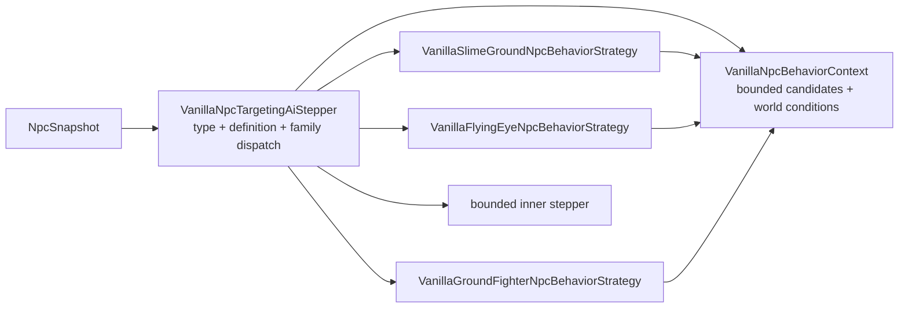

# Dispatch NPC по behavior-family

[English](../en/npc-behavior-families.md) · [Gameplay](gameplay.md) · [Roadmap декомпозиции gameplay](../roadmap/gameplay-decomposition-and-catalogs.md)

## Назначение

TerraRuntime разделяет два разных понятия NPC:

- `NpcAiStyleId` — source-backed факт Terraria 1.4.5.8, сохранённый в vanilla definition;
- `VanillaNpcBehaviorFamily` — runtime-owned явное разрешение использовать конкретную реализацию поведения, уже проверенную для этой definition.

Это намеренно не одно и то же. В Terraria множество NPC могут иметь одинаковый `aiStyle`, но при этом отличаться type-specific ветками, параметрами или lifecycle-правилами. Автоматически отправлять любой будущий NPC с `aiStyle = 3` в текущую Zombie-реализацию нельзя: source fact тогда превращается в красивое, но неподтверждённое предположение.

## Текущее проверенное соответствие

| NPC | source `AiStyle` | runtime behavior family |
| --- | --- | --- |
| Blue Slime | `Slime` | `SlimeGround` |
| Demon Eye | `DemonEye` | `FlyingEye` |
| Zombie | `Fighter` | `GroundFighter` |
| Eye of Cthulhu | `EyeOfCthulhu` | `EyeOfCthulhu` |
| Servant of Cthulhu | `Flyer` | `Flyer` |
| Skeleton | `Fighter` | `GroundFighter` |
| King Slime | `KingSlime` | `KingSlime` |
| Eater of Worlds head/body/tail | `Worm` | `Worm` |
| Brain of Cthulhu | `BrainOfCthulhu` | `BrainOfCthulhu` |
| Brain Creeper | `BrainCreeper` | `BrainCreeper` |
| Skeletron Head | `SkeletronHead` | `SkeletronHead` |
| Skeletron Hand | `SkeletronHand` | `SkeletronHand` |
| Queen Bee | `QueenBee` | `QueenBee` |
| Deerclops | `Deerclops` | `Deerclops` |
| Wall of Flesh | `WallOfFlesh` | `WallOfFlesh` |
| Wall of Flesh Eye | `WallOfFleshEye` | `WallOfFleshEye` |
| The Hungry | `TheHungry` | `WallOfFleshHungry` |

Family назначается только definitions, уже присутствующим в version-pinned `VanillaNpcDefinitionCatalog`. Для нового vanilla NPC требуется отдельное явное решение; один совпавший aiStyle доказательством не является.

## Ownership после декомпозиции

Публичный compatibility facade больше не содержит реализации всех families внутри себя.



Границы ownership теперь явные:

- `VanillaNpcTargetingAiStepper` преобразует тип в `NpcTypeId`, один раз получает `VanillaNpcDefinition`, выбирает явную family и сохраняет прежний fallback-контракт;
- `VanillaNpcBehaviorContext` владеет фиксированным scratch-buffer кандидатов, target geometry helpers, обогащением live-скоростью игрока, переводом world surface в пиксели и текущими фактами day/slime-rain;
- `VanillaSlimeGroundNpcBehaviorStrategy` владеет Slime-family engagement/targeting input и проверенным переходом `VanillaBlueSlimeMotion`;
- `VanillaFlyingEyeNpcBehaviorStrategy` владеет FlyingEye target refresh перед передачей состояния независимо реализованному eye AI;
- `VanillaGroundFighterNpcBehaviorStrategy` владеет Fighter-family target prepass, overlap semantics, day/surface pursuit policy и проверенным compatibility-переходом `VanillaZombieMotion`. `VanillaGroundFighterNpcCatalog` теперь закрепляет SetDefaults и AI_003 movement profiles для Zombie, Skeleton и ещё шестнадцати hostile fighters: Goblin Peon/Thief/Warrior/Scout, Angry Bones, Doctor Bones, The Groom, Armored Skeleton, Bald Zombie, Zombie Eskimo, Undead Viking, Pincushion/Slimed/Swamp/Twiggy/Female Zombie. Для каждого профиля явно хранится source-backed максимальная горизонтальная скорость и факт применения `(1 + (1 - scale))`, поэтому любой `aiStyle = 3` больше не наследует Zombie-semantics автоматически.
- Angry Bones и Armored Skeleton дополнительно включают закреплённый grounded close-range lunge (`|dx| < 100`, `|dy| < 50`, движение к цели, удвоение X с clamp до `±3`, Y = `-4`). World-motion также передаёт реальный NPC type в существующую AI_003 door-pressure policy, поэтому type-specific pressure/reset правила больше не вычисляются как будто любой fighter является Zombie. Для Goblin Peon type `26` destructive-door side effect по-прежнему fail-closed: policy распознаёт это решение, но authoritative разрушение двери пока не заявляется.

Facade сохраняет `EnableBlueSlimeMotion`, `EnableZombieMotion`, `SetWorldConditions` и `SetCandidates`, чтобы runtime composition и существующим callers не требовалась одновременная миграция API. Теперь эти методы настраивают context, а не накапливают внутри dispatcher поведение разных families.

## Invariants dispatch

Каждая concrete strategy по-прежнему проверяет ожидаемый source-backed `AiStyle`. `BehaviorFamily` выбирает реализацию, а `AiStyle` подтверждает source invariant, на котором эта реализация была проверена.

Не включённая family уходит в bounded inner stepper ровно как раньше. Валидный NPC type, отсутствующий в definition catalog, тоже уходит в fallback и не наследует поведение из-за похожего числового ID или совпавшего aiStyle.

Разделение остаётся таким:

```text
Terraria fact             TerraRuntime implementation decision
AiStyle = Fighter   !=    BehaviorFamily = GroundFighter
```

## Граница сложности Eye of Cthulhu

`VanillaEyeOfCthulhuMotion` получает live-флаг Expert mode для source-backed детерминированной части `AI_004`, проверенной по TerrariaServer `1.4.5.8`. Первая фаза включает Expert-скорость и ускорение hover, окно hover в $210\,\text{тиков}$, cadence Servant в $44\,\text{тика}$ при любом вертикальном смещении, запуск Servant со скоростью $6\,\text{пикселей/тик}$, прямой dash со скоростью $7\,\text{пикселей/тик}$, последовательное замедление dash на `0.98f` и `0.985f`, окно dash в $100\,\text{тиков}$ и переход при здоровье ниже $65\%$.

Expert transformation тоже authoritative. Обе стадии transformation по $100\,\text{тиков}$ продвигают source spin/timer state и применяют decay скорости `0.98f`. Каждый двадцатый тик transformation создаёт post-commit intent Servant из двух точных вызовов `Main.rand.Next(-200, 200)`, нормализует вектор до $5\,\text{пикселей/тик}$ и сдвигает spawn на десять тиков от центра Eye. Spawn на 100-м тике сохраняется до смены стадии transformation, то есть порядок вызовов совпадает с source.

Детерминированный Expert slice второй фазы включает source-полосы расстояния выше $400/600/800\,\text{пикселей}$, множители скорости следующих прямых dash `1.15f` и `1.30f`, Expert-границы slowdown/duration $50$ и $90$ тиков, а также движение low-life state `ai[1] = 5` к точке на $600\,\text{пикселей}$ ниже target.

`VanillaEyeOfCthulhuExpertRapidDashNpcBehaviorStrategy` владеет оставшейся Expert rapid-dash веткой, кроме Good World. Сохраняется source-порядок RNG для seed `Main.rand.Next(1, 4)` после третьего обычного dash второй фазы, low-life seed `Main.rand.Next(-3, 1)`, predictive launch `ai[1] = 3` с live velocity игрока, обоих слоёв ±10% perturbation, velocity jitter, critical-life rotation/renormalization и cadence state `ai[1] = 4` с окнами $20/10 + 13\,\text{тиков}$. Target candidates перед boss AI обогащаются из authoritative player-slot snapshot lookup, поэтому prediction больше не подменяет скорость игрока нулями.

Это ограниченные возможности (`BossExpertPhaseOneSlice`, `BossExpertTransformationSlice`, `BossExpertPhaseTwoDeterministicSlice` и `BossExpertRapidDashSlice`), а не заявление о полной difficulty-parity. Live phase-two combat projection теперь атомарно коммитит source-значения `NPC.damage`/`NPC.defense` для Classic, Expert и Master, включая пороги `<12%` и `<4%`. Good World transformation state запускает authoritative projectile/NPC reflection short-circuit после движения projectile: допущенные player-projectile с aiStyle 1/2 сохраняют скорость `oldVelocity`, получают четверть текущего damage, становятся одноразово reflected с penetrate `1` и сохраняют исходного owner. Также допущена закреплённая special star-shot ветка: projectile `728` (`aiStyle 151`) и `955` (`aiStyle 5`) отражаются только от точного набора NPC из `NPCID.Sets.ReflectStarShotsInForTheWorthy` при активном Good World. Звук, dust, gore и прочие presentation-only эффекты остаются вне server gameplay claim.

## Взаимодействия GroundFighter с дверями и tall-gate

Admitted `GroundFighter` slice теперь несёт полный source-backed путь давления на двери:

- `VanillaWorldZombieDoorContact` накапливает per-contact давление `ai[1]` (5 за дверь, 2 за tall-gate, плюс бонусы типов) и выпускает типизированный `VanillaGroundFighterDoorOpeningIntent` на ванильном пороге 10;
- `VanillaWorldGroundFighterDoorOpeningService` выполняет точные мутации `WorldGen.OpenDoor` / `ShiftTallGate` (отклонение locked-двери, трансформация `1x3 -> 2x3` frame/style, перенос paint/coating, очистка `tileCut`, сдвиг типа `388 -> 389`);
- `VanillaWorldUnbreakableWallScan` повторяет `UnbreakableWallScan.InsideUnbreakableWalls` (8 направлений ×250 тайлов, стена 350, цвет ≥16) и подаёт `TargetInsideUnbreakableWalls` в политику давления для бонуса `+6`;
- `RuntimeTallGateOccupancyProbe` реализует `Collision.EmptyTile(ignoreTiles:true)` проверкой live прямоугольников игроков (`20×42`) и NPC (live hitbox) на каждом тайле ворот, теперь подключён в `ServerRuntimeState` через `RuntimeGroundFighterDoorOpeningSink` с репликацией packet-19.

Обычные двери открываются без occupancy-пробы; tall-gate закрывается fail-closed, если хотя бы один из пяти тайлов ворот занят, и открывается только когда все пять свободны — как в ванильном `ShiftTallGate`. Флаг `GetGoodWorld` и состояние `insideUnbreakableWalls` теперь проецируются из live состояния мира, а не остаются `false` по умолчанию.

## Почему пункт roadmap по AI decomposition закрыт

D4-пункт `AI family/behavior decomposition` описывает ownership и архитектуру dispatch, а не обещание реализовать каждый NPC Terraria. Для authoritative vanilla NPC slice, который сейчас допускает `VanillaNpcDefinitionCatalog`, выбор family, общий context и family behavior теперь являются отдельными единицами и имеют executable coverage. Новые NPC definitions расширяют эту схему, а не возвращают код в монолитный dispatcher.

Все D4 checkbox'ы описывают decomposition/ownership admitted slices, а не полный NPC roster. `VanillaNpcAiCoverageCatalog` оставляет `FullVanillaAiParity` false для каждой текущей записи; дальнейший roster отслеживается в [roadmap NPC/AI parity](../roadmap/npc-ai-parity.md).

## Проверка

Brain of Cthulhu и Brain Creeper теперь являются отдельными fail-closed family. Brain владеет source-backed созданием 20/40 Creeper, invulnerability первой фазы, обеими teleport state machine и Good World скоростью преследования; Creeper владеет orbit/charge относительно Brain и Expert/Good World pursuit. Packet-28 death path включает difficulty material loot Creeper, normal/Expert/Master loot Brain и `downedBoss2`. Пока Brain активен, target candidates получают `ZoneCrimson` из authoritative SceneMetrics-сканирования тайлов, поэтому source escape/despawn gate на 60/120 тиков больше не опирается на выдуманный biome default. Presentation-only эффекты остаются вне claim, поэтому full parity остаётся false.

`VanillaNpcBehaviorFamilyDispatchTests` закрепляет fail-closed контракт dispatch: отключённые families уходят в fallback, неизвестные catalog types не наследуют поведение, а FlyingEye target refresh выполняется внутри family strategy до делегирования. `VanillaEyeOfCthulhuExpertRapidDashTests` закрепляет source RNG consumption, prediction по live velocity игрока, low-life seeding и cadence rapid states. `VanillaNpcAiCoverageCatalogTests` не позволяет назвать эти slices полным parity.

## Состояние мира для жизненного цикла AI_002

AI_002 теперь хранит не косметические правила жизненного цикла отдельно от догадок по пакетам и состоянию. Дневное бегство повторяет исходник: только закреплённые типы, только днём, на уровне или выше `worldSurface` и только если текущая цель не находится в функциональном Graveyard. Ветка ограничивает `timeLeft` значением 10, задаёт движение вверх и намеренно не вызывает `TargetClosest` на этом тике.

Pigron теперь использует исходный автомат `ai[0]/ai[1]`. Отсутствие прямой видимости увеличивает `ai[0]`; на 300-м тике включается проход сквозь тайлы. Возврат прямой видимости отключает фазирование только после того, как `Collision.SolidCollision` становится ложным. Production-факты берутся из `VanillaWorldCanHit`, `VanillaWorldSolidCollision` и `VanillaWorldGraveyardScene`. Косметические alpha, rotation, dust и sound не входят в authoritative claim.

### Граница projectile-side-effects AI_005

Обычные атаки Probe и Blood Squid теперь хранят source-backed таймер `localAI[0]` в той же ревизии симуляции NPC, а создание снарядов планируется через `INpcAiProjectileIntentPlanner`. Executor выделяет projectile-слот только после успешного коммита точного поколения исходного NPC, поэтому stale/rejected AI-transition не может породить призрачный лазер или blood shot. Production LOS использует тот же source-backed адаптер tile `Collision.CanHit`, что и остальные world-запросы NPC, а глобальный firing gate фиксирует TerrariaServer 1.4.5.8 `Main.MaxWorldViewSize` 1920x1200 и исходный отступ 50 пикселей. Stinger-атаки Hornet и Good World Eater child намеренно не входят в этот claim до появления недостающего authoritative player-state / определения NPC 666.

[Moon Lord: death lifecycle](moon-lord-death-sequence.md)
