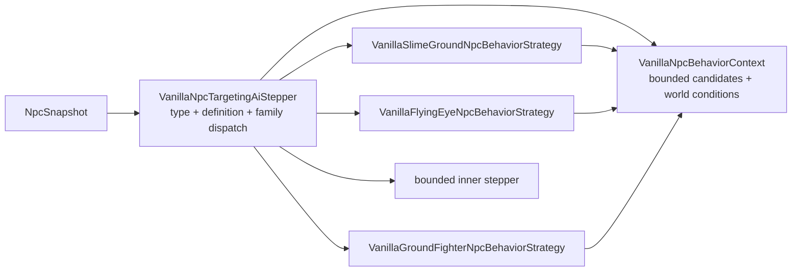

# Dispatch NPC по behavior-family

[English](../en/npc-behavior-families.md) · [Gameplay](gameplay.md) · [Roadmap декомпозиции gameplay](../roadmap/gameplay-decomposition-and-catalogs.md)

## Назначение

TerraRuntime разделяет два разных понятия NPC:

- `NpcAiStyleId` — source-backed факт Terraria 1.4.5.8, сохранённый в vanilla definition;
- `VanillaNpcBehaviorFamily` — runtime-owned явное разрешение использовать конкретную реализацию поведения, уже проверенную для этой definition.

Это намеренно не одно и то же. В Terraria множество NPC могут иметь одинаковый `aiStyle`, но при этом отличаться type-specific ветками, параметрами или lifecycle-правилами. Автоматически отправлять любой будущий NPC с `aiStyle = 3` в текущую Zombie-реализацию нельзя: source fact тогда превращается в красивое, но неподтверждённое предположение.

## Текущее проверенное соответствие

| NPC | source `AiStyle` | runtime behavior family |
| --- | --- | --- |
| Blue Slime | `Slime` | `SlimeGround` |
| Demon Eye | `DemonEye` | `FlyingEye` |
| Zombie | `Fighter` | `GroundFighter` |
| Eye of Cthulhu | `EyeOfCthulhu` | `EyeOfCthulhu` |
| Servant of Cthulhu | `Flyer` | `Flyer` |
| Skeleton | `Fighter` | `GroundFighter` |
| King Slime | `KingSlime` | `KingSlime` |

Family назначается только definitions, уже присутствующим в version-pinned `VanillaNpcDefinitionCatalog`. Для нового vanilla NPC требуется отдельное явное решение; один совпавший aiStyle доказательством не является.

## Ownership после декомпозиции

Публичный compatibility facade больше не содержит реализации всех families внутри себя.



Границы ownership теперь явные:

- `VanillaNpcTargetingAiStepper` преобразует тип в `NpcTypeId`, один раз получает `VanillaNpcDefinition`, выбирает явную family и сохраняет прежний fallback-контракт;
- `VanillaNpcBehaviorContext` владеет фиксированным scratch-buffer кандидатов, target geometry helpers, переводом world surface в пиксели и текущими фактами day/slime-rain;
- `VanillaSlimeGroundNpcBehaviorStrategy` владеет Slime-family engagement/targeting input и проверенным переходом `VanillaBlueSlimeMotion`;
- `VanillaFlyingEyeNpcBehaviorStrategy` владеет FlyingEye target refresh перед передачей состояния независимо реализованному eye AI;
- `VanillaGroundFighterNpcBehaviorStrategy` владеет Fighter-family target prepass, overlap semantics, day/surface pursuit policy и проверенным compatibility-переходом `VanillaZombieMotion`. `VanillaGroundFighterBehaviorCatalog` сохраняет параметры admitted types, например base speed Skeleton `1.5f`.

Facade сохраняет `EnableBlueSlimeMotion`, `EnableZombieMotion`, `SetWorldConditions` и `SetCandidates`, чтобы runtime composition и существующим callers не требовалась одновременная миграция API. Теперь эти методы настраивают context, а не накапливают внутри dispatcher поведение разных families.

## Invariants dispatch

Каждая concrete strategy по-прежнему проверяет ожидаемый source-backed `AiStyle`. `BehaviorFamily` выбирает реализацию, а `AiStyle` подтверждает source invariant, на котором эта реализация была проверена.

Не включённая family уходит в bounded inner stepper ровно как раньше. Валидный NPC type, отсутствующий в definition catalog, тоже уходит в fallback и не наследует поведение из-за похожего числового ID или совпавшего aiStyle.

Разделение остаётся таким:

```text
Terraria fact             TerraRuntime implementation decision
AiStyle = Fighter   !=    BehaviorFamily = GroundFighter
```

## Взаимодействия GroundFighter с дверями и tall-gate

Admitted `GroundFighter` slice теперь несёт полный source-backed путь давления на двери:

- `VanillaWorldZombieDoorContact` накапливает per-contact давление `ai[1]` (5 за дверь, 2 за tall-gate, плюс бонусы типов) и выпускает типизированный `VanillaGroundFighterDoorOpeningIntent` на ванильном пороге 10;
- `VanillaWorldGroundFighterDoorOpeningService` выполняет точные мутации `WorldGen.OpenDoor` / `ShiftTallGate` (отклонение locked-двери, трансформация `1x3 -> 2x3` frame/style, перенос paint/coating, очистка `tileCut`, сдвиг типа `388 -> 389`);
- `VanillaWorldUnbreakableWallScan` повторяет `UnbreakableWallScan.InsideUnbreakableWalls` (8 направлений ×250 тайлов, стена 350, цвет ≥16) и подаёт `TargetInsideUnbreakableWalls` в политику давления для бонуса `+6`;
- `RuntimeTallGateOccupancyProbe` реализует `Collision.EmptyTile(ignoreTiles:true)` проверкой live прямоугольников игроков (`20×42`) и NPC (live hitbox) на каждом тайле ворот, теперь подключён в `ServerRuntimeState` через `RuntimeGroundFighterDoorOpeningSink` с репликацией packet-19.

Обычные двери открываются без occupancy-пробы; tall-gate закрывается fail-closed, если хотя бы один из пяти тайлов ворот занят, и открывается только когда все пять свободны — как в ванильном `ShiftTallGate`. Флаг `GetGoodWorld` и состояние `insideUnbreakableWalls` теперь проецируются из live состояния мира, а не остаются `false` по умолчанию.

## Почему пункт roadmap по AI decomposition закрыт

D4-пункт `AI family/behavior decomposition` описывает ownership и архитектуру dispatch, а не обещание реализовать каждый NPC Terraria. Для authoritative vanilla NPC slice, который сейчас допускает `VanillaNpcDefinitionCatalog`, выбор family, общий context и family behavior теперь являются отдельными единицами и имеют executable coverage. Новые NPC definitions расширяют эту схему, а не возвращают код в монолитный dispatcher.

Все D4 checkbox'ы описывают decomposition/ownership admitted slices, а не полный NPC roster. `VanillaNpcAiCoverageCatalog` оставляет `FullVanillaAiParity` false для каждой текущей записи; дальнейший roster отслеживается в [roadmap NPC/AI parity](../roadmap/npc-ai-parity.md).

## Проверка

`VanillaNpcBehaviorFamilyDispatchTests` закрепляет fail-closed контракт dispatch: отключённые families уходят в fallback, неизвестные catalog types не наследуют поведение, а FlyingEye target refresh выполняется внутри family strategy до делегирования. NPC-specific suites покрывают admitted ordinary и boss slices, а `VanillaNpcAiCoverageCatalogTests` не позволяет назвать эти slices полным parity.
