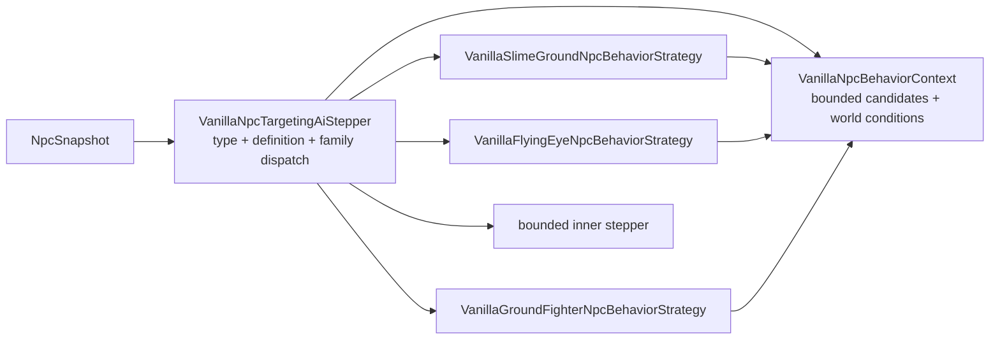

# Dispatch NPC по behavior-family

[English](../en/npc-behavior-families.md) · [Gameplay](gameplay.md) · [Roadmap декомпозиции gameplay](../roadmap/gameplay-decomposition-and-catalogs.md)

## Назначение

TerraRuntime разделяет два разных понятия NPC:

- `NpcAiStyleId` — source-backed факт Terraria 1.4.5.8, сохранённый в vanilla definition;
- `VanillaNpcBehaviorFamily` — runtime-owned явное разрешение использовать конкретную реализацию поведения, уже проверенную для этой definition.

Это намеренно не одно и то же. В Terraria множество NPC могут иметь одинаковый `aiStyle`, но при этом отличаться type-specific ветками, параметрами или lifecycle-правилами. Автоматически отправлять любой будущий NPC с `aiStyle = 3` в текущую Zombie-реализацию нельзя: source fact тогда превращается в красивое, но неподтверждённое предположение.

## Текущее проверенное соответствие

| NPC | source `AiStyle` | runtime behavior family |
| --- | --- | --- |
| Blue Slime | `Slime` | `SlimeGround` |
| Demon Eye | `DemonEye` | `FlyingEye` |
| Zombie | `Fighter` | `GroundFighter` |

Family назначается только definitions, уже присутствующим в version-pinned `VanillaNpcDefinitionCatalog`. Для нового vanilla NPC требуется отдельное явное решение; один совпавший aiStyle доказательством не является.

## Ownership после декомпозиции

Публичный compatibility facade больше не содержит реализации всех families внутри себя.



Границы ownership теперь явные:

- `VanillaNpcTargetingAiStepper` преобразует тип в `NpcTypeId`, один раз получает `VanillaNpcDefinition`, выбирает явную family и сохраняет прежний fallback-контракт;
- `VanillaNpcBehaviorContext` владеет фиксированным scratch-buffer кандидатов, target geometry helpers, переводом world surface в пиксели и текущими фактами day/slime-rain;
- `VanillaSlimeGroundNpcBehaviorStrategy` владеет Slime-family engagement/targeting input и проверенным переходом `VanillaBlueSlimeMotion`;
- `VanillaFlyingEyeNpcBehaviorStrategy` владеет FlyingEye target refresh перед передачей состояния независимо реализованному eye AI;
- `VanillaGroundFighterNpcBehaviorStrategy` владеет Fighter-family target prepass, overlap semantics, day/surface pursuit policy и проверенным переходом `VanillaZombieMotion`.

Facade сохраняет `EnableBlueSlimeMotion`, `EnableZombieMotion`, `SetWorldConditions` и `SetCandidates`, чтобы runtime composition и существующим callers не требовалась одновременная миграция API. Теперь эти методы настраивают context, а не накапливают внутри dispatcher поведение разных families.

## Invariants dispatch

Каждая concrete strategy по-прежнему проверяет ожидаемый source-backed `AiStyle`. `BehaviorFamily` выбирает реализацию, а `AiStyle` подтверждает source invariant, на котором эта реализация была проверена.

Не включённая family уходит в bounded inner stepper ровно как раньше. Валидный NPC type, отсутствующий в definition catalog, тоже уходит в fallback и не наследует поведение из-за похожего числового ID или совпавшего aiStyle.

Разделение остаётся таким:

```text
Terraria fact             TerraRuntime implementation decision
AiStyle = Fighter   !=    BehaviorFamily = GroundFighter
```

## Почему пункт roadmap по AI decomposition закрыт

D4-пункт `AI family/behavior decomposition` описывает ownership и архитектуру dispatch, а не обещание реализовать каждый NPC Terraria. Для authoritative vanilla NPC slice, который сейчас допускает `VanillaNpcDefinitionCatalog`, выбор family, общий context и family behavior теперь являются отдельными единицами и имеют executable coverage. Новые NPC definitions расширяют эту схему, а не возвращают код в монолитный dispatcher.

Это **не** закрывает остальные пункты D4:

- разделение spawn / physics / combat / loot;
- границы boss / town behavior;
- устранение всех оставшихся raw NPC IDs и AI-style numbers.

Они остаются отдельной работой и в roadmap остаются незакрытыми.

## Проверка

`VanillaNpcBehaviorFamilyDispatchTests` закрепляет fail-closed контракт dispatch: отключённые families уходят в fallback, неизвестные catalog types не наследуют поведение, а FlyingEye target refresh выполняется внутри family strategy до делегирования. Существующие Blue Slime, Demon Eye и Zombie targeting/motion tests продолжают работать через тот же публичный `VanillaNpcTargetingAiStepper`, поэтому меняется ownership реализации, а наблюдаемые state transitions сохраняются.
