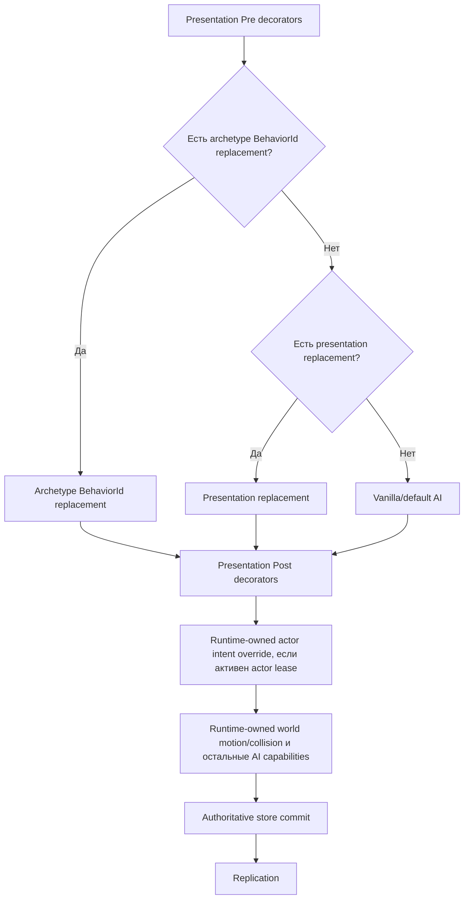

# Граница поведения NPC в TerraRuntime

TerraRuntime предоставляет доверенному host-слою интерфейс поведения NPC, не передавая ему владение симуляцией. Runtime остаётся единственным владельцем жизненного цикла NPC, generation identity, клиентского представления, проверки состояния, authoritative tick, движения и коллизий мира, боя и репликации.

Этот документ описывает только границу TerraRuntime. Адаптеры host-фреймворков, обнаружение плагинов, разрешения и API, специфичные для Vega, намеренно находятся вне этого слоя.

## Identity, представление и поведение разделены

У серверного кастомного NPC есть три независимые сущности:

- `GameplayArchetypeId` задаёт стабильную runtime/host identity кастомного archetype.
- `NpcArchetypeDescriptor.VanillaPresentationType` задаёт vanilla NPC type, который получает немодифицированный клиент Terraria.
- `NpcArchetypeDescriptor.BehaviorId` выбирает runtime-поведение, зарегистрированное для этого archetype.

Например, `example:resident-zombie` может использовать `VanillaNpcIds.Zombie` как представление и `example:resident-ai` как поведение. Официальный клиент продолжает рисовать обычного Zombie. TerraRuntime отдельно хранит custom archetype identity и вызывает зарегистрированное поведение для конкретной живой generation NPC.

Код поведения не может изменить `Type` или `NetId`. `NpcBehaviorState` намеренно содержит только изменяемое состояние симуляции: позицию, скорость, target, `ai[]` и `NpcSimulationState`. После callback TerraRuntime самостоятельно переносит текущие authoritative `Type` и `NetId` во внутренний state transition.

## Регистрация поведения

`INpcActorOperations` предоставляет два пути регистрации.

`RegisterBehaviorAsync(GameplayExtensionId, INpcBehaviorProvider, ...)` регистрирует exclusive replacement, адресуемый по archetype `BehaviorId`. Кастомный `NpcArchetypeDescriptor` выбирает его через `BehaviorId`. Несколько кастомных archetype могут использовать один и тот же vanilla presentation type, но разные behavior ID.

`RegisterPresentationBehaviorAsync(GameplayExtensionId, NpcTypeId, NpcBehaviorStage, int order, INpcBehaviorProvider, ...)` регистрирует поведение для vanilla presentation type. Поддерживаются стадии:

1. `Pre`, упорядоченные decorators перед replacement/default behavior.
2. `Replacement`, единственный replacement уровня type, если для живой generation не выбран archetype-specific replacement.
3. `Post`, упорядоченные decorators после replacement/default behavior.

Archetype-specific replacement имеет приоритет над type-level replacement. При этом type-level `Pre` и `Post` всё равно обрамляют выбранный replacement.

Регистрация сериализуется через authoritative command queue runtime. Успешный результат означает, что регистрация принята и поставлена в staged state; immutable dispatch snapshot становится видимым на следующей authoritative safe boundary. `Dispose()` у `INpcBehaviorRegistration` аналогично ставит регистрацию на retirement, которое публикуется только на безопасной границе tick.

## Callback поведения

`INpcBehaviorProvider.TryStep` является синхронным и выполняется на authoritative runtime thread. Он получает stack-only `NpcBehaviorContext`, содержащий:

- стабильный behavior ID;
- custom archetype ID, если конкретная живая generation принадлежит зарегистрированному archetype;
- текущий immutable `NpcSnapshot`;
- номер текущего authoritative tick;
- generation-safe запросы snapshot игроков и NPC;
- ограниченное перечисление NPC в предоставленный вызывающим кодом `Span<NpcSnapshot>`;
- запросы solid collision и line of sight.

Callback предлагает `NpcBehaviorState`. TerraRuntime сам отвечает за принятие или отклонение этого предложения и за все последующие authoritative стадии симуляции.

Callback не должен блокировать поток, выполнять I/O, спать, ждать task или создавать второго владельца симуляции. Граница не предоставляет изменяемые массивы NPC, tile storage, очереди пакетов или произвольную отправку сетевых пакетов.

## Authoritative pipeline

Для NPC без активного actor-control lease часть tick, связанная с поведением, концептуально выглядит так:



Behavior dispatcher входит в production AI chain `ServerRuntimeState`. Это не тестовый registry, существующий отдельно от сервера. Composition через `INpcAiStateStepperWrapper` сохраняется, поэтому вложенные vanilla capabilities, включая targeting, spawn planners, projectile planners и post-commit hooks, остаются доступными через wrapper chain.

## Ограниченные запросы мира

`NpcBehaviorContext` предоставляет семантические запросы вместо сырого доступа к состоянию мира:

- `TryGetPlayer(PlayerHandle, ...)`
- `TryGetPlayer(PlayerSlotId, ...)`
- `TryGetNpc(NpcHandle, ...)`
- `CopyNpcs(Span<NpcSnapshot>)`
- `HasSolidCollision(NpcBehaviorBounds)`
- `HasLineOfSight(NpcBehaviorBounds, NpcBehaviorBounds)`

Identity игрока и NPC generation-safe там, где используется handle с generation. Collision и line-of-sight делегируются version-pinned примитивам коллизий TerraRuntime.

В этот срез намеренно не входит произвольный spawn дочерних NPC или projectile непосредственно из callback поведения. Для этого нужны отдельные ограниченные runtime-owned request API, а не утечка store или packet access в callback.

## Lifecycle и unload

Регистрации поведения являются lease. Extensible host scope отслеживает их вместе с custom actor и archetype leases. При retirement scope очистка выполняется в таком порядке:

1. освобождаются actor controllers;
2. despawn-ятся actors, принадлежащие scope;
3. retire-ятся behavior registrations;
4. retire-ятся archetype registrations.

Registry публикует immutable snapshots только на safe boundary, поэтому callback не удаляется путём мутации dispatch table во время обхода authoritative tick. После commit retirement опубликованный snapshot больше не удерживает provider callback.

## Пример: Zombie с поведением жителя

Host может зарегистрировать behavior ID, затем archetype с vanilla-представлением Zombie и ссылкой на это поведение:

```csharp
var behaviorId = new GameplayExtensionId("example:resident-ai");
var archetypeId = new GameplayArchetypeId("example:resident-zombie");

NpcBehaviorRegistrationResult behavior = await runtime.NpcActors.RegisterBehaviorAsync(
    behaviorId,
    new ResidentZombieBehavior());

runtime.NpcActors.TryRegisterArchetype(
    new NpcArchetypeDescriptor(
        archetypeId,
        VanillaNpcIds.Zombie,
        behaviorId),
    out INpcArchetypeRegistration? archetype);

NpcActorSpawnResult spawned = await runtime.NpcActors.SpawnAsync(
    new NpcActorSpawnRequest(archetypeId, 100f, 200f));
```

Это граница кастомизации AI/runtime, а не автоматическое включение NPC в Town NPC subsystem. Housing, happiness, pylons, shops, arrival rules и остальные Town NPC механики остаются отдельными gameplay subsystem и не выводятся автоматически из presentation type или behavior кастомного NPC.
