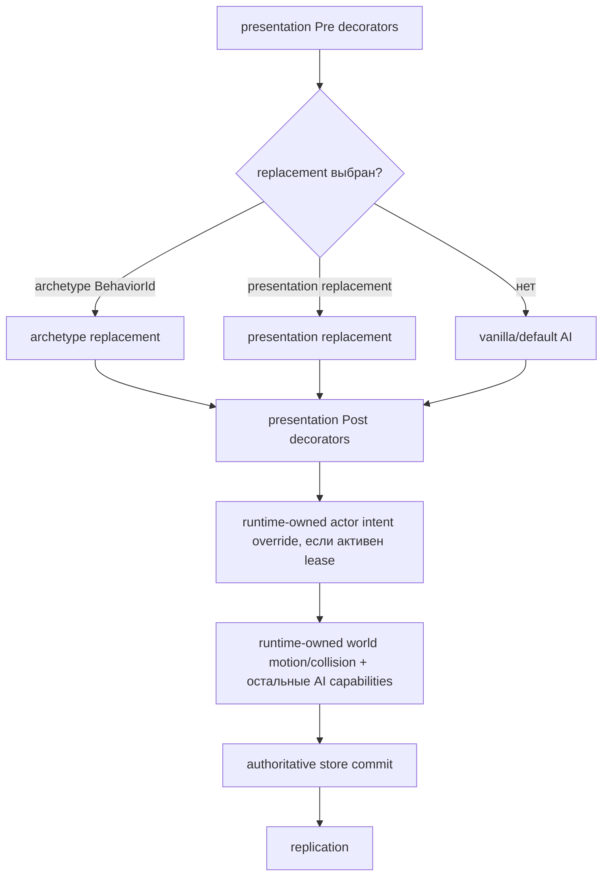

# Граница поведения NPC в TerraRuntime

TerraRuntime предоставляет доверенному host-слою интерфейс поведения NPC, не передавая ему владение симуляцией. Runtime остаётся единственным владельцем жизненного цикла NPC, generation identity, клиентского представления, проверки состояния, authoritative tick, движения и коллизий мира, боя и репликации.

Этот документ описывает только границу TerraRuntime. Адаптеры host-фреймворков, обнаружение плагинов, разрешения и API, специфичные для Vega, намеренно находятся вне этого слоя.

## Identity, представление и поведение разделены

У серверного кастомного NPC есть три независимые сущности:

- `GameplayArchetypeId` задаёт стабильную runtime/host identity кастомного archetype.
- `NpcArchetypeDescriptor.VanillaPresentationType` задаёт vanilla NPC type, который получает немодифицированный клиент Terraria.
- `NpcArchetypeDescriptor.BehaviorId` выбирает runtime-поведение, зарегистрированное для этого archetype.

Например, `example:resident-zombie` может использовать `VanillaNpcIds.Zombie` как представление и `example:resident-ai` как поведение. Официальный клиент продолжает рисовать обычного Zombie. TerraRuntime отдельно хранит custom archetype identity и вызывает зарегистрированное поведение для конкретной живой generation NPC.

Код поведения не может изменить `Type` или `NetId`. `NpcBehaviorState` намеренно содержит только изменяемое состояние симуляции: позицию, скорость, target, `ai[]` и `NpcSimulationState`. После callback TerraRuntime самостоятельно переносит текущие authoritative `Type` и `NetId` во внутренний state transition.

## Регистрация поведения

`INpcActorOperations` предоставляет два пути регистрации.

`RegisterBehaviorAsync(GameplayExtensionId, INpcBehaviorProvider, ...)` регистрирует exclusive replacement, адресуемый по archetype `BehaviorId`. Кастомный `NpcArchetypeDescriptor` выбирает его через `BehaviorId`. Несколько кастомных archetype могут использовать один и тот же vanilla presentation type, но разные behavior ID.

`RegisterPresentationBehaviorAsync(GameplayExtensionId, NpcTypeId, NpcBehaviorStage, int order, INpcBehaviorProvider, ...)` регистрирует поведение для vanilla presentation type. Поддерживаются стадии:

1. `Pre`, упорядоченные decorators перед replacement/default behavior.
2. `Replacement`, единственный replacement уровня type, если для живой generation не выбран archetype-specific replacement.
3. `Post`, упорядоченные decorators после replacement/default behavior.

Archetype-specific replacement имеет приоритет над type-level replacement. При этом type-level `Pre` и `Post` всё равно обрамляют выбранный replacement.

Регистрация сериализуется через authoritative command queue runtime. Успешный результат означает, что регистрация принята и поставлена в staged state; immutable dispatch snapshot становится видимым на следующей authoritative safe boundary. `Dispose()` у `INpcBehaviorRegistration` аналогично ставит регистрацию на retirement, которое публикуется только на безопасной границе tick.

## Callback поведения

`INpcBehaviorProvider.TryStep` является синхронным и выполняется на authoritative runtime thread. Он получает stack-only `NpcBehaviorContext`, содержащий:

- стабильный behavior ID;
- custom archetype ID, если конкретная живая generation принадлежит зарегистрированному archetype;
- текущий immutable `NpcSnapshot`;
- номер текущего authoritative tick;
- generation-safe запросы snapshot игроков и NPC;
- ограниченное перечисление NPC в предоставленный вызывающим кодом `Span<NpcSnapshot>`;
- запросы solid collision и line of sight.

Callback предлагает `NpcBehaviorState`. TerraRuntime сам отвечает за принятие или отклонение этого предложения и за все последующие authoritative стадии симуляции.

Callback не должен блокировать поток, выполнять I/O, спать, ждать task или создавать второго владельца симуляции. Граница не предоставляет изменяемые массивы NPC, tile storage, очереди пакетов или произвольную отправку сетевых пакетов.

## Authoritative pipeline

Для NPC без активного actor-control lease часть tick, связанная с поведением, концептуально выглядит так:



Behavior dispatcher входит в production AI chain `NpcAuthority`, который вызывается из `ServerRuntimeState`. Это не тестовый registry, существующий отдельно от сервера. Composition через `INpcAiStateStepperWrapper` сохраняется, поэтому вложенные vanilla capabilities, включая targeting, spawn planners, projectile planners и post-commit hooks, остаются доступными через wrapper chain.

## Ограниченные запросы мира

`NpcBehaviorContext` предоставляет семантические запросы вместо сырого доступа к состоянию мира:

- `TryGetPlayer(PlayerHandle, ...)`
- `TryGetPlayer(PlayerSlotId, ...)`
- `TryGetNpc(NpcHandle, ...)`
- `CopyNpcs(Span<NpcSnapshot>)`
- `HasSolidCollision(NpcBehaviorBounds)`
- `HasLineOfSight(NpcBehaviorBounds, NpcBehaviorBounds)`

Identity игрока и NPC generation-safe там, где используется handle с generation. Collision и line-of-sight делегируются version-pinned примитивам коллизий TerraRuntime.

В этот срез намеренно не входит произвольный spawn дочерних NPC или projectile непосредственно из callback поведения. Для этого нужны отдельные ограниченные runtime-owned request API, а не утечка store или packet access в callback.

## Source-backed вертикальный срез Wall of Flesh

Граница дохардмодных боссов теперь явно допускает Wall of Flesh (`NPC 113`) и его linked server-owned детей вместо generic fallback. Root выполняет source-shaped движение по коридору и стартовый bootstrap из 13 детей (два глаза и одиннадцать Hungry), а state глаз/Hungry сохраняет явную привязку к root. Runtime post-state intents покрывают leech, Good World Fire Imp, Expert Hungry pressure и laser projectile `83` глаз; damage по глазу перед lethal-finalization коммитится в общий life root.

Death path владеет обязательными server gameplay мутациями: normal/Expert/Master loot, source-shaped recovery drops, Demonite/Crimtane brick box с очисткой жидкости, cleanup детей и persisted Hardmode progression mutation. Cosmetic dust/gore/sound и client presentation остаются вне этой границы.

## Source-backed срез Deerclops AI_123

Текущая vanilla behavior chain включает gameplay-owned вертикальный срез Deerclops из TerrariaServer 1.4.5.8 (`NPC 668`, `aiStyle 123`). Runtime сохраняет исходную state machine вместо сведения босса к обычному наземному преследователю:

- state `0`: погоня и source-ordered выбор атаки;
- states `1` и `4`: фронтальная и двусторонняя атаки ice spikes;
- state `2`: залп rubble;
- state `3`: тайминг slow scream;
- state `5`: залп из шести shadow hands;
- states `6` и `7`: возврат домой и teleport-home recovery;
- state `8`: timeout despawn без обычного boss death loot.

`NpcAuthority` передаёт окружение поверх `WorldTileStore` через семантические запросы snow, walkability, solid tile и collision. Projectile side effects Deerclops остаются runtime-owned post-state intents: ice spike `961`, rubble `962` и shadow hand `965` проходят через обычный projectile authority, а не публикуются непосредственно из AI callback. Distance shield (`localAI[3]`) и его порог неуязвимости после тридцати тиков являются authoritative gameplay state.

Dedicated-server Expert-ветка passive shadow hands теперь authoritative. `localAI[2]` использует source life-scaled cadence 80→40 тиков, вращает три группы player slot, требует generation-safe per-NPC interaction credit и проверяет дистанцию 1200 пикселей перед staging projectile `965` с source damage `10`. Slow-scream state по-прежнему намеренно не применяет vanilla `Slow (buff 32, 720 ticks)`: закреплённая ветка исключена при `Main.netMode == 2`, поэтому такой buff на dedicated server был бы ложным parity, а не завершением. Deerclops остаётся ниже full vanilla AI parity только из-за более широких shared/global пробелов, а не этой server-executed projectile ветки.

## Source-backed срез поздних Hardmode/endgame боссов

Runtime-owned boss boundary теперь содержит оставшийся server-authoritative NPC-side state позднего Hardmode/endgame roster вместо encounter root, привязанных к metadata-only заглушкам projectile. Duke Fishron допускает AI 71 Sharkron/Sharkron2 с emergence/charge state и source-owned Sharknado Bolt `385`; projectile runtime теперь исполняет его aiStyle-65 movement и generation-safe on-kill переход в Sharknado `384` либо terrain-anchored Cthulunado `386`. Lunatic Cultist допускает Ancient Vision/Light/Doom, ritual spawn Dragon либо Vision, прерывание ритуала попаданием по настоящему боссу или копии и source-owned семейства атак `464/465/467/468/490/593`.

Empress of Light staging-ит специализированные lasting-rainbow, rainbow-streak, lance и sun-dance projectile (`872/873/919/923`); дневная ярость также переводит cadence в source Expert-like режим и даёт projectile damage `9999`, а не полагается только на сохранённый `ai[3]`. Attack clock рук, головы и True Eye Moon Lord следует закреплённым source sequence на 600/1200 тиков и staging-ит Phantasmal eye/sphere/deathray/leech/bolt intents (`452/454/455/456/462`). Moon Lord Hand также владеет закреплённым cross-entity release на tick 292: после commit точной generation руки только её generation-owned projectile type 454 получают `ai[0] = -1` и source speed 12. Первый смертельный удар по руке или голове теперь следует закреплённому переходу `NPC.checkDead`: life восстанавливается, часть становится неуязвимой в `ai[0] = -2`, из неё создаётся ровно один True Eye с исходным расчётом фазы по циклу 1200 тиков, базовому offset 588 и шагу 400 на каждый уже активный глаз, а core открывается только пока обе owned-руки и owned-голова всё ещё существуют в retired-state. Retired-голова также переходит в `ai[0] = -3`, когда core начинает death drama. Cosmetic sound/dust/gore остаются вне authority. Для Moon Lord ещё открыты полная 600-tick terminal death sequence core и точная vanilla self-termination при потере child-slot; внутренности специальных projectile style и оставшиеся seed-only условия Empress тоже остаются явной parity-работой.

## Lifecycle и unload

Регистрации поведения являются lease. Extensible host scope отслеживает их вместе с custom actor и archetype leases. При retirement scope очистка выполняется в таком порядке:

1. освобождаются actor controllers;
2. despawn-ятся actors, принадлежащие scope;
3. retire-ятся behavior registrations;
4. retire-ятся archetype registrations.

Registry публикует immutable snapshots только на safe boundary, поэтому callback не удаляется путём мутации dispatch table во время обхода authoritative tick. После commit retirement опубликованный snapshot больше не удерживает provider callback.

## Пример: Zombie с поведением жителя

Host может зарегистрировать behavior ID, затем archetype с vanilla-представлением Zombie и ссылкой на это поведение:

```csharp
var behaviorId = new GameplayExtensionId("example:resident-ai");
var archetypeId = new GameplayArchetypeId("example:resident-zombie");

NpcBehaviorRegistrationResult behavior = await runtime.NpcActors.RegisterBehaviorAsync(
    behaviorId,
    new ResidentZombieBehavior());

runtime.NpcActors.TryRegisterArchetype(
    new NpcArchetypeDescriptor(
        archetypeId,
        VanillaNpcIds.Zombie,
        behaviorId),
    out INpcArchetypeRegistration? archetype);

NpcActorSpawnResult spawned = await runtime.NpcActors.SpawnAsync(
    new NpcActorSpawnRequest(archetypeId, 100f, 200f));
```

Это граница кастомизации AI/runtime, а не автоматическое включение NPC в Town NPC subsystem. Housing, happiness, pylons, shops, arrival rules и остальные Town NPC механики остаются отдельными gameplay subsystem и не выводятся автоматически из presentation type или behavior кастомного NPC.
