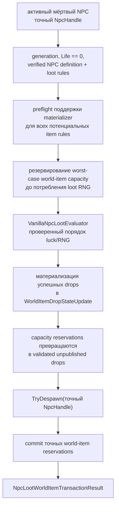

# Финализация смерти NPC, loot и world-item

TerraRuntime разделяет урон, определение смерти, вычисление loot, материализацию world-item и репликацию на отдельные gameplay-границы. Для source-backed среза Blue Slime теперь есть два пути финализации:

- `RuntimeNpcDeathLootFinalizer` вычисляет NPC-specific loot и возвращает семантические `NpcLootDrop`, после чего despawn'ит точное поколение NPC;
- `RuntimeNpcLootWorldItemTransaction` дополнительно координирует эти roll'ы с reservation API `RuntimeWorldItemStore`, поэтому server-owned death path может публиковать world-item без выдуманного клиентского `ConnectionHandle`.

Сама транзакция **не** решает Terraria item defaults, prefixes или spawn RNG. Эти source-backed факты принадлежат `INpcLootWorldItemMaterializer`, который обязан уметь полностью материализовать каждый item type, поддержку которого он объявляет.

## Поток транзакции

## Generation safety и exactly-once

Слоты NPC переиспользуются, поэтому номер слота не является идентичностью смерти. Транзакция требует

$$
H_{npc}=(slot, generation).
$$

Начальный lookup и финальный despawn работают с одним и тем же точным handle. Stale generation не может финализировать нового NPC, занявшего тот же слот. После успешной транзакции старое поколение уже не активно, поэтому повторный вызов завершается до loot RNG и materializer.

Результат сохраняет последнюю активную revision NPC перед despawn. Сам despawn очищает runtime-состояние слота, поэтому именно pre-despawn revision является осмысленной финальной revision для диагностики и последующего bookkeeping.

## Порядок работы с capacity

`RuntimeWorldItemStore` предоставляет unpublished generation-safe reservations. Транзакция резервирует количество слотов, достаточное для максимального числа drops в текущей импортированной последовательности NPC-specific правил, **до** вызова `VanillaNpcLootEvaluator`.

Это намеренно консервативное поведение. Нехватка capacity не должна сначала съесть player-luck/stack RNG, а затем оставить мёртвого NPC на повторную попытку уже с другим случайным результатом. Для текущего Blue Slime максимальное количество world-item равно двум: Gel и Slime Staff.

Reservation не видна snapshot/replication до commit. Неиспользованные reservations освобождаются без публикации предмета.

## Контракт materializer

`INpcLootWorldItemMaterializer.CanMaterialize(ItemTypeId)` является side-effect-free preflight. Если он возвращает `true`, то `TryMaterialize` обязан преобразовать корректный `NpcLootDrop` этого типа в валидный `WorldItemDropStateUpdate`. Если materializer объявил поддержку, а затем не смог выполнить её, это считается нарушением внутреннего контракта, а не поводом тихо удалить loot.

Materializer получает source-backed origin NPC loot. TerrariaServer 1.4.5.8 задаёт обычный центр NPC для drop следующим образом:

$$
x_c=\lfloor x_{npc}\rfloor+\left\lfloor\frac{w_{npc}}{2}\right\rfloor,
\qquad
y_c=\lfloor y_{npc}\rfloor+\left\lfloor\frac{h_{npc}}{2}\right\rfloor.
$$

Для Blue Slime проверенный размер NPC равен `24×18`, поэтому NPC в позиции `(10.9, 20.9)` даёт центр `(22, 29)`, что закреплено тестом runtime-транзакции.

## Уже закреплённые source-backed spawn-факты

Постоянный `NPC Loot Source Contract` скачивает официальный Windows TerrariaServer 1.4.5.8 с SHA-256

`d87e3faf08637f6be8882c63e7f11fb7e792b0230006309618473ece0f863e1e`

и проверяет соответствующий путь `CommonCode.DropItemFromNPC` / `Item.NewItem`. Сейчас закреплены следующие факты:

- обычный NPC loot использует центр NPC и `scattered = false`;
- `Item.NewItem` вызывается с natural-prefix request `-1` и обычным broadcast-поведением;
- размеры Gel равны `10×12`, Slime Staff `26×28`;
- ни Gel, ни Slime Staff не входят в `ItemID.Sets.ItemNoGravity`;
- начальная скорость поэтому задаётся как

$$
v_x=0.1R_x,\quad R_x\in[-30,30],
$$

$$
v_y=0.1R_y,\quad R_y\in[-40,-16].
$$

- Slime Staff входит в summon-prefix family;
- summon family содержит 22 проверенных rollable prefix ID;
- natural `Prefix(-1)` сначала имеет ветку `1/4` без prefix и затем применяет правило `ReducedNaturalChance`, где соответствующий выбранный prefix сохраняется с вероятностью `1/3`.

Эти факты являются evidence для конкретного vanilla materializer; сама транзакция не зависит от конкретной prefix-таблицы.

## Поведение при ошибках

Следующие пути завершаются до потребления loot RNG:

- invalid, live или stale NPC handle;
- отсутствующий source-backed NPC-specific loot table;
- слишком маленький caller output buffer;
- materializer не поддерживает хотя бы один потенциальный item rule;
- недостаточная world-item capacity.

Если materialization падает после того, как `CanMaterialize` обещал поддержку, либо точную staged reservation невозможно закоммитить при authoritative single-writer контракте, runtime выбрасывает исключение. Продолжить выполнение в таком состоянии означало бы молча нарушить death/loot transaction.

## Текущий охват

Каталог пока содержит только source-backed NPC-specific правила Blue Slime. Global loot rules, chained conditions, world/event conditions и остальные NPC остаются вне этого среза. Следующий слой — конкретный vanilla materializer для Gel/Slime Staff; до его подключения transaction boundary уже пригодна для production-композиции, но намеренно dependency-injected и не угадывает item defaults или prefix behavior.
