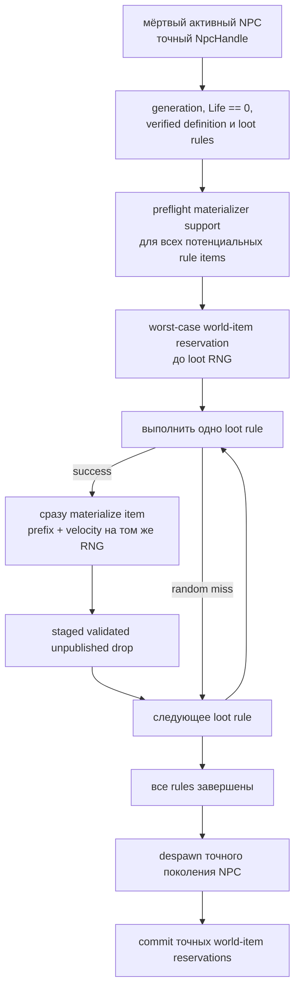

# Финализация смерти NPC, loot и world-item

TerraRuntime разделяет урон, определение смерти, вычисление loot, материализацию world-item и репликацию на отдельные authoritative-границы. Текущий срез Blue Slime уже может завершить server-owned смерть реальным world-item state без выдуманного клиентского `ConnectionHandle`.

## Production flow

Критичная деталь: loot теперь выполняется **потоково**, а не сначала целиком вычисляется и только потом materialize'ится.

## Почему нужен streaming

Pinned TerrariaServer 1.4.5.8 source доказывает, что `NPC.NPCLoot_DropItems` создаёт

`DropAttemptInfo { rng = Main.rand }`.

`CommonDrop.TryDroppingItem` выполняет luck check, потребляет `info.rng.Next(...)` для stack и немедленно вызывает `CommonCode.DropItemFromNPC`. Этот путь вызывает `Item.NewItem`, а natural prefix и default velocity там также потребляют `Main.rand` **до следующего loot rule**.

Поэтому обязательный порядок таков:

$$
R_i^{loot}\;\rightarrow\;R_i^{stack}\;\rightarrow\;R_i^{prefix}\;\rightarrow\;R_i^{velocity}\;\rightarrow\;R_{i+1}^{loot}.
$$

Если сначала собрать все `NpcLootDrop`, а затем создавать items, отдельные вероятности могли бы выглядеть правильно, но deterministic RNG stream уже отличался бы от vanilla. Транзакция теперь выполняет одно правило через `VanillaNpcLootEvaluator.TryEvaluateRule`, немедленно materialize'ит успешный результат и только затем переходит к следующему правилу.

## Generation safety и capacity

Идентичность NPC задаётся как

$$
H_{npc}=(slot,generation).
$$

Начальный lookup и финальный despawn используют один и тот же exact handle. Stale generation не может финализировать нового NPC в переиспользованном слоте, а повторный вызов после успешной транзакции завершается до RNG.

Reservations в `RuntimeWorldItemStore` unpublished и generation-safe. До потребления loot RNG транзакция резервирует максимальное число item slots, которое может потребовать импортированная последовательность правил. Для Blue Slime это два слота: Gel и Slime Staff. При нехватке capacity мёртвый NPC остаётся в store, luck/random не потребляются.

Это консервативное capacity-preflight намеренно отличается от opportunistic slot selection Terraria при почти полностью занятом item pool: TerraRuntime может отложить финализацию, если свободен только один слот, хотя одно из двух вероятностных правил могло бы не сработать. Такой компромисс исключает retry-driven RNG drift и частичный loot commit, пока общий loot transaction model ещё расширяется.

## Concrete Blue Slime materializer

`VanillaNpcLootWorldItemMaterializer` сейчас поддерживает два source-backed предмета Blue Slime:

| Item | Размер | Gravity | Natural prefix |
|---|---:|---|---|
| Gel (`23`) | `10×12` | обычная | отсутствует |
| Slime Staff (`1309`) | `26×28` | обычная | summon family |

Обычный NPC loot использует целочисленный центр NPC:

$$
x_c=\lfloor x_{npc}\rfloor+\left\lfloor\frac{w_{npc}}2\right\rfloor,
\qquad
y_c=\lfloor y_{npc}\rfloor+\left\lfloor\frac{h_{npc}}2\right\rfloor.
$$

Top-left world-item равен центру минус половина проверенных размеров item. Ни Gel, ни Slime Staff не входят в `ItemID.Sets.ItemNoGravity`, поэтому начальная скорость задаётся как

$$
v_x=0.1R_x,\quad R_x\in[-30,30],
$$

$$
v_y=0.1R_y,\quad R_y\in[-40,-16].
$$

## Natural prefixes Slime Staff

`VanillaItemPrefixCatalog` фиксирует точную summon family из 22 элементов официального сервера. `Prefix(-1)` воспроизводится в source-порядке:

1. `Next(4) == 0` даёт prefix `0`;
2. иначе равномерно выбирается один summon prefix;
3. prefix из `ReducedNaturalChance` сохраняется только при `Next(3) == 0`, иначе результат становится prefix `0`;
4. выполняется item-specific prefix validity; невалидный выбранный prefix запускает natural-prefix loop заново.

Для Slime Staff source-backed stat-rounding guards отвергают prefix ID `55`, `89` и `91`. Их damage multipliers после округления возвращают базовые `8` damage staff, поэтому vanilla считает modifier неэффективным и выполняет reroll.

Materializer выполняет prefix selection до velocity RNG, как и `Item.NewItem`.

## Source contract

`NPC Loot Source Contract` скачивает официальный Windows TerrariaServer 1.4.5.8 и фиксирует SHA-256:

`d87e3faf08637f6be8882c63e7f11fb7e792b0230006309618473ece0f863e1e`

Executable probe проверяет регистрацию rules, `Player.RollLuck`, stack ranges, центр NPC, размеры items, gravity membership, общий `Main.rand`, немедленный `CommonDrop → Item.NewItem`, summon-prefix family, `ReducedNaturalChance` и item-specific prefix validity Slime Staff.

## Вертикальный death-срез Deerclops

Deerclops теперь имеет явный импортированный boss-death path и не проваливается в обычную финализацию неизвестного NPC. Evaluator сохраняет порядок rules TerrariaServer 1.4.5.8 для реализованных difficulty branches:

- Expert: instanced Boss Bag `5111` с существующим `54000`-tick slot lease;
- Master: relic `5110` плюс независимые `1/4` pet rolls для каждого interacting player, item `5090`;
- Classic: mask `5109`, Chester `5098`, Eyebrella `5101`, shader `5113`, Dizzy Hat `5385` и один гарантированный weapon из `5117/5118/5119/5095`;
- все сложности: Deerclops trophy `5108` по source boss-trophy rule `1/10`.

Classic-путь гарантированного weapon намеренно сохраняет оба вложенных guaranteed `Next(1)` из `OneFromRulesRule(1)` и `OneFromOptionsNotScalingWithLuck(1)` до выбора weapon option. Active interacting players должны передаваться в порядке player slots, чтобы Master per-player rolls оставались синхронны с vanilla loop.

После успешной authoritative death выставляется `VanillaWorldProgressionId.Deerclops`. `.wld` progression header patcher теперь обновляет source-backed byte `downedDeerclops`, расположенный непосредственно после `downedQueenSlime`. Regression coverage выполняет round-trip мира текущего формата и доказывает, что patch меняет ровно один byte header, не затрагивая соседние Empress, Queen Slime и town-slime/truffle unlock flags.

## Текущие ограничения

Это всё ещё NPC-specific срез Blue Slime, а не весь Terraria loot engine. Global/chained rules, world/event conditions, money/heal drops и остальные NPC остаются следующими этапами. Killer/closest-player resolution и production-реализация `Player.RollLuck` также остаются отдельными обязанностями и не должны угадываться по переиспользуемому byte player slot.
