# Финализация смерти NPC и loot

TerraRuntime держит урон, финализацию смерти, вычисление loot и создание world-item отдельными gameplay-границами. Начальный finalizer связывает уже проверенное боевое состояние NPC с source-backed каталогом NPC-specific loot, не делая вид, что размещение предметов в мире каким-то образом решилось само.

## Поток

```mermaid
flowchart LR
    Damage["RuntimeNpcDamageExecutor\nLife -> 0"] --> Dead["активный мёртвый NPC\nточный NpcHandle"]
    Dead --> Finalizer["RuntimeNpcDeathLootFinalizer"]
    Finalizer --> Validate["generation + Life == 0\nесть source-backed loot"]
    Validate --> Loot["VanillaNpcLootEvaluator"]
    Loot --> Despawn["TryDespawn(точный handle)"]
    Despawn --> Result["NpcDeathLootResult + drops"]
    Result --> Future["будущая server-owned\nworld-item транзакция"]
```

Finalizer намеренно не является сетевым API. Он работает только с runtime-owned identity и состоянием.

## Exactly-once граница поколения

Слот Terraria NPC переиспользуется. Поэтому одного `slot` недостаточно для идентичности смерти. Для финализации требуется точный

$$
H_{npc}=(slot, generation).
$$

Finalizer сначала читает именно этот handle, а затем despawn'ит этот же handle. После успешной финализации повторный вызов со старым handle завершается до потребления loot RNG, потому что это поколение уже не активно.

По той же причине stale handle не способен финализировать нового NPC, случайно занявшего тот же byte-слот.

## Порядок

Для текущего импортированного среза Blue Slime:

1. точное поколение NPC всё ещё должно быть активно;
2. combat state должен быть материализован, а `Life == 0`;
3. должен существовать source-backed NPC-specific набор loot-правил;
4. caller-provided буфер drops должен быть достаточного размера;
5. loot-правила потребляют luck/RNG в проверенном исходном порядке;
6. точное поколение NPC despawn'ится;
7. `NpcDeathLootResult` сохраняет последнюю pre-despawn revision, тип и координаты для следующего этапа.

Пути invalid/live/stale/unsupported/short-buffer не потребляют loot RNG.

## Почему world-item здесь ещё не создаются

Runtime world-item store уже имеет reservation primitives, но NPC loot всё ещё требует pinned TerrariaServer 1.4.5.8 evidence для соответствующего порядка `NPC.NPCLoot` / `Item.NewItem`: размещение, размеры, скорость и ownership. Переиспользовать константы tile-drop или придумать универсальную точку spawn означало бы получить правдоподобную, но ложную vanilla parity.

Следующий integration-этап сможет резервировать server-owned world-item capacity, материализовать source-backed состояние создаваемого предмета и коммитить drops без поддельного `ConnectionHandle`.

## Текущий охват

`RuntimeNpcDeathLootFinalizer` сейчас успешно работает только там, где `VanillaNpcLootEvaluator` имеет импортированный NPC-specific rule set. На данный момент это Blue Slime. Неподдержанный мёртвый NPC остаётся активным и мёртвым, чтобы верхний слой не мог тихо удалить ещё не реализованный loot path.
