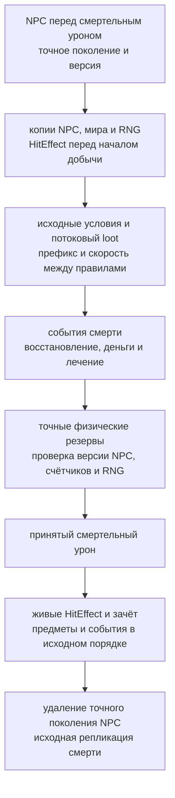

# Финализация смерти NPC, loot и world-item

Отложенное рождение сохраняет исходную границу удара. Серверный удар объявляет ожидающее поколение с состоянием до удара перед пакетом `28`; принятый клиентский урон завершает loot и эффекты смерти перед объявлением состояния после удара и ретрансляцией `28`. Адресный replay при подключении сохраняет ожидающее широковещательное объявление. Замена точного поколения публикует предыдущее ожидающее рождение. Общее здоровье Destroyer берётся из точного снимка головы и применяется внутри принятого изменения урона; отказ в приёме смертельного удара сохраняет состояния сегмента и головы, ожидающую публикацию и игровой RNG. Эталоны оригинального recording socket содержат 32 случая Bee и 64 случая Blue Slime; завершающий смертельный `23` вызывается явно в harness как более поздняя публикация и не доказывает полный внешний update.

2026-10-04 седьмой блок gameplay/NPC принят на базе `52c8c5ab`: сохранённые планы состояния/RNG/defaults и выполнение AI002 в мире, исходный выбор владельца предметов и клиентское создание/таймеры, допущенные контекстные эмоции жителей, сохранение HP Immortal и исходная арифметика отбрасывания. Полный прогон **1 182 793/1 182 793** проходит за **513,212 с**, без отказов, ошибок и пропусков; чистая Release-сборка, Windows NativeAOT/пять smoke-проверок и проверки документации/литералов/графа/staged diff успешны. Исходники и тесты за время приёмки не менялись: `2b4baf3527e7c98579b702c7b05796e4343b0654174d6039ffe1123374e4c200`. Артефакт `.cache/flying-eye-owner-emotes-final-status.json`. FullVanillaAiParity=false; общие N1–N5, Linux NativeAOT, непредставленные цели/кадры AI002, выбранные неизвестные контексты жителей и instanced item400 остаются открытыми. Далее — содержимое слизней/Hive/Bee, исходная добыча механических призывов перед содержимым и авторитетные контексты биомов жителей. Push не запрошен.

2026-10-04 шестой блок gameplay/NPC принят на базе `36bd2a15`: Big Mimic 473..476 AI87 с отражением и пушкой, парные разговоры/RPS и кадры обычных жителей, лечение Nurse 13/584, исходное распределение предметов с переполнением и временными пакетами индекса400, физические производители выпадений и общая отправка server strike28 перед итоговым23. Полный прогон 1,088,799/1,088,799 проходит за 397.240 с без отказов, ошибок и пропусков; чистая Release-сборка, Windows NativeAOT, пять smoke-проверок и проверки документации/литералов/графа/diff проходят. Хэш всех исходников и тестов, включая новые файлы, сохраняется: `c60e7b8a9d27d7deaaab2a02c87b2bb03b6d69f611d02cdcd6a1ccf2bf9ef7cc`. При отказе подготовленного выпадения тайлов owned RNG не меняется; ловля NPC отправляет21→22→23 с исходными полями задержки. Артефакт `.cache/big-mimic-social-overflow-final-status.json`. FullVanillaAiParity=false; общие N1-N5 и Linux NativeAOT остаются открытыми. Поиск владельца None400 при активных игроках, instanced400, контекстные эмоции, мокрые/специальные жители и импортированный Life выше LifeMax ограничены до представления исходных фактов. Далее — исходная геометрия/цели/RNG AI002 и поиск владельца предмета по owned инвентарю и эффектам игрока. Push не запрошен.

Принятый шестой блок добавляет публикацию серверных ударов на общей границе боя. Проверка допустимости и подготовка смерти завершаются перед неопубликованным изменением точного поколения NPC; затем packet 28 передаёт исходные урон, отбрасывание, направление и флаг критического удара. Выживший NPC публикует итоговый packet 23; погибший — окончательное исчезновение после принадлежащих runtime эффектов смерти, без промежуточного пакета Life=0. Входящий клиентский packet 28 сохраняет отдельное подтверждение и исключение отправителя. Записи оригинала охватывают уже опубликованных NPC; pending-spawn и произвольные прямые вызовы остаются вне этого среза. Большой положительный урон в пакете ограничивается short.MaxValue на проверенном Windows-хосте net11.

Седьмой блок сохраняет HP принадлежащих runtime NPC с `Immortal`, сохраняя рассчитанный урон, `JustHit`, отбрасывание и исходные пакеты удара. Такие удары не входят в подготовку смерти. Обычное отбрасывание использует исходное непроверяемое 32-битное произведение урона для порога stagger, включая переполнение. Независимые записи оригинала содержат 9720 вызовов отбрасывания; 3240 различных runtime-случаев проходят, а возврат прежнего широкого произведения ломает 1509 случаев без ошибок runner. Среди 323 проверок пакетов есть бессмертные NPC в обоих серверных путях боя; удаление только сохранения HP ломает 160 проверок. Эти focused-результаты включены в седьмую общую приёмку. Остальные особые модификаторы отбрасывания NPC остаются вне этой обычной ветки.

Общая приёмка 2026-10-04: блоки Mothron/Mother, лечения и начала смерти, баннеров и бестиария, контактов жителей, регенерации и Stinky проходят 664 317 из 664 317 тестов за 404,906 с, без ошибок и пропусков. Release-сборка, Windows NativeAOT, пять smoke-проверок и проверки документации, домена, зависимостей и diff проходят; код и тесты за время проверки не изменились. Входящий контактный урон отправляет пакет 28 перед итоговым 23. Linux NativeAOT, полные N1–N5, переполнение предметов и существующая публикация не-клиентских и пользовательских ударов остаются открытыми.

Блок начала смерти владеет пакетом достижений 97, зачётом убийств в бестиарии и счётчиками баннеров, доступных для получения. Предварительный план сохраняет ранние запреты добычи в данже, условия последнего сегмента Пожирателя и последнего Близнеца, зачёт до подавления добычи статуи и исходное короткое замыкание RNG. Зачёт взаимодействий корня и собственная маска NPC остаются разными. Выбор игрока для баннера следует квадрату расстояния между float-центрами из `NPC.FindClosestPlayer`, отдельно от геометрии `Player.FindClosest` для денег и лечения. Обычная сборка вычисляет `Main.onlyShimmerOceanWorlds` из сохранённых признаков мира: это подтверждают 32 вызова исходного getter и принятые, подавленные и отклонённые смерти в данже. Удаление проекции вызывает два падения утверждений в 42 проверках. Пользовательский host без нужных фактов отклоняет соответствующую смерть до урона.

В 1.4.5.8 порог баннера увеличивает счётчик доступных наград и не создаёт предмет мира. Запрос модуля 11 использует текущее аутентифицированное поколение игрока, заменяет количество ноль на один, выдаёт доступный минимум и сообщает об отказанном остатке. Исходная доставка в курсор и инвентарь остаётся локальной задачей клиента. Клиент не может записывать серверные счётчики или полное состояние. Неизменяемые опубликованные кадры баннеров и известных записей бестиария передаются до пакета 49 при запросе секций; переход в другой мир тоже получает актуальный baseline до handoff. Неизвестные сохранённые ключи бестиария остаются в файле без выдуманных клиентских идентификаторов.

Checkpoint отделяет массивы баннеров и все три коллекции бестиария. Writer заменяет только декодированный диапазон баннеров в заголовке, перестраивает указатели секций и сохраняет принадлежащую runtime секцию бестиария. Чужие байты заголовка и сохранённые sight/chat переживают запись. Layout 4 подготовленного cache инвалидирует старые проекции. Массивы баннеров ограничены исходными 293 элементами; заполненный допустимый бюджет бестиария отклоняет новый ключ в предварительном плане смерти вместо принятия несохраняемого состояния.

Независимые данные включают 697 строк defaults, 762 идентичности зачёта, 293 обратных соответствия баннеров, 199 кадров модулей, семь исходных кадров пакета 97, тридцать выполненных исходных запросов награды и шестьдесят исходных изменений счётчиков, 216 полных исходных смертей статуй с подавленной добычей и 256 исходных случаев геометрии выбора игрока для баннера. Тридцать два исходных выполнения условий достижений фиксируют адресованные байты и отсутствие уведомления. Изолированный graph проходит 2582 проверки, включая полный checkpoint мира, загрузку, продолжение после перезапуска и порядок начального подключения. Отключение только нового зачёта, условий статуй, изменения награды, replay и геометрии выбора цели в копии Application приводит к 345 падению утверждений без ошибок runner. Отдельное удаление только публикации зачёта в pipeline ломает все три проверки принятой смертельной атаки при сохранённых API helper. Структурный бюджет исходящей очереди включает один кадр баннеров и до 762 известных записей каждого tracker бестиария: предел для восьми игроков составляет 6771 кадр при сохранённом бюджете 16 MiB. Этот блок включён в общую приёмку выше. Полные достижения встречи, произвольные непредставленные связи `realLife`, открытие sight/chat и исходное переполнение world-item остаются открытыми.

Блок лечения планирует `NPC.NPCLoot_DropHeals` после денег и публикует точные зарезервированные физические предметы отдельной фазой. Общие проверки удачи выполняются перед проверками урона, максимального здоровья и потребности игрока; предложение сердца остаётся условным после предложения маны. Особые сердца сохраняют исходный порядок, включая `Next(4)` сегмента Пожирателя до проверки здоровья. Отдельный путь сердца Пожирателя удалён: все допущенные пути смертельного урона используют одного владельца. Потребность определяется по сохранённому состоянию ближайшего игрока; отсутствующие необязательные характеристики не означают потребность. Произвольные callbacks и неизвестные исходные состояния игроков остаются вне этого представления.

Матрица из 22 464 вызовов оригинала охватывает 39 NPC, боевые характеристики, удачу, потребности здоровья и маны, сложность и материализацию юбилейного мира. Типизированный helper совпадает по физическим предметам и следующему RNG. Изолированный граф Application проходит 25 339 focused и 38 499 соседних случаев смерти, лута и боссов. Отключение только лечебной фазы вызывает 116 ожидаемых падений в 153 соседних случаях без ошибок runner. Эталоны только денежной фазы сохранены отдельно от обновлённых связанных вызовов. Этот лечебный этап включён в общую приёмку выше.

TerraRuntime разделяет урон, определение смерти, вычисление loot, материализацию world-item и репликацию на отдельные authoritative-границы. Текущий срез Blue Slime уже может завершить server-owned смерть реальным world-item state без выдуманного клиентского `ConnectionHandle`.

## Production flow

```mermaid
flowchart TD
    Validate["NPC перед смертельным уроном\nточное поколение и версия"] --> Preview["копии NPC, мира и RNG\nHitEffect перед началом добычи"]
    Preview --> Rules["исходные условия и потоковый loot\nпрефикс и скорость между правилами"]
    Rules --> Tail["события смерти\nвосстановление, деньги и лечение"]
    Tail --> Reserve["точные физические резервы\nпроверка версии NPC, счётчиков и RNG"]
    Reserve --> Damage["принятый смертельный урон"]
    Damage --> Publish["живые HitEffect и зачёт\nпредметы и события в исходном порядке"]
    Publish --> Despawn["удаление точного поколения NPC\nисходная репликация смерти"]
```

Критичная деталь: loot теперь выполняется **потоково**, а не сначала целиком вычисляется и только потом materialize'ится.

## Почему нужен streaming

Pinned TerrariaServer 1.4.5.8 source доказывает, что `NPC.NPCLoot_DropItems` создаёт

`DropAttemptInfo { rng = Main.rand }`.

`CommonDrop.TryDroppingItem` выполняет luck check, потребляет `info.rng.Next(...)` для stack и немедленно вызывает `CommonCode.DropItemFromNPC`. Этот путь вызывает `Item.NewItem`, а natural prefix и default velocity там также потребляют `Main.rand` **до следующего loot rule**.

Поэтому обязательный порядок таков:

$$
R_i^{loot}\;\rightarrow\;R_i^{stack}\;\rightarrow\;R_i^{prefix}\;\rightarrow\;R_i^{velocity}\;\rightarrow\;R_{i+1}^{loot}.
$$

Если сначала собрать все `NpcLootDrop`, а затем создавать items, отдельные вероятности могли бы выглядеть правильно, но deterministic RNG stream уже отличался бы от vanilla. Транзакция теперь выполняет одно правило через `VanillaNpcLootEvaluator.TryEvaluateRule`, немедленно materialize'ит успешный результат и только затем переходит к следующему правилу.

## Generation safety и capacity

Текущий контракт выделения и независимые проверки переполнения описаны в [Распределении предметов по исходнику](world-item-allocation.md).

Идентичность NPC задаётся как

$$
H_{npc}=(slot,generation).
$$

Начальный lookup и финальный despawn используют один и тот же exact handle. Stale generation не может финализировать нового NPC в переиспользованном слоте, а повторный вызов после успешной транзакции завершается до RNG.

Транзакция смерти материализует фактические выпадения по порядку на копии RNG, затем рассчитывает выбор слотов на отдельном `RuntimeWorldItemStore.AllocationPreview`. До смертельного урона она проверяет сохранённое состояние предметов и отложенных переносов и удерживает затронутые физические слоты. Полная таблица допускает замену или объединение; отдельный пустой слот для каждого возможного правила больше не требуется.

Отклонённый устаревший или неподдерживаемый план сохраняет NPC, RNG и живые предметы. Неизвестные временные резервации исключены из вытеснения. Принятая замена продвигает поколение, удаляет старый активный предмет перед новым выпадением и может повторно использовать один слот несколько раз в пределах одной смерти.

## Concrete Blue Slime materializer

`VanillaNpcLootWorldItemMaterializer` сейчас поддерживает два source-backed предмета Blue Slime:

| Item | Размер | Gravity | Natural prefix |
|---|---:|---|---|
| Gel (`23`) | `10×12` | обычная | отсутствует |
| Slime Staff (`1309`) | `26×28` | обычная | summon family |

Обычный NPC loot использует целочисленный центр NPC:

$$
x_c=\operatorname{trunc}(x_{npc})+\left\lfloor\frac{w_{npc}}2\right\rfloor,
\qquad
y_c=\operatorname{trunc}(y_{npc})+\left\lfloor\frac{h_{npc}}2\right\rfloor.
$$

Левый верхний угол физического предмета равен центру минус $8\,\mathrm{px}$ по каждой оси. Тело `WorldItem` имеет размер $16\times16\,\mathrm{px}$; размеры item defaults описывают данные предмета. Ни Gel, ни Slime Staff не входят в `ItemID.Sets.ItemNoGravity`, поэтому начальная скорость задаётся как

$$
v_x=0.1R_x,\quad R_x\in[-30,30],
$$

$$
v_y=0.1R_y,\quad R_y\in[-40,-16].
$$

## Natural prefixes Slime Staff

`VanillaItemPrefixCatalog` фиксирует точную summon family из 22 элементов официального сервера. `Prefix(-1)` воспроизводится в source-порядке:

1. `Next(4) == 0` даёт prefix `0`;
2. иначе равномерно выбирается один summon prefix;
3. prefix из `ReducedNaturalChance` сохраняется только при `Next(3) == 0`, иначе результат становится prefix `0`;
4. выполняется item-specific prefix validity; невалидный выбранный prefix запускает natural-prefix loop заново.

Для Slime Staff source-backed stat-rounding guards отвергают prefix ID `55`, `89` и `91`. Их damage multipliers после округления возвращают базовые `8` damage staff, поэтому vanilla считает modifier неэффективным и выполняет reroll.

Materializer выполняет prefix selection до velocity RNG, как и `Item.NewItem`.

## Source contract

`NPC Loot Source Contract` скачивает официальный Windows TerrariaServer 1.4.5.8 и фиксирует SHA-256:

`d87e3faf08637f6be8882c63e7f11fb7e792b0230006309618473ece0f863e1e`

Executable probe проверяет регистрацию rules, `Player.RollLuck`, stack ranges, центр NPC, размеры items, gravity membership, общий `Main.rand`, немедленный `CommonDrop → Item.NewItem`, summon-prefix family, `ReducedNaturalChance` и item-specific prefix validity Slime Staff.

## Вертикальный death-срез Deerclops

Deerclops теперь имеет явный импортированный boss-death path и не проваливается в обычную финализацию неизвестного NPC. Evaluator сохраняет порядок rules TerrariaServer 1.4.5.8 для реализованных difficulty branches:

- Expert: instanced Boss Bag `5111` с существующим `54000`-tick slot lease;
- Master: relic `5110` плюс независимые `1/4` pet rolls для каждого interacting player, item `5090`;
- Classic: mask `5109`, Chester `5098`, Eyebrella `5101`, shader `5113`, Dizzy Hat `5385` и один гарантированный weapon из `5117/5118/5119/5095`;
- все сложности: Deerclops trophy `5108` по source boss-trophy rule `1/10`.

Классическая обёртка гарантированного оружия расходует три `Next(1)`: внешний шанс, выбор единственного дочернего правила и шанс правила вариантов. Четвёртый вызов выбирает оружие; фиксированный стек не требует дополнительного броска. Трофей регистрируется раньше правил босса в `ItemDropDatabase.Populate`. Взаимодействующие игроки передаются по порядку слотов.

После успешной authoritative death выставляется `VanillaWorldProgressionId.Deerclops`. `.wld` progression header patcher теперь обновляет source-backed byte `downedDeerclops`, расположенный непосредственно после `downedQueenSlime`. Regression coverage выполняет round-trip мира текущего формата и доказывает, что patch меняет ровно один byte header, не затрагивая соседние Empress, Queen Slime и town-slime/truffle unlock flags.

## Текущие ограничения

Поддержанные семейства наград NPC, восстановление боссов и денежный callback используют общий порядок смерти. Общие/цепочечные rules, счётчики banner/bestiary, обычное лечение, проверки статуй и полные условия мира/событий остаются открытыми. Выбор ближайшего игрока учитывает живое целочисленное тело NPC, тело игрока на ездовом существе, манхэттенское расстояние, фильтр мёртвых игроков и первый слот при равенстве; сохранённая удача игрока поступает в существующую границу бросков обычных наград.

## Объявления о боссах

Существующие пути призыва через тайлы, пакет `61`, Slime Rain и Mechdusa отправляют исходное локализованное сообщение о боссе только после успешного авторитетного выделения NPC. Retinazer отправляет `LegacyMisc.48`; Spazmatism не отправляет сообщение о появлении; Mechdusa отправляет `LegacyMisc.107` один раз для основного Prime. События рассылаются играющим участникам и не повторяются как исходное состояние при подключении.

Смерть поддерживаемых боссов объявляется после добычи и прогресса, перед удалением. Первый Twin не объявляет победу, пока другой активен; последний отправляет множественное объявление `Enemies.TheTwins`. Только последний сегмент Eater отмечает победу, сохраняя ключ локализации именно этого сегмента. Moon Lord использует `Enemies.MoonLord` на авторитетном терминальном тике смерти $600\,\text{тиков}$; смерти частей, уход и устаревшие терминальные вызовы не объявляют победу. Текстовый модуль протокола `326` сохраняет вложенные ключи локализации, автора `255` и исходный цвет босса/события `(175,75,255)`. Пять независимых эталонных пакетов получены из официального сериализатора `1.4.5.8`. Остальные источники появления, объявления событий и полная совместимость представления боссов остаются открытыми.

Обычная добыча King Slime в Classic теперь имеет исходные размеры и признаки отсутствия префиксов для всех девяти ранее отсутствовавших наград, включая обязательную одежду Ninja, Solidifier и ветвь Slime Hook/Slime Gun. Принятый смертельный удар поэтому завершает обычную добычу и смерть; ранее материализатор отклонял эти обязательные предметы. Порядок правил добычи сохранён; открытие мешков и полная совместимость общих правил добычи остаются открытыми.

Общий материализатор теперь размещает физическое тело $16\times16\,\mathrm{px}$. Общая транзакция и все сохранённые пути добычи Application используют усечённые координаты NPC плюс половину текущего целочисленного хитбокса, включая размеры, заданные AI. Размеры item defaults остаются отдельными. Независимые записи оригинала проверяют три размера тела при дробной позиции NPC.

`VanillaBossRecovery1458` заменяет восстановление только для Стены плоти. Порядок оригинала: импортированная добыча, специальные эффекты `DoDeathEvents`, восстановление, затем объявление победы. Выпадает стек зелья $5\ldots15$, затем $5\ldots9$ сердец; тип зелья определяется ветвями оригинала. Первый Близнец, нетерминальный сегмент Пожирателя и оболочки Лунного лорда восстановления не дают; ядро восстанавливает предметы на принятом терминальном тике $600$ с проверкой поколения. `VanillaBossRecoveryDailyState1458` принадлежит часам мира: связывает убийства Глаза и Стены, выдаёт одну шляпу Badger и очищает оба флага. Сумерки и новый владелец мира сбрасывают временное состояние; рассвет и сохранение его не переносят.

`VanillaSeasonalItemDropFacts1458` заменяет сердца/звёзды до RNG префикса и скорости. Юбилейный выбор имеет приоритет; одновременные Halloween/Christmas случайно выбирают одну из замен. Композиция передаёт сохранённые принудительные сезонные факты мира; обычная календарная активация остаётся открытой. `VanillaBossRecoveryItemCatalog1458` содержит проверенные данные зелий и подбираемых предметов. `VanillaBossRewardItemPrefixFacts1458` задаёт точные семейства и ограничения округления шестнадцати наград оружия/аксессуаров, не расширяя применение оружия. Семь оценщиков теперь проверяют трофей до специальных правил босса; фиксированные стеки правил вариантов не вводят дополнительных бросков.

Распределитель теперь владеет возрастом предметов и начальными смещениями защиты, заменой подбираемых предметов старше 1200 тиков, серверным порогом слота 360, аварийным объединением и выбором по возрасту либо разности возраста и cooldown. Общий владелец напрямую реализует тринадцать интерфейсов наград, восстановление и общий путь rules. Принятые фазы сохраняют порядок импортированные награды → собственные события → восстановление → деньги → исцеление; адресная доставка принимает выбранное поколение без нового выделения. План ограничен 400 выпадениями, 4096 попытками разбиения денег и 4096 операциями выделения. Обычный sentinel 400 потребляет RNG материализации, но не создаёт физический объект сервера. Адресный sentinel 400 отклоняется до смертельного изменения: его клиентские wire/expiry ownership ещё не представлены.

Предпросмотр NPC сохраняет не более $256$ физических слотов, защиту распределителя, поколения и ревизии без публикации дочерних NPC. Копии часов/прогрессии сохраняют скалярное состояние и отдельный суточный журнал восстановления. Провайдер контекста появления — доверенный вход только для чтения в потоке владельца; он вызывается один раз. Реальные границы фаз проверяют полное живое состояние RNG до перехода к вычисленной контрольной точке. Дочернее появление в Good World с независимым/пользовательским RNG NPC либо сработавший непрозрачный callback появления короля во время Slime Rain отклоняется до собственного смертельного изменения; такие callbacks нельзя вызывать спекулятивно. Произвольные рекурсивные callbacks выделения не входят в синхронный контракт допуска. Ошибка адресной отправки сохраняет принятую аренду вместо повторного использования слота уже наблюдаемого мешка.

`NpcSimulationState.MoneyValue`, `ExtraMoneyValue` и `Midas` — сохранённые серверные факты. Новые поддержанные NPC получают проверенные денежные defaults, нулевую добавку и false Midas; обновление состояния сохраняет представленные значения, включая ноль. Денежный helper выполняется после восстановления, потребляет исходный случайный пролог даже при нулевой стоимости, выбирает лучший/худший результат по удаче ближайшего игрока, применяет сохранённые Midas/Blood Moon/добавку и материализует каждую монету до следующего разбиения. Нулевой стек старшего номинала не выделяет `Item.NewItem` и не бросает скорость, поэтому может потребоваться следующая ограниченная попытка. Монеты используют общий физический материализатор $16\times16\,\mathrm{px}$ без естественного префикса. Производители фактов подбора монет/revenge и общего статуса Midas остаются открытыми. Положительные денежные defaults следуют исходной кривой сложности; отрицательные net-варианты сохраняют записанный порядок целочисленного усечения при обычных runtime strengths `0.5/1/2/3/4`, а дробная сила вариантов и неподдержанные варианты особых миров остаются закрытыми.

Независимые исполняемые данные включают $1152$ прямых случая восстановления, $2592$ допустимых suffix после imported loot по сезонным режимам, сложности и живым телам, $108$ полных Classic цепочек imported/recovery без сезонных глобальных правил, 64 материализации сердечек/звёзд и 16 полных prefix-family/stat-guard captures. Проверяются порядок предметов, stack, prefix, позиции, скорости и следующий RNG. Suffix начинается на захваченном исходном курсоре после imported loot и не доказывает пропущенные глобальные правила. Pipeline проверяет терминальные условия, повторные и устаревшие смерти, пару Badger, сброс при сумерках и допустимую нагрузку. Эти проверки вводят один retained `VanillaUnifiedRandom1458`; production теперь разделяет RNG создания NPC, AI, loot и projectiles, но точное соответствие пропущенных callbacks остаётся открытым. Общий pickup, открытие бестиария, календарная authority, полное переполнение world-item и открытие сумок остаются открытыми.

Дополнительно 64 независимых записи Item.NewItem проверяют обе ветви сезонных замен: сердца и звёзды, их позиции, скорости и следующий результат RNG.

Данные денег добавляют 1120 исходных `NPCLoot_DropMoney` по стоимости, luck, Midas, Blood Moon и extra value; 1915 положительных defaults и 180 отрицательных вариантов; 108 принятых Classic цепочек callbacks по живым телам и терминальным условиям; 32 исходных случая `Player.FindClosest` для геометрии, смерти и ничьих. Сохраняются порядок монет, stack, физические origin, скорости и следующий RNG. Classic-цепочка изолирует callbacks imported/recovery/money и не заявляет пропущенные баннеры, общее лечение или полную встречу. Ещё восемь default-composition цепочек сохраняют создание NPC, реальные loot/recovery/money Глаза, завершение флакона dedicated server и следующее создание NPC на общем владельце RNG. Эта историческая money-only матрица не включает новые callbacks начала смерти и лечения. Общий pickup, открытие бестиария, календарная authority, полное переполнение и открытие сумок остаются открытыми.

NPC death allocation использует однократно связанные owner facts и guarded physical/sentinel21→22 publication из [world-item allocation](world-item-allocation.md). Source instanced noBroadcast пропускает обычный owner search; непредставленные pickup modifiers и instanced sentinel400 отклоняются до death mutation.

Восьмой блок выполняет глобальные механические призыватели до `SlimeBodyItemDropRule`, материализуя каждый предмет до следующего глобального или NPC-specific правила. Порядок: незавершённый Destroyer/Worm556, Twins/Eyes544, Skeletron Prime/Skull557; для каждого используется `RollLuck(2500)`, только первый успех, stack1 без броска размера. Немедленные prefix/velocity draws `NewItem` предшествуют содержимому слизня. Загруженные baseline-флаги объединяются с owned журналом прогрессии; synthetic context по умолчанию обозначает новый мир. Death plan проверяет захваченный снимок прогрессии до принятия смертельного урона. Original mechanical evidence:61 440 direct/coupled строк и12 defaults; copied controls пропуска/перестановки/лишнего stack draw дают10080/2016/2880 ошибок assertions без runner errors.

Содержимое соответствует source `SlimeCanContainItems` для типов1/59/147/184/537 и положительного ai1 нижеItemID.Count. Retained ID усечён до целого, source inclusive stack range бросается даже для фиксированного1..1. Sparse catalog добавляет независимо captured60 исходов генератора, проверенные sibling Desert Fossil3347 и Conveyor Belt3610, а также Ice Cream4026. Уже проверенные retained-item materializers остаются доступными; неизвестное eligible содержимое отклоняет detached whole-death plan до мутации NPC/предметов и переноса live RNG. Обычный nongood Torch отличается от пока отклоняемого GoodWorld ignition producer. Defaults Herb/Web не разрешают их не принадлежащие runtime same-tick tile effects.

Полный принятый NPC-specific хвост: Lava Slime без обычного правила; Blue Slime Gel1..2, затем Slime Staff10000/7000; Ice/Spiked Ice food4026 с шансом150 и `NotFromStatue` до Gel/Staff; Sand Slime Gel2..3, затем Staff8000/5600. Успешная награда материализуется сразу, включая фиксированный food stack draw и natural prefix. Statue suppression в source prelude отделён от food condition. Evidence:260 original defaults/prefix строк,21 080 direct contained-rule строк,21 286 полных imported callbacks (199 food и7 Staff),8060 последовательностей imported→zero-value money→full-vitals healing, сравниваемых с реальным lethal ingress и next RNG. Standard host и реальный writer проверяют physical21→selected-owner22, generation-safe duplicate rejection и отсутствие повторного RNG. Это ограниченное доказательство callbacks/owned lifecycle, а не непрерывного vanilla encounter или всех global loot. Поздние holiday/biome keys, souls, Living Flames, Pirate Map и yoyo globals остаются открытыми; captured clear-world contexts исключают их source gates. Whole-death claims, unknown allocation leases и stale generation/currentness guards сохраняют существующий ownership contract.

Contained-loot copied graph проходит50 698 проверок без failures/errors/skips. Source-copy controls дают35 771 failures без sparse defaults,13 600 без fixed-stack draws,12 854 без Ice/Sand-specific правил (по42 626 проверок); пропуск или позднее выполнение реального death global hook ломает все11 lifecycle/writer проверок. Runner errors отсутствуют; восстановленная production-копия снова проходит50 698. Общая приёмка восьмого блока пока ожидается. Mechanical live evidence отдельно включает1536 original imported→positive-money→healing последовательностей через loaded baseline и progression journal (3072 live cases и2 guards); root64 526 проверок проходят. Перенос Mech после содержимого ломает673/3074 случая, удаление progression currentness —1/1, без runner errors.
