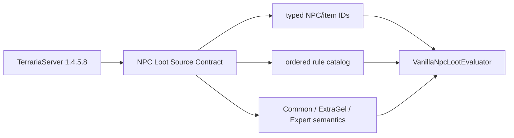
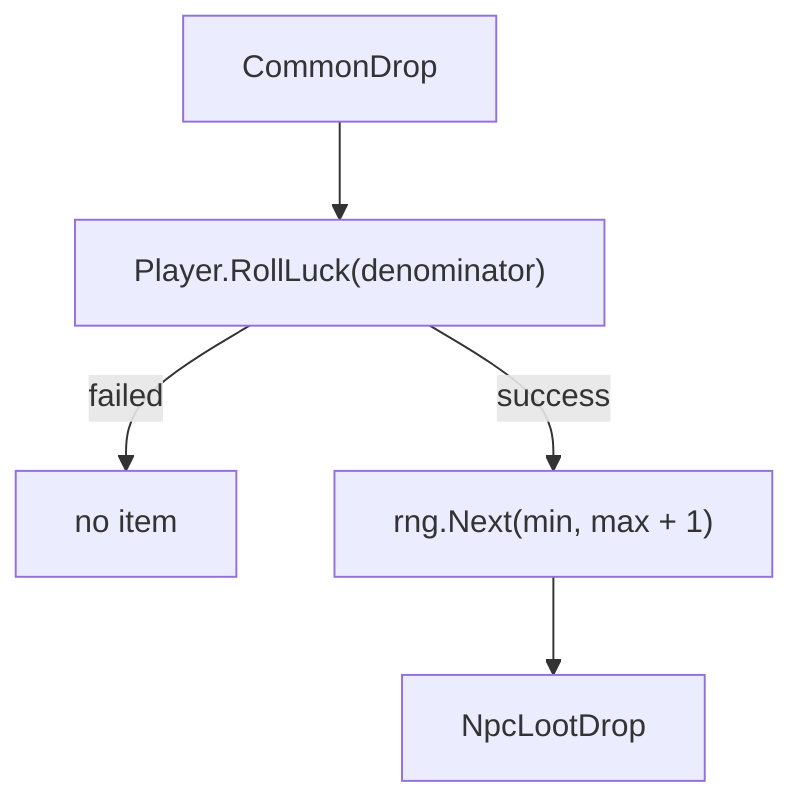

# Source-backed правила NPC loot

Первый NPC-loot срез TerraRuntime реализует NPC-specific правила стандартной slime-группы для Blue Slime по закреплённому TerrariaServer 1.4.5.8. Это **не** заявление о том, что уже реализованы все global, world-condition, event, bestiary и chained vanilla drop layers.

## Source contract

Отдельный workflow `NPC Loot Source Contract` скачивает официальный сервер 1.4.5.8, выбирает точную Windows assembly с SHA-256

`d87e3faf08637f6be8882c63e7f11fb7e792b0230006309618473ece0f863e1e`,

и декомпилирует только item-drop классы, необходимые этому срезу.

Проверенная последовательность NPC-specific правил Blue Slime:

1. `Gel(1, 1, 2)`;
2. `NormalvsExpert(SlimeStaff, 10000, 7000)`.

Named identities также фиксируются из официальных ID tables:

- `BlueSlime = 1`;
- `Gel = 23`;
- `SlimeStaff = 1309`.

## Почему это не плоская таблица вероятностей

`ItemDropRule.Gel(1, 1, 2)` создаёт два luck-scaled `CommonDrop` и оборачивает их в `DropBasedOnExtraGel`:

- normal branch: stack range `1..2`;
- branch при выполненном `DropExtraGel`: stack range `2..4`.

Поэтому loot engine получает результат семантического условия `DropExtraGel` явно. Он не пытается угадывать, почему Terraria включила это condition.

`NormalvsExpert` выбирает между двумя `CommonDrop` через `DropAttemptInfo.IsExpertMode`:

- normal denominator: `10000`;
- expert-mode denominator: `7000`.

Denominator передаётся в `Player.RollLuck`. Поэтому фактическая вероятность Slime Staff зависит от Terraria player-luck semantics; TerraRuntime **не** заменяет её скрытым приближением вида `Random.Next(denominator)`.

## Порядок CommonDrop

Pinned source contract подтверждает следующий порядок:

Для успешного stack roll верхняя граница vanilla включительна, потому что random call получает `max + 1` как exclusive bound.

Для Gel wrapper диапазоны равны

$$
S_{normal} \in \{1,2\}, \qquad
S_{extra} \in \{2,3,4\}.
$$

## Runtime API

`VanillaNpcLootRuleCatalog` хранит проверенные NPC-specific rules в source registration order.

`VanillaNpcLootEvaluator` не создаёт heap allocations на evaluation path:

- caller передаёт `Span<NpcLootDrop>`;
- `INpcLootRollSource.RollLuck` владеет player-luck semantics;
- `INpcLootRollSource.NextInt32` владеет RNG stream;
- `VanillaNpcLootContext` передаёт `IsExpertMode` и семантический результат условия `DropExtraGel`.

Evaluator не занимается world-item spawning. Это отдельная следующая граница, чтобы loot roll тестировался независимо от slot allocation, replication и размещения item в мире.

## Fail-closed scope

NPC без импортированного NPC-specific rule set считается unsupported вместо получения выдуманного generic loot. Сейчас catalog намеренно содержит только Blue Slime.

Этот срез также не объявляет полный vanilla loot parity для Blue Slime. Global и conditional rules вне проверенного standard-slime registration layer должны быть отдельно импортированы из official source до участия в authoritative drops.

## Проверка

`VanillaNpcLootRuleTests` проверяет:

- точный rule order и constants;
- normal и `DropExtraGel` stack ranges;
- выбор normal/expert denominator для Slime Staff;
- вызов `RollLuck` до stack RNG;
- порядок output при успехе обоих rules;
- fail-closed поведение для unsupported NPC и слишком маленького output buffer.

Постоянный gameplay acceptance workflow выполняет `NpcLoot` tests, а отдельный source-contract workflow независимо перепроверяет official TerrariaServer evidence при изменениях loot-кода или тестов.
