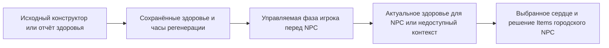

# Управляемый контекст здоровья NPC и физические эффекты

[English](../en/npc-owned-health-and-producers-1458.md) · [Дорожная карта NPC](../roadmap/npc-ai-parity.md)

Этот блок объединяет три зависимости NPC: актуальное здоровье игрока, операцию смерти Гида от куклы и физические эффекты травы/паутины AI001. Поддержка опирается на исполняемые доказательства TerrariaServer 1.4.5.8 и явный допуск владельца состояния; полная совместимость NPC остаётся открытой.

## Актуальное здоровье для решений NPC

Лечебные предметы и темы Items городских NPC требуют текущего здоровья оригинала, а не бессрочно сохранённого отчёта packet16. `PlayerNpcHealthState1458` сохраняет целочисленное здоровье для NPC и исходные счётчик/время регенерации отдельно от сообщённого боевого здоровья. Настоящий конструктор начинает со 100 и нулевых часов; packet16 заменяет здоровье, не сбрасывая часы. Неизвестные импортированные часы нельзя восстановить новым отчётом здоровья. Обычный перенос сохраняет явное происхождение состояния; возрождение и принятый Hurt следуют исходным переходам часов/здоровья.

Фаза игрока перед NPC выполняет допущенную удалённую регенерацию и представленные контексты Regeneration, Poison, OnFire, CursedInferno и Lifeforce, включая исходный порядок ghost/dead/outside. Удалённый DoT может давать отрицательное здоровье без отдельно ограниченного локальным игроком вызова смерти. Регенерация экипировки, неподдержанные buffs/unlocks, воздействия среды и неуправляемый захват крюком остаются выборочно недоступны. Заведомо пустой управляемый набор снарядов доказывает отсутствие крюка; неизвестный активный снаряд этого игрока такого доказательства не даёт. Отсутствие данных мира не означает обычные правила без Vampire.

## Допуск куклы Гида

Поддерживаемая операция с одним Гидом ставит удаление куклы точного поколения первой записью того же плана выделения предметов, который содержит добычу смерти. Это освобождает исходный слот предмета до выделения добычи. Смертельный урон, выбранные зависимости игрока и будущий вызов Стены проверяются до принятия операции. Отказ сохраняет куклу, Гида и геймплейный RNG. Принятая публикация сохраняет удаление перед исходной последовательностью удара/смерти, затем допущенное продолжение со Стеной.

Сжигание без Гида сохраняется. Несколько Гидов или стопка куклы с дополнительными городскими жертвами требуют упорядоченной транзакции нескольких смертей и явно недоступны до расходования предмета. Исходные результаты с несколькими жертвами сохраняются как эталон; отказ runtime является границей допуска, а не утверждением, что vanilla отказывает таким операциям. Это закрывает дефект одного Гида, не объявляя полный эффект стопки завершённым.

Общий путь серверного и клиентского удара по городскому NPC теперь применяет исходный сброс AI, направление и `Next(300)` до добычи. Запись состояния собеседника остаётся недоступной без его владельца. Добыча Гида дополнительно требует имени жителя с точным поколением: Andrew оставляет Green Cap до денег; неизвестная или устаревшая идентичность отклоняет операцию. Принятое удаление куклы отправляет packet151 перед packet28.

## Трава и паутина

Размещение Herb Slime использует исходные стили основания, условия размещения, покрытия/краску и увеличение локального счётчика только при успехе. Паутина сохраняет выбранную координату, поведение занятой клетки/неуспешного размещения и исходную публикацию tile square. Успешное формирование паутины требует управляемого соседства; неизвестные эффекты обработки соседей отклоняются до принятия. Членство в очереди жидкости имеет значение даже при нулевом количестве жидкости в клетке.

Изменения мира, ревизия родительского NPC, исходный RNG и данные секций/жидкости входят в один допущенный переход. `WorldGen.genRand` в этой версии является `Main.rand`: формирование паутины обязано изменять тот же поток, что и AI NPC. Зависимости враждебного статуса/DoT Torch Slime и обработка более широкого соседства остаются открытыми. Чисто визуальные эффекты не входят в это серверное утверждение.

Доставка квадрата тайлов проверяет исходный диапазон секций получателя, включая четыре угла с `x + size` и `y + size`, и актуальное поколение соединения.

## Доказательства

Общий этап фиксирует реальные последовательности оригинального игрока, результаты сжигания/смерти и tile/RNG-эффекты, с регрессионными проверками, восстанавливающими прежние ошибки. Узкие результаты и общая приёмка сборки/полного набора/NativeAOT записываются в [дорожной карте NPC](../roadmap/npc-ai-parity.md); эта страница сама по себе не заявляет полной совместимости с vanilla.
