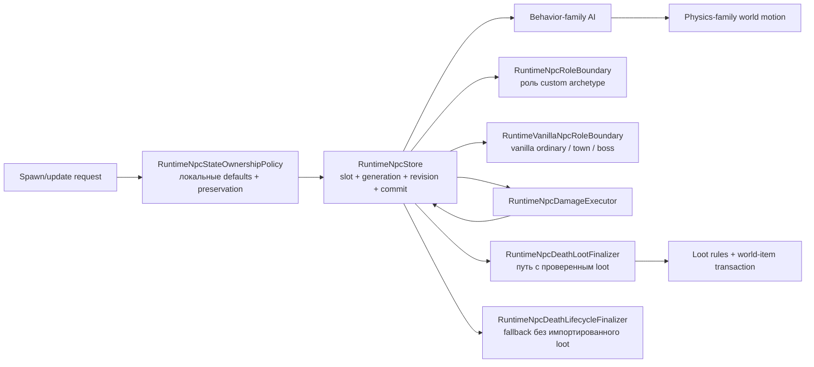

# Границы ответственности NPC runtime

Серверные игроки без клиента сохраняют участие в бою, но не имеют потребителя packet90. Проекция получателей difficulty-loot теперь требует playing/open client-local receiver с точной generation; иначе персональная награда не выдаётся, без срыва смертельного удара, прямого зачисления inventory или перенаправления наблюдателям. Это явная fail-closed политика runtime-расширения, а не утверждение о vanilla eligibility игроков. Classic world drops и обычный pickup ботов не изменены. Двенадцать boundary cases и два настоящих Guard-bot Expert/Master kills воспроизводят старое исключение; с восстановленной проверкой они проходят, включая повторные прогоны ботов. Actor-owned адаптер персонального лута остаётся открытым.

Eye of Cthulhu получила отсутствовавшие NPC-specific death-loot dispatch и прогрессию первого босса. Classic ore/seeds зависят от authoritative evil-флага мира; Expert bag, Master relic/Aviator Sunglasses/персональный pet и trophy во всех режимах сохраняют source-порядок. Существующие network/server-player/town-NPC death branches отмечают Eye milestone, а текущий world-header patcher меняет только downedBoss1. Тесты покрывают оба типа мира/все сложности, изоляцию получателей, повторные убийства и byte-exact/idempotent persistence (27 focused tests; 11 negative-control failures). Global event/announcement, global loot и полный AI остаются открытыми.

Награды обычных механических боёв используют тот же death boundary: Classic Hallowed Bars15–30/Souls25–40 и masks, Expert bags, Master relic/pets, затем trophies. MissingTwin проверяет активность противоположного глаза перед основной наградой; trophy каждого глаза независим. Распространение NPC.ApplyInteraction теперь учитывает всех активных Twins или части Prime через существующий generation-safe ledger в network и server-player damage paths. Двадцать проверенных item defaults сохраняют no-gravity RNG скорости Souls. Source-order и production-delivery tests покрывают все корневые типы/сложности, оба порядка убийства глаз и участие через четыре руки Prime (65 тестов; 18 negative-control failures). Mechdusa/Waffle Iron, global loot, открытие мешков и полный AI остаются открытыми.

Награды Queen Slime за смерть подключены к существующим imported-loot boundary и item delivery/lease stores. Classic-правила в source-порядке включают gel, mask, одну часть брони, Blade Staff, mount и hook с raw RNG; мешки Expert/Master остаются адресными копиями packet90, плюс Master relic/персональный pet и trophy во всех режимах. Двенадцать world-drop definitions не разрешают непроверенное использование предметов. Natural prefixes Blade Staff учитывают damage6/нулевой knockback. Exact-RNG и authoritative-player-kill tests проверяют три сложности, получателей packet21/90, unpublished leases и запрет повторной награды; negative controls дают десять ошибок. Global drops, открытие мешков и остальные Hardmode-таблицы остаются открытыми.

AI70 инициализирует скорость/scale/смещение только при входящем неназначенном target, затем применяет homing, jitter и ветер текущего мира. Начальный ветер берётся из сохранённого target, как в `WorldFile.LoadWorld`; динамика погоды/усиление дождём остаются открытыми. Detonation проверяет всех active living players по исходному асимметричному целочисленному rectangle и базовым размерам игрока. `checkDead` готовит четырёхтактный взрыв через общий урон вместо обычной смерти/лута. Физическое тело расширяется с $36\times36\,\mathrm{px}$ до $100\times100\,\mathrm{px}$ вокруг прежнего центра независимо от scale. Bounded nullable `NpcSimulationState.HitboxOverride` принадлежит общей authoritative revision; targeting, collision, combat и packet anchors получают его через definition helper. State-only updates сохраняют его, defaults новой definition не наследуют. Потеря target не останавливает expiry. Проверены точные границы, расширение, invalid bodies, сохранение состояния, packet geometry и production bot contact; отключение физических/death/proximity правил вызывает одиннадцать ошибок. Mounted-player proximity dimensions и динамическая погода остаются ограничениями.

Создание пузырей Duke теперь использует входящий `ai[2] % 4 == 0`, включая нулевой tick. Первая фаза создаёт пузырь без target, с нулевой скоростью/default AI; вторая использует входящее направление (до circle rotation) для mouth и перпендикулярной скорости, назначает target и делает только RNG scale. Lifetime AI70 больше не увеличивается во время detonation: countdown достигает нуля, существующий post-AI expiry path удаляет именно этот NPC без combat loot/progression. Четырнадцать тестов покрывают spawn timing/defaults/geometry и четыре обновления timeout. Следующий срез AI70 ниже добавляет инициализацию движения и физический путь взрыва; динамика погоды остаётся открытой.

Следующий проверенный срез AI69 восстанавливает сбросы attack cycle первой/второй фаз и ожидание hover boundary перед сменой фазы. Bubble/shark атаки первой фазы оставляют cycle `1`/`0`; вторая фаза использует шесть шагов рывка, затем circle/shark со сбросом в `1`/`0`. Circle второй фазы и state `13` вращают входящую скорость вместо hover/замирания; ускорение при развороте hover и facing следуют source. Тесты покрывают каждый selector/reset и оба направления circle; возврат старых resets/rotation вызывает восемь ошибок. Ocean/enrage и остальные детали фаз открыты: весь бой Duke этим не закрыт.

TZ-35 добавляет server-owned nullable `Friendly`, `Chaseable` и `Immortal` в committed simulation revision. Null означает unspecified (targeting fail-closed); verified spawn defaults заполняют значения, state-only updates сохраняют их, AI атомарно меняет live flags. Controlled magic и Guard используют source-backed `CanBeChasedBy`; NPC contact также отклоняет friendly instances. Clone 440 и Ancient Doom 523 появляются unchaseable. Duke states 10/12 выключают chaseability, 11 включает, остальные ветви сохраняют значение, включая transition tick. Intro/ritual и reposition damage gates Культиста следуют исполняемой source-ветви. Это не утверждение о поддержке всех transient allegiance/immortality branches или temporary catchable immunity.

[English](../en/npc-runtime-ownership.md) · [Семейства поведения NPC](npc-behavior-families.md) · [Roadmap декомпозиции gameplay](../roadmap/gameplay-decomposition-and-catalogs.md)

Следующий проход Duke Fishron AI69 исправляет фактическое перемещение в третьей фазе на входящем таймере `15`, точку на противоположной стороне, затухание скорости/прозрачности и девятишаговый цикл одного/двух/трёх рывков между телепортациями. Focused-тесты фиксируют соседние границы таймера и все девять решений; возврат старого ожидания без перемещения и цикла по модулю четыре вызывает шесть регрессионных ошибок. Это не полный parity Duke: входные условия океана/enrage, остальные детали фаз и проверка боя официальным клиентом остаются открытыми.

TerraRuntime разделяет хранение NPC, материализацию spawn/default state, AI, физику, combat и loot на самостоятельные зоны ответственности. Это не декоративная раскладка по файлам: slot-store не должен знать ванильные правила урона и стартовых характеристик, а физика не должна выбирать алгоритм по конкретному content ID NPC.

`TerraRuntime.Gameplay.Npcs` владеет неизменяемым source-backed слоем vanilla definitions: `VanillaNpcDefinition`, metadata behavior/physics family, net variants и допущенными каталогами slime/flying-eye/flyer/worm/AI17-20-21/town definitions. Core использует эти факты, но не владеет ими. Mutable NPC slots, authoritative state transitions, исполнение AI, combat и world-item transactions остаются в Core/application runtime.

То же правило владения теперь применяется к protocol-neutral NPC simulation и loot. Source-backed gravity, targeting, knockback, motion/check-active primitives, ordinary spawn cadence, town identity/rescue rules, AI coverage и boss-loot evaluators находятся в `TerraRuntime.Gameplay.Npcs`. В Core остаются mutable behavior context/state steppers, generation-safe interaction ledger, world-item materialization transactions и death/finalization steps. `NpcLootWorldItemOrigin` и vanilla-граница допустимых player slots являются gameplay-фактами, а не свойствами конкретного runtime store.

Та же граница действует для ловли NPC: `VanillaNpcCatchCatalog1458` владеет неизменяемыми critter/catch-item фактами в Gameplay, а `VanillaNpcCatchWorldItem1458` остаётся в Core, потому что материализует state пойманного world item и reservation policy.

## Spawn и локальное состояние

`RuntimeNpcStore` отвечает за адресуемые слоты, active-state, монотонные generation/revision, snapshots и порядок commit. Он больше не владеет поиском vanilla definition или материализацией ванильных локальных defaults.

`RuntimeNpcStateOwnershipPolicy` владеет текущими проверенными правилами spawn/update для полей, которые не являются packet identity:

- материализация `Life/LifeMax` из definition;
- стандартный active lifetime (`TimeLeft`);
- начальное направление sprite;
- сохранение combat/lifetime/presentation state, когда AI/state update намеренно оставляет эти поля unspecified.

Так storage остаётся общим, а существующий sentinel-контракт (`LifeMax == 0`, `TimeLeft == -1`, совместимый нулевой sprite direction на ingress) сохраняется.

Создание дочерних NPC из AI проходит через `INpcAiSpawnIntentPlanner`, а не мутирует slot-store прямо из AI. Executor предоставляет bounded scratch storage, planner может выдать упорядоченный batch из нуля или нескольких intents, и batch применяется только после успешного commit точной generation исходного NPC. Поэтому rejected/stale transition не может выпустить дочерние сущности в мир. После source commit отдельные spawn выполняются в vanilla-подобном best-effort порядке: если NPC table заполнится посередине batch, уже принятые дети остаются, а последующие spawn могут завершиться неудачей.

## AI family и physics family

`VanillaNpcBehaviorFamily` и `VanillaNpcPhysicsFamily` намеренно являются разными metadata. Общая AI-реализация сама по себе не доказывает одинаковые collision, platform, gravity или obstacle rules.

Текущие проверенные соответствия:

| NPC | behavior family | physics family |
| --- | --- | --- |
| Blue Slime | `SlimeGround` | `SlimeGround` |
| Demon Eye | `FlyingEye` | `FlyingEye` |
| Zombie | `GroundFighter` | `GroundFighter` |
| Eye of Cthulhu | `EyeOfCthulhu` | `NoClipFlight` |
| Servant of Cthulhu | `Flyer` | `NoClipFlight` |
| Skeleton | `GroundFighter` | `GroundFighter` |
| King Slime | `KingSlime` | `SlimeGround` |

Связь между именами считается допустимой только там, где её подтверждает текущий source-backed slice. Поля остаются раздельными, чтобы будущие definitions могли безопасно расходиться.

`VanillaNpcWorldMotionAiStepper` выбирает special movement и platform behavior через `PhysicsFamily`, а не через `NpcTypeId`. Для `VanillaNpcGravity` authoritative gameplay overload принимает уже разрешённый definition; raw/typed ID overloads остаются compatibility boundary и сначала разрешают definition.

## Проводка дверей и tall-gate в production

`VanillaNpcWorldMotionAiStepper` теперь владеет production-проекцией давления на двери и пробой занятости tall-gate. `RuntimeWorldClock` отдаёт live `BloodMoonActive` (уже отфильтрованный по `GetGoodWorld`) и сам `GetGoodWorld`; `VanillaWorldUnbreakableWallScan` отдаёт `TargetInsideUnbreakableWalls` (сканирование 8×250 для стены 350, цвет ≥16); `RuntimeTallGateOccupancyProbe` отдаёт `IsActorFree`, проверяя live прямоугольники игроков (`20×42`) и NPC (live hitbox) через семантику `Collision.EmptyTile(ignoreTiles:true)`. Собранный `VanillaGroundFighterDoorEnvironment` поэтому несёт точные ванильные входы политики, а `VanillaWorldGroundFighterDoorOpeningService` выполняет мутацию за `RuntimeGroundFighterDoorOpeningSink`, который также реплицирует packet-19 играющим пирам. Открытие tall-gate без пробы закрывается fail-closed; обычным дверям проба не нужна.

## Combat, смерть и loot

Combat остаётся в `RuntimeNpcDamageExecutor` и `VanillaNpcDamageResolver`. Lethal damage коммитит `Life = 0`, но не despawn'ит NPC и не запускает loot внутри damage resolver.

Для NPC с уже импортированным source-backed loot death/loot остаётся в `RuntimeNpcDeathLootFinalizer`, `VanillaNpcLootRules`, vanilla world-item materializer и generation-safe loot transaction. Поэтому store не знает drop tables, prefix RNG и world-item capacity semantics.

Отдельный `RuntimeNpcDeathLifecycleFinalizer.TryFinalizeWhenLootUnsupported` завершает entity lifecycle только для мёртвых vanilla типов, loot table которых ещё не импортирована. Он намеренно отказывает любому типу, уже присутствующему в `VanillaNpcLootRuleCatalog`, поэтому проверенные drops нельзя случайно обойти. Успешный fallback означает **неразрешённую loot parity**, а не пустой ванильный набор drops. Благодаря этому частично реализованный boss, например текущий Eye of Cthulhu, может generation-safe исчезнуть при `Life = 0`, не притворяясь, что его loot уже полностью реализован.

## Границы ролей town и boss

`NpcArchetypeRole` задаёт policy `Ordinary`, `Town` или `Boss`, но runtime-defined/custom и vanilla identity приходят к этой policy через разные доверенные источники.

`RuntimeNpcRoleBoundary` разрешает роль custom archetype через точный live `NpcHandle`, generation-safe archetype binding и одну опубликованную revision descriptor catalog. Такая роль является metadata custom runtime identity и никогда не выводится из vanilla presentation type или AI style.

`RuntimeVanillaNpcRoleBoundary` разрешает live vanilla generation через `RuntimeNpcStore` и version-pinned `VanillaNpcDefinitionCatalog`. Stale generation и неподдерживаемые vanilla types завершаются fail-closed. Поэтому текущий source-backed definition Eye of Cthulhu выбирает `Boss` lifecycle policy через точный live handle, а Blue Slime, Demon Eye, Zombie и Servant остаются `Ordinary`.

Оба результата классификации дают взаимоисключающие policy gates для town interaction, boss lifecycle или ordinary lifecycle. Housing/shop policy не попадает в обычный combat AI, а boss progression/despawn policy не превращается в raw type-number branch внутри store.

Это ownership boundaries, а не полная vanilla town/boss parity. Housing, boss progression, boss bars, оставшиеся boss-specific death effects и широкая boss AI всё ещё требуют отдельной source-backed реализации. Actor-commerce smoke по-прежнему явно помечает custom merchant archetype как `Town`.

## Граница завершения D4

Пункт roadmap `spawn/physics/combat/loot separation` считается закрытым для текущего authoritative NPC slice, потому что:

- slot storage больше не содержит vanilla definition/default materialization;
- physics dispatch больше не ветвится по конкретным ID Blue Slime/Demon Eye/Zombie;
- дочерние AI spawn проходят через bounded post-commit intent boundary, а не мутируют store спекулятивно;
- combat, entity death lifecycle и проверенный death/loot исполняются раздельными generation-safe компонентами;
- custom и vanilla role policy разрешаются через явные generation-safe boundaries;
- тесты фиксируют выбор catalog family и ownership локального состояния;
- будущие definitions обязаны явно выбрать behavior и physics family.

Это не означает поддержку всех NPC Terraria. Широкие vanilla town/housing, boss progression и boss behavior остаются открытыми, хотя их ownership boundaries теперь явные.
