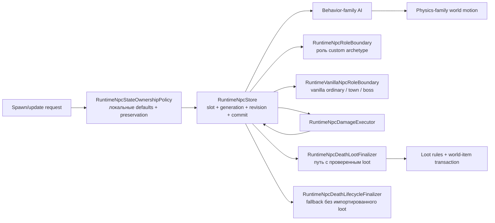

# Границы ответственности NPC runtime

Голова и руки Скелетрона также используют общий профиль создания: физический масштаб Good World равен `1.25` для головы и `1.15` для рук; поправки сложности и числа игроков сохраняют исходное округление float. Координаты рук используют размеры головы до движения и отбрасывают дробную часть вертикальной позиции до добавления целой половины высоты. Доказательства включают 158 созданий NPC и 48 созданий рук головой оригинала, покрытых 254 сравнениями; отключение профиля ломает 202 проверки, возврат старого округления — 36. Native smoke проверяет масштабированные характеристики головы/рук и дробные координаты создания. Соседний пробел создания закрыт; использование боевой базы головой, урон вращения, полный AI рук, варианты RedHat и полное поведение боя/сети ещё не завершены.

Начальное создание рук Прайма теперь использует физические размеры головы и её позицию до движения мира. Оригинал отбрасывает дробную часть вертикальной позиции перед добавлением целой половины высоты; это существенно и для отрицательных дробных координат. Все четыре руки начинают поиск слота с головы, а нехватка слотов даёт частичное создание без повторной инициализации. Сохранены результаты 48 вызовов головы оригинала: три режима, Good World, четыре начальных слота и дробные координаты. Каждый случай проверяется с обычным AI и с обработкой движения мира; начальное состояние рук сравнивается до их AI. Возврат старых координат ломает 63 из 96 проверок; отдельные возвраты позиции после движения и неправильного округления — 18 и 36. Native protocol smoke также проверяет дробные координаты в Good World. Это подтверждает создание, но не полный AI рук или порядок сетевой публикации.

Снимки NPC теперь сохраняют `BaseDamage` и `BaseDefense`, соответствующие vanilla-полям `defDamage` и `defDefense`, отдельно от текущих боевых переопределений. При создании значения берутся из проверенного профиля сложности либо определения, если вызывающая сторона не передала их явно. Пропущенное значение при обновлении сохраняет базу того же определения; смена типа/net-определения сбрасывает её к новому определению, а повторное использование слота не наследует значения старого поколения. Это поддержка владения состоянием, а не утверждение о полном совпадении параметров сложности при произвольных превращениях NPC.

Skeletron Prime и четыре руки теперь используют общий контекст создания. AI головы восстанавливает сохранённую базу на каждом шаге, удваивает текущие урон/защиту при вращении и возвращает исходные значения после его завершения. Наведение при зависании, атаке и дневном преследовании использует центр физического hitbox. Атака и преследование сохраняют исходный порядок деления/умножения, заменяют единицей только неположительное расстояние и соблюдают исходные пороги ускорения. Независимые данные покрывают 395 созданий семейства Prime и 408 вызовов AI головы, включая нулевое/малое расстояние и обе стороны каждого порога ускорения. Тесты runtime проверяют все четыре руки и выход из вращения после изменения контекста; native smoke проверяет восстановление базы. Отключение базовых значений, физических центров или правила малой дистанции вызывает соответственно 201, 168 и 12 ошибок. Полный AI рук, Mechdusa, вращения, общий порядок снарядов/сетевой синхронизации боя и сложность при превращениях остаются открытыми.

Создание vanilla NPC теперь один раз на запрос получает эффективную сложность мира, текущее число принадлежащих runtime игроков и `getGoodWorld`. `NpcAuthority` передаёт эти значения на авторитетном потоке через `RuntimeNpcStore.SetVanillaSpawnContextSource`; явное создание в заданном слоте через `TrySpawn` сохраняет прежнюю семантику. Вход и выход игроков влияют на последующие создания, но не меняют здоровье существующих NPC. Мёртвые персонажи учитываются, отключившиеся — нет. Эта же эффективная сложность определяет флаги Expert/Master для AI, включая повышение на один уровень при `getGoodWorld`.

`VanillaNpcSpawnDefaults` пока реализует исходное масштабирование головы/тел/хвоста Destroyer, Probe, Skeletron Prime и четырёх рук, а также головы/рук Скелетрона. Сохраняется порядок задания физических размеров, изменений специального сида, поправок сложности и масштабирования здоровья по числу игроков. Физические размеры отделены от визуального масштаба: обычный Expert Destroyer имеет hitbox $47\times47$ при масштабе `1.3125`; создание в good-world даёт hitbox $76\times76$, а последующая поправка сложности меняет визуальный масштаб на `1.70625`. Здоровье, контактный урон и физический размер присутствуют уже в первом подтверждённом снимке, включая сегменты, созданные головой. Явно переданные здоровье и боевые переопределения остаются под управлением вызывающей стороны.

Независимые данные включают 240 применимых случаев из 540 строк оригинального набора `NpcSpawnContext1458` и все 76 случаев дробной сложности из `NpcSpawnFractional1458`. Остальные строки сохранены для последующих сравнений отдельных типов. Тесты сравнивают позиции, физические/визуальные размеры, здоровье, урон и защиту; шесть тестов полного runtime проверяют изменение числа игроков и создание детей в том же тике. Все 32 исходные цепи теперь сравниваются также по позиции и здоровью в good-world. Отрицательные проверки падают при отключении связи с миром, нарушении порядка размеров, игнорировании числа игроков или эффективных флагов AI. Native protocol smoke использует настоящее подключение runtime. Масштабирование остальных NPC, управление сложностью Journey, проекция hardcore-призраков, остальные эффекты сидов, продолжение RNG и полный бой/сетевая синхронизация боссов остаются открытыми.

Destroyer `AI_037` теперь создаёт всю цепь при подтверждённом вызове AI головы: 80 тел и один хвост либо 100 тел и один хвост при `getGoodWorld`. Поиск каждого слота начинается с головы; `ai[1]` связывает предшественника, `ai[3]` указывает голову, `ai[2]` остаётся нулём. При заполненной таблице `ai[0]` последнего доступного предшественника получает исходный маркер неудачи `200`. Живой NPC-маркер не создаётся, повторного достраивания в следующем тике нет. Существующий исполнитель затем посещает новые старшие слоты в том же проходе мира. Изменение связи с проверкой поколения проходит через `INpcAiCommittedNpcMutationSink.TryLinkFollower`; неподтверждённый или отклонённый шаг головы не создаёт детей.

Независимый набор `DestroyerChainSpawn1458` содержит 32 вызова только AI головы оригинала: четыре слота головы, четыре варианта заполнения/замены и оба значения `getGoodWorld`. Тесты сравнивают все связи, типы, начальный localAI и время жизни; для обычного Classic и good-world дополнительно сравниваются позиции, скорости и здоровье. Тест полного прохода мира проверяет наличие всей цепи до первого вызова AI тела. Возврат прежнего создания по одному сегменту ломает все 33 проверки. Дополнительный тест проверяет перезапись старой ссылки головы, заполнение малой таблицы и отказ менять связь устаревшего поколения; возврат прежнего условия перезаписи ломает его. Данные получены из официальной Linux-сборки на Windows CoreCLR; native-проверка рантайма выполняется отдельно. Продолжение RNG, Mechdusa, полное движение/бой и точный порядок отправки packet23 остаются открытыми. Этот набор не доказывает полный паритет Destroyer.

Серверные игроки без клиента сохраняют участие в бою, но не имеют потребителя packet90. Проекция получателей difficulty-loot теперь требует playing/open client-local receiver с точной generation; иначе персональная награда не выдаётся, без срыва смертельного удара, прямого зачисления inventory или перенаправления наблюдателям. Это явная fail-closed политика runtime-расширения, а не утверждение о vanilla eligibility игроков. Classic world drops и обычный pickup ботов не изменены. Двенадцать boundary cases и два настоящих Guard-bot Expert/Master kills воспроизводят старое исключение; с восстановленной проверкой они проходят, включая повторные прогоны ботов. Actor-owned адаптер персонального лута остаётся открытым.

Eye of Cthulhu получила отсутствовавшие NPC-specific death-loot dispatch и прогрессию первого босса. Classic ore/seeds зависят от authoritative evil-флага мира; Expert bag, Master relic/Aviator Sunglasses/персональный pet и trophy во всех режимах сохраняют source-порядок. Существующие network/server-player/town-NPC death branches отмечают Eye milestone, а текущий world-header patcher меняет только downedBoss1. Тесты покрывают оба типа мира/все сложности, изоляцию получателей, повторные убийства и byte-exact/idempotent persistence (27 focused tests; 11 negative-control failures). Global event/announcement, global loot и полный AI остаются открытыми.

Награды обычных механических боёв используют тот же death boundary: Classic Hallowed Bars15–30/Souls25–40 и masks, Expert bags, Master relic/pets, затем trophies. MissingTwin проверяет активность противоположного глаза перед основной наградой; trophy каждого глаза независим. Распространение NPC.ApplyInteraction теперь учитывает всех активных Twins или части Prime через существующий generation-safe ledger в network и server-player damage paths. Двадцать проверенных item defaults сохраняют no-gravity RNG скорости Souls. Source-order и production-delivery tests покрывают все корневые типы/сложности, оба порядка убийства глаз и участие через четыре руки Prime (65 тестов; 18 negative-control failures). Mechdusa/Waffle Iron, global loot, открытие мешков и полный AI остаются открытыми.

Награды Queen Slime за смерть подключены к существующим imported-loot boundary и item delivery/lease stores. Classic-правила в source-порядке включают gel, mask, одну часть брони, Blade Staff, mount и hook с raw RNG; мешки Expert/Master остаются адресными копиями packet90, плюс Master relic/персональный pet и trophy во всех режимах. Двенадцать world-drop definitions не разрешают непроверенное использование предметов. Natural prefixes Blade Staff учитывают damage6/нулевой knockback. Exact-RNG и authoritative-player-kill tests проверяют три сложности, получателей packet21/90, unpublished leases и запрет повторной награды; negative controls дают десять ошибок. Global drops, открытие мешков и остальные Hardmode-таблицы остаются открытыми.

AI70 инициализирует скорость/scale/смещение только при входящем неназначенном target, затем применяет homing, jitter и ветер текущего мира. Начальный ветер берётся из сохранённого target, как в `WorldFile.LoadWorld`; динамика погоды/усиление дождём остаются открытыми. Detonation проверяет всех active living players по исходному асимметричному целочисленному rectangle и базовым размерам игрока. `checkDead` готовит четырёхтактный взрыв через общий урон вместо обычной смерти/лута. Физическое тело расширяется с $36\times36\,\mathrm{px}$ до $100\times100\,\mathrm{px}$ вокруг прежнего центра независимо от scale. Bounded nullable `NpcSimulationState.HitboxOverride` принадлежит общей authoritative revision; targeting, collision, combat и packet anchors получают его через definition helper. State-only updates сохраняют его, defaults новой definition не наследуют. Потеря target не останавливает expiry. Проверены точные границы, расширение, invalid bodies, сохранение состояния, packet geometry и production bot contact; отключение физических/death/proximity правил вызывает одиннадцать ошибок. Mounted-player proximity dimensions и динамическая погода остаются ограничениями.

Создание пузырей Duke теперь использует входящий `ai[2] % 4 == 0`, включая нулевой tick. Первая фаза создаёт пузырь без target, с нулевой скоростью/default AI; вторая использует входящее направление (до circle rotation) для mouth и перпендикулярной скорости, назначает target и делает только RNG scale. Lifetime AI70 больше не увеличивается во время detonation: countdown достигает нуля, существующий post-AI expiry path удаляет именно этот NPC без combat loot/progression. Четырнадцать тестов покрывают spawn timing/defaults/geometry и четыре обновления timeout. Следующий срез AI70 ниже добавляет инициализацию движения и физический путь взрыва; динамика погоды остаётся открытой.

Следующий проверенный срез AI69 восстанавливает сбросы attack cycle первой/второй фаз и ожидание hover boundary перед сменой фазы. Bubble/shark атаки первой фазы оставляют cycle `1`/`0`; вторая фаза использует шесть шагов рывка, затем circle/shark со сбросом в `1`/`0`. Circle второй фазы и state `13` вращают входящую скорость вместо hover/замирания; ускорение при развороте hover и facing следуют source. Тесты покрывают каждый selector/reset и оба направления circle; возврат старых resets/rotation вызывает восемь ошибок. Ocean/enrage и остальные детали фаз открыты: весь бой Duke этим не закрыт.

TZ-35 добавляет server-owned nullable `Friendly`, `Chaseable` и `Immortal` в committed simulation revision. Null означает unspecified (targeting fail-closed); verified spawn defaults заполняют значения, state-only updates сохраняют их, AI атомарно меняет live flags. Controlled magic и Guard используют source-backed `CanBeChasedBy`; NPC contact также отклоняет friendly instances. Clone 440 и Ancient Doom 523 появляются unchaseable. Duke states 10/12 выключают chaseability, 11 включает, остальные ветви сохраняют значение, включая transition tick. Intro/ritual и reposition damage gates Культиста следуют исполняемой source-ветви. Это не утверждение о поддержке всех transient allegiance/immortality branches или temporary catchable immunity.

[English](../en/npc-runtime-ownership.md) · [Семейства поведения NPC](npc-behavior-families.md) · [Roadmap декомпозиции gameplay](../roadmap/gameplay-decomposition-and-catalogs.md)

Следующий проход Duke Fishron AI69 исправляет фактическое перемещение в третьей фазе на входящем таймере `15`, точку на противоположной стороне, затухание скорости/прозрачности и девятишаговый цикл одного/двух/трёх рывков между телепортациями. Focused-тесты фиксируют соседние границы таймера и все девять решений; возврат старого ожидания без перемещения и цикла по модулю четыре вызывает шесть регрессионных ошибок. Это не полный parity Duke: входные условия океана/enrage, остальные детали фаз и проверка боя официальным клиентом остаются открытыми.

TerraRuntime разделяет хранение NPC, материализацию spawn/default state, AI, физику, combat и loot на самостоятельные зоны ответственности. Это не декоративная раскладка по файлам: slot-store не должен знать ванильные правила урона и стартовых характеристик, а физика не должна выбирать алгоритм по конкретному content ID NPC.

`TerraRuntime.Gameplay.Npcs` владеет неизменяемым source-backed слоем vanilla definitions: `VanillaNpcDefinition`, metadata behavior/physics family, net variants и допущенными каталогами slime/flying-eye/flyer/worm/AI17-20-21/town definitions. Core использует эти факты, но не владеет ими. Mutable NPC slots, authoritative state transitions, исполнение AI, combat и world-item transactions остаются в Core/application runtime.

То же правило владения теперь применяется к protocol-neutral NPC simulation и loot. Source-backed gravity, targeting, knockback, motion/check-active primitives, ordinary spawn cadence, town identity/rescue rules, AI coverage и boss-loot evaluators находятся в `TerraRuntime.Gameplay.Npcs`. В Core остаются mutable behavior context/state steppers, generation-safe interaction ledger, world-item materialization transactions и death/finalization steps. `NpcLootWorldItemOrigin` и vanilla-граница допустимых player slots являются gameplay-фактами, а не свойствами конкретного runtime store.

Та же граница действует для ловли NPC: `VanillaNpcCatchCatalog1458` владеет неизменяемыми critter/catch-item фактами в Gameplay, а `VanillaNpcCatchWorldItem1458` остаётся в Core, потому что материализует state пойманного world item и reservation policy.

## Spawn и локальное состояние

`RuntimeNpcStore` отвечает за адресуемые слоты, active-state, монотонные generation/revision, snapshots и порядок commit. Он больше не владеет поиском vanilla definition или материализацией ванильных локальных defaults.

`RuntimeNpcStateOwnershipPolicy` владеет текущими проверенными правилами spawn/update для полей, которые не являются packet identity:

- материализация `Life/LifeMax` из definition;
- стандартный active lifetime (`TimeLeft`);
- начальное направление sprite;
- сохранение combat/lifetime/presentation state, когда AI/state update намеренно оставляет эти поля unspecified.

Так storage остаётся общим, а существующий sentinel-контракт (`LifeMax == 0`, `TimeLeft == -1`, совместимый нулевой sprite direction на ingress) сохраняется.

Создание дочерних NPC из AI проходит через `INpcAiSpawnIntentPlanner`, а не мутирует slot-store прямо из AI. Executor предоставляет bounded scratch storage, planner может выдать упорядоченный batch из нуля или нескольких intents, и batch применяется только после успешного commit точной generation исходного NPC. Поэтому rejected/stale transition не может выпустить дочерние сущности в мир. После source commit отдельные spawn выполняются в vanilla-подобном best-effort порядке: если NPC table заполнится посередине batch, уже принятые дети остаются, а последующие spawn могут завершиться неудачей.

## AI family и physics family

`VanillaNpcBehaviorFamily` и `VanillaNpcPhysicsFamily` намеренно являются разными metadata. Общая AI-реализация сама по себе не доказывает одинаковые collision, platform, gravity или obstacle rules.

Текущие проверенные соответствия:

| NPC | behavior family | physics family |
| --- | --- | --- |
| Blue Slime | `SlimeGround` | `SlimeGround` |
| Demon Eye | `FlyingEye` | `FlyingEye` |
| Zombie | `GroundFighter` | `GroundFighter` |
| Eye of Cthulhu | `EyeOfCthulhu` | `NoClipFlight` |
| Servant of Cthulhu | `Flyer` | `NoClipFlight` |
| Skeleton | `GroundFighter` | `GroundFighter` |
| King Slime | `KingSlime` | `SlimeGround` |

Связь между именами считается допустимой только там, где её подтверждает текущий source-backed slice. Поля остаются раздельными, чтобы будущие definitions могли безопасно расходиться.

`VanillaNpcWorldMotionAiStepper` выбирает special movement и platform behavior через `PhysicsFamily`, а не через `NpcTypeId`. Для `VanillaNpcGravity` authoritative gameplay overload принимает уже разрешённый definition; raw/typed ID overloads остаются compatibility boundary и сначала разрешают definition.

## Проводка дверей и tall-gate в production

`VanillaNpcWorldMotionAiStepper` теперь владеет production-проекцией давления на двери и пробой занятости tall-gate. `RuntimeWorldClock` отдаёт live `BloodMoonActive` (уже отфильтрованный по `GetGoodWorld`) и сам `GetGoodWorld`; `VanillaWorldUnbreakableWallScan` отдаёт `TargetInsideUnbreakableWalls` (сканирование 8×250 для стены 350, цвет ≥16); `RuntimeTallGateOccupancyProbe` отдаёт `IsActorFree`, проверяя live прямоугольники игроков (`20×42`) и NPC (live hitbox) через семантику `Collision.EmptyTile(ignoreTiles:true)`. Собранный `VanillaGroundFighterDoorEnvironment` поэтому несёт точные ванильные входы политики, а `VanillaWorldGroundFighterDoorOpeningService` выполняет мутацию за `RuntimeGroundFighterDoorOpeningSink`, который также реплицирует packet-19 играющим пирам. Открытие tall-gate без пробы закрывается fail-closed; обычным дверям проба не нужна.

## Combat, смерть и loot

Combat остаётся в `RuntimeNpcDamageExecutor` и `VanillaNpcDamageResolver`. Lethal damage коммитит `Life = 0`, но не despawn'ит NPC и не запускает loot внутри damage resolver.

Для NPC с уже импортированным source-backed loot death/loot остаётся в `RuntimeNpcDeathLootFinalizer`, `VanillaNpcLootRules`, vanilla world-item materializer и generation-safe loot transaction. Поэтому store не знает drop tables, prefix RNG и world-item capacity semantics.

Отдельный `RuntimeNpcDeathLifecycleFinalizer.TryFinalizeWhenLootUnsupported` завершает entity lifecycle только для мёртвых vanilla типов, loot table которых ещё не импортирована. Он намеренно отказывает любому типу, уже присутствующему в `VanillaNpcLootRuleCatalog`, поэтому проверенные drops нельзя случайно обойти. Успешный fallback означает **неразрешённую loot parity**, а не пустой ванильный набор drops. Благодаря этому частично реализованный boss, например текущий Eye of Cthulhu, может generation-safe исчезнуть при `Life = 0`, не притворяясь, что его loot уже полностью реализован.

## Границы ролей town и boss

`NpcArchetypeRole` задаёт policy `Ordinary`, `Town` или `Boss`, но runtime-defined/custom и vanilla identity приходят к этой policy через разные доверенные источники.

`RuntimeNpcRoleBoundary` разрешает роль custom archetype через точный live `NpcHandle`, generation-safe archetype binding и одну опубликованную revision descriptor catalog. Такая роль является metadata custom runtime identity и никогда не выводится из vanilla presentation type или AI style.

`RuntimeVanillaNpcRoleBoundary` разрешает live vanilla generation через `RuntimeNpcStore` и version-pinned `VanillaNpcDefinitionCatalog`. Stale generation и неподдерживаемые vanilla types завершаются fail-closed. Поэтому текущий source-backed definition Eye of Cthulhu выбирает `Boss` lifecycle policy через точный live handle, а Blue Slime, Demon Eye, Zombie и Servant остаются `Ordinary`.

Оба результата классификации дают взаимоисключающие policy gates для town interaction, boss lifecycle или ordinary lifecycle. Housing/shop policy не попадает в обычный combat AI, а boss progression/despawn policy не превращается в raw type-number branch внутри store.

Это ownership boundaries, а не полная vanilla town/boss parity. Housing, boss progression, boss bars, оставшиеся boss-specific death effects и широкая boss AI всё ещё требуют отдельной source-backed реализации. Actor-commerce smoke по-прежнему явно помечает custom merchant archetype как `Town`.

## Распределение слотов vanilla

`RuntimeNpcStore.TrySpawnVanilla` ищет только в исходных $200\,\text{слотах}$, даже если хранилище имеет большую ёмкость с байтовой адресацией. При начальном индексе по умолчанию обычные типы обходятся по возрастанию; исходный набор `CannotSpawnInSlot0` начинает поиск со слота 1. Queen Bee и Golem идут по убыванию от слота 199 и исключают слот 0. Эти правила принадлежат `VanillaNpcSpawnRules`. Меньшие хранилища хоста или тестов сохраняют свою ёмкость.

Необязательный аргумент `startSlot` и `NpcAiSpawnIntent.StartSlot` представляют `NewNPC.Start`. Поиск по возрастанию включает этот индекс, обратный — исключает. Коррекция нулевого слота применяется только при запрошенном старте с нуля. Отрицательные или выходящие за ёмкость значения отклоняются без изменения состояния. Руки Skeletron и Skeletron Prime теперь передают слот головы, сохраняя исходный порядок выделения при свободных ранних слотах. Остальные источники дочерних NPC ещё требуют отдельной проверки начального индекса.

Vanilla-создание защищает выбранный слот на $2\,\text{обновления}$. В начале каждого авторитетного тика мира активные слоты обновляют защиту, а неактивные уменьшают её до нуля. Отдельный проход AI не продвигает этот таймер. `TrySpawn` с явным слотом остаётся доверенной операцией хранилища и может создать замену после удаления без vanilla-распределителя.

Свободные незащищённые слоты всегда имеют приоритет. Если их нет, выбирается первый `CanBeReplacedByOtherNpcs` в том же порядке, включая защищённые неактивные записи. Замена увеличивает точное поколение, публикует создание и сохраняет число активных NPC при замене живого; эффекты смерти и выпадение предметов не запускаются. Неактивное состояние остаётся закрытым и ограниченным по размеру, чтобы флаг замены переживал деактивацию. Намерение создания пчелы Queen Bee несёт исходный флаг замены вместе с начальным local-AI. Остальные источники флага, включая Hive Slime и выпущенных взрывных кроликов, а также полный порядок отправки ожидающих пакетов создания остаются открытыми.

Сохранённый набор оригинального сервера сравнивает $6264\,\text{решения о выделении слота}$ для всех положительных vanilla-типов и девяти состояний таблицы, а также спад защиты и пять настоящих вызовов `NPC.NewNPC` (SHA256 распакованного набора `3066507d07e01edb34f8812ffede7c9671e135d930783efca982496268b60bd6`). Второй набор охватывает $25056\,\text{решений}$ с начальными индексами 1, 17, 198 и 199 (SHA256 распакованного набора `55ad9275bbc2e8fa15e7d15d97e9767067dbe366c0b96339bcb7a1e09f37526a`). Регрессии проверяют устаревшие дескрипторы, публикацию замены, владение защитой тиками мира и выделение конечностей выше слота головы. Отрицательные проверки падают при удалении защиты, увеличении ёмкости до 256, включении слота 0 в обратный поиск и игнорировании начального индекса. Нативная проверка протокола выполняет обратный поиск, исключение нулевого слота, защиту, смену поколения, ненулевой старт и отклонение недопустимой границы.

## Граница завершения D4

Пункт roadmap `spawn/physics/combat/loot separation` считается закрытым для текущего authoritative NPC slice, потому что:

- slot storage больше не содержит vanilla definition/default materialization;
- physics dispatch больше не ветвится по конкретным ID Blue Slime/Demon Eye/Zombie;
- дочерние AI spawn проходят через bounded post-commit intent boundary, а не мутируют store спекулятивно;
- combat, entity death lifecycle и проверенный death/loot исполняются раздельными generation-safe компонентами;
- custom и vanilla role policy разрешаются через явные generation-safe boundaries;
- тесты фиксируют выбор catalog family и ownership локального состояния;
- будущие definitions обязаны явно выбрать behavior и physics family.

Это не означает поддержку всех NPC Terraria. Широкие vanilla town/housing, boss progression и boss behavior остаются открытыми, хотя их ownership boundaries теперь явные.
