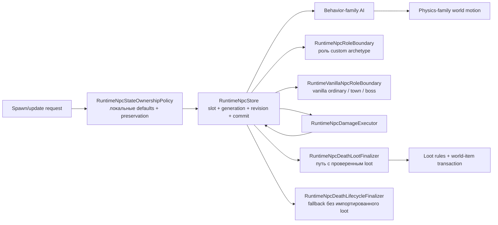

# Границы ответственности NPC runtime

[English](../en/npc-runtime-ownership.md) · [Семейства поведения NPC](npc-behavior-families.md) · [Roadmap декомпозиции gameplay](../roadmap/gameplay-decomposition-and-catalogs.md)

TerraRuntime разделяет хранение NPC, материализацию spawn/default state, AI, физику, combat и loot на самостоятельные зоны ответственности. Это не декоративная раскладка по файлам: slot-store не должен знать ванильные правила урона и стартовых характеристик, а физика не должна выбирать алгоритм по конкретному content ID NPC.

`TerraRuntime.Gameplay.Npcs` владеет неизменяемым source-backed слоем vanilla definitions: `VanillaNpcDefinition`, metadata behavior/physics family, net variants и допущенными каталогами slime/flying-eye/flyer/worm/AI17-20-21/town definitions. Core использует эти факты, но не владеет ими. Mutable NPC slots, authoritative state transitions, исполнение AI, combat и world-item transactions остаются в Core/application runtime.

## Spawn и локальное состояние

`RuntimeNpcStore` отвечает за адресуемые слоты, active-state, монотонные generation/revision, snapshots и порядок commit. Он больше не владеет поиском vanilla definition или материализацией ванильных локальных defaults.

`RuntimeNpcStateOwnershipPolicy` владеет текущими проверенными правилами spawn/update для полей, которые не являются packet identity:

- материализация `Life/LifeMax` из definition;
- стандартный active lifetime (`TimeLeft`);
- начальное направление sprite;
- сохранение combat/lifetime/presentation state, когда AI/state update намеренно оставляет эти поля unspecified.

Так storage остаётся общим, а существующий sentinel-контракт (`LifeMax == 0`, `TimeLeft == -1`, совместимый нулевой sprite direction на ingress) сохраняется.

Создание дочерних NPC из AI проходит через `INpcAiSpawnIntentPlanner`, а не мутирует slot-store прямо из AI. Executor предоставляет bounded scratch storage, planner может выдать упорядоченный batch из нуля или нескольких intents, и batch применяется только после успешного commit точной generation исходного NPC. Поэтому rejected/stale transition не может выпустить дочерние сущности в мир. После source commit отдельные spawn выполняются в vanilla-подобном best-effort порядке: если NPC table заполнится посередине batch, уже принятые дети остаются, а последующие spawn могут завершиться неудачей.

## AI family и physics family

`VanillaNpcBehaviorFamily` и `VanillaNpcPhysicsFamily` намеренно являются разными metadata. Общая AI-реализация сама по себе не доказывает одинаковые collision, platform, gravity или obstacle rules.

Текущие проверенные соответствия:

| NPC | behavior family | physics family |
| --- | --- | --- |
| Blue Slime | `SlimeGround` | `SlimeGround` |
| Demon Eye | `FlyingEye` | `FlyingEye` |
| Zombie | `GroundFighter` | `GroundFighter` |
| Eye of Cthulhu | `EyeOfCthulhu` | `NoClipFlight` |
| Servant of Cthulhu | `Flyer` | `NoClipFlight` |
| Skeleton | `GroundFighter` | `GroundFighter` |
| King Slime | `KingSlime` | `SlimeGround` |

Связь между именами считается допустимой только там, где её подтверждает текущий source-backed slice. Поля остаются раздельными, чтобы будущие definitions могли безопасно расходиться.

`VanillaNpcWorldMotionAiStepper` выбирает special movement и platform behavior через `PhysicsFamily`, а не через `NpcTypeId`. Для `VanillaNpcGravity` authoritative gameplay overload принимает уже разрешённый definition; raw/typed ID overloads остаются compatibility boundary и сначала разрешают definition.

## Проводка дверей и tall-gate в production

`VanillaNpcWorldMotionAiStepper` теперь владеет production-проекцией давления на двери и пробой занятости tall-gate. `RuntimeWorldClock` отдаёт live `BloodMoonActive` (уже отфильтрованный по `GetGoodWorld`) и сам `GetGoodWorld`; `VanillaWorldUnbreakableWallScan` отдаёт `TargetInsideUnbreakableWalls` (сканирование 8×250 для стены 350, цвет ≥16); `RuntimeTallGateOccupancyProbe` отдаёт `IsActorFree`, проверяя live прямоугольники игроков (`20×42`) и NPC (live hitbox) через семантику `Collision.EmptyTile(ignoreTiles:true)`. Собранный `VanillaGroundFighterDoorEnvironment` поэтому несёт точные ванильные входы политики, а `VanillaWorldGroundFighterDoorOpeningService` выполняет мутацию за `RuntimeGroundFighterDoorOpeningSink`, который также реплицирует packet-19 играющим пирам. Открытие tall-gate без пробы закрывается fail-closed; обычным дверям проба не нужна.

## Combat, смерть и loot

Combat остаётся в `RuntimeNpcDamageExecutor` и `VanillaNpcDamageResolver`. Lethal damage коммитит `Life = 0`, но не despawn'ит NPC и не запускает loot внутри damage resolver.

Для NPC с уже импортированным source-backed loot death/loot остаётся в `RuntimeNpcDeathLootFinalizer`, `VanillaNpcLootRules`, vanilla world-item materializer и generation-safe loot transaction. Поэтому store не знает drop tables, prefix RNG и world-item capacity semantics.

Отдельный `RuntimeNpcDeathLifecycleFinalizer.TryFinalizeWhenLootUnsupported` завершает entity lifecycle только для мёртвых vanilla типов, loot table которых ещё не импортирована. Он намеренно отказывает любому типу, уже присутствующему в `VanillaNpcLootRuleCatalog`, поэтому проверенные drops нельзя случайно обойти. Успешный fallback означает **неразрешённую loot parity**, а не пустой ванильный набор drops. Благодаря этому частично реализованный boss, например текущий Eye of Cthulhu, может generation-safe исчезнуть при `Life = 0`, не притворяясь, что его loot уже полностью реализован.

## Границы ролей town и boss

`NpcArchetypeRole` задаёт policy `Ordinary`, `Town` или `Boss`, но runtime-defined/custom и vanilla identity приходят к этой policy через разные доверенные источники.

`RuntimeNpcRoleBoundary` разрешает роль custom archetype через точный live `NpcHandle`, generation-safe archetype binding и одну опубликованную revision descriptor catalog. Такая роль является metadata custom runtime identity и никогда не выводится из vanilla presentation type или AI style.

`RuntimeVanillaNpcRoleBoundary` разрешает live vanilla generation через `RuntimeNpcStore` и version-pinned `VanillaNpcDefinitionCatalog`. Stale generation и неподдерживаемые vanilla types завершаются fail-closed. Поэтому текущий source-backed definition Eye of Cthulhu выбирает `Boss` lifecycle policy через точный live handle, а Blue Slime, Demon Eye, Zombie и Servant остаются `Ordinary`.

Оба результата классификации дают взаимоисключающие policy gates для town interaction, boss lifecycle или ordinary lifecycle. Housing/shop policy не попадает в обычный combat AI, а boss progression/despawn policy не превращается в raw type-number branch внутри store.

Это ownership boundaries, а не полная vanilla town/boss parity. Housing, boss progression, boss bars, оставшиеся boss-specific death effects и широкая boss AI всё ещё требуют отдельной source-backed реализации. Actor-commerce smoke по-прежнему явно помечает custom merchant archetype как `Town`.

## Граница завершения D4

Пункт roadmap `spawn/physics/combat/loot separation` считается закрытым для текущего authoritative NPC slice, потому что:

- slot storage больше не содержит vanilla definition/default materialization;
- physics dispatch больше не ветвится по конкретным ID Blue Slime/Demon Eye/Zombie;
- дочерние AI spawn проходят через bounded post-commit intent boundary, а не мутируют store спекулятивно;
- combat, entity death lifecycle и проверенный death/loot исполняются раздельными generation-safe компонентами;
- custom и vanilla role policy разрешаются через явные generation-safe boundaries;
- тесты фиксируют выбор catalog family и ownership локального состояния;
- будущие definitions обязаны явно выбрать behavior и physics family.

Это не означает поддержку всех NPC Terraria. Широкие vanilla town/housing, boss progression и boss behavior остаются открытыми, хотя их ownership boundaries теперь явные.
