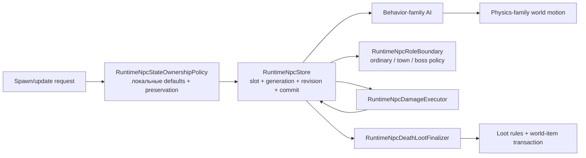

# Границы ответственности NPC runtime

[English](../en/npc-runtime-ownership.md) · [Семейства поведения NPC](npc-behavior-families.md) · [Roadmap декомпозиции gameplay](../roadmap/gameplay-decomposition-and-catalogs.md)

TerraRuntime разделяет хранение NPC, материализацию spawn/default state, AI, физику, combat и loot на самостоятельные зоны ответственности. Это не декоративная раскладка по файлам: slot-store не должен знать ванильные правила урона и стартовых характеристик, а физика не должна выбирать алгоритм по конкретному content ID NPC.

## Spawn и локальное состояние

`RuntimeNpcStore` отвечает за адресуемые слоты, active-state, монотонные generation/revision, snapshots и порядок commit. Он больше не владеет поиском vanilla definition или материализацией ванильных локальных defaults.

`RuntimeNpcStateOwnershipPolicy` владеет текущими проверенными правилами spawn/update для полей, которые не являются packet identity:

- материализация `Life/LifeMax` из definition;
- стандартный active lifetime (`TimeLeft`);
- начальное направление sprite;
- сохранение combat/lifetime/presentation state, когда AI/state update намеренно оставляет эти поля unspecified.

Так storage остаётся общим, а существующий sentinel-контракт (`LifeMax == 0`, `TimeLeft == -1`, совместимый нулевой sprite direction на ingress) сохраняется.

## AI family и physics family

`VanillaNpcBehaviorFamily` и `VanillaNpcPhysicsFamily` намеренно являются разными metadata. Общая AI-реализация сама по себе не доказывает одинаковые collision, platform, gravity или obstacle rules.

Текущие проверенные соответствия:

| NPC | behavior family | physics family |
| --- | --- | --- |
| Blue Slime | `SlimeGround` | `SlimeGround` |
| Demon Eye | `FlyingEye` | `FlyingEye` |
| Zombie | `GroundFighter` | `GroundFighter` |

Названия пока совпадают, потому что допущенный authoritative slice небольшой. Поля остаются раздельными, чтобы будущие source-backed definitions могли безопасно расходиться.

`VanillaNpcWorldMotionAiStepper` выбирает special movement и platform behavior через `PhysicsFamily`, а не через `NpcTypeId`. Для `VanillaNpcGravity` authoritative gameplay overload принимает уже разрешённый definition; raw/typed ID overloads остаются compatibility boundary и сначала разрешают definition.

## Combat и loot

Combat остаётся в `RuntimeNpcDamageExecutor` и `VanillaNpcDamageResolver`. Lethal damage коммитит `Life = 0`, но не despawn'ит NPC и не запускает loot внутри damage resolver.

Death/loot остаётся в `RuntimeNpcDeathLootFinalizer`, `VanillaNpcLootRules`, vanilla world-item materializer и generation-safe loot transaction. Поэтому store не знает drop tables, prefix RNG и world-item capacity semantics.

## Граница ролей town и boss

`NpcArchetypeRole` явно классифицирует runtime-defined archetype как `Ordinary`, `Town` или `Boss`. Role является metadata runtime identity и никогда не выводится из vanilla presentation type или AI style. `RuntimeNpcRoleBoundary` разрешает её через точный live `NpcHandle`, generation-safe archetype binding и одну опубликованную revision descriptor catalog.

Полученный `RuntimeNpcRoleClassification` открывает взаимоисключающие policy gates: town interaction, boss lifecycle или ordinary lifecycle. Housing/shop policy не попадает в обычный combat AI, а boss progression/despawn policy не превращается в type-number branch внутри store. Missing, stale и unpublished bindings завершаются fail-closed.

Это boundary декомпозиции, а не vanilla town/boss parity. Текущие vanilla definitions ещё не заявляют town/boss roles; housing, boss progression, boss bars, special despawn и широкая boss AI остаются отдельной source-backed работой. Actor-commerce smoke явно помечает custom merchant archetype как `Town`.

## Граница завершения D4

Пункт roadmap `spawn/physics/combat/loot separation` считается закрытым для текущего authoritative NPC slice, потому что:

- slot storage больше не содержит vanilla definition/default materialization;
- physics dispatch больше не ветвится по конкретным ID Blue Slime/Demon Eye/Zombie;
- combat и death/loot уже исполняются отдельными generation-safe компонентами;
- тесты фиксируют выбор catalog family и ownership локального состояния;
- будущие definitions обязаны явно выбрать behavior и physics family.

Это не означает поддержку всех NPC Terraria. Широкое vanilla town/housing и boss behavior остаётся открытым, хотя их ownership boundary теперь явная.
