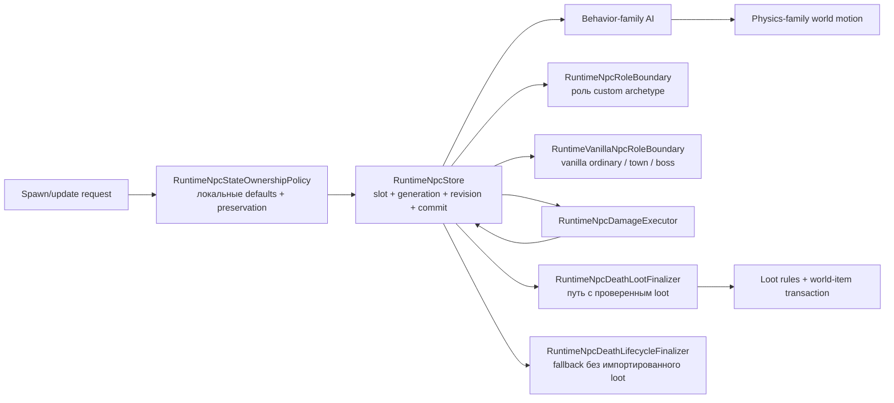

# Границы ответственности NPC runtime

Destroyer (`134`, AI `37`) сохраняет исходный маркер режима копания `localAI[0]` вместе с `localAI[1]`. Переход маркера копания создаёт явное срочное обновление NPC только для подтверждённой исходником ветки: TerrariaServer выставляет здесь `netUpdate`, поэтому runtime обходит обычный 30-тиковый cadence пакета `23` только в этом случае. AI_037 также выставляет `netUpdate`, когда тело Destroyer сбрасывает счётчик лазера, проходит `Collision.CanHit` и создаёт Death Laser. Исполнитель теперь принудительно публикует packet 23 для ровно такого запланированного лазера, но не при простом сбросе счётчика за заблокированной линией видимости. Общий механизм срочного обновления остаётся opt-in, поэтому остальные AI-коммиты сохраняют свой cadence. Фокусные runtime-регрессии покрывают оба перехода маркера, обе ветки видимости лазера и lifecycle-событие `ForcedUpdate`. Duke Fishron (`370`, AI `69`) использует тот же opt-in путь в точках исходного `netUpdate`: при обновлении сохранённой цели за границей 5600 пикселей и известных переходах фаз корня. Sharkron и Sharkron2 (`372/373`, AI `71`) также принудительно обновляются только после обновления сохранённой цели либо на 90-тиковом переходе emergence-to-charge; при refresh сохраняется исходный reset направления `TargetClosest(false)` к `1`. Обычное увеличение счётчиков остаётся на стандартном cadence.

Пила Прайма (`129`, AI `33`) и тиски Прайма (`130`, AI `34`) теперь воспроизводят исходные области зависания, преследование, вертикальные атаки, повторные рывки тисков, фазу слежения пилы и возврат по расстоянию. Переход в возврат выполняется до обработки фазы. Фаза родителя `3` ускоряет исчезновение только в исходных ветках зависания. Физические флаги и признак полученного удара эти ветки не меняют.

Независимые записи оригинальных Windows/Linux покрывают $9520\,\text{вызовов/платформу}$: сложность, Good World, фазы родителя, счётчики атак, знаки скорости, физические флаги, проверку типа активного родителя и ближнюю/дальнюю геометрию неактивного родителя. Тесты сравнивают полное сохраняемое состояние NPC и RNG; ещё восемь тестов проверяют устаревшие предложения и замену NPC при удалении. Все $9408\,\text{начальных регрессионных случаев}$ падали на прежней реализации. Нативная протокольная проверка исполняет обе ближние стратегии. Удаление при неверном родителе публикует только despawn и сохраняет четыре вызова RNG для gore на выделенном сервере. Runtime теперь передаёт ограниченный снимок сохранённых слотов вместе с обычными активными peers, поэтому неактивный родитель всё ещё задаёт исходный переход по расстоянию. Другая геометрия тела игрока, проекция неактивных целей и призраков, последовательные встречи и внешнее перемещение NPC ещё не подтверждены.

Пушка Прайма (`128`, AI `35`) и лазер Прайма (`131`, AI `36`) теперь используют отдельные исходные правила фаз для движения, поворота, смены цели, ускоренного исчезновения и таймеров стрельбы. В обычной фазе пушка стреляет от точки крепления к родителю; при активном движении она читает прежнюю цель до выбора следующей цели выстрела. Лазер сохраняет собственные пороги обычной и активной фаз, включая ветку фазы `3`. Переходы сохраняют физические флаги, которыми эти ветки AI не управляют.

Планирование снарядов этих рук не расходует RNG. После принятия точной ревизии источника эффект расходует два исходных случайных значения разброса и создаёт бомбу или лазер относительно физического центра до перемещения. Заполненное хранилище снарядов всё равно сохраняет этот расход и сброшенный таймер выстрела. Более новая ревизия источника или новое поколение не получают старый выстрел. При потере родителя публикуется только окончательное удаление руки; её `HitEffect` на выделенном сервере всё ещё вызывает `Next(61,64)` четыре раза, и эти вызовы сохранены до удаления. Замена NPC во время этих вызовов остаётся активной.

Независимые записи Windows и Linux покрывают $3456\,\text{исходных вызовов/платформу}$, $6912\,\text{вызовов геометрии, целей и флагов/платформу}$, $96\,\text{серий/платформу}$ по восемь последовательных вызовов и $60\,\text{случаев родителя/платформу}$. Проверки сравнивают сохраняемое состояние NPC, координаты, скорости, ключи и время жизни снарядов и полное состояние RNG. Нативная протокольная проверка исполняет обе руки через подтверждённое создание. В записях родитель заморожен, а AI руки исполняется отдельно; полные встречи с Праймом, ближние руки, Mech Queen, проекция неактивных игроков, внешнее перемещение и полная периодичность обновлений снарядов и сети остаются открытыми.

Масштабирование при создании Скелетрона, Прайма, Уничтожителя, Зонда, тёмного мага, водяной сферы и двух типов демонов теперь следует арифметике оригинала для платформы хоста. Windows сохраняет расширенные произведения перед преобразованием в целое, исходное сохранение Single между двумя поправками здоровья и итоговым округлением, а также расширенные выражения урона и отбрасывания. Коэффициент числа игроков округляется при исходных записях выходных значений. Linux сохраняет собственные границы Single. Обычный `VanillaNpcSpawnDefaults.TryResolve` выбирает платформу хоста; перегрузка с явным `windowsArithmetic` позволяет проверить любой оригинал на любом хосте.

Независимые записи содержат $14400\,\text{созданий/платформу}$ для пятнадцати типов, дробной сложности, Good World, Hardmode, Плантеры, активного Скелетрона и числа игроков вплоть до $255\,\text{игроков}$. Обе арифметические ветки сравниваются с оригиналами без допусков. Существующие проверки создания, RNG и фаз также получили отдельно снятые ожидания Windows. Расчёт дневной скорости Прайма теперь сохраняет расширенное деление и сложение Windows до записи скорости в Single; исходная матрица фаз проверяет полученную скорость. Нативная протокольная проверка исполняет дробное здоровье головы и руки, здоровье Прайма при большом числе игроков и урон сферы в Hardmode.

Это закрывает зафиксированное расхождение дробного создания для этих профилей и сохранённых контекстов. Другие профили NPC, непроверенные пользовательские значения сложности, полные встречи с боссами, внешний жизненный цикл и полное сетевое согласование ещё требуют независимой сверки.

Голова Скелетрона (`35`) теперь реализует варианты зависания и вращения RedHat, исходное вращение спрайта и сохранение физических флагов. RedHat продвигает таймер зависания на $1.5\,\text{тика/вызов}$, использует собственные коэффициенты ускорения и скорости и применяет исходный множитель урона с точностью `double`. Отражение и обычный призыв Good World используют количество рук, подсчитываемое только в Expert. При выходе из зависания очередной череп использует цель, выбранную до обработки фазы; затем голова выбирает следующую ближайшую цель и произносит реплику. Перед уходом из боя из-за далёкой цели выполняется повторный выбор.

Призывы магов используют отдельный `IVanillaSkeletronEnvironment`, подключаемый через `SetSkeletronEnvironment`. Адаптер принадлежащего миру хранилища воспроизводит предел $1000\,\text{попыток}$, тайловые координаты физического центра, проверку сплошного тайла и поиск вниз. Платформы, склоны, полублоки и деактивированные тайлы не останавливают этот поиск. Сохранены исходные результаты у пустого нижнего края и выше верхней границы мира. Попытки разрешаются исходным таймером вращения каждые $200\,\text{тиков}$; общий предел магов в мире равен четырём для RedHat и шести для обычного Good World. Новые маги сохраняют цель `255` и получают маркер при выполнении собственного AI. Новый слот выше родительского исполняется позже в том же проходе.

`INpcAiTauntCommitSink` публикует только принятые варианты `SkeletronTaunt` от `2` до `5`; приложение отправляет исходное локализованное красное сообщение сервера через пакет `82`. `TryAnnounceSkeletronTaunt` проверяет ревизию источника после случайного выбора. Перегрузка `TrySpawn` с источником проверяет его принадлежность до вызовов создания и повторно после получения контекста и RNG, до выделения слота и публикации. Этот путь используют призывы Скелетрона и сферы мага: при более новой ревизии или замене поколения принятый расход RNG сохраняется, а ребёнок не публикуется.

Сверка включает $2443\,\text{отдельных вызова головы}$, $96\,\text{серий по пять вызовов}$, $1008\,\text{сценариев геометрии и ёмкости}$, $144\,\text{прохода головы и мага}$, $32\,\text{смены цели}$, $32\,\text{сценария флагов}$, $16\,\text{сценариев границ мира}$ и четыре исходных пакета чата. Записи получены от оригиналов Windows и Linux; различающаяся арифметика снарядов сохранена по платформам. Тесты сравнивают полное сохраняемое состояние головы и детей, снаряды и все ячейки RNG. Эти записи проверяют отдельный AI при замороженных посторонних сущностях, без внешнего перемещения и жизненного цикла `NPC.Update`. Полные встречи, проекция отключённых целей и призраков, нестандартные хитбоксы, оставшиеся модификаторы боя и добычи и полная срочная сетевая синхронизация остаются открытыми.

Атака Скелетрона черепом теперь расходует четыре случайных числа и создаёт снаряд после принятия состояния головы. Предварительное планирование снарядов ничего не расходует. Подтверждённый эффект использует цель, выбранную до обработки фазы, позицию и скорость головы до перемещения, исходную периодичность и порог здоровья с точностью `double`. `INpcAiCommittedNpcMutationSink.TrySpawnProjectile` проверяет ожидаемые поколение и ревизию источника перед привязкой снаряда к NPC. Повторный вход во время проверки видимости не расходует RNG для устаревшего источника; повторный вход во время RNG сохраняет принятый расход, но не позволяет создать снаряд от имени более нового состояния. Неудачное выделение слота сохраняет расход RNG.

Физический левый верхний угол черепа вычисляется из исходного центра создания и размеров в каталоге. Начальный AI — `(-1, 0, 0)`, урон — `17`, время жизни — $300\,\text{тиков}$. Отдельные записи Windows x86/XNA и Linux/FNA содержат по $384\,\text{вызова}$ с разной сложностью, Good World, количеством рук, начальным состоянием генератора и координатами цели. Тесты сравнивают скорость без допуска на обеих арифметических ветвях, а для подтверждённого создания на платформе хоста — координаты, AI, время жизни, привязку к NPC и полное состояние RNG. Промежуточная точность Windows воспроизведена явно; это не глобальная замена всех вычислений `float`. Полные встречи, нестандартные хитбоксы целей и сходимость сетевого состояния остаются открытыми.

Тёмный маг (`32`) получил реализацию AI стиля `8` выделенного сервера: наследование RedHat от первой головы, сохранение локального маркера, обновление цели, замедление по горизонтали, таймеры атак, отложенную телепортацию и создание водяной сферы. Ограниченный поиск места следует исходным случайным попыткам, проверкам опоры и свободного места, исключению для стены темницы, ветке лавы и проверкам игроков. Успешный выбор сбрасывает таймер атаки до возможного создания сферы в текущем вызове. Сфера использует позицию мага после уже запланированной телепортации, но до внешнего перемещения; новый NPC в большем слоте выполняет AI далее в том же проходе по возрастанию слотов. Ещё 48 поисков в оригинале проверяют окна поиска, касающиеся краёв мира, и отказ проверки свободного места у дна мира, включая расход RNG. Окна поиска за пределами хранилища тайлов безопасно отклоняются.

Поля AI, зависящие от случайного выбора, завершаются после принятия исходного состояния, но до публикации обновления. `INpcAiStatePostCommitEffect` может отложить публикацию и завершить подтверждённое состояние через проверяющий ревизию вход `TryUpdateAi`. Наблюдатели получают окончательное состояние; замена NPC или новая ревизия во время поиска отменяет устаревшую публикацию и последующие эффекты. Уже выполненный расход RNG принятого поиска сохраняется. Внешнее перемещение по-прежнему выполняется один раз. Создание сферы предшествует проверке вероятности пыли мага на выделенном сервере, в том числе при отказе в выделении слота.

Библиотеки оригинальных платформ различаются в проверке игроков при телепортации: Windows XNA правильно объединяет текущий прямоугольник игрока с прогнозируемым смещением, а поставляемая с Linux FNA использует один объект для входа `ref` и результата `out`, теряя положительное смещение по каждой оси. Runtime выбирает поведение по платформе хоста. Оба оригинальных сервера проверены независимо: по 600 поисков на платформу выявили 40 различающихся результатов. Это отдельное свидетельство от проверки нативных сборок runtime для Windows/Linux. Также сохранены 4800 отдельных вызовов AI мага с побайтово одинаковыми результатами оригинальных сборок Windows и Linux, 960 серий по пять вызовов, 96 связанных проходов мага/сферы и 486 проверок границ прямоугольника стрельбы в оригинале. Полные встречи, нестандартные размеры игроков, проекция отключённых целей и другие типы магов остаются отдельной незавершённой работой.

Ванильное создание теперь использует общий поток случайных чисел мира вместе с естественным спавном и встроенным AI NPC. `SystemVanillaNpcRandom` использует закреплённый алгоритм `UnifiedRandom` версии 1.4.5.8; хост может передать поток через `RuntimeNpcStore.SetVanillaSpawnRandomSource`. В Good World оба входа ванильного создания расходуют один `Next(3)` до выделения слота, в том числе при неудаче. Ненулевой результат заменяет кролика (`46`) на взрывного кролика (`614`), а демона (`62`) на демона вуду (`66`). Параметры выбранного типа вычисляются после замены. Создание в точном слоте через `TrySpawn` этот ванильный этап не выполняет.

Определения и профили сложности этих четырёх типов при создании проверены независимо. Оба кролика остаются дружелюбными, с пятью единицами жизни и сохранённой сложностью `1`; демоны создаются с включённой гравитацией и используют проверенные обычные правила масштабирования. Их AI, добыча и полный игровой цикл остаются отдельной незавершённой работой. Основание — 2880 вызовов создания в оригинале, проверенных через оба входа, и шесть последовательностей «создание → отказ при заполненной таблице → AI водяной сферы» со сравнением полного состояния RNG. Общий поток подключён к встроенному AI; пользовательский AI и другие игровые системы ещё требуют проверенной интеграции для полного соответствия игровому `Main.rand`.

Огненная (`25`) и водяная (`33`) сферы теперь используют общий проверенный путь AI стиля `9`. Первичное наведение выполняется только при неназначенной цели (`255`); уже назначенная мёртвая, неактивная или призрачная цель не перенаправляет летящую сферу. При наведении учитываются физические центры и исходный порядок деления. В Good World наличие соответствующего босса меняет скорость запуска и включает неуязвимость, которая сохраняется после его удаления. Каждый вызов AI ограничивает оставшееся время жизни значением 100, увеличивает сохранённый угол на `0.4 * direction` и сохраняет `JustHit` и физические флаги. Внешнее перемещение, удаление по времени жизни и призывающий маг относятся к отдельным этапам.

`NpcSimulationState.Rotation` — nullable-конечный угол в радианах: при создании по умолчанию ноль, отсутствие значения в обновлении сохраняет угол, явный ноль сбрасывает его, а смена идентичности NPC возвращает ноль. Два вызова `Next(5)` водяной сферы выполняются только после подтверждения состояния и запланированных призывов; они остаются частью AI выделенного сервера, хотя само создание пыли завершается раньше. У огненной сферы таких вызовов нет. Общий исполнитель AI также отклоняет результат, если ревизия исходного NPC изменилась во время планирования, чтобы не затереть более новое обновление. Замена поколения, недопустимый результат и новое состояние от наблюдателя подтверждения не сдвигают этот поток RNG.

Основание — 5760 отдельных вызовов AI оригинала и 144 серии по пять вызовов (720 вызовов) для обеих сфер, с полным состоянием RNG до/после, резервным выбором цели и удалением босса. Тесты восстанавливают независимо записанный поток после создания NPC; описанные выше отдельные выборки создания и связанных последовательностей подтверждают подключение RNG в проверенном объёме `NewNPC`. Перенаправление на питомца-танка, разворот с учётом предыдущей цели и отрицательного aggro, нестандартные размеры игрока и сохранённые позиции отключившихся игроков ещё требуют полной проекции состояния выбора цели. Порядок призывов/реплик головы RedHat остаётся открытым.

Тёмный маг (`32`) и водяная сфера (`33`) получили подтверждённые оригиналом размеры, боевые параметры, прозрачность и физические флаги создания. Общий контекст отдельно для каждого создания считывает хардмод, победу над Плантерой и наличие активного Скелетрона. Учитываются загруженные факты мира и подтверждённые изменения прогрессии; активная голова с нулевой жизнью считается присутствующей до удаления. В Good World наличие головы отменяет усиление хардмода для обоих типов и отдельно изменяет жизнь и защиту мага. Водяная сфера остаётся NPC с одной единицей жизни, а не сущностью хранилища снарядов. Сохранённая выборка сравнивает 784 результата оригинального `NewNPC`, включая дробную сложность, число игроков и все три условия мира.

`NpcSimulationState.KnockBackResist` хранит текущее сопротивление отбрасыванию: null означает отсутствие заданного значения, создание берёт определение или проверенный профиль сложности, обновление состояния сохраняет значение, а смена типа/net identity восстанавливает новое определение. Явный ноль допустим и отключает отбрасывание; отрицательные и неконечные значения отвергаются. Боевая обработка использует подтверждённое состояние. `AlphaAtSpawn` задаёт исходную прозрачность, если вызывающая сторона не передала ненулевую. Веса NPC при ограничении естественного спавна и упорядоченные призывы/реплики головы RedHat ещё не завершены; AI тёмного мага стиля `8` и сферы стиля `9` описаны выше.

Контактное поведение RedHat, входящий урон и добыча Скелетрона теперь используют общее правило `VanillaSkeletronCombat.HasRedHatAdjustments`: голова и водяная сфера проверяют `ai[3]`, рука и тёмный маг — `localAI[3]`; вариант включается только при точном значении `1`. Общий исполнитель авторитетного урона применяет исходный float-множитель `0.7` после обычного расчёта защиты, критического удара и округления, ограничивает результат снизу единицей и использует его для жизни и отбрасывания. Конвейер смерти читает маркер подтверждённого состояния головы для пяти гарантированных декоративных предметов вместо постоянного ложного условия.

Проверки опираются на 1 760 публичных вызовов `StrikeNPC` оригинала с обычными значениями и 960 с большим входным уроном для головы/руки Скелетрона и контрольных типов, 54 вызова исходного предиката маркера для четырёх затронутых типов и контролей, девять сценариев настоящего конвейера смерти в Classic/Expert/Master. Обычный расчёт защиты и критического удара теперь использует исходную точность `double` до округления; снижение RedHat остаётся `float`. Проверки конвейера декодируют пакеты мировых предметов для убийцы, другого игрока и наблюдателя, а также отклоняют повторное убийство по устаревшему идентификатору. Удаление снижения урона нарушает 306 проверок, старый float-расчёт защиты — 450, возврат постоянного флага добычи — три. Полные определения и AI тёмного мага/водяной сферы, RedHat AI головы, другие модификаторы урона и паритет полного боя остаются незавершёнными.

Руки Скелетрона теперь учитывают маркер RedHat, полученный из `ai[3]` допустимого родителя, независимо от сложности и флагов сида. Маркер меняет контактный урон относительно сохранённого базового урона, таймеры покоя, ускорения и ограничения подготовки, скорости рывков. Сброс маркера прекращает эти изменения движения, но сохраняет текущее значение урона, как в оригинале. При недопустимом родителе локальный маркер руки сохраняется вместе с его влиянием на урон.

Родитель проверяется по активности и `aiStyle 11`, включая Хранителя Данжа. Для него добавлены базовое определение и геометрия из оригинала; собственный AI и масштабирование по сложности ещё не реализованы. Осиротевшая рука прибавляет десять к `ai[2]` за вызов AI и немедленно удаляется при превышении пятидесяти. Внутренний отрицательный признак смерти оригинала представлен нулевой жизнью и удалением с проверкой поколения; `TimeLeft` сохраняется. Существующий этап подтверждённых эффектов подавляет промежуточное обновление активного NPC, публикует удаление до следующего слота и сохраняет последнее перемещение в мире. Этот путь не создаёт боевое убийство или добычу.

Независимые фикстуры содержат 1 296 вызовов RedHat оригинала и 288 последовательностей связи с родителем — ещё 1 248 исходных вызовов. Вместе с обычными фазами и проверками владения состоянием и перемещения проходят 3 810 целевых тестов. Возврат проверки только типа родителя нарушает 48 проверок, отключение немедленного удаления — 193, отключение изменений RedHat — 1 300. Native protocol smoke проверяет значения рывка RedHat и удаление осиротевшей руки. Эта запись заменяет ограничения маркера и жизненного цикла рук ниже; RedHat AI головы, мёртвые/отсутствующие/призрачные цели, повороты, полные бои и точное продолжение пакетов/RNG остаются открытыми.

Обычные фазы рук Скелетрона теперь используют физические размеры: целую половину ширины при выравнивании относительно головы и float-центр для вектора рывка. При переходе к рывку обновляются ближайшая цель и оба направления взгляда; направление спрайта зависит от стороны руки. Руки копируют `ai[3]` головы в `localAI[3]`, сохраняют исходный минимум дистанции рывка `0.01` и порядок деления, а выход по большой дистанции проверяют относительно верхнего левого угла игрока. Время жизни при бегстве сокращается до десяти обновлений только в состояниях рук `0` и `3`. Сохранены 2 220 вызовов AI рук оригинала: таймеры, стороны, фазы головы, Good World, точное выравнивание, малые дистанции и границы выхода по дальности. AI головы заморожен; удаление осиротевших рук, другие стили родителя, RedHat, полный бой и доказательства для пакетов/RNG ещё не завершены.

Vanilla-выделение теперь заменяет нулевой `DirectionY` исходным значением свежего NPC — `1`, в том числе при повторном использовании слота. Явные ненулевые направления остаются под управлением вызывающей стороны. Точное создание через `TrySpawn` и обычные обновления сохраняют переданный ноль. Это проверено по созданию рук оригинала и тестом границ владения; формат сетевого пакета не меняется.

Инициализация Скелетрона теперь создаёт руки до того, как оставшийся AI головы рассчитывает защиту и планирует черепа. `INpcAiSpawnIntentPlanner.TryPlanInitialization` — необязательная стадия; обычные планировщики сохраняют выделение после шага. Исполнитель сначала проверяет допустимое предложение состояния без побочных эффектов, подтверждает только инициализацию без публикации промежуточного обновления головы, создаёт дочерних NPC по порядку, обновляет список соседей и выполняет оставшийся шаг состояния. Таймеры и движение мира продвигаются один раз. Проверки точного поколения/ревизии отклоняют устаревшее начальное предложение и останавливают работу после изменения головы при публикации ребёнка или во время продолжения. Уже подтверждённые инициализация и дочерние NPC сохраняются, если продолжение отклонено; отката этой выполненной части нет.

Расширенный набор из 48 вызовов рук оригинала теперь содержит начальные урон, защиту, скорость головы и число снарядов в пустом мире с инициализированными тайлами. Сравнения с обычным AI и обработкой движения мира проходят: защита обычного Expert равна 60 при двух созданных руках, 35 при одной и 10 без рук; начальный череп подавляется при двух руках и полном здоровье. Runtime-тесты также проверяют публикацию рук до итогового состояния головы, видимость этого состояния первой рукой, обновление цели, отсутствие преждевременного RNG черепов и защиту от повторного входа. Отключение инициализации ломает 65 проверок; удаление каждой из трёх проверок ревизии ломает граничный тест. Полные бои, другие семейства инициализации, точные байты снарядов/продолжение RNG и AI рук остаются открытыми.

Состояние NPC теперь сохраняет nullable-поле `SpawnDifficulty` (`NPC.difficulty`). Vanilla-выделение считывает его один раз даже для типов, чей профиль характеристик ещё не реализован. Явное создание в хранилище задаёт известным типам Classic; обновление без значения сохраняет его, а смена определения сбрасывает к Classic вместе с базовыми характеристиками определения. Нечисловые, бесконечные и выходящие за диапазон значения отклоняются до изменения состояния; поддерживается диапазон от `0.5` до `4`. Произвольные vanilla-параметры превращений этим ещё не воспроизводятся.

Фазы уже инициализированной головы Скелетрона теперь восстанавливают боевую базу создания, вычисляют урон вращения по сохранённой сложности, сохраняют текущий урон при бегстве и используют физический центр с исходной проверкой положительной дистанции и порядком float-операций. Отражение снарядов при вращении в Good World зависит от текущего числа рук в Expert. Независимые доказательства включают 715 вызовов головы оригинала с разными режимами, сидами, числом рук, таймерами, дробной сложностью и граничными дистанциями, а также регрессии владения состоянием и native smoke выхода из вращения. Вызовы начинаются после инициализации, AI рук заморожен; полный AI рук, RedHat, вращение спрайта и сетевое/RNG-поведение полного боя остаются открытыми.

Голова и руки Скелетрона также используют общий профиль создания: физический масштаб Good World равен `1.25` для головы и `1.15` для рук; поправки сложности и числа игроков сохраняют исходное округление float. Координаты рук используют размеры головы до движения и отбрасывают дробную часть вертикальной позиции до добавления целой половины высоты. Доказательства включают 158 созданий NPC и 48 созданий рук головой оригинала, покрытых 254 сравнениями; отключение профиля ломает 202 проверки, возврат старого округления — 36. Native smoke проверяет масштабированные характеристики головы/рук и дробные координаты создания. Соседний пробел создания закрыт; полный AI рук, варианты RedHat и полное поведение боя/сети ещё не завершены.

Начальное создание рук Прайма теперь использует физические размеры головы и её позицию до движения мира. Оригинал отбрасывает дробную часть вертикальной позиции перед добавлением целой половины высоты; это существенно и для отрицательных дробных координат. Все четыре руки начинают поиск слота с головы, а нехватка слотов даёт частичное создание без повторной инициализации. Сохранены результаты 48 вызовов головы оригинала: три режима, Good World, четыре начальных слота и дробные координаты. Каждый случай проверяется с обычным AI и с обработкой движения мира; начальное состояние рук сравнивается до их AI. Возврат старых координат ломает 63 из 96 проверок; отдельные возвраты позиции после движения и неправильного округления — 18 и 36. Native protocol smoke также проверяет дробные координаты в Good World. Это подтверждает создание, но не полный AI рук или порядок сетевой публикации.

Снимки NPC теперь сохраняют `BaseDamage` и `BaseDefense`, соответствующие vanilla-полям `defDamage` и `defDefense`, отдельно от текущих боевых переопределений. При создании значения берутся из проверенного профиля сложности либо определения, если вызывающая сторона не передала их явно. Пропущенное значение при обновлении сохраняет базу того же определения; смена типа/net-определения сбрасывает её к новому определению, а повторное использование слота не наследует значения старого поколения. Это поддержка владения состоянием, а не утверждение о полном совпадении параметров сложности при произвольных превращениях NPC.

Skeletron Prime и четыре руки теперь используют общий контекст создания. AI головы восстанавливает сохранённую базу на каждом шаге, удваивает текущие урон/защиту при вращении и возвращает исходные значения после его завершения. Наведение при зависании, атаке и дневном преследовании использует центр физического hitbox. Атака и преследование сохраняют исходный порядок деления/умножения, заменяют единицей только неположительное расстояние и соблюдают исходные пороги ускорения. При поиске цели теперь обновляется и направление головы, а фазы зависания, вращения, ярости и исчезновения сохраняют rotation до изменения velocity, как в порядке AI `32`. Подтверждённый пакет рук следует исходному порядку типов и слотов: Cannon (`128`), Saw (`129`), Vice (`130`) и Laser (`131`); все четыре ребёнка выполняются после головы в том же проходе по возрастанию слотов. Независимые данные покрывают 395 созданий семейства Prime и 408 вызовов AI головы, включая нулевое/малое расстояние и обе стороны каждого порога ускорения; парные Windows/Linux-fixture по 1200 шагов покрывают первые 600 тиков от обеих границ `599`→вращение и `399`→зависание, включая создание Cannon bomb и Laser projectile, с обновлением всех четырёх рук в порядке слотов. Runtime сравнивает все сохранённые поля акторов, активные слоты projectile, кинематику, AI, время жизни и полное состояние RNG после AI NPC на всех 1200 шагах; запись восстанавливает позднее состояние RNG оригинала после presentation-эффектов projectile, чтобы следующий шаг NPC сохранил исходную последовательность; во второй фазе остаются активными projectile первой фазы, как в исходном мире. Для Windows float-сравнения допускают $10^{-5}$, так как исходный x86 и текущие x64-вычисления отличаются в последних битах float на длинной встрече. Обновление projectile и сетевая каденция остаются открытыми. Оставшиеся боевые состояния Mechdusa, логика головы и сложность при превращениях остаются открытыми.

Действие `-16` packet `61` теперь достигает серверной границы `NPC.SpawnMechQueen`, если у загруженного мира установлен флаг Zenith. Сначала оно отклоняется при активном Prime, Destroyer или Twin; иначе Prime создаётся обычным размещением около игрока начиная со слота `100`, сохраняет этот слот в `ai[3]` и получает время жизни SpawnBoss `×20`. Затем Retinazer, Spazmatism, Destroyer и два Probe создаются в усечённом центре физического hitbox Prime. Probe сохраняют слот нового Destroyer в `ai[2]` и `-1`/`1` в `ai[3]`. Runtime проверяет порядок шести участников, anchors, исходные targets, связь/время Prime, отклонение повтора и отклонение вне Zenith-мира. Общий AI Mechdusa остаётся открытым; ветка добычи Waffle Iron теперь следует исходному условию убийства.

Привязанные Probe Mechdusa теперь используют живые физические центр и rotation своего Destroyer, а velocity берут у живого Prime Mech Queen. Их offset `26 × ai[3]` остаётся неуязвимым, пока активен anchor Prime; таймер AI_005 расходует три обновления за тик мира и стреляет каждые 360 обновлений. Probe Pink Laser начинается в исходном центре до привязки, усечённом к сетке восьми пикселей, но целится из центра после привязки с упреждением velocity цели на 20 тиков и скоростью `8`. Эта часть покрывает Classic и Good World dimensions через обычный resolver hitbox. AI_005 также повторно находит первый Destroyer, если сохранённый слот вне физической таблицы; в остальных случаях исчезновения Prime или Destroyer в допустимом слоте он очищает `ai[3]`, неуязвимость и трёхшаговый таймер. Остальной общий бой остаётся открытым.

У Retinazer и Spazmatism Мехдузы обычное наведение фазы `ai[0]=0, ai[1]=0` заменяется орбитой пока жив anchor Prime. Оба берут физический центр Prime со сдвигом вверх на $14\,\mathrm{px}$, поворачивают точки $(-112.5,-187.5)$ и $(112.5,-187.5)$ на `Prime.velocity.X × 0.025`; Retinazer сохраняет сглаживание `59/60`, Spazmatism — `4/5`, оба с пределом скорости `14`. Граница таймера `ai[2]` этой фазы равна `1200` обновлениям; исходные счётчики `ai[3]` передаются существующему планировщику projectile, включая Cursed Flame Spazmatism на границе `60`. В исходных фазах превращения `ai[0]=1/2` живой anchor Prime также включает отражение projectile. В позднем зависании `ai[0]≥3, ai[1]=0` те же точки орбиты используют обратное сглаживание: Retinazer `4/5`, Spazmatism `59/60`, и границу `1200` обновлений. Порядок projectile и поздние состояния общего боя остаются открытыми.

В последний тик перехода от `ai[0]=2` к фазе три Twin Mechdusa всё ещё отражает projectile: AI_030/AI_031 выставляет флаг до увеличения фазы.

Мехдуза Twin теперь сохраняет исходную ротацию к цели до ветвления фаз. Retinazer поворачивается на `0.1`, Spazmatism — на `0.15`, а в позднем зависании с живым Prime последний использует исходный четвертной шаг `0.0375`. Ротация берёт физические width/height, нижнюю точку наведения `59 px` и исходные правила кругового wrap.

Поздняя стрельба Twins теперь использует исходную проверку Collision.CanHit через authoritative world projectile environment. Retinazer сохраняет готовый счётчик до появления линии огня; Spazmatism не увеличивает счётчик позднего пламени за препятствием. Death Laser Retinazer в третьей фазе получает прямое наведение без случайного отклонения, старт на пятнадцать скоростей вперёд и пары урона Classic/Expert 25/23 либо 18/17 по состоянию. Eye Fire Spazmatism сохраняет исходные RNG-вытяжки сначала Y, затем X, и урон Classic/Expert 30/27. При живом anchor Mechdusa пламя заменяет это наведение направлением rotation Twins с половиной текущей velocity и начинается на три скорости позади физического центра. Focused-тесты покрывают блокированный счётчик, геометрию Retinazer и направление Mechdusa; полная каденция боя остаётся открытой. В первой фазе Retinazer также использует живую физическую нижнюю границу hitbox вместо фиксированной высоты. Первая фаза Spazmatism теперь обновляет ближайшую цель на каждом hover-шаге и использует исходный Expert-урон Cursed Flame 22. На границах циклов первой фазы Retinazer обновляет ближайшую цель перед рывком, Spazmatism очищает её, а после завершённого рывка её очищают оба. Rotation рывка теперь задаётся прямо на цель при входе, следует velocity до демпфирования и возвращается к цели на границе цикла. Поздние циклы сохраняют соответствующие обновление цели Retinazer и очистку Spazmatism, а поздние рывки Spazmatism используют те же переходы rotation. Retinazer Mechdusa использует исходный порог лазера первой фазы 90/120 по наличию активного Destroyer Body. Проверка дальности лазера первой фазы сохраняет обычный hover-вектор до подстановки орбиты Prime Mechdusa. Поздняя проверка Collision.CanHit передаёт живой физический hitbox экземпляра NPC. Движение фаз Twin, векторы рывка и позднее наведение Retinazer используют тот же живой центр. Планирование снарядов Twin также берёт живой hitbox при выборе исходного центра. Destroyer Body теперь обновляет ближайшую цель на исходной границе лазера, проверяет pre-attachment физический hitbox через Collision.CanHit и затем выпускает лазер скорости 8 с исходным jitter и уроном Classic/Expert 22/18. Голова Destroyer также обновляет ближайшую цель на каждом надземном шаге движения. Если голова находится ниже цели и в исходном квадрате 2000 на 2000 нет активного игрока, она принудительно переходит к прокладке пути; активные dead/ghost slots в этой проверке сохраняются. Днём ниже загруженного rock layer голова атомарно удаляет всю поддерживаемую цепь Destroyer до обработки следующих слотов. Rotation связанного сегмента сохраняет исходный вектор родителя до переноса и без временного вертикального смещения. Дневное отступление Destroyer проходит обычный надземный steering с исходными пределами скорости 16/32 по поверхности. Голова снижает alpha на 42 каждый тик, а сегмент — только когда alpha предшественника становится меньше 128.

Голова Destroyer Mechdusa теперь завершает обычный шаг AI_037 исходным orbit-override. Она берёт физический центр Prime со сдвигом вверх на $14\,\mathrm{px}$, поворачивает нижний anchor $100\,\mathrm{px}$ на `Prime.velocity.X × 0.025`, прибавляет velocity Prime к полученной верхней левой позиции, обнуляет собственную velocity и задаёт исходную rotation `orbit × 0.75 + π`. Focused runtime-регрессия покрывает физические hitbox, обновление target, позицию, нулевую velocity и rotation. Привязка сегментов, восстановление при отсутствии anchor и остальные состояния общего боя остаются открытыми.

Сегменты Destroyer Mechdusa теперь считают связанных предшественников до головы. Для индексов от одного до девяти AI_037 сначала целится ниже предыдущего сегмента на целочисленный масштабированный gap $44\,\mathrm{px}$, затем сжимает радиальное расстояние до одной десятой этого gap на индекс и сохраняет полученную rotation. Обычная цепь сохраняет прежний зазор. Регрессия начинается с invalid target и проверяет его обновление, геометрию первого сегмента, нулевую velocity и rotation. Восстановление при отсутствии parent и остальные состояния боя остаются открытыми.

Создание vanilla NPC теперь один раз на запрос получает эффективную сложность мира, текущее число принадлежащих runtime игроков и `getGoodWorld`. `NpcAuthority` передаёт эти значения на авторитетном потоке через `RuntimeNpcStore.SetVanillaSpawnContextSource`; явное создание в заданном слоте через `TrySpawn` сохраняет прежнюю семантику. Вход и выход игроков влияют на последующие создания, но не меняют здоровье существующих NPC. Мёртвые персонажи учитываются, отключившиеся — нет. Эта же эффективная сложность определяет флаги Expert/Master для AI, включая повышение на один уровень при `getGoodWorld`.

`VanillaNpcSpawnDefaults` пока реализует исходное масштабирование головы/тел/хвоста Destroyer, Probe, Skeletron Prime и четырёх рук, а также головы/рук Скелетрона. Сохраняется порядок задания физических размеров, изменений специального сида, поправок сложности и масштабирования здоровья по числу игроков. Физические размеры отделены от визуального масштаба: обычный Expert Destroyer имеет hitbox $47\times47$ при масштабе `1.3125`; создание в good-world даёт hitbox $76\times76$, а последующая поправка сложности меняет визуальный масштаб на `1.70625`. Здоровье, контактный урон и физический размер присутствуют уже в первом подтверждённом снимке, включая сегменты, созданные головой. Явно переданные здоровье и боевые переопределения остаются под управлением вызывающей стороны.

Независимые данные включают 240 применимых случаев из 540 строк оригинального набора `NpcSpawnContext1458` и все 76 случаев дробной сложности из `NpcSpawnFractional1458`. Остальные строки сохранены для последующих сравнений отдельных типов. Тесты сравнивают позиции, физические/визуальные размеры, здоровье, урон и защиту; шесть тестов полного runtime проверяют изменение числа игроков и создание детей в том же тике. Все 32 исходные цепи теперь сравниваются также по позиции и здоровью в good-world. Отрицательные проверки падают при отключении связи с миром, нарушении порядка размеров, игнорировании числа игроков или эффективных флагов AI. Native protocol smoke использует настоящее подключение runtime. Масштабирование остальных NPC, управление сложностью Journey, проекция hardcore-призраков, остальные эффекты сидов, продолжение RNG и полный бой/сетевая синхронизация боссов остаются открытыми.

Destroyer `AI_037` теперь создаёт всю цепь при подтверждённом вызове AI головы: 80 тел и один хвост либо 100 тел и один хвост при `getGoodWorld`. Поиск каждого слота начинается с головы; `ai[1]` связывает предшественника, `ai[3]` указывает голову, `ai[2]` остаётся нулём. При заполненной таблице `ai[0]` последнего доступного предшественника получает исходный маркер неудачи `200`. Живой NPC-маркер не создаётся, повторного достраивания в следующем тике нет. Существующий исполнитель затем посещает новые старшие слоты в том же проходе мира. Изменение связи с проверкой поколения проходит через `INpcAiCommittedNpcMutationSink.TryLinkFollower`; неподтверждённый или отклонённый шаг головы не создаёт детей.

Независимый набор `DestroyerChainSpawn1458` содержит 32 вызова только AI головы оригинала: четыре слота головы, четыре варианта заполнения/замены и оба значения `getGoodWorld`. Тесты сравнивают все связи, типы, начальный localAI и время жизни; для обычного Classic и good-world дополнительно сравниваются позиции, скорости и здоровье. Тест полного прохода мира проверяет наличие всей цепи до первого вызова AI тела. Возврат прежнего создания по одному сегменту ломает все 33 проверки. Дополнительный тест проверяет перезапись старой ссылки головы, заполнение малой таблицы и отказ менять связь устаревшего поколения; возврат прежнего условия перезаписи ломает его. Данные получены из официальной Linux-сборки на Windows CoreCLR; native-проверка рантайма выполняется отдельно. Продолжение RNG, Mechdusa, полное движение/бой и точный порядок отправки packet23 остаются открытыми. Этот набор не доказывает полный паритет Destroyer.

Серверные игроки без клиента сохраняют участие в бою, но не имеют потребителя packet90. Проекция получателей difficulty-loot теперь требует playing/open client-local receiver с точной generation; иначе персональная награда не выдаётся, без срыва смертельного удара, прямого зачисления inventory или перенаправления наблюдателям. Это явная fail-closed политика runtime-расширения, а не утверждение о vanilla eligibility игроков. Classic world drops и обычный pickup ботов не изменены. Двенадцать boundary cases и два настоящих Guard-bot Expert/Master kills воспроизводят старое исключение; с восстановленной проверкой они проходят, включая повторные прогоны ботов. Actor-owned адаптер персонального лута остаётся открытым.

Eye of Cthulhu получила отсутствовавшие NPC-specific death-loot dispatch и прогрессию первого босса. Classic ore/seeds зависят от authoritative evil-флага мира; Expert bag, Master relic/Aviator Sunglasses/персональный pet и trophy во всех режимах сохраняют source-порядок. Существующие network/server-player/town-NPC death branches отмечают Eye milestone, а текущий world-header patcher меняет только downedBoss1. Тесты покрывают оба типа мира/все сложности, изоляцию получателей, повторные убийства и byte-exact/idempotent persistence (27 focused tests; 11 negative-control failures). Global event/announcement, global loot и полный AI остаются открытыми.

Награды обычных механических боёв используют тот же death boundary: Classic Hallowed Bars15–30/Souls25–40 и masks, Expert bags, Master relic/pets, затем trophies. MissingTwin проверяет активность противоположного глаза перед основной наградой; trophy каждого глаза независим. Распространение NPC.ApplyInteraction теперь учитывает всех активных Twins или части Prime через существующий generation-safe ledger в network и server-player damage paths. Двадцать проверенных item defaults сохраняют no-gravity RNG скорости Souls. Source-order и production-delivery tests покрывают все корневые типы/сложности, оба порядка убийства глаз, участие через четыре руки Prime и предикат последнего корня Mechdusa. В Zenith-мире Waffle Iron теперь гарантированно выпадает только, когда умирающий Prime, Destroyer или Twin остаётся последним среди остальных трёх типов корней; runtime сохраняет исходную регистрацию независимого trophy перед таблицей босса и materialize Waffle Iron с исходными world-drop defaults 30 на 30. Global loot, открытие мешков и полный AI остаются открытыми.

Награды Queen Slime за смерть подключены к существующим imported-loot boundary и item delivery/lease stores. Classic-правила в source-порядке включают gel, mask, одну часть брони, Blade Staff, mount и hook с raw RNG; мешки Expert/Master остаются адресными копиями packet90, плюс Master relic/персональный pet и trophy во всех режимах. Двенадцать world-drop definitions не разрешают непроверенное использование предметов. Natural prefixes Blade Staff учитывают damage6/нулевой knockback. Exact-RNG и authoritative-player-kill tests проверяют три сложности, получателей packet21/90, unpublished leases и запрет повторной награды; negative controls дают десять ошибок. Global drops, открытие мешков и остальные Hardmode-таблицы остаются открытыми.

AI70 инициализирует скорость/scale/смещение только при входящем неназначенном target, затем применяет homing, jitter и ветер текущего мира. Начальный ветер берётся из сохранённого target, как в `WorldFile.LoadWorld`; динамика погоды/усиление дождём остаются открытыми. Detonation проверяет всех active living players по исходному асимметричному целочисленному rectangle и базовым размерам игрока. `checkDead` готовит четырёхтактный взрыв через общий урон вместо обычной смерти/лута. Физическое тело расширяется с $36\times36\,\mathrm{px}$ до $100\times100\,\mathrm{px}$ вокруг прежнего центра независимо от scale. Bounded nullable `NpcSimulationState.HitboxOverride` принадлежит общей authoritative revision; targeting, collision, combat и packet anchors получают его через definition helper. State-only updates сохраняют его, defaults новой definition не наследуют. Потеря target не останавливает expiry. Проверены точные границы, расширение, invalid bodies, сохранение состояния, packet geometry и production bot contact; отключение физических/death/proximity правил вызывает одиннадцать ошибок. Mounted-player proximity dimensions и динамическая погода остаются ограничениями.

Создание пузырей Duke теперь использует входящий `ai[2] % 4 == 0`, включая нулевой tick. Первая фаза создаёт пузырь без target, с нулевой скоростью/default AI; вторая использует входящее направление (до circle rotation) для mouth и перпендикулярной скорости, назначает target и делает только RNG scale. Lifetime AI70 больше не увеличивается во время detonation: countdown достигает нуля, существующий post-AI expiry path удаляет именно этот NPC без combat loot/progression. Четырнадцать тестов покрывают spawn timing/defaults/geometry и четыре обновления timeout. Следующий срез AI70 ниже добавляет инициализацию движения и физический путь взрыва; динамика погоды остаётся открытой.

Следующий проверенный срез AI69 восстанавливает сбросы attack cycle первой/второй фаз и ожидание hover boundary перед сменой фазы. Bubble/shark атаки первой фазы оставляют cycle `1`/`0`; вторая фаза использует шесть шагов рывка, затем circle/shark со сбросом в `1`/`0`. Circle второй фазы и state `13` вращают входящую скорость вместо hover/замирания; ускорение при развороте hover и facing следуют source. Тесты покрывают каждый selector/reset и оба направления circle; возврат старых resets/rotation вызывает восемь ошибок. Ocean/enrage и остальные детали фаз открыты: весь бой Duke этим не закрыт.

TZ-35 добавляет server-owned nullable `Friendly`, `Chaseable` и `Immortal` в committed simulation revision. Null означает unspecified (targeting fail-closed); verified spawn defaults заполняют значения, state-only updates сохраняют их, AI атомарно меняет live flags. Controlled magic и Guard используют source-backed `CanBeChasedBy`; NPC contact также отклоняет friendly instances. Clone 440 и Ancient Doom 523 появляются unchaseable. Duke states 10/12 выключают chaseability, 11 включает, остальные ветви сохраняют значение, включая transition tick. Intro/ritual и reposition damage gates Культиста следуют исполняемой source-ветви. Это не утверждение о поддержке всех transient allegiance/immortality branches или temporary catchable immunity.

[English](../en/npc-runtime-ownership.md) · [Семейства поведения NPC](npc-behavior-families.md) · [Roadmap декомпозиции gameplay](../roadmap/gameplay-decomposition-and-catalogs.md)

Следующий проход Duke Fishron AI69 исправляет фактическое перемещение в третьей фазе на входящем таймере `15`, точку на противоположной стороне, затухание скорости/прозрачности и девятишаговый цикл одного/двух/трёх рывков между телепортациями. Focused-тесты фиксируют соседние границы таймера и все девять решений; возврат старого ожидания без перемещения и цикла по модулю четыре вызывает шесть регрессионных ошибок. Это не полный parity Duke: входные условия океана/enrage, остальные детали фаз и проверка боя официальным клиентом остаются открытыми. Duke теперь повторно выбирает близкую цель, если сохранённая находится дальше исходной границы 5600 px, до решения об отступлении.

TerraRuntime разделяет хранение NPC, материализацию spawn/default state, AI, физику, combat и loot на самостоятельные зоны ответственности. Это не декоративная раскладка по файлам: slot-store не должен знать ванильные правила урона и стартовых характеристик, а физика не должна выбирать алгоритм по конкретному content ID NPC.

`TerraRuntime.Gameplay.Npcs` владеет неизменяемым source-backed слоем vanilla definitions: `VanillaNpcDefinition`, metadata behavior/physics family, net variants и допущенными каталогами slime/flying-eye/flyer/worm/AI17-20-21/town definitions. Core использует эти факты, но не владеет ими. Mutable NPC slots, authoritative state transitions, исполнение AI, combat и world-item transactions остаются в Core/application runtime.

То же правило владения теперь применяется к protocol-neutral NPC simulation и loot. Source-backed gravity, targeting, knockback, motion/check-active primitives, ordinary spawn cadence, town identity/rescue rules, AI coverage и boss-loot evaluators находятся в `TerraRuntime.Gameplay.Npcs`. В Core остаются mutable behavior context/state steppers, generation-safe interaction ledger, world-item materialization transactions и death/finalization steps. `NpcLootWorldItemOrigin` и vanilla-граница допустимых player slots являются gameplay-фактами, а не свойствами конкретного runtime store.

Та же граница действует для ловли NPC: `VanillaNpcCatchCatalog1458` владеет неизменяемыми critter/catch-item фактами в Gameplay, а `VanillaNpcCatchWorldItem1458` остаётся в Core, потому что материализует state пойманного world item и reservation policy.

## Spawn и локальное состояние

`RuntimeNpcStore` отвечает за адресуемые слоты, active-state, монотонные generation/revision, snapshots и порядок commit. Он больше не владеет поиском vanilla definition или материализацией ванильных локальных defaults.

`RuntimeNpcStateOwnershipPolicy` владеет текущими проверенными правилами spawn/update для полей, которые не являются packet identity:

- материализация `Life/LifeMax` из definition;
- стандартный active lifetime (`TimeLeft`);
- начальное направление sprite;
- сохранение combat/lifetime/presentation state, когда AI/state update намеренно оставляет эти поля unspecified.

Так storage остаётся общим, а существующий sentinel-контракт (`LifeMax == 0`, `TimeLeft == -1`, совместимый нулевой sprite direction на ingress) сохраняется.

Создание дочерних NPC из AI проходит через `INpcAiSpawnIntentPlanner`, а не мутирует slot-store прямо из AI. Executor предоставляет bounded scratch storage, planner может выдать упорядоченный batch из нуля или нескольких intents, и batch применяется только после успешного commit точной generation исходного NPC. Поэтому rejected/stale transition не может выпустить дочерние сущности в мир. После source commit отдельные spawn выполняются в vanilla-подобном best-effort порядке: если NPC table заполнится посередине batch, уже принятые дети остаются, а последующие spawn могут завершиться неудачей.

## AI family и physics family

`VanillaNpcBehaviorFamily` и `VanillaNpcPhysicsFamily` намеренно являются разными metadata. Общая AI-реализация сама по себе не доказывает одинаковые collision, platform, gravity или obstacle rules.

Текущие проверенные соответствия:

| NPC | behavior family | physics family |
| --- | --- | --- |
| Blue Slime | `SlimeGround` | `SlimeGround` |
| Demon Eye | `FlyingEye` | `FlyingEye` |
| Zombie | `GroundFighter` | `GroundFighter` |
| Eye of Cthulhu | `EyeOfCthulhu` | `NoClipFlight` |
| Servant of Cthulhu | `Flyer` | `NoClipFlight` |
| Skeleton | `GroundFighter` | `GroundFighter` |
| King Slime | `KingSlime` | `SlimeGround` |

Связь между именами считается допустимой только там, где её подтверждает текущий source-backed slice. Поля остаются раздельными, чтобы будущие definitions могли безопасно расходиться.

`VanillaNpcWorldMotionAiStepper` выбирает special movement и platform behavior через `PhysicsFamily`, а не через `NpcTypeId`. Для `VanillaNpcGravity` authoritative gameplay overload принимает уже разрешённый definition; raw/typed ID overloads остаются compatibility boundary и сначала разрешают definition.

## Проводка дверей и tall-gate в production

`VanillaNpcWorldMotionAiStepper` теперь владеет production-проекцией давления на двери и пробой занятости tall-gate. `RuntimeWorldClock` отдаёт live `BloodMoonActive` (уже отфильтрованный по `GetGoodWorld`) и сам `GetGoodWorld`; `VanillaWorldUnbreakableWallScan` отдаёт `TargetInsideUnbreakableWalls` (сканирование 8×250 для стены 350, цвет ≥16); `RuntimeTallGateOccupancyProbe` отдаёт `IsActorFree`, проверяя live прямоугольники игроков (`20×42`) и NPC (live hitbox) через семантику `Collision.EmptyTile(ignoreTiles:true)`. Собранный `VanillaGroundFighterDoorEnvironment` поэтому несёт точные ванильные входы политики, а `VanillaWorldGroundFighterDoorOpeningService` выполняет мутацию за `RuntimeGroundFighterDoorOpeningSink`, который также реплицирует packet-19 играющим пирам. Открытие tall-gate без пробы закрывается fail-closed; обычным дверям проба не нужна.

## Combat, смерть и loot

Combat остаётся в `RuntimeNpcDamageExecutor` и `VanillaNpcDamageResolver`. Lethal damage коммитит `Life = 0`, но не despawn'ит NPC и не запускает loot внутри damage resolver.

Для NPC с уже импортированным source-backed loot death/loot остаётся в `RuntimeNpcDeathLootFinalizer`, `VanillaNpcLootRules`, vanilla world-item materializer и generation-safe loot transaction. Поэтому store не знает drop tables, prefix RNG и world-item capacity semantics.

Отдельный `RuntimeNpcDeathLifecycleFinalizer.TryFinalizeWhenLootUnsupported` завершает entity lifecycle только для мёртвых vanilla типов, loot table которых ещё не импортирована. Он намеренно отказывает любому типу, уже присутствующему в `VanillaNpcLootRuleCatalog`, поэтому проверенные drops нельзя случайно обойти. Успешный fallback означает **неразрешённую loot parity**, а не пустой ванильный набор drops. Благодаря этому частично реализованный boss, например текущий Eye of Cthulhu, может generation-safe исчезнуть при `Life = 0`, не притворяясь, что его loot уже полностью реализован.

## Границы ролей town и boss

`NpcArchetypeRole` задаёт policy `Ordinary`, `Town` или `Boss`, но runtime-defined/custom и vanilla identity приходят к этой policy через разные доверенные источники.

`RuntimeNpcRoleBoundary` разрешает роль custom archetype через точный live `NpcHandle`, generation-safe archetype binding и одну опубликованную revision descriptor catalog. Такая роль является metadata custom runtime identity и никогда не выводится из vanilla presentation type или AI style.

`RuntimeVanillaNpcRoleBoundary` разрешает live vanilla generation через `RuntimeNpcStore` и version-pinned `VanillaNpcDefinitionCatalog`. Stale generation и неподдерживаемые vanilla types завершаются fail-closed. Поэтому текущий source-backed definition Eye of Cthulhu выбирает `Boss` lifecycle policy через точный live handle, а Blue Slime, Demon Eye, Zombie и Servant остаются `Ordinary`.

Оба результата классификации дают взаимоисключающие policy gates для town interaction, boss lifecycle или ordinary lifecycle. Housing/shop policy не попадает в обычный combat AI, а boss progression/despawn policy не превращается в raw type-number branch внутри store.

Это ownership boundaries, а не полная vanilla town/boss parity. Housing, boss progression, boss bars, оставшиеся boss-specific death effects и широкая boss AI всё ещё требуют отдельной source-backed реализации. Actor-commerce smoke по-прежнему явно помечает custom merchant archetype как `Town`.

## Распределение слотов vanilla

`RuntimeNpcStore.TrySpawnVanilla` ищет только в исходных $200\,\text{слотах}$, даже если хранилище имеет большую ёмкость с байтовой адресацией. При начальном индексе по умолчанию обычные типы обходятся по возрастанию; исходный набор `CannotSpawnInSlot0` начинает поиск со слота 1. Queen Bee и Golem идут по убыванию от слота 199 и исключают слот 0. Эти правила принадлежат `VanillaNpcSpawnRules`. Меньшие хранилища хоста или тестов сохраняют свою ёмкость.

Необязательный аргумент `startSlot` и `NpcAiSpawnIntent.StartSlot` представляют `NewNPC.Start`. Поиск по возрастанию включает этот индекс, обратный — исключает. Коррекция нулевого слота применяется только при запрошенном старте с нуля. Отрицательные или выходящие за ёмкость значения отклоняются без изменения состояния. Руки Skeletron и Skeletron Prime, глаза и Hungry Стены плоти, крюки Плантеры, свободная голова Голема, оболочка Лунного лорда и ритуальные клоны Lunatic Cultist теперь передают слот родителя, сохраняя исходный порядок выделения при свободных ранних слотах. Остальные источники дочерних NPC ещё требуют отдельной проверки начального индекса.

Vanilla-создание защищает выбранный слот на $2\,\text{обновления}$. В начале каждого авторитетного тика мира активные слоты обновляют защиту, а неактивные уменьшают её до нуля. Отдельный проход AI не продвигает этот таймер. `TrySpawn` с явным слотом остаётся доверенной операцией хранилища и может создать замену после удаления без vanilla-распределителя.

Свободные незащищённые слоты всегда имеют приоритет. Если их нет, выбирается первый `CanBeReplacedByOtherNpcs` в том же порядке, включая защищённые неактивные записи. Замена увеличивает точное поколение, публикует создание и сохраняет число активных NPC при замене живого; эффекты смерти и выпадение предметов не запускаются. Неактивное состояние остаётся закрытым и ограниченным по размеру, чтобы флаг замены переживал деактивацию. Намерение создания пчелы Queen Bee несёт исходный флаг замены вместе с начальным local-AI. Остальные источники флага, включая Hive Slime и выпущенных взрывных кроликов, а также полный порядок отправки ожидающих пакетов создания остаются открытыми.

Сохранённый набор оригинального сервера сравнивает $6264\,\text{решения о выделении слота}$ для всех положительных vanilla-типов и девяти состояний таблицы, а также спад защиты и пять настоящих вызовов `NPC.NewNPC` (SHA256 распакованного набора `3066507d07e01edb34f8812ffede7c9671e135d930783efca982496268b60bd6`). Второй набор охватывает $25056\,\text{решений}$ с начальными индексами 1, 17, 198 и 199 (SHA256 распакованного набора `55ad9275bbc2e8fa15e7d15d97e9767067dbe366c0b96339bcb7a1e09f37526a`). Регрессии проверяют устаревшие дескрипторы, публикацию замены, владение защитой тиками мира, выделение конечностей выше слота головы и выделение тринадцати потомков Стены плоти первого тика выше её корня. Отрицательные проверки падают при удалении защиты, увеличении ёмкости до 256, включении слота 0 в обратный поиск и игнорировании начального индекса. Нативная проверка протокола выполняет обратный поиск, исключение нулевого слота, защиту, смену поколения, ненулевой старт и отклонение недопустимой границы.

## Граница завершения D4

Пункт roadmap `spawn/physics/combat/loot separation` считается закрытым для текущего authoritative NPC slice, потому что:

- slot storage больше не содержит vanilla definition/default materialization;
- physics dispatch больше не ветвится по конкретным ID Blue Slime/Demon Eye/Zombie;
- дочерние AI spawn проходят через bounded post-commit intent boundary, а не мутируют store спекулятивно;
- combat, entity death lifecycle и проверенный death/loot исполняются раздельными generation-safe компонентами;
- custom и vanilla role policy разрешаются через явные generation-safe boundaries;
- тесты фиксируют выбор catalog family и ownership локального состояния;
- будущие definitions обязаны явно выбрать behavior и physics family.

Это не означает поддержку всех NPC Terraria. Широкие vanilla town/housing, boss progression и boss behavior остаются открытыми, хотя их ownership boundaries теперь явные.
