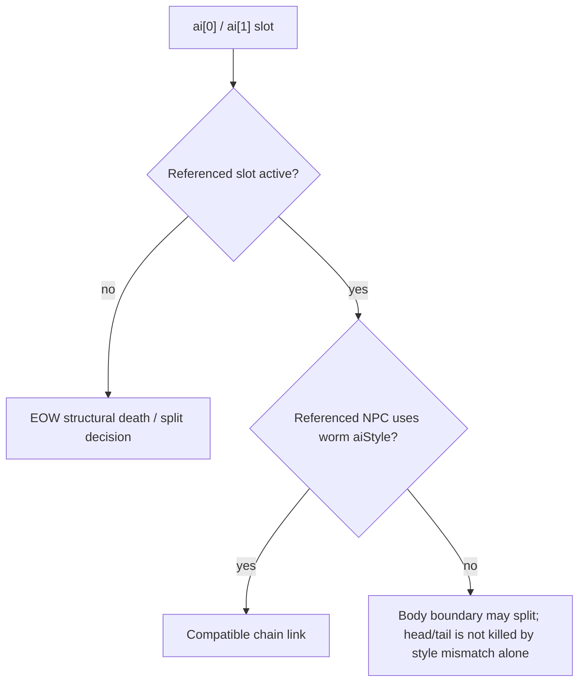

# Vanilla parity жизненного цикла червей AI_006

Этот документ фиксирует source-backed часть chain lifecycle для worm AI из TerrariaServer 1.4.5.8. Это намеренно уже полной NPC parity: movement families, построение цепочки и описанная здесь link lifecycle допускаются, а полный death/loot/progression и все побочные ветви AI_006 остаются отдельной работой.

## Состояние цепочки

TerraRuntime трактует синхронизируемые `ai` slots как vanilla linked-list state:

| Slot | Source-backed смысл в реализованном chain slice |
|---|---|
| `ai[0]` | slot successor/follower NPC либо construction sentinel до commit следующего сегмента |
| `ai[1]` | slot predecessor/leader NPC |
| `ai[2]` | оставшийся follower construction count для поддержанных chain profiles |
| `ai[3]` | slot root/head, копируемый из головы во все создаваемые descendants |

Официальный метод `AI_006_Worms` версии 1.4.5.8 записывает собственный `whoAmI` головы в `ai[3]` и копирует это значение каждому новому follower. TerraRuntime теперь сохраняет такое же root-slot propagation и для Eater of Worlds, и для остальных допущенных worm families. Само по себе это ещё не означает полную реализацию vanilla `realLife`/shared-health behavior.

## Link semantics Eater of Worlds

Eater of Worlds не использует один общий predicate «валидная worm link» для всех решений lifecycle. В source есть два разных контракта:

1. structural terminal checks смотрят только на активность slot predecessor/successor;
2. split body проверяет и активность, и совместимость `aiStyle` перед transform в новую head или tail.

Это важно при повторном использовании NPC slot. Живой non-worm occupant не удовлетворяет source-условию inactive-link для уже существующей Eater head/tail, поэтому одна только несовместимость `aiStyle` не должна убивать голову или хвост. Но для body такой сосед не является совместимым chain segment, поэтому body разрывает цепь через split, как в `AI_006_Worms`, а не ошибочно погибает как изолированный сегмент.

TerraRuntime сохраняет defensive boundary для malformed float link values: slot обязан быть finite, integral и addressable до lookup. Обычные server-authored chain links автоматически удовлетворяют этому условию.

## Исполняемое evidence

`.github/workflows/npc-worm-reference-probe.yml` декомпилирует официальный binary TerrariaServer 1.4.5.8 и запускает `tools/ci/check_npc_worm_reference.py`. Checker fail-closed проверяет, что pinned method по-прежнему доказывает initialization `ai[3]` головы, child root propagation, обычные worm guards `active + aiStyle`, active-only structural death gates Eater, body split gates по `aiStyle`, оба transform и их source order.

`VanillaWormLifecycleParityTests` отдельно фиксирует поведение TerraRuntime при reused non-worm slots, missing structural links и root-slot propagation Eater.

## Что ещё не закончено

Это evidence не делает `FullVanillaAiParity` истинным. Полный synchronized lifecycle Eater of Worlds, последствия damage/death, loot/progression, все взаимодействия `realLife`, оставшиеся специальные ветви AI_006 и широкие differential gameplay scenarios остаются открытыми в NPC parity roadmap.
