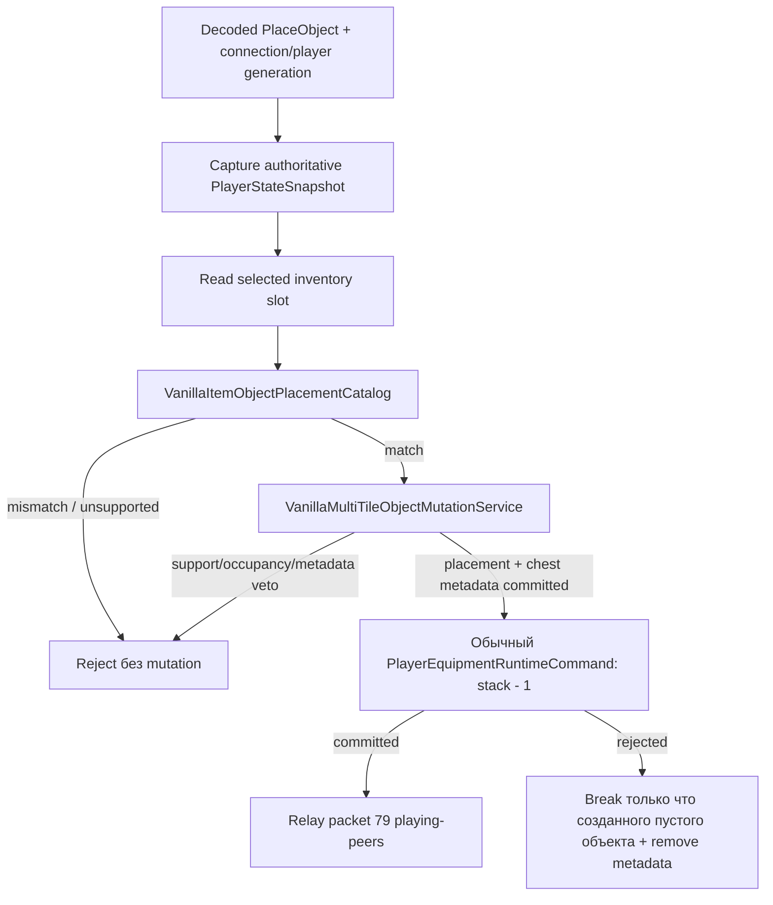

# Authoritative-размещение объектов

Gameplay-граница packet 79 намеренно остаётся sparse. Первый production-ready transaction primitive разрешает только обычный vanilla-предмет Chest и базовый объект `Containers`. Клиент не может превратить корректно удерживаемый предмет в произвольный tile/style claim.

## Первая разрешённая связь

| Удерживаемый предмет | Item id | Object tile | Tile id | Style | Alternate |
| --- | ---: | --- | ---: | ---: | ---: |
| Chest | 48 | Containers | 21 | 0 | 0 |

Другие стили контейнеров, `Containers2`, dressers, random styles и alternate placement variants остаются unsupported, пока их source contracts не будут закреплены независимо.

## Транзакция

Multi-tile service владеет геометрией 2×2, placement origin, support checks, frame cells и chest metadata lifecycle. Для `Containers` координаты packet передаются как vanilla placement origin. Object catalog переводит этот origin в нормализованный top-left anchor metadata сундука.

Расход предмета не выполняется изменением отдельного shadow inventory. Processor формирует нормализованное packet-5-style equipment state и проводит его через обычный authoritative equipment path `ServerRuntimeState`. Так сохраняются player revisioning, generation checks, inventory normalization и equipment replication.

Если equipment commit не материализует ровно ожидаемый остаток stack, только что созданный chest всё ещё пуст и не открыт, поэтому тот же multi-tile lifecycle удаляет metadata и все четыре клетки до завершения command. Невозможность rollback считается нарушением invariant и вызывает fault, а не тихо создаёт бесплатный объект.

## Репликация

Обратно в packet 79 кодируется только committed placement. Исходное соединение исключается; playing-peers получают принятый request после успешной authoritative world+inventory transaction. Ошибки support, item mismatch и rollback paths не создают peer placement frame.

## Область этого среза

Этот срез даёт transaction processor и replication primitive, но пока не подключает `ObjectPlacementFrameSink` в production host sink chain. Финальное composition остаётся отдельным явным шагом, чтобы сеть не начинала принимать gameplay packet раньше появления всех authority layers.
