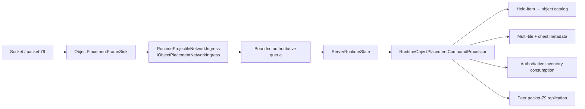
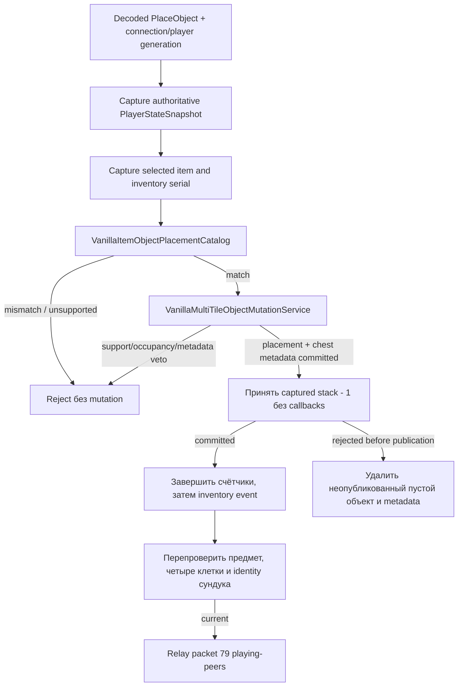

# Authoritative-размещение объектов

Gameplay-граница packet 79 намеренно остаётся sparse. Первая production-транзакция разрешает только обычный vanilla-предмет Chest и базовый объект `Containers`. Клиент не может превратить корректно удерживаемый предмет в произвольный tile/style claim.

## Первая разрешённая связь

| Удерживаемый предмет | Item id | Object tile | Tile id | Style | Alternate |
| --- | ---: | --- | ---: | ---: | ---: |
| Chest | 48 | Containers | 21 | 0 | 0 |

Другие стили контейнеров, `Containers2`, dressers и alternate placement variants остаются unsupported, пока их source contracts не будут закреплены независимо. Поля packet random/direction в этом срезе остаются wire state; они не могут переопределить проверенную связь held-item → tile/style/alternate.

## Production ownership

```mermaid
flowchart LR
    Socket["Socket / packet 79"] --> Sink["ObjectPlacementFrameSink"]
    Sink --> Ingress["RuntimeProjectileNetworkIngress\nIObjectPlacementNetworkIngress"]
    Ingress --> Queue["Bounded authoritative queue"]
    Queue --> State["ServerRuntimeState"]
    State --> Processor["RuntimeObjectPlacementCommandProcessor"]
    Processor --> Catalog["Held-item → object catalog"]
    Processor --> World["Multi-tile + chest metadata"]
    Processor --> Inventory["Authoritative inventory consumption"]
    Processor --> Relay["Peer packet-79 replication"]
```

Production использует один gameplay ingress для projectile, packet-17 tile и packet-79 object traffic. `ProjectileLifecycleFrameSink` композирует tile- и object-sink под существующей chest/sign chain, поэтому серверу не нужен второй command queue или параллельный connection lifecycle.

Конкретный загруженный `WorldTileStore` связывается со своим runtime chest metadata lifecycle через weak-key runtime composition registry. Persistence создаёт эту связь до конструирования `ServerRuntimeState`. Registry не вводит process-global «current world» и не удерживает уже неиспользуемый мир в памяти.

## Транзакция

```mermaid
flowchart TD
    Request["Decoded PlaceObject + connection/player generation"] --> Player["Capture authoritative PlayerStateSnapshot"]
    Player --> Item["Capture selected item and inventory serial"]
    Item --> Catalog["VanillaItemObjectPlacementCatalog"]
    Catalog -->|match| World["VanillaMultiTileObjectMutationService"]
    Catalog -->|mismatch / unsupported| Reject["Reject без mutation"]
    World -->|placement + chest metadata committed| Consume["Принять captured stack - 1 без callbacks"]
    World -->|support/occupancy/metadata veto| Reject
    Consume -->|committed| Publish["Завершить счётчики, затем inventory event"]
    Consume -->|rejected before publication| Rollback["Удалить неопубликованный пустой объект и metadata"]
    Publish --> Current["Перепроверить предмет, четыре клетки и identity сундука"]
    Current -->|current| Relay["Relay packet 79 playing-peers"]
```

Multi-tile service владеет геометрией 2×2, placement origin, support checks, frame cells и chest metadata lifecycle. Для `Containers` координаты packet передаются как vanilla placement origin. Object catalog переводит этот origin в нормализованный top-left anchor metadata сундука.

Существующий владелец инвентаря `PlayerAuthority` готовит одну захваченную каноническую запись до размещения в мире. Токен сохраняет точные connection/member, player snapshot, item phase, input revision, полный inventory serial и прежний предмет. Насыщенные stamps и последний непригодный inventory serial приводят к отказу до mutation. Adoption использует существующий atomic inventory store без callbacks. Геометрия мира, chest metadata, инвентарь, принятый результат и счётчики готовы до первого inventory event; внутренний расход не создаёт дополнительный входящий equipment report.

Отказ adoption позволяет удалить неопубликованный пустой объект и metadata до любого inventory event. Невозможность rollback вызывает fault. После публикации принятая операция не откатывается из-за изменения стека, мира или membership наблюдателем. Исключение наблюдателя оставляет все принятые состояния и accounting завершёнными. Обычные equipment reports и default packet-17 placement сохраняют свои отдельные контракты.

Temple Key использует ту же захваченную границу инвентаря: первый обычный ключ в слотах `0..57` расходуется, а все три source-строки двери получают `54` до публикации. Mouse slot исключён, последний ключ становится канонически пустым. Существующая последовательность `52`/tile-square выполняется лишь пока occupation, стек и полный footprint двери остаются актуальными.

## Репликация

Обратно в packet 79 кодируется только актуальный committed placement. Исходное соединение исключается. После inventory publication снова проверяются точный принятый стек, все четыре клетки и identity объекта runtime-сундука; удаление и повторное создание по тем же координатам не разрешает старый frame. Custom metadata lifecycle без такого identity proof может выполнить локальный commit, но не разрешает этот поздний relay. Ошибки support, stale connections, item mismatch и rollback до публикации не создают peer placement frame.

## Оставшаяся область

Production composition теперь подключён для проверенного базового Chest. Для более широкой D5 parity всё ещё нужны независимо закреплённые item/style mappings, alternate placement origins, support rules мебели/табличек, liquid rules, adapters metadata tile-entity, object-specific drops и вторичные эффекты. До их проверки эти пути остаются fail-closed, а не выводятся из внешнего сходства объектов.
